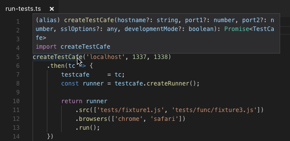
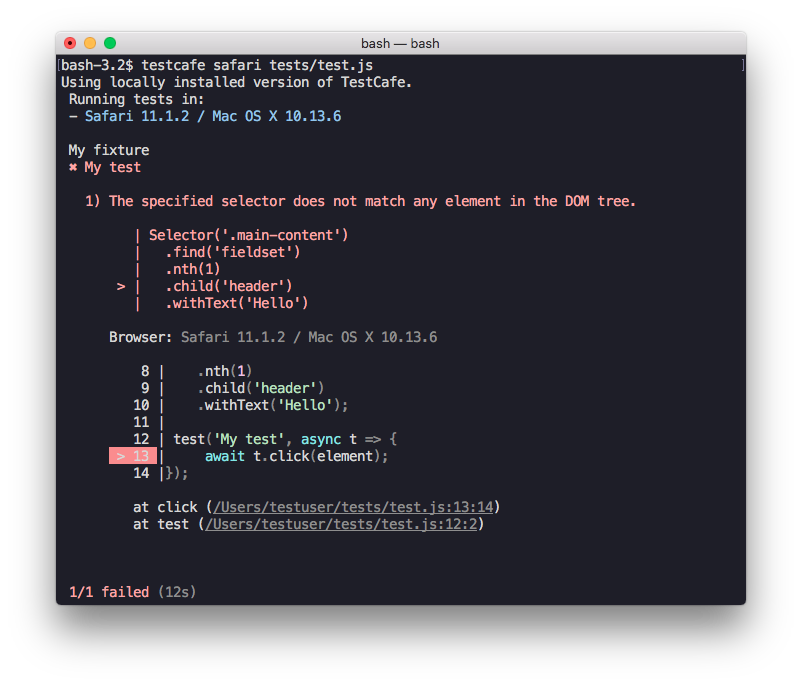
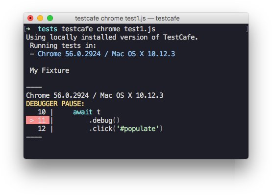

# Changelog

## v1.7.0 (2019-11-21)

### Enhancements

#### :gear: Identify the Browser and Platform in Test Code ([#481](https://github.com/DevExpress/testcafe/issues/481))

TestCafe now allows you to obtain information about the current user agent. These data identify the operating system, platform type, browser, engine, etc.

Use the [t.browser](https://devexpress.github.io/testcafe/documentation/test-api/identify-the-browser-and-platform.html) property to access user agent data.

```js
import { Selector } from 'testcafe';

fixture `My fixture`
    .page `https://example.com`;

test('My test', async t => {
    if (t.browser.name !== 'Chrome')
        await t.expect(Selector('div').withText('Browser not supported').visible).ok();
});
```

The [t.browser](https://devexpress.github.io/testcafe/documentation/test-api/identify-the-browser-and-platform.html) object exposes the following properties:

Property | Type | Description   | Example
-------- | ---- | ------------- | -------
[alias](https://devexpress.github.io/testcafe/documentation/test-api/identify-the-browser-and-platform.html#alias) | String | The browser alias string specified when tests were launched. | `firefox:headless`
[name](https://devexpress.github.io/testcafe/documentation/test-api/identify-the-browser-and-platform.html#name) | String | The browser name. | `Chrome`
[version](https://devexpress.github.io/testcafe/documentation/test-api/identify-the-browser-and-platform.html#version) | String | The browser version. | `77.0.3865.120`
[platform](https://devexpress.github.io/testcafe/documentation/test-api/identify-the-browser-and-platform.html#platform) | String | The platform type. | `desktop`
[headless](https://devexpress.github.io/testcafe/documentation/test-api/identify-the-browser-and-platform.html#headless) | Boolean | `true` if the browser runs in headless mode. | `false`
[os](https://devexpress.github.io/testcafe/documentation/test-api/identify-the-browser-and-platform.html#os) | Object | The name and version of the operating system. | `{ name: 'macOS', version: '10.15.1' }`
[engine](https://devexpress.github.io/testcafe/documentation/test-api/identify-the-browser-and-platform.html#engine) | Object | The name and version of the browser engine. |  `{ name: 'Gecko', version: '20100101' }`
[userAgent](https://devexpress.github.io/testcafe/documentation/test-api/identify-the-browser-and-platform.html#useragent) | String | The user agent string. | `Mozilla/5.0 (Windows NT 10.0; Win64; x64) AppleWebKit/537.36 (KHTML, like Gecko) HeadlessChrome/77.0.3865.120 Safari/537.36`
[prettyUserAgent](https://devexpress.github.io/testcafe/documentation/test-api/identify-the-browser-and-platform.html#prettyuseragent) | String | Formatted string with the browser's and operating system's name and version. | `Chrome 77.0.3865.75 / macOS 10.14.0`

The following example shows how to create a [beforeEach](https://devexpress.github.io/testcafe/documentation/test-api/test-code-structure.html#test-hooks) hook that runs for specific [browser engines](https://devexpress.github.io/testcafe/documentation/test-api/identify-the-browser-and-platform.html#engine).

```js
import { Selector } from 'testcafe';

fixture `My fixture`
    .page `https://example.com`
    .beforeEach(async t => {
        if (t.browser.engine.name === 'Blink')
            return;
        // ...
    });
```

You can also use [t.browser](https://devexpress.github.io/testcafe/documentation/test-api/identify-the-browser-and-platform.html) to generate the screenshot path based on the [browser name](https://devexpress.github.io/testcafe/documentation/test-api/identify-the-browser-and-platform.html#name). This prevents screenshots taken with [t.takeElementScreenshot](https://devexpress.github.io/testcafe/documentation/test-api/actions/take-screenshot.html#take-a-screenshot-of-a-page-element) in different browsers from being overwritten.

```js
import { Selector } from 'testcafe';

fixture `My fixture`
    .page `https://example.com`;

test('My test', async t => {
    const loginButton = Selector('div').withText('Login');

    await t.takeElementScreenshot(loginButton, `auth/${t.browser.name}/login-button.png`);
});
```

For more information and examples, see [Identify the Browser and Platform](https://devexpress.github.io/testcafe/documentation/test-api/identify-the-browser-and-platform.html).

### Bug Fixes

* Fixed an error on pages that submit forms immediately after loading ([#4360](https://github.com/DevExpress/testcafe/issues/4360) by [@bill-looby-i](https://github.com/bill-looby-i))
* TestCafe now scrolls to elements located inside Shadow DOM roots ([#4222](https://github.com/DevExpress/testcafe/issues/4222))
* Fixed an error that occurred when TypeScripts tests that use Node.js globals were run with TestCafe installed globally ([#4437](https://github.com/DevExpress/testcafe/issues/4437))
* Fixed the TypeScript definition for the `Selector.withAttribute` method's return type ([#4448](https://github.com/DevExpress/testcafe/issues/4448))
* Fixed an issue when custom browser providers could not take screenshots ([#4477](https://github.com/DevExpress/testcafe/issues/4477))
* Support pages that use advanced ES6 module export ([testcafe-hammerhead/#2137](https://github.com/DevExpress/testcafe-hammerhead/issues/2137))
* Fixed compatibility issues with Salesforce Lightning Web Components ([testcafe-hammerhead/#2152](https://github.com/DevExpress/testcafe-hammerhead/issues/2152))

## v1.6.1 (2019-10-29)

### Bug Fixes

* Fixed a conflict with Jest type definitions that caused a TypeScript error ([#4405](https://github.com/DevExpress/testcafe/issues/4405))
* TestCafe no longer deletes screenshots with no page content detected ([#3552](https://github.com/DevExpress/testcafe/issues/3552))
* Fixed a bug when TestCafe did not use the default path to the test files ([#4331](https://github.com/DevExpress/testcafe/issues/4331))
* Fixed a bug when the FFmpeg library could not be detected in the `PATH` locations ([PR #4377](https://github.com/DevExpress/testcafe/pull/4377))
* Added a TypeScript definition for `runner.tsConfigPath` ([PR #4403](https://github.com/DevExpress/testcafe/pull/4403))

## v1.6.0 (2019-10-16)

### :star2: Support for macOS 10.15 Catalina

This version provides compatibility with macOS 10.15. Update TestCafe to v1.6.0 if you run macOS Catalina.

### Enhancements

#### :gear: Full-Page Screenshots ([#1520](https://github.com/DevExpress/testcafe/issues/1520))

TestCafe can now take screenshots that show the full page, including content that is not visible due to overflow.

Enable the `fullPage` option in CLI, API or configuration file to capture the full page on all screenshots. You can also pass this option to `t.takeScreenshot` to capture a single full-page screenshot.

*Command line interface*

Enable the [fullPage](https://devexpress.github.io/testcafe/documentation/using-testcafe/command-line-interface.html#fullpage) parameter of the [-s (--screenshots)](https://devexpress.github.io/testcafe/documentation/using-testcafe/command-line-interface.html#-s---screenshots-optionvalueoption2value2) flag:

```sh
testcafe chrome test.js -s fullPage=true
```

*API*

Pass the `fullPage` option to [runner.screenshots](https://devexpress.github.io/testcafe/documentation/using-testcafe/programming-interface/runner.html#screenshots):

```js
runner.screenshots({
    fullPage: true
});
```

*Configuration file*

Set the [screenshots.fullPage](https://devexpress.github.io/testcafe/documentation/using-testcafe/configuration-file.html#screenshotsfullpage) property:

```json
{
    "screenshots": {
        "fullPage": true
    }
}
```

*Test code*

Pass the `fullPage` option to the [t.takeScreenshot](https://devexpress.github.io/testcafe/documentation/test-api/actions/take-screenshot.html#take-a-screenshot-of-the-entire-page) action:

```js
t.takeScreenshot({
    fullPage: true
});
```

#### :gear: Compound Screenshot Options

The command line interface and configuration file schema have been updated to provide a more concise way to specify the screenshot options.

> TestCafe v1.6.0 also supports the existing options to maintain backward compatibility. However, these options are now marked *obsolete* in the documentation. In the future updates, we will deprecate them and emit warnings.

*Command line interface*

Screenshot options in CLI are now consolidated under the [-s (--screenshots)](https://devexpress.github.io/testcafe/documentation/using-testcafe/command-line-interface.html#-s---screenshots-optionvalueoption2value2) flag in an `option=value` string:

```sh
testcafe chrome test.js -s takeOnFails=true,pathPattern=${DATE}_${TIME}/${FILE_INDEX}.png
```

Old Usage                                      | New Usage
---------------------------------------------- | -----------
`-s artifacts/screenshots`                     | `-s path=artifacts/screenshots`
`-S`, `--screenshots-on-fails`                 | `-s takeOnFails=true`
`-p ${DATE}_${TIME}/${FILE_INDEX}.png`         | `-s pathPattern=${DATE}_${TIME}/${FILE_INDEX}.png`

*Configuration file*

Configuration file properties that specify screenshot options are now combined in the [screenshots](https://devexpress.github.io/testcafe/documentation/using-testcafe/configuration-file.html#screenshots) object:

```json
{
    "screenshots": {
        "path": "artifacts/screenshots",
        "takeOnFails": true,
        "pathPattern": "${DATE}_${TIME}/${FILE_INDEX}.png"
    }
}
```

Old Property             | New Property
------------------------ | ----------------------------
`screenshotPath`         | `screenshots.path`
`takeScreenshotsOnFails` | `screenshots.takeOnFails`
`screenshotPathPattern`  | `screenshots.pathPattern`

#### :gear: Default Screenshot Directory

TestCafe now saves the screenshots to `./screenshots` if the base directory is not specified.

The [--screenshots](https://devexpress.github.io/testcafe/documentation/using-testcafe/command-line-interface.html#-s---screenshots-optionvalueoption2value2) CLI flag, the [runner.screenshots](https://devexpress.github.io/testcafe/documentation/using-testcafe/programming-interface/runner.html#screenshots) method or the [screenshotPath](https://devexpress.github.io/testcafe/documentation/using-testcafe/configuration-file.html#screenshotpath) configuration option are not required to take screenshots. For instance, you can run TestCafe with no additional parameters and use the [t.takeScreenshot](https://devexpress.github.io/testcafe/documentation/test-api/actions/take-screenshot.html#take-a-screenshot-of-the-entire-page) action in test code:

```sh
testcafe chrome test.js
```

*test.js*

```js
fixture `My fixture`
    .page `https://example.com`;

test('Take a screenshot', async t => {
    await t.takeScreenshot();
});
```

The `path` argument in [runner.screenshots](https://devexpress.github.io/testcafe/documentation/using-testcafe/programming-interface/runner.html#screenshots) is now optional.

```js
runner.screenshots({
    takeOnFails: true
});
```

#### :gear: New Option to Disable Screenshots

We have added an option that allows you to disable taking screenshots. If this option is specified, TestCafe does not take screenshots when a test fails and when the [t.takeScreenshot](https://devexpress.github.io/testcafe/documentation/test-api/actions/take-screenshot.html#take-a-screenshot-of-the-entire-page) or [t.takeElementScreenshot](https://devexpress.github.io/testcafe/documentation/test-api/actions/take-screenshot.html#take-a-screenshot-of-a-page-element) action is executed.

You can disable screenshots with a command line, API or configuration file option:

* the [--disable-screenshots](https://devexpress.github.io/testcafe/documentation/using-testcafe/command-line-interface.html#--disable-screenshots) command line flag

    ```sh
    testcafe chrome my-tests --disable-screenshots
    ```

* the `disableScreenshots` option in the [runner.run](https://devexpress.github.io/testcafe/documentation/using-testcafe/programming-interface/runner.html#run) method

    ```js
    runner.run({ disableScreenshots: true });
    ```

* the [disableScreenshots](https://devexpress.github.io/testcafe/documentation/using-testcafe/configuration-file.html#disablescreenshots) configuration file property

    ```json
    {
        "disableScreenshots": true
    }
    ```

### Bug Fixes

* Fixed an error thrown when you pass the `-b` command line flag ([#4294](https://github.com/DevExpress/testcafe/issues/4294))
* TestCafe no longer hangs when Firefox downloads a file ([#2741](https://github.com/DevExpress/testcafe/issues/2741))
* You can now start tests from TypeScript code executed with `ts-node` ([#4276](https://github.com/DevExpress/testcafe/issues/4276))
* Fixed TypeScript definitions for client script injection API ([PR #4272](https://github.com/DevExpress/testcafe/pull/4272))
* Fixed TypeScript definitions for `disablePageCaching` ([PR #4274](https://github.com/DevExpress/testcafe/pull/4274))
* Fixed a bug when anchor links did not navigate to their target destinations ([testcafe-hammerhead/#2080](https://github.com/DevExpress/testcafe-hammerhead/issues/2080))

## v1.5.0 (2019-9-12)

### Enhancements

#### :gear: Page Caching Can be Disabled ([#3780](https://github.com/DevExpress/testcafe/issues/3780))

TestCafe may be unable to log in to the tested website correctly if the web server uses caching for authentication pages or pages to which users are redirected after login. See the [User Roles](https://devexpress.github.io/testcafe/documentation/test-api/authentication/user-roles.html#test-actions-fail-after-authentication) topic for details.

If tests fail unexpectedly after authentication, disable page caching in TestCafe.

Use the [fixture.disablePageCaching](https://devexpress.github.io/testcafe/documentation/test-api/test-code-structure.html#disable-page-caching) and [test.disablePageCaching](https://devexpress.github.io/testcafe/documentation/test-api/test-code-structure.html#disable-page-caching) methods to disable caching during a particular fixture or test.

```js
fixture
    .disablePageCaching `My fixture`
    .page `https://example.com`;
```

```js
test
    .disablePageCaching
    ('My test', async t => { /* ... */ });
```

To disable page caching during the entire test run, use either of the following options:

* the [--disable-page-caching](https://devexpress.github.io/testcafe/documentation/using-testcafe/command-line-interface.html#--disable-page-caching) command line flag

    ```sh
    testcafe chrome my-tests --disable-page-caching
    ```

* the `disablePageCaching` option in the [runner.run](https://devexpress.github.io/testcafe/documentation/using-testcafe/programming-interface/runner.html#run) method

    ```js
    runner.run({ disablePageCaching: true });
    ```

* the [disablePageCaching](https://devexpress.github.io/testcafe/documentation/using-testcafe/configuration-file.html#disablepagecaching) configuration file property

    ```json
    {
        "disablePageCaching": true
    }
    ```

If tests run correctly without page caching, we recommend that you adjust the server settings to disable caching for authentication pages and pages to which the server redirects from them.

### Bug Fixes

* Fixed an error that occured when a selector matched an `<svg>` element ([#3684](https://github.com/DevExpress/testcafe/issues/3684))
* Fixed an issue when the `reporter` configuration file option was not applied ([#4234](https://github.com/DevExpress/testcafe/issues/4234))
* Fixed a warning message about invalid `tsconfig.json` file ([#4154](https://github.com/DevExpress/testcafe/issues/4154))
* `LiveRunner.stop()` now closes the browsers ([#4107](https://github.com/DevExpress/testcafe/issues/4107))
* Quarantined tests now re-run correctly in live mode ([#4093](https://github.com/DevExpress/testcafe/issues/4093))
* Fixed a bug when client scripts were not injected in live mode when it re-executed tests ([#4183](https://github.com/DevExpress/testcafe/issues/4183))
* `form.elements.length` now returns the correct value for forms with file inputs ([testcafe-hammerhead/#2034](https://github.com/DevExpress/testcafe-hammerhead/issues/2034))
* Fixed a bug when images were not displayed in inputs with the `image` type ([testcafe-hammerhead/#2116](https://github.com/DevExpress/testcafe-hammerhead/issues/2116))
* Fixed an AngularJS compatibility issue that caused a `TypeError` ([testcafe-hammerhead/#2099](https://github.com/DevExpress/testcafe-hammerhead/issues/2099))
* TestCafe now works correctly with servers that use `JSZip` to unpack uploaded files ([testcafe-hammerhead/#2115](https://github.com/DevExpress/testcafe-hammerhead/issues/2115))

## v1.4.3 (2019-9-2)

* Information about TestCafe Studio is no longer displayed in the console.

## v1.4.2 (2019-8-28)

### Bug Fixes

* Added support for pages that reference ES6 modules ([testcafe-hammerhead/#1725](https://github.com/DevExpress/testcafe-hammerhead/issues/1725))
* Events are now emulated correctly if the mouse pointer does not move during scrolling ([#3564](https://github.com/DevExpress/testcafe/issues/3564))
* Fixed a Capacitor.js compatibility issue ([testcafe-hammerhead/#2094](https://github.com/DevExpress/testcafe-hammerhead/issues/2094))
* Fixed Node.js TLS warning suppression ([testcafe-hammerhead/PR#2109](https://github.com/DevExpress/testcafe-hammerhead/pull/2109))
* Fixed a warning about injecting duplicated scripts ([#4116](https://github.com/DevExpress/testcafe/issues/4116))
* Fixed a bug when information messages were printed in `stderr` ([#3873](https://github.com/DevExpress/testcafe/issues/3873))

## v1.4.1 (2019-8-15)

### Bug Fixes

* Drag now works correctly in Chrome Mobile on Android and Chrome device emulator with touch screens ([#3948](https://github.com/DevExpress/testcafe/issues/3948))
* Live Mode no longer fails when it restarts tests that import other modules on Node.js v12 ([#4052](https://github.com/DevExpress/testcafe/issues/4052))
* TestCafe now types into inputs wrapped in `label` elements correctly ([#4068](https://github.com/DevExpress/testcafe/issues/4068))
* `test.clientScripts` no longer override `fixture.clientScripts` ([#4122](https://github.com/DevExpress/testcafe/issues/4122))

## v1.4.0 (2019-8-7)

### Enhancements

#### :gear: Inject Scripts Into Tested Pages ([#1739](https://github.com/DevExpress/testcafe/issues/1739))

TestCafe now allows you to [inject scripts](https://devexpress.github.io/testcafe/documentation/using-testcafe/common-concepts/inject-scripts-into-tested-pages.html) into pages visited during the tests. Use this feature to add helper functions, mock browser API or import modules.

To add client scripts to all tests, specify them in the command line, API or configuration file. Use the following options:

* the [--cs (--client-scripts)](https://devexpress.github.io/testcafe/documentation/using-testcafe/command-line-interface.html#--cs-pathpath2---client-scripts-pathpath2) command line argument

    ```sh
    testcafe chrome test.js --client-scripts mockDate.js,assets/react-helpers.js
    ```

* the [runner.clientScripts](https://devexpress.github.io/testcafe/documentation/using-testcafe/programming-interface/runner.html#clientscripts) API method

    ```js
    runner.clientScripts('mockDate.js', 'scripts/react-helpers.js');
    ```

* the [clientScripts](https://devexpress.github.io/testcafe/documentation/using-testcafe/configuration-file.html#clientscripts) configuration file property

    ```json
    {
        "clientScripts": ["mockDate.js", "scripts/react-helpers.js"]
    }
    ```

If you need to add scripts to individual fixtures or tests, use the [fixture.clientScripts](https://devexpress.github.io/testcafe/documentation/test-api/test-code-structure.html#inject-scripts-into-tested-pages) and [test.clientScripts](https://devexpress.github.io/testcafe/documentation/test-api/test-code-structure.html#inject-scripts-into-tested-pages) methods in test code.

```js
fixture `My fixture`
    .page `http://example.com`
    .clientScripts('mockDate.js', 'scripts/react-helpers.js');
```

```js
test
    ('My test', async t => { /* ... */ })
    .clientScripts('mockDate.js', 'scripts/react-helpers.js');
```

TestCafe also allows you to [inject scripts into specific pages](https://devexpress.github.io/testcafe/documentation/using-testcafe/common-concepts/inject-scripts-into-tested-pages.html#provide-scripts-for-specific-pages).

```js
fixture `My fixture`
    .clientScripts({
        page: 'https://myapp.com/page/',
        path: 'scripts/vue-helpers.js'
    });
```

This is helpful when you need to override the browser API on particular pages and use the default behavior everywhere else.

You can specify the scripts to inject as follows:

* pass the [path to a JavaScript file](https://devexpress.github.io/testcafe/documentation/using-testcafe/common-concepts/inject-scripts-into-tested-pages.html#inject-a-javascript-file) to inject its content:

    ```js
    fixture `My fixture`
        .clientScripts({ path: 'assets/jquery.js' });
    ```

* use the [module name](https://devexpress.github.io/testcafe/documentation/using-testcafe/common-concepts/inject-scripts-into-tested-pages.html#inject-a-module) to inject a module:

    ```js
    fixture `My fixture`
        .clientScripts({ module: 'async' });
    ```

    TestCafe searches for the module's entry point with Node.js mechanisms and injects its content. Note that the browser must be able to execute this module.

* pass the [code](https://devexpress.github.io/testcafe/documentation/using-testcafe/common-concepts/inject-scripts-into-tested-pages.html#inject-script-code) you need to inject:

    ```js
    fixture `My fixture`
        .clientScripts({ content: 'Geolocation.prototype.getCurrentPosition = () => new Positon(0, 0);' });
    ```

For more information, see [Inject Scripts into Tested Pages](https://devexpress.github.io/testcafe/documentation/using-testcafe/common-concepts/inject-scripts-into-tested-pages.html).

### Bug Fixes

* The browser no longer displays 404 errors after the test submits a form ([#3560](https://github.com/DevExpress/testcafe/issues/3560)
* TestCafe can now download files when testing in headless mode ([#3127](https://github.com/DevExpress/testcafe/issues/3127))
* TypeScript no longer throws an error when `fixture` or `fixture.page` uses a tag function ([#4042](https://github.com/DevExpress/testcafe/issues/4042))
* The `load` event now correctly fires for cached images ([testcafe-hammerhead/#1959](https://github.com/DevExpress/testcafe-hammerhead/issues/1959))
* TestCafe can now read resources from `asar` archives ([testcafe-hammerhead/#2033](https://github.com/DevExpress/testcafe-hammerhead/issues/2033))
* Fixed a bug when `testcafe-hammerhead` event listeners were called twice ([testcafe-hammerhead/#2062](https://github.com/DevExpress/testcafe-hammerhead/issues/2062))

## v1.3.3 (2019-7-17)

### Bug Fixes

* TestCafe now throws an error if the specified TypeScript configuration file does not exist ([#3991](https://github.com/DevExpress/testcafe/issues/3991))
* TypeScript compilation time has been reduced for a large number of files ([#4010](https://github.com/DevExpress/testcafe/issues/4010))
* Expressions with the `+=` operator are now expanded only when required ([testcafe-hammerhead/#2029](https://github.com/DevExpress/testcafe-hammerhead/issues/2029))
* Parentheses around the `await` expression are now preserved in the processed scripts ([testcafe-hammerhead/#2072](https://github.com/DevExpress/testcafe-hammerhead/issues/2072))
* Fixed a compatibility issue with Firefox 68 that prevented text selection ([testcafe-hammerhead/#2071](https://github.com/DevExpress/testcafe-hammerhead/issues/2071))

## v1.3.2 (2019-7-11)

### :gear: Package dependencies have been upgraded to avoid CVEs found in the 'lodash' package

### Bug Fixes

* TestCafe no longer hangs when a disconnected browser reconnects to the network ([#3929](https://github.com/DevExpress/testcafe/issues/3929))

## v1.3.1 (2019-7-5)

This release fixes an issue caused by `tsconfig.json` auto-detection.

### Breaking Changes

#### :boom: TypeScript Configuration File Location is Required to Apply the Custom Compiler Settings ([#3983](https://github.com/DevExpress/testcafe/issues/3983))

Version 1.3.0 introduced support for [custom TypeScript configuration files](https://devexpress.github.io/testcafe/documentation/test-api/typescript-support.html#customize-compiler-options) where you can provide the compiler options. This feature included automatic detection of these configuration files. If the directory from which you run tests contained a `tsconfig.json` file, TestCafe would apply it by default.

However, this behavior caused troubles for users who have already had `tsconfig.json` files with conflicting settings in their projects. TestCafe attempted to apply these configurations, which resulted in issues with test compilation.

In v1.3.1, we have disabled `tsconfig.json` auto-detection. Now you must explicitly specify the `tsconfig.json` file location to apply the compiler settings. You can do it in one of the following ways:

* the [--ts-config-path](https://devexpress.github.io/testcafe/documentation/using-testcafe/command-line-interface.html#--ts-config-path-path) command line parameter,

    ```sh
    testcafe chrome my-tests --ts-config-path /Users/s.johnson/testcafe/tsconfig.json
    ```

* the [runner.tsConfigPath](https://devexpress.github.io/testcafe/documentation/using-testcafe/programming-interface/runner.html#tsconfigpath) API method,

    ```js
    runner.tsConfigPath('/Users/s.johnson/testcafe/tsconfig.json');
    ```

* the [tsConfigPath](https://devexpress.github.io/testcafe/documentation/using-testcafe/configuration-file.html#tsconfigpath) configuration file property.

    ```json
    {
        "tsConfigPath": "/Users/s.johnson/testcafe/tsconfig.json"
    }
    ```

We strongly recommend that you upgrade to v1.3.1. We apologize for any inconvenience.

## v1.3.0 (2019-7-2)

### Enhancements

#### :gear: Customize TypeScript Compiler Options ([#1845](https://github.com/DevExpress/testcafe/issues/1845))

> **Update:** v1.3.1 disables automatic detection of the `tsconfig.json` file. See [v1.3.1 release notes](https://devexpress.github.io/testcafe/blog/testcafe-v1-3-1-released.html) for more information.

TestCafe now allows you to specify the [TypeScript compiler options](https://www.typescriptlang.org/docs/handbook/compiler-options.html) in the `tsconfig.json` configuration file. You can use these options to enable JSX compilation, import code or typings with `paths` aliases, set aliases to React typings, or customize other compiler settings.

Define the `compilerOptions` property in `tsconfig.json` and specify the compiler options in this property:

```json
{
    "compilerOptions": {
        "jsx": "react",
        "jsxFactory": "myFactory",
        "paths": {
            "jquery": [ "node_modules/jquery/dist/jquery" ]
        },
        "alwaysStrict": true
    }
}
```

Save this file to the directory from which you run tests (or use the [tsConfigPath](https://devexpress.github.io/testcafe/documentation/using-testcafe/configuration-file.html#tsconfigpath) setting in the main configuration file to specify a different location).

See [Customize Compiler Options](https://devexpress.github.io/testcafe/documentation/test-api/typescript-support.html#customize-compiler-options) for more information.

### Bug Fixes

* TestCafe now waits for asynchronous tasks in `reportTaskDone` to complete before it exits ([#3835](https://github.com/DevExpress/testcafe/issues/3835))
* `childNodes.length` now returns the correct result after you type in an `iframe` ([#3887](https://github.com/DevExpress/testcafe/issues/3887))
* TestCafe no longer hangs when a custom request hook throws an error ([#3786](https://github.com/DevExpress/testcafe/issues/3786))
* Error messages now show the correct selector chains for selectors that use the `with` method ([#3874](https://github.com/DevExpress/testcafe/issues/3874))
* TestCafe can now work with test files located on a Windows network drive ([#3918](https://github.com/DevExpress/testcafe/issues/3918))
* Page elements overlapped by the TestCafe status panel are now scrolled into view correctly ([#3924](https://github.com/DevExpress/testcafe/issues/3924))
* Labels with the `tabIndex` and `for` attributes are now focused correctly ([#3501](https://github.com/DevExpress/testcafe/issues/3501))
* Fixed a bug that prevented elements behind the footer from being scrolled up on some pages ([#2601](https://github.com/DevExpress/testcafe/issues/2601))
* Enhanced the previous fix for a Chrome 75 compatibility issue when `t.typeText` typed each character at the beginning of the input ([#3865](https://github.com/DevExpress/testcafe/issues/3865))
* jQuery scroll functions no longer cause errors ([testcafe-hammerhead/#2045](https://github.com/DevExpress/testcafe-hammerhead/issues/2045))

## v1.2.1 (2019-6-10)

### Bug Fixes

* Fixed a Chrome 75 compatibility issue when `t.typeText` typed each character at the beginning of the input ([#3865](https://github.com/DevExpress/testcafe/issues/3865))
* Fixed a bug when a test with an unhandled promise rejection passed ([#3787](https://github.com/DevExpress/testcafe/issues/3787))
* The native dialog handler is now applied when a role redirects to the login page ([#2969](https://github.com/DevExpress/testcafe/issues/2969))

## v1.2.0 (2019-5-28)

### Enhancements

#### :gear: Custom Reporters Can Now Handle Test Start ([#3715](https://github.com/DevExpress/testcafe/issues/3715)) by [@Ivan-Katovich](https://github.com/Ivan-Katovich)

We have added an optional `reportTestStart` method to reporter API. This method fires each time a test starts. You can override it to output information about the started test:

```js
async reportTestStart (name, meta) {
    this.write(`Starting test: ${name} (${meta.severity})`)
        .newline();
}
```

This method also enables better integration with third-party reporter frameworks. For instance, [allure](https://github.com/allure-framework/allure2) requires that you perform some actions (namely, [specify the test steps](https://docs.qameta.io/allure/#_steps_6)) before a test starts. Now you can do this in the `reportTestStart` method in a custom reporter.

See the `reportTestStart` method description in [Reporter Methods](https://devexpress.github.io/testcafe/documentation/extending-testcafe/reporter-plugin/reporter-methods.html#reportteststart).

### Bug Fixes

* Fixed a regression that prevented non-responsive browsers from restarting ([#3781](https://github.com/DevExpress/testcafe/issues/3781))
* Fixed an issue when `t.click` triggered the `click` event twice ([#3645](https://github.com/DevExpress/testcafe/issues/3645))
* Fixed a regression that prevented TestCafe from checking `checkbox` inputs with `t.click` ([#3482](https://github.com/DevExpress/testcafe/issues/3482))
* TestCafe TypeScript definitions no longer cause the `Cannot find namespace 'NodeJS'` error ([#3719](https://github.com/DevExpress/testcafe/issues/3719))
* TestCafe no longer removes the `Authorization` header when Fetch API is used ([testcafe-hammerhead/#2020](https://github.com/DevExpress/testcafe-hammerhead/issues/2020))
* TestCafe now provides correct values for the `form.elements.length` property ([testcafe-hammerhead/#2009](https://github.com/DevExpress/testcafe-hammerhead/issues/2009))
* Fixed the `Invariant Violation` React error caused by TestCafe Hammerhead ([testcafe-hammerhead/#2000](https://github.com/DevExpress/testcafe-hammerhead/issues/2000))
* Fixed a regression that disabled the `IE=edge` meta tag ([testcafe-hammerhead/#1963](https://github.com/DevExpress/testcafe-hammerhead/issues/1963))
* Fixed an issue that prevented `t.setFilesToUpload` from raising the `change` event on some file inputs ([testcafe-hammerhead/#2007](https://github.com/DevExpress/testcafe-hammerhead/issues/2007))

## v1.1.4 (2019-5-6)

### Bug Fixes

* Roles now work when navigation to the login URL does not trigger page reload ([#2195](https://github.com/DevExpress/testcafe/issues/2195))
* TestCafe no longer emits the `touchmove` events when it simulates clicks on Android devices ([#3465](https://github.com/DevExpress/testcafe/issues/3465))
* `t.takeElementScreenshot` now works if the display has custom color correction ([#2918](https://github.com/DevExpress/testcafe/issues/2918))
* Fixed a regression that prevented `t.typeText` from working within iframes in IE 11 ([#3724](https://github.com/DevExpress/testcafe/issues/3724))
* TestCafe now displays the correct error message when a browser is disconnected ([#3711](https://github.com/DevExpress/testcafe/issues/3711))
* URLs that contain authentication credentials are now processed correctly ([testcafe-hammerhead/#1990](https://github.com/DevExpress/testcafe-hammerhead/issues/1990))
* TestCafe no longer breaks `async` functions inside constructors ([testcafe-hammerhead/#2002](https://github.com/DevExpress/testcafe-hammerhead/issues/2002))

## v1.1.3 (2019-4-18)

### Bug Fixes

* TestCafe now shows a warning when the `t.resizeWindow` action is used during video recording ([#3513](https://github.com/DevExpress/testcafe/issues/3513))
* Debugging in the Docker image can now be enabled with the `--inspect` and `--inspect-brk` flags ([#3646](https://github.com/DevExpress/testcafe/issues/3646))
* You can now use the `--window-width` flag to set the emulated window width for headless Chrome ([#3456](https://github.com/DevExpress/testcafe/issues/3456))
* TestCafe now shows the correct error message when an iframe is not visible ([#3681](https://github.com/DevExpress/testcafe/issues/3681))
* The Unlock Page button no longer throws an error when clicked ([#3652](https://github.com/DevExpress/testcafe/issues/3652))
* The `change` event for a file input is no longer emulated unless the `t.setFilesToUpload` method changes the input value ([testcafe-hammerhead/#1844](https://github.com/DevExpress/testcafe-hammerhead/issues/1844))
* The upload native dialog is no longer shown in Firefox after a click is simulated ([testcafe-hammerhead/#1984](https://github.com/DevExpress/testcafe-hammerhead/issues/1984))
* The `style` attribute and the `HTMLElement.style` property values are now synchronized ([testcafe-hammerhead/#1922](https://github.com/DevExpress/testcafe-hammerhead/issues/1922))

## v1.1.2 (2019-4-10)

### Bug Fixes

* TestCafe now captures full-size screenshots on macOS systems with a Retina display ([#3541](https://github.com/DevExpress/testcafe/issues/3541))
* The `referrer` property is now encoded correctly ([testcafe-hammerhead/#1953](https://github.com/DevExpress/testcafe-hammerhead/issues/1953))

## v1.1.1 (2019-4-4)

### Bug Fixes

* TestCafe no longer crashes if the tested page contains many cross-domain iframes ([testcafe-hammerhead/#1885](https://github.com/DevExpress/testcafe-hammerhead/issues/1885))
* TestCafe now displays a more concise message when it cannot find and run Chrome or Firefox ([#3534](https://github.com/DevExpress/testcafe/issues/3534))
* TestCafe no longer creates temporary video files in the concurrency mode ([#3508](https://github.com/DevExpress/testcafe/issues/3508))
* The `--no-sandbox` and `--disable-dev-shm-usage` flags are now applied automatically when TestCafe runs in a Docker container ([#3531](https://github.com/DevExpress/testcafe/issues/3531))
* In live mode, TestCafe now hides the spinner when it displays a message or if test compilation has failed ([#3451](https://github.com/DevExpress/testcafe/issues/3451) and ([#3452](https://github.com/DevExpress/testcafe/issues/3452)))
* TypeScript definitions for `t.expect().contains` have been fixed to support different types ([#3537](https://github.com/DevExpress/testcafe/issues/3537))
* The `keyPress` event simulation now works properly on Android ([#2236](https://github.com/DevExpress/testcafe/issues/2236))
* Salesforce Lightning Experience components are now rendered correctly ([testcafe-hammerhead/#1874](https://github.com/DevExpress/testcafe-hammerhead/issues/1874))

## v1.1.0 (2019-2-28)

### Enhancements

#### :gear: TypeScript 3 Support ([#3401](https://github.com/DevExpress/testcafe/issues/3401))

TypeScript test files can now use the new syntax features introduced in [TypeScript 3.0](https://www.typescriptlang.org/docs/handbook/release-notes/typescript-3-0.html) and [TypeScript 3.3](https://www.typescriptlang.org/docs/handbook/release-notes/typescript-3-3.html).

#### :gear: Enhanced TypeScript Definitions for Client Functions ([#3431](https://github.com/DevExpress/testcafe/pull/3431)) by [@vitalics](https://github.com/vitalics)

The updated type definitions allow the TypeScript compiler to determine client function's return value type. Static typing now warns you when you call wrong methods for the return value.

```js
const getFoo = ClientFunction(() => 42);
const foo    = await getFoo();
foo.match(/foo/);
```

Before v1.1.0, an error occurred during test execution:

```text
$ testcafe chrome tests.ts
 Running tests in:
 - Chrome 72.0.3626 / Windows 10.0.0
 Fixture 1
 √ Test 1
 √ Test 2
 ...
 × Test N
   1) TypeError: foo.match is not a function
```

With v1.1.0, the TypeScript compiler throws an error before tests are started:

```text
$ testcafe chrome tests.ts
  ERROR Cannot prepare tests due to an error.
  Error: TypeScript compilation failed.

  tests.ts (4, 2): Property 'match' does not exist on type 'number'.
```

### Bug Fixes

* TestCafe no longer ignores test and fixture metadata filters specified in the configuration file ([#3443](https://github.com/DevExpress/testcafe/issues/3443)) by [@NanjoW](https://github.com/NanjoW)
* TestCafe no longer resolves placeholders to `null` in video path patterns ([#3455](https://github.com/DevExpress/testcafe/issues/3455))
* Fixed the `KeyboardEvent`'s `key` property emulation for Safari ([#3282](https://github.com/DevExpress/testcafe/issues/3282))
* TestCafe now correctly captures element screenshots after the page was scrolled ([#3292](https://github.com/DevExpress/testcafe/issues/3292))
* Reduced TypeScript compilation time for a large number of files ([#3475](https://github.com/DevExpress/testcafe/issues/3475))
* Reach Router can now navigate correctly on tested pages ([testcafe-hammerhead/#1863](https://github.com/DevExpress/testcafe-hammerhead/issues/1863))
* TestCafe now correctly handles websites that use the `WebKitMutationObserver` class ([testcafe-hammerhead/#1912](https://github.com/DevExpress/testcafe-hammerhead/issues/1912))
* TestCafe now processes ECMAScript modules in `<script>` tags ([testcafe-hammerhead/#1725](https://github.com/DevExpress/testcafe-hammerhead/issues/1725))

## v1.0.1 (2019-2-15)

### :gear: Package dependencies have been upgraded to avoid CVEs found in the 'lodash' package

### Bug Fixes

* TestCafe no longer hangs when CLI argument validation fails in live mode ([#3402](https://github.com/DevExpress/testcafe/issues/3402))
* TestCafe no longer fails with the `ERR_STREAM_WRITE_AFTER_END` error after restarting tests in live mode ([#3322](https://github.com/DevExpress/testcafe/issues/3322))
* TestCafe does not ignore video and encoding options specified in a configuration file ([#3415](https://github.com/DevExpress/testcafe/issues/3415))
* You can now specify only tests in TestCafe CLI if browsers are specified in a configuration file ([#3421](https://github.com/DevExpress/testcafe/issues/3421))
* Live mode: TestCafe no longer stops test execution in multiple browsers if tests do not contain actions ([#3410](https://github.com/DevExpress/testcafe/issues/3410))
* TestCafe now correctly handles the `data-parsley-multiple` attribute ([testcafe-hammerhead/#1845](https://github.com/DevExpress/testcafe-hammerhead/issues/1845))
* TestCafe now allows passing the `headers` option of the `fetch` function as an Array ([testcafe-hammerhead/#1898](https://github.com/DevExpress/testcafe-hammerhead/issues/1898))
* No error occurs when page scripts pass a number as an argument to the `window.open` function ([testcafe-hammerhead/#1908](https://github.com/DevExpress/testcafe-hammerhead/issues/1908))
* TestCafe now correctly processes rewritten stylesheets ([testcafe-hammerhead/#1919](https://github.com/DevExpress/testcafe-hammerhead/pull/1919))
* TestCafe now correctly processes source maps in stylesheets ([testcafe-hammerhead/#1907](https://github.com/DevExpress/testcafe-hammerhead/issues/1907))

## v1.0.0 (2019-2-7)

### Breaking Changes

#### :boom: Test Syntax Validation Disabled: All Input Files Are Executed

Previous versions performed *test syntax validation* within input script files before executing them. Only files that contained the [fixture](https://devexpress.github.io/testcafe/documentation/test-api/test-code-structure.html#fixtures) and [test](https://devexpress.github.io/testcafe/documentation/test-api/test-code-structure.html#tests) directives were executed.

Starting with v1.0.0, input script files are **never** validated. This means that TestCafe executes all the scripts you specify as test sources. If you use Glob patterns to specify input test files, please recheck these patterns to avoid unintended file matches.

The `--disable-test-syntax-validation` command line flag and the `disableTestSyntaxValidation` option for the [runner.run](https://devexpress.github.io/testcafe/documentation/using-testcafe/programming-interface/runner.html#run) API method that disabled test syntax validation were removed in v1.0.0.

##### What Has Improved

You can now load tests dynamically without additional customization. The following example illustrates how tests can be imported from an external library.

**external-lib.js**

```js
export default function runFixture(name, url) {
    fixture(name)
        .page(url);

    test(`${url} test`, async t => {
        // ...
    });
}
```

**test.js**

```js
import runFixture from './external-lib';

const fixtureName = 'My fixture';
const url = 'https://testPage';

runFixture(fixtureName, url);
```

#### :boom: Programming Interface: Multiple Method Calls Prohibited

Previous versions allowed you to call the [runner.src](https://devexpress.github.io/testcafe/documentation/using-testcafe/programming-interface/runner.html#src), [runner.browsers](https://devexpress.github.io/testcafe/documentation/using-testcafe/programming-interface/runner.html#browsers) and [runner.reporter](https://devexpress.github.io/testcafe/documentation/using-testcafe/programming-interface/runner.html#reporter) methods several times to specify multiple test files, browsers or reporters.

```js
const stream = fs.createWriteStream('report.json');

runner
    .src('/home/user/tests/fixture1.js')
    .src('fixture5.js')
    .browsers('chrome')
    .browsers('firefox:headless')
    .reporter('minimal')
    .reporter('json', stream);
```

Starting with v1.0.0, pass arrays to these methods to specify multiple values.

To use a reporter that writes to a file, add a `{ name, output }` object to an array (see the [runner.reporter](https://devexpress.github.io/testcafe/documentation/using-testcafe/programming-interface/runner.html#reporter) description for details).

```js
runner
    .src(['/home/user/tests/fixture1.js', 'fixture5.js'])
    .browsers(['chrome', 'firefox:headless'])
    .reporter(['minimal', { name: 'json', output: 'report.json' }]);
```

##### What Has Improved

This change was necessary to implement the [configuration file](https://devexpress.github.io/testcafe/documentation/using-testcafe/configuration-file.html) in a way that is consistent with the API and command line interface.

#### :boom: Custom Request Hooks: Asynchronous API

[Request hook](https://devexpress.github.io/testcafe/documentation/test-api/intercepting-http-requests/) methods became asynchronous in TestCafe v1.0.0.

If the [onRequest](https://devexpress.github.io/testcafe/documentation/test-api/intercepting-http-requests/creating-a-custom-http-request-hook.html#the-onrequest-method) or [onResponse](https://devexpress.github.io/testcafe/documentation/test-api/intercepting-http-requests/creating-a-custom-http-request-hook.html#the-onresponse-method) method in your custom hook returns a Promise, TestCafe now waits for this Promise to resolve.

This does not necessarily leads to unexpected behavior, but still be aware of possible side effects.

Since the [onRequest](https://devexpress.github.io/testcafe/documentation/test-api/intercepting-http-requests/creating-a-custom-http-request-hook.html#the-onrequest-method) and [onResponse](https://devexpress.github.io/testcafe/documentation/test-api/intercepting-http-requests/creating-a-custom-http-request-hook.html#the-onresponse-method) methods are now asynchronous, add the `async` keyword to their declarations.

```js
import { RequestHook } from 'testcafe';

class MyRequestHook extends RequestHook {
    constructor (requestFilterRules, responseEventConfigureOpts) {
        super(requestFilterRules, responseEventConfigureOpts);
        // ...
    }

    async onRequest (event) {
        // ...
    }

    async onResponse (event) {
        // ...
    }
}
```

##### What Has Improved

You can call asynchronous [fs](https://nodejs.org/api/fs.html) functions, invoke a [child_process](https://nodejs.org/api/child_process.html), or perform asynchronous network requests (to a database or any other server) from inside the hooks.

#### :boom: Custom Reporter Plugins: Asynchronous API

TestCafe v1.0.0 also introduces asynchronous API for [reporter plugins](https://devexpress.github.io/testcafe/documentation/extending-testcafe/reporter-plugin/).

Similarly to [request hooks](#-boom-custom-request-hooks-asynchronous-api), if any of the custom reporter's methods ([reportTaskStart](https://devexpress.github.io/testcafe/documentation/extending-testcafe/reporter-plugin/reporter-methods.html#reporttaskstart), [reportFixtureStart](https://devexpress.github.io/testcafe/documentation/extending-testcafe/reporter-plugin/reporter-methods.html#reportfixturestart), [reportTestDone](https://devexpress.github.io/testcafe/documentation/extending-testcafe/reporter-plugin/reporter-methods.html#reporttestdone) or [reportTaskDone](https://devexpress.github.io/testcafe/documentation/extending-testcafe/reporter-plugin/reporter-methods.html#reporttaskdone)) returns a Promise, this Promise is now awaited.

Side effects may show up in certain cases.

Since the reporter methods are now asynchronous, add the `async` keyword to their declarations.

```js
async reportTaskStart (startTime, userAgents, testCount) {
    // ...
},

async reportFixtureStart (name, path, meta) {
    // ...
},

async reportTestDone (name, testRunInfo, meta) {
    // ...
},

async reportTaskDone (endTime, passed, warnings, result) {
    // ...
}
```

##### What Has Improved

Reporters can call asynchronous [fs](https://nodejs.org/api/fs.html) functions, invoke a [child_process](https://nodejs.org/api/child_process.html), or perform asynchronous network requests (to send an email, use REST API, connect to a database, etc).

### Enhancements

#### :gear: Video Recording ([#2151](https://github.com/DevExpress/testcafe/issues/2151))

You can now [record videos of test runs](https://devexpress.github.io/testcafe/documentation/using-testcafe/common-concepts/screenshots-and-videos.html#record-videos) in Google Chrome and Mozilla Firefox. To enable video recording, [install the FFmpeg library](https://devexpress.github.io/testcafe/documentation/using-testcafe/common-concepts/screenshots-and-videos.html#prerequisites) and then do one of the following:

* specify the [--video](https://devexpress.github.io/testcafe/documentation/using-testcafe/command-line-interface.html#--video-basepath) command line flag,

    ```sh
    testcafe chrome test.js --video artifacts/videos/
    ```

* call the [runner.video](https://devexpress.github.io/testcafe/documentation/using-testcafe/programming-interface/runner.html#video) API method,

    ```js
    runner.video('artifacts/videos/');
    ```

* specify the [videoPath](https://devexpress.github.io/testcafe/documentation/using-testcafe/configuration-file.html#videopath) configuration file property (configuration file is also a new feature, see below).

    ```json
    {
        "videoPath": "artifacts/videos/"
    }
    ```

TestCafe records all tests and saves each recording in a separate file. You can change this behavior in [video options](https://devexpress.github.io/testcafe/documentation/using-testcafe/common-concepts/screenshots-and-videos.html#basic-video-options). You can also customize [video encoding parameters](https://devexpress.github.io/testcafe/documentation/using-testcafe/common-concepts/screenshots-and-videos.html#video-encoding-options).

#### :gear: Configuration File ([#3131](https://github.com/DevExpress/testcafe/issues/3131))

TestCafe now allows you to store its settings in the `.testcaferc.json` [configuration file](https://devexpress.github.io/testcafe/documentation/using-testcafe/configuration-file.html) (with support for [JSON5 syntax](https://json5.org/)).

```json5
{
    "browsers": "chrome",
    "src": ["/home/user/auth-tests/fixture-1.js", "/home/user/mobile-tests/"],
    "reporter": {
        "name": "xunit",
        "output": "reports/report.xml"
    },
    "screenshotPath": "/home/user/tests/screenshots/",
    "takeScreenshotsOnFails": true,
    "videoPath": "/home/user/tests/videos/",
    "pageLoadTimeout": 1000,
    "hostname": "host.mycorp.com"
    // and more
}
```

Keep the configuration file in the project's root directory from which you run TestCafe.

Settings you specify when you launch tests from the command line and programming interfaces override settings from `.testcaferc.json`.

See [Configuration File](https://devexpress.github.io/testcafe/documentation/using-testcafe/configuration-file.html) for more information.

#### :gear: Live Mode ([#3215](https://github.com/DevExpress/testcafe/issues/3215))

We have integrated the [testcafe-live](https://github.com/DevExpress/testcafe-live) module into our main code so you can now use the new [live mode](https://devexpress.github.io/testcafe/documentation/using-testcafe/common-concepts/live-mode.html).

Live mode keeps the TestCafe process and browsers opened the whole time you are working on tests. Changes you make in code immediately restart the tests. That is, live mode allows you to see test results instantly. See [How Live Mode Works](https://devexpress.github.io/testcafe/documentation/using-testcafe/common-concepts/live-mode.html#how-live-mode-works).

Use the [-L (--live)](https://devexpress.github.io/testcafe/documentation/using-testcafe/command-line-interface.html#-l---live) flag to enable live mode from the command line interface.

```sh
testcafe chrome tests/test.js -L
```

In the API, create a [live mode runner](https://devexpress.github.io/testcafe/documentation/using-testcafe/programming-interface/livemoderunner.html) with the [testcafe.createLiveModeRunner](https://devexpress.github.io/testcafe/documentation/using-testcafe/programming-interface/testcafe.html#createlivemoderunner) function and use it instead of a [regular test runner](https://devexpress.github.io/testcafe/documentation/using-testcafe/programming-interface/runner.html).

```js
const createTestCafe = require('testcafe');
let testcafe         = null;

createTestCafe('localhost', 1337, 1338)
    .then(tc => {
        testcafe         = tc;
        const liveRunner = testcafe.createLiveModeRunner();
        return liveRunner
            .src('tests/test.js')
            .browsers('chrome')
            .run();
    })
    .then(() => {
        testcafe.close();
    });
```

#### :gear: Custom Reporter API Enhancements (Part of [#2753](https://github.com/DevExpress/testcafe/issues/2753); [Pull Request](https://github.com/DevExpress/testcafe/pull/3177))

* You can now access warnings that appeared during the test run from the [reportTestDone](https://devexpress.github.io/testcafe/documentation/extending-testcafe/reporter-plugin/reporter-methods.html#reporttestdone) method. Use the `warnings` property of the [testRunInfo](https://devexpress.github.io/testcafe/documentation/extending-testcafe/reporter-plugin/reporter-methods.html#testruninfo-object) object.

    ```js
    async reportTestDone (name, testRunInfo, meta) {
        const warnings    = testRunInfo.warnings;
        const hasWarnings = !!warnings.length;

        if(hasWarnings) {
            this.newline()
                .write('Warnings:');

            warnings.forEach(warning => {
                this.newline()
                    .write(warning);
            });
        }
    }
    ```

* The [reportTaskDone](https://devexpress.github.io/testcafe/documentation/extending-testcafe/reporter-plugin/reporter-methods.html#reporttaskdone) method now receives the [result](https://devexpress.github.io/testcafe/documentation/extending-testcafe/reporter-plugin/reporter-methods.html#result-object) parameter that contains information about the number of passed, failed, and skipped tests.

    ```js
    async reportTaskDone (endTime, passed, warnings, result) {
        this.write(`Testing finished!`)
            .newline()
            .write(`Passed: ${result.passedCount}`)
            .newline()
            .write(`Failed: ${result.failedCount}`)
            .newline();
            .write(`Skipped: ${result.skippedCount}`)
            .newline();
    }
    ```

#### :gear: Typings for Programming Interface ([#3341](https://github.com/DevExpress/testcafe/issues/3341)) by [@infctr](https://github.com/infctr)

TestCafe [programming interface](https://devexpress.github.io/testcafe/documentation/using-testcafe/programming-interface/) now features TypeScript typings.



#### :gear: Programming Interface: Simpler API to Write Reports to a File

You no longer need to use `fs.createWriteStream` to create a stream that writes a report to a file. You can now pass the file name as the [runner.reporter](https://devexpress.github.io/testcafe/documentation/using-testcafe/programming-interface/runner.html#reporter) parameter.

```js
runnner.reporter('json', 'reports/report.json');
```

### Bug Fixes

* The test runner no longer hangs when a custom reporter implementation uses synchronous callbacks ([#3209](https://github.com/DevExpress/testcafe/issues/3209))
* Fixture hooks for two adjacent fixtures are now executed in the correct order ([#3298](https://github.com/DevExpress/testcafe/issues/3298))
* Iframes no longer throw an error after a `document.open` call in IE and Edge ([#3343](https://github.com/DevExpress/testcafe/issues/3343))
* TestCafe no longer triggers a click event when you disable a button with a `span` element inside ([#2902](https://github.com/DevExpress/testcafe/issues/2902))
* Fixed a bug that led to errors in certain cases ([#3189](https://github.com/DevExpress/testcafe/issues/3189))
* We have improved the status panel design and adaptivity ([#3073](https://github.com/DevExpress/testcafe/issues/3073))
* Redirects through several pages in iframes now work correctly ([testcafe-hammerhead/#1825](https://github.com/DevExpress/testcafe-hammerhead/issues/1825))
* TestCafe can now correctly work with pages that override `HTMLElement.classList` in IE11 ([testcafe-hammerhead/#1890](https://github.com/DevExpress/testcafe-hammerhead/issues/1890))

## v0.23.3 (2018-12-19)

### Bug Fixes

* Remote browsers now start after tests are compiled ([#3219](https://github.com/DevExpress/testcafe/issues/3219)) by [@link89](https://github.com/link89)
* The TestCafe Docker image now includes version tags ([#2315](https://github.com/DevExpress/testcafe/issues/2315))
* Tests now fail with a meaningful error if no fixture is defined ([#2913](https://github.com/DevExpress/testcafe/issues/2913))
* Tests now resume correctly after a long waiting ([#3070](https://github.com/DevExpress/testcafe/issues/3070))
* TestCafe now throws a meaningful exception when taking screenshots in a browser that does not support it ([#2878](https://github.com/DevExpress/testcafe/issues/2878))
* Events are now simulated in the correct order when focusing an element after another element was focused on the `changed` event ([#3098](https://github.com/DevExpress/testcafe/issues/3098))
* The `Invalid calling object` exception is no longer thrown in IE11 ([testcafe-hammerhead/#1846](https://github.com/DevExpress/testcafe-hammerhead/issues/1846))
* The JSON parse error is no longer thrown when sending an XHR request ([testcafe-hammerhead/#1839](https://github.com/DevExpress/testcafe-hammerhead/issues/1839))
* Overridden functions now have the right prototype in an `iframe` without `src` ([testcafe-hammerhead/#1824](https://github.com/DevExpress/testcafe-hammerhead/issues/1824))
* `gulp-testcafe` now correctly closes Chrome after tests are finished ([testcafe-hammerhead/#1826](https://github.com/DevExpress/testcafe-hammerhead/issues/1826))
* Saving the `window` prototype to a property now works correctly ([testcafe-hammerhead/#1828](https://github.com/DevExpress/testcafe-hammerhead/issues/1828))
* Hammerhead is now retained after `document.close` in Firefox ([testcafe-hammerhead/#1821](https://github.com/DevExpress/testcafe-hammerhead/issues/1821))

## v0.23.2 (2018-11-12)

### Bug Fixes

* TestCafe no longer posts internal messages to the browser console ([#3099](https://github.com/DevExpress/testcafe/issues/3099))
* The TestCafe process no longer terminates before the report is written to a file ([#2502](https://github.com/DevExpress/testcafe/issues/2502))

## v0.23.1 (2018-11-7)

### Enhancements

#### :gear: Select Tests and Fixtures to Run by Their Metadata ([#2527](https://github.com/DevExpress/testcafe/issues/2527)) by [@NickCis](https://github.com/NickCis)

You can now run only those tests or fixtures whose [metadata](https://devexpress.github.io/testcafe/documentation/test-api/test-code-structure.html#specifying-testing-metadata) contains a specific set of values. Use the [--test-meta](https://devexpress.github.io/testcafe/documentation/using-testcafe/command-line-interface.html#--test-meta-keyvaluekey2value2) and [--fixture-meta](https://devexpress.github.io/testcafe/documentation/using-testcafe/command-line-interface.html#--fixture-meta-keyvaluekey2value2) flags to specify these values.

```sh
testcafe chrome my-tests --test-meta device=mobile,env=production
```

```sh
testcafe chrome my-tests --fixture-meta subsystem=payments,type=regression
```

In the API, test and fixture metadata is now passed to the [runner.filter](https://devexpress.github.io/testcafe/documentation/using-testcafe/programming-interface/runner.html#filter) method in the `testMeta` and `fixtureMeta` parameters. Use this metadata to build a logic that determines whether to run the current test.

```js
runner.filter((testName, fixtureName, fixturePath, testMeta, fixtureMeta) => {
    return testMeta.mobile === 'true' &&
        fixtureMeta.env === 'staging';
});
```

#### :gear: Run Dynamically Loaded Tests ([#2074](https://github.com/DevExpress/testcafe/issues/2074))

You can now run tests imported from external libraries or generated dynamically even if the `.js` file does not contain any tests.

Previously, test files had to contain the [fixture](https://devexpress.github.io/testcafe/documentation/test-api/test-code-structure.html#fixtures) and [test](https://devexpress.github.io/testcafe/documentation/test-api/test-code-structure.html#tests) directives. You can now add the `--disable-test-syntax-validation` command line flag to bypass this check.

```sh
testcafe safari test.js --disable-test-syntax-validation
```

In the API, use the `disableTestSyntaxValidation` option.

```js
runner.run({ disableTestSyntaxValidation: true })
```

### Bug Fixes

* Touch events are now simulated with correct touch properties (`touches`, `targetTouches`, `changedTouches`) ([#2856](https://github.com/DevExpress/testcafe/issues/2856))
* Google Chrome now closes correctly on macOS after tests are finished ([#2860](https://github.com/DevExpress/testcafe/issues/2860))
* Internal attribute and node changes no longer trigger `MutationObserver` notifications ([testcafe-hammerhead/#1769](https://github.com/DevExpress/testcafe-hammerhead/issues/1769))
* The `ECONNABORTED` error is no longer raised ([testcafe-hammerhead/#1744](https://github.com/DevExpress/testcafe-hammerhead/issues/1744))
* Websites that use `Location.ancestorOrigins` are now proxied correctly ([testcafe-hammerhead/#1342](https://github.com/DevExpress/testcafe-hammerhead/issues/1342))

## v0.23.0 (2018-10-25)

### Enhancements

#### :gear: Stop Test Run After the First Test Fail ([#1323](https://github.com/DevExpress/testcafe/issues/1323))

You can now configure TestCafe to stop the entire test run after the first test fail. This saves your time when you fix problems with your tests one by one.

Specify the [--sf](https://devexpress.github.io/testcafe/documentation/using-testcafe/command-line-interface.html#--sf---stop-on-first-fail) flag to enable this feature when you run tests from the command line.

```sh
testcafe chrome my-tests --sf
```

In the API, use the [stopOnFirstFail](https://devexpress.github.io/testcafe/documentation/using-testcafe/programming-interface/runner.html#run) option.

```js
runner.run({ stopOnFirstFail: true })
```

#### :gear: View the JavaScript Errors' Stack Traces in Reports ([#2043](https://github.com/DevExpress/testcafe/issues/2043))

Now when a JavaScript error occurs on the tested webpage, the test run report includes a stack trace for this error (only if the [--skip-js-errors](https://devexpress.github.io/testcafe/documentation/using-testcafe/command-line-interface.html#-e---skip-js-errors) option is disabled).


#### :gear: Browsers are Automatically Restarted When They Stop Responding ([#1815](https://github.com/DevExpress/testcafe/issues/1815))

If a browser stops responding while it executes tests, TestCafe restarts the browser and reruns the current test in a new browser instance.
If the same problem occurs with this test two more times, the test run finishes and an error is thrown.

### Bug Fixes

* An error message about an unawaited call to an async function is no longer displayed when an uncaught error occurs ([#2557](https://github.com/DevExpress/testcafe/issues/2557))
* A request hook is no longer added multiple times when a filter rule is used ([#2650](https://github.com/DevExpress/testcafe/issues/2650))
* Screenshot links in test run reports now contain paths specified by the `--screenshot-pattern` option ([#2726](https://github.com/DevExpress/testcafe/issues/2726))
* Assertion chains no longer produce unhandled promise rejections ([#2852](https://github.com/DevExpress/testcafe/issues/2852))
* The `moment` loader now works correctly in the Jest environment ([#2500](https://github.com/DevExpress/testcafe/issues/2500))
* TestCafe no longer hangs if the screenshot directory contains forbidden symbols ([#681](https://github.com/DevExpress/testcafe/issues/681))
* The `--ssl` option's parameters are now parsed correctly ([#2924](https://github.com/DevExpress/testcafe/issues/2924))
* TestCafe now throws a meaningful error if an assertion method is missing ([#1063](https://github.com/DevExpress/testcafe/issues/1063))
* TestCafe no longer hangs when it clicks a custom element ([#2861](https://github.com/DevExpress/testcafe/issues/2861))
* TestCafe now performs keyboard navigation between radio buttons/groups in a way that matches the native browser behavior ([#2067](https://github.com/DevExpress/testcafe/issues/2067), [#2045](https://github.com/DevExpress/testcafe/issues/2045))
* The `fetch` method can now be used with data URLs ([#2865](https://github.com/DevExpress/testcafe/issues/2865))
* The `switchToIframe` function no longer throws an error ([#2956](https://github.com/DevExpress/testcafe/issues/2956))
* TestCafe can now scroll through fixed elements when the action has custom offsets ([#2978](https://github.com/DevExpress/testcafe/issues/2978))
* You can now specify the current directory or its parent directories as the base path to store screenshots ([#2975](https://github.com/DevExpress/testcafe/issues/2975))
* Tests no longer hang up when you try to debug in headless browsers ([#2846](https://github.com/DevExpress/testcafe/issues/2846))
* The `removeEventListener` function now works correctly when an object is passed as its third argument ([testcafe-hammerhead/#1737](https://github.com/DevExpress/testcafe-hammerhead/issues/1737))
* Hammerhead no longer adds the `event` property to a null `contentWindow` in IE11 ([testcafe-hammerhead/#1684](https://github.com/DevExpress/testcafe-hammerhead/issues/1684))
* The browser no longer resets connection with the server for no reason ([testcafe-hammerhead/#1647](https://github.com/DevExpress/testcafe-hammerhead/issues/1647))
* Hammerhead now stringifies values correctly before outputting them to the console ([testcafe-hammerhead/#1750](https://github.com/DevExpress/testcafe-hammerhead/issues/1750))
* A document fragment from the top window can now be correctly appended to an iframe ([testcafe-hammerhead/#912](https://github.com/DevExpress/testcafe-hammerhead/issues/912))
* Lifecycle callbacks that result from the `document.registerElement` method are no longer called twice ([testcafe-hammerhead/#695](https://github.com/DevExpress/testcafe-hammerhead/issues/695))

## v0.22.0 (2018-9-3)

### Enhancements

#### :gear: CoffeeScript Support ([#1556](https://github.com/DevExpress/testcafe/issues/1556)) by [@GeoffreyBooth](https://github.com/GeoffreyBooth)

TestCafe now allows you to write tests in CoffeeScript. You do not need to compile CoffeeScript manually or make any customizations - everything works out of the box.

```coffee
import { Selector } from 'testcafe'

fixture 'CoffeeScript Example'
    .page 'https://devexpress.github.io/testcafe/example/'

nameInput = Selector '#developer-name'

test 'Test', (t) =>
    await t
        .typeText(nameInput, 'Peter')
        .typeText(nameInput, 'Paker', { replace: true })
        .typeText(nameInput, 'r', { caretPos: 2 })
        .expect(nameInput.value).eql 'Parker';
```

#### :gear: Failed Selector Method Pinpointed in the Report ([#2568](https://github.com/DevExpress/testcafe/issues/2568))

Now the test run report can identify which selector's method does not match any DOM element.



#### :gear: Fail on Uncaught Server Errors ([#2546](https://github.com/DevExpress/testcafe/issues/2546))

Previously, TestCafe ignored uncaught errors and unhandled promise rejections that occurred on the server. Whenever an error or a promise rejection happened, test execution continued.

Starting from v0.22.0, tests fail if a server error or promise rejection is unhandled. To return to the previous behavior, we have introduced the `skipUncaughtErrors` option. Use the [--skip-uncaught-errors](https://devexpress.github.io/testcafe/documentation/using-testcafe/command-line-interface.html#-u---skip-uncaught-errors) flag in the command line or the [skipUncaughtErrors](https://devexpress.github.io/testcafe/documentation/using-testcafe/programming-interface/runner.html#run) option in the API.

```sh
testcafe chrome tests/fixture.js --skipUncaughtErrors
```

```js
runner.run({skipUncaughtErrors:true})
```

#### :gear: Use Glob Patterns in `runner.src` ([#980](https://github.com/DevExpress/testcafe/issues/980))

You can now use [glob patterns](https://github.com/isaacs/node-glob#glob-primer) in the [runner.src](https://devexpress.github.io/testcafe/documentation/using-testcafe/programming-interface/runner.html#src) method to specify a set of test files.

```js
runner.src(['/home/user/tests/**/*.js', '!/home/user/tests/foo.js']);
```

### Bug Fixes

* `RequestLogger` no longer fails when it tries to stringify a null request body ([#2718](https://github.com/DevExpress/testcafe/issues/2718))
* Temporary directories are now correctly removed when the test run is finished ([#2735](https://github.com/DevExpress/testcafe/issues/2735))
* TestCafe no longer throws `ECONNRESET` when run against a Webpack project ([#2711](https://github.com/DevExpress/testcafe/issues/2711))
* An error is no longer thrown when TestCafe tests Sencha ExtJS applications in IE11 ([#2639](https://github.com/DevExpress/testcafe/issues/2639))
* Firefox no longer waits for page elements to appear without necessity ([#2080](https://github.com/DevExpress/testcafe/issues/2080))
* `${BROWSER}` in the screenshot pattern now correctly resolves to the browser name ([#2742](https://github.com/DevExpress/testcafe/issues/2742))
* The `toString` function now returns a native string for overridden descriptor ancestors ([testcafe-hammerhead/#1713](https://github.com/DevExpress/testcafe-hammerhead/issues/1713))
* The `iframe` flag is no longer added when a form with `target="_parent"` is submitted ([testcafe-hammerhead/#1680](https://github.com/DevExpress/testcafe-hammerhead/issues/1680))
* Hammerhead no longer sends request headers in lower case ([testcafe-hammerhead/#1380](https://github.com/DevExpress/testcafe-hammerhead/issues/1380))
* The overridden `createHTMLDocument` method has the right context now ([testcafe-hammerhead/#1722](https://github.com/DevExpress/testcafe-hammerhead/issues/1722))
* Tests no longer lose connection ([testcafe-hammerhead/#1647](https://github.com/DevExpress/testcafe-hammerhead/issues/1647))
* The case when both the `X-Frame-Options` header and a CSP with `frame-ancestors` are set is now handled correctly ([testcafe-hammerhead/#1666](https://github.com/DevExpress/testcafe-hammerhead/issues/1666))
* The mechanism that resolves URLs on the client now works correctly ([testcafe-hammerhead/#1701](https://github.com/DevExpress/testcafe-hammerhead/issues/1701))
* `LiveNodeListWrapper` now imitates the native behavior correctly ([testcafe-hammerhead/#1376](https://github.com/DevExpress/testcafe-hammerhead/issues/1376))

## v0.21.1 (2018-8-8)

### Bug fixes

* The `RequestLogger.clear` method no longer raises an error if it is called during a long running request ([#2688](https://github.com/DevExpress/testcafe/issues/2688))
* TestCafe now uses native methods to work with the `fetch` request ([#2686](https://github.com/DevExpress/testcafe/issues/2686))
* A URL now resolves correctly for elements in a `document.implementation` instance ([testcafe-hammerhead/#1673](https://github.com/DevExpress/testcafe-hammerhead/issues/1673))
* Response header names specified via the `respond` function are lower-cased now ([testcafe-hammerhead/#1704](https://github.com/DevExpress/testcafe-hammerhead/issues/1704))
* The cookie domain validation rule on the client side has been fixed ([testcafe-hammerhead/#1702](https://github.com/DevExpress/testcafe-hammerhead/issues/1702))

## v0.21.0 (2018-8-2)

### Enhancements

#### :gear: Test Web Pages Served Over HTTPS ([#1985](https://github.com/DevExpress/testcafe/issues/1985))

Some browser features (like [Service Workers](https://developer.mozilla.org/en-US/docs/Web/API/Service_Worker_API), [Geolocation API](https://developer.mozilla.org/en-US/docs/Web/API/Geolocation_API), [ApplePaySession](https://developer.apple.com/documentation/apple_pay_on_the_web/applepaysession), or [SubtleCrypto](https://developer.mozilla.org/en-US/docs/Web/API/SubtleCrypto)) require a secure origin. This means that the website should use the HTTPS protocol.

Starting with v0.21.0, TestCafe can serve proxied web pages over HTTPS. This allows you to test pages that require a secure origin.

To enable HTTPS when you use TestCafe through the command line, specify the [--ssl](https://devexpress.github.io/testcafe/documentation/using-testcafe/command-line-interface.html#--ssl-options) flag followed by the [HTTPS server options](https://nodejs.org/api/https.html#https_https_createserver_options_requestlistener). The most commonly used options are described in the [TLS topic](https://nodejs.org/api/tls.html#tls_tls_createsecurecontext_options) in the Node.js documentation.

```sh
testcafe --ssl pfx=path/to/file.pfx;rejectUnauthorized=true;...
```

When you use a programming API, pass the HTTPS server options to the [createTestCafe](https://devexpress.github.io/testcafe/documentation/using-testcafe/programming-interface/createtestcafe.html) method.

```js
'use strict';

const createTestCafe        = require('testcafe');
const selfSignedSertificate = require('openssl-self-signed-certificate');
let runner                  = null;

const sslOptions = {
    key:  selfSignedSertificate.key,
    cert: selfSignedSertificate.cert
};

createTestCafe('localhost', 1337, 1338, sslOptions)
    .then(testcafe => {
        runner = testcafe.createRunner();
    })
    .then(() => {
        return runner
            .src('test.js')

            // Browsers restrict self-signed certificate usage unless you
            // explicitly set a flag specific to each browser.
            // For Chrome, this is '--allow-insecure-localhost'.
            .browsers('chrome --allow-insecure-localhost')
            .run();
    });
```

See [Connect to TestCafe Server over HTTPS](https://devexpress.github.io/testcafe/documentation/using-testcafe/common-concepts/connect-to-the-testcafe-server-over-https.html) for more information.

#### :gear: Construct Screenshot Paths with Patterns ([#2152](https://github.com/DevExpress/testcafe/issues/2152))

You can include placeholders in the path, for example, `${DATE}`, `${TIME}`, `${USERAGENT}`, etc. For a complete list, refer to [Path Pattern Placeholders](https://devexpress.github.io/testcafe/documentation/using-testcafe/common-concepts/screenshots-and-videos.html#path-pattern-placeholders).

You should specify a screenshot path pattern when you run tests. Each time TestCafe takes a screenshot, it substitutes the placeholders with actual values and saves the screenshot to the resulting path.

The following example shows how to specify a screenshot path pattern through the command line:

```sh
testcafe all test.js -s path=screenshots,pathPattern=${DATE}_${TIME}/test-${TEST_INDEX}/${USERAGENT}/${FILE_INDEX}.png
```

When you use a programming API, pass the screenshot path pattern to the [runner.screenshots method](https://devexpress.github.io/testcafe/documentation/using-testcafe/programming-interface/runner.html#screenshots).

```js
runner.screenshots({
    path: 'reports/screenshots/',
    takeOnFails: true,
    pathPattern: '${TEST_INDEX}/${OS}/${BROWSER}-v${BROWSER_VERSION}/${FILE_INDEX}.png'
});
```

#### :gear: Add Info About Screenshots and Quarantine Attempts to Custom Reports ([#2216](https://github.com/DevExpress/testcafe/issues/2216))

Custom reporters can now access screenshots' data and the history of quarantine attempts (if the test run in the quarantine mode).

The following information about screenshots is now available:

* the path to the screenshot file,
* the path to the thumbnail image,
* the browser's user agent,
* the quarantine attempt number (if the screenshot was taken in the quarantine mode),
* whether the screenshot was taken because the test failed.

If the test was run in the quarantine mode, you can also determine which attempts failed and passed.

Refer to the [reportTestDone method description](https://devexpress.github.io/testcafe/documentation/extending-testcafe/reporter-plugin/reporter-methods.html#reporttestdone) for details on how to access this information.

### Bug Fixes

* HTML5 drag events are no longer simulated if `event.preventDefault` is called for the `mousedown` event ([#2529](https://github.com/DevExpress/testcafe/issues/2529))
* File upload no longer causes an exception when there are several file inputs on the page ([#2642](https://github.com/DevExpress/testcafe/issues/2642))
* File upload now works with inputs that have the `required` attribute ([#2509](https://github.com/DevExpress/testcafe/issues/2509))
* The `load` event listener is no longer triggered when added to an image ([testcafe-hammerhead/#1688](https://github.com/DevExpress/testcafe-hammerhead/issues/1688))

## v0.20.5 (2018-7-18)

### Bug fixes

* The `buttons` property was added to the `MouseEvent` instance ([#2056](https://github.com/DevExpress/testcafe/issues/2056))
* Response headers were converted to lowercase ([#2534](https://github.com/DevExpress/testcafe/issues/2534))
* Updated flow definitions ([#2053](https://github.com/DevExpress/testcafe/issues/2053))
* An `AttributesWrapper` instance is now updated when the the element's property specifies the `disabled` attribute ([#2539](https://github.com/DevExpress/testcafe/issues/2539))
* TestCafe no longer hangs when it redirects from a tested page to the 'about:error' page with a hash ([#2371](https://github.com/DevExpress/testcafe/issues/2371))
* TestCafe now reports a warning for a mocked request if CORS validation failed ([#2482](https://github.com/DevExpress/testcafe/issues/2482))
* Prevented situations when a request logger tries to stringify a body that is not logged ([#2555](https://github.com/DevExpress/testcafe/issues/2555))
* The Selector API now reports `NaN` instead of `integer` when type validation fails ([#2470](https://github.com/DevExpress/testcafe/issues/2470))
* Enabled `noImplicitAny` and disabled `skipLibCheck` in the TypeScript compiler ([#2497](https://github.com/DevExpress/testcafe/issues/2497))
* Pages with `rel=prefetch` links no longer hang during test execution ([#2528](https://github.com/DevExpress/testcafe/issues/2528))
* Fixed the `TypeError: this.res.setHeader is not a function` error in Firefox ([#2438](https://github.com/DevExpress/testcafe/issues/2438))
* The `formtarget` attribute was overridden ([testcafe-hammerhead/#1513](https://github.com/DevExpress/testcafe-hammerhead/issues/1513))
* `fetch.toString()` now equals `function fetch() { [native code] }` ([testcafe-hammerhead/#1662](https://github.com/DevExpress/testcafe-hammerhead/issues/1662))

## v0.20.4 (2018-6-25)

### Enhancements

#### TestCafe now takes screenshots using browsers' debug protocols ([#2492](https://github.com/DevExpress/testcafe/pull/2492))

### Bug fixes

* `fetch` requests now correctly proxied in a specific case ([testcafe-hammerhead/#1613](https://github.com/DevExpress/testcafe-hammerhead/issues/1613))
* Resources responding with `304` HTTP status code and with the 'content-length: ' header are proxied correctly now ([testcafe-hammerhead/#1602](https://github.com/DevExpress/testcafe-hammerhead/issues/1602))
* The `transfer` argument of `window.postMessage` is passed correctly now ([testcafe-hammerhead/#1535](https://github.com/DevExpress/testcafe-hammerhead/issues/1535))
* Incorrect focus events order in IE has been fixed ([#2072](https://github.com/DevExpress/testcafe/issues/2072))

## v0.20.3 (2018-6-6)

### Enhancements

#### :gear: Add TS definitions to the Docker image ([#2481](https://github.com/DevExpress/testcafe/pull/2481))

### Bug fixes

* Selection in a `contenteditable` `div` now works properly in a specific scenario ([#2365](https://github.com/DevExpress/testcafe/issues/2365))
* A collision related to several `moment-duration-format` package versions is now fixed ([#1750](https://github.com/DevExpress/testcafe/issues/1750))
* TestCafe now reports a warning when saving several screenshots at the same path ([#2213](https://github.com/DevExpress/testcafe/issues/2213))
* A regression related to wrongly processed `document.write` in IE11 is now fixed ([#2469](https://github.com/DevExpress/testcafe/issues/2469))
* An out of memory crash on calling console methods is now fixed ([testcafe-hammerhead/#1546](https://github.com/DevExpress/testcafe-hammerhead/issues/1546))
* `Click` action for an element with 1px height or width works properly now ([#2020](https://github.com/DevExpress/testcafe/issues/2020))
* Touch emulation for the latest Google Chrome was fixed ([#2448](https://github.com/DevExpress/testcafe/issues/2448))

## v0.20.2 (2018-5-24)

### :gear: Package dependencies have been upgraded to avoid CVEs reported by Node Security Platform

### Bug fixes

* Enabled the screenshot and window resizing functionalities in the concurrency mode for Firefox and Chrome on macOS [#2095](https://github.com/DevExpress/testcafe/issues/2095)

## v0.20.1 (2018-5-21)

### :gear: Typescript definitions for new features from v0.20.0 have been added ([#2428](https://github.com/DevExpress/testcafe/issues/2428))

### Bug fixes

* Now sites with the overridden `Element.prototype.matches` method work properly [#2241](https://github.com/DevExpress/testcafe/issues/2241)
* `window.Blob` now returns a correct result when Array of `ArrayBuffer` is passed as a parameter ([testcafe-hammerhead/#1599](https://github.com/DevExpress/testcafe-hammerhead/issues/1599))
* Firefox Shield popup is not shown during test execution now ([#2421](https://github.com/DevExpress/testcafe/pull/2421))

## v0.20.0 (2018-5-15)

### Request Hooks: Intercepting HTTP requests ([#1341](https://github.com/DevExpress/testcafe/issues/1341))

TestCafe now allows you to record HTTP request data or mock responses. You can also create a custom HTTP request hook to emulate authentications like  **Kerberos** or **Client Certificate Authentication**.

See [Intercepting HTTP Requests](https://devexpress.github.io/testcafe/documentation/test-api/intercepting-http-requests) for more information.

### Enhancements

#### :gear: Specifying resources accessed by bypassing a proxy server ([#1791](https://github.com/DevExpress/testcafe/issues/1791))

TestCafe now allows you to bypass the proxy server when accessing specific resources.

To specify resources that require direct access, use the [--proxy-bypass](https://devexpress.github.io/testcafe/documentation/using-testcafe/command-line-interface.html#--proxy-bypass-rules) flag in the command line or the [useProxy](https://devexpress.github.io/testcafe/documentation/using-testcafe/programming-interface/runner.html) API method's parameters.

```sh
testcafe chrome my-tests/**/*.js --proxy proxy.corp.mycompany.com --proxy-bypass localhost:8080,internal-resource.corp.mycompany.com
```

```js
runner.useProxy('172.0.10.10:8080', ['localhost:8080', 'internal-resource.corp.mycompany.com']);
```

#### :gear: Specifying testing metadata ([#2242](https://github.com/DevExpress/testcafe/issues/2242))

TestCafe allows you to specify additional information for tests in the form of key-value metadata and use it in reports.

You can define metadata for a fixture or a test using the [meta](https://devexpress.github.io/testcafe/documentation/test-api/test-code-structure.html#specifying-testing-metadata) method:

```js
fixture `My Fixture`
    .meta('fixtureID', 'f-0001')
    .meta({ author: 'John', creationDate: '05/03/2018' });
```

```js
test
    .meta('testID', 't-0005')
    .meta({ severity: 'critical', testedAPIVersion: '1.0' })
    ('MyTest', async t => { /* ... */});
```

To include testing metadata to reports, use the [custom reporter methods](https://devexpress.github.io/testcafe/documentation/extending-testcafe/reporter-plugin/reporter-methods.html).

#### :gear: Passing a regular promise to `t.expect` is deprecated now ([#2207](https://github.com/DevExpress/testcafe/issues/2207))

TestCafe now throws an error if you pass a regular promise to the assertion's `expect` method.

If you need to assert a regular promise, set the [allowUnawaitedPromise](https://devexpress.github.io/testcafe/documentation/test-api/assertions/#optionsallowunawaitedpromise) option to `true`.

```js
await t.expect(doSomethingAsync()).ok('check that a promise is returned', { allowUnawaitedPromise: true });
```

### Bug Fixes

* The session recovery bubble in Firefox is disabled ([#2341](https://github.com/DevExpress/testcafe/pull/2341))
* TestCafe works properly if a `body` element has the `pointer-events: none;` css style rule ([#2251](https://github.com/DevExpress/testcafe/issues/2251))
* Resizing Chrome in the emulation mode works correctly ([#2154](https://github.com/DevExpress/testcafe/issues/2154))
* The location port is used for service messages ([#2308](https://github.com/DevExpress/testcafe/pull/2308))
* A browser instance shuts down correctly on Unix systems ([#2226](https://github.com/DevExpress/testcafe/issues/2226))
* An `Integrity` attribute is removed from `script` and `link` tags ([testcafe-hammerhead/#235](https://github.com/DevExpress/testcafe-hammerhead/issues/235))
* The `event.preventDefault()` method call changes the `event.defaultPrevented` property value ([testcafe-hammerhead/#1588](https://github.com/DevExpress/testcafe-hammerhead/issues/1588))
* It is possible to set the `meta` element's `content` attribute ([testcafe-hammerhead/#1586](https://github.com/DevExpress/testcafe-hammerhead/issues/1586))
* TestCafe no longer overrides attributes used in a non-standard way with `null` ([testcafe-hammerhead/#1583](https://github.com/DevExpress/testcafe-hammerhead/pull/1583))
* The `Change` event fires correctly if the `target.value` changes ([#2319](https://github.com/DevExpress/testcafe/issues/2319))
* `MouseEvent.screenX` and `MouseEvent.screenY` are added to the emulated events ([#2325](https://github.com/DevExpress/testcafe/issues/2325))
* Cookies on `localhost` are processed correctly ([testcafe-hammerhead/#1491](https://github.com/DevExpress/testcafe-hammerhead/issues/1491))
* Setting the `//` url for an image works correctly ([#2312](https://github.com/DevExpress/testcafe/issues/2312))
* `shadowUI` internal elements are no longer processed ([#2281](https://github.com/DevExpress/testcafe/issues/2281))
* `typeInput` event is raised correctly ([#1956](https://github.com/DevExpress/testcafe/issues/1956))
* Selecting text in contenteditable elements works properly ([#2301](https://github.com/DevExpress/testcafe/issues/2301))

## v0.19.2 (2018-4-11)

### Enhancements

#### Added support for browser providers from private repositories ([#2221](https://github.com/DevExpress/testcafe/issues/2221))

### Bug Fixes

* Restored the screenshot functionality in legacy tests ([#2235](https://github.com/DevExpress/testcafe/issues/2235))
* Updated the list of emulation devices in Google Chrome ([#2257](https://github.com/DevExpress/testcafe/issues/2257))
* Fixed touch events emulation ([#2268](https://github.com/DevExpress/testcafe/issues/2268))
* The `event.relatedTarget` property is set correctly for the emulated focus and drag events ([#2197](https://github.com/DevExpress/testcafe/issues/2197))
* The `event.detail` property is set correctly for the emulated mouse events ([#2232](https://github.com/DevExpress/testcafe/issues/2232))
* The `Element.innerHTML` property is processed correctly in certain cases ([testcafe-hammerhead/#1538](https://github.com/DevExpress/testcafe-hammerhead/issues/1538))
* The iframe location has the correct value when it is not initialized ([testcafe-hammerhead/#1531](https://github.com/devexpress/testcafe-hammerhead/issues/1531))
* A trailing slash is added to test page URL when necessary ([#2005](https://github.com/DevExpress/testcafe/issues/2005))
* The `focus` event is not called for a disabled input ([#2123](https://github.com/devexpress/testcafe/issues/2123))

## v0.19.1 (2018-3-13)

### Backward compatibility with the legacy test syntax has been restored ([#2210](https://github.com/DevExpress/testcafe/issues/2210))

### Bug Fixes

* The `document.all` property is overridden ([testcafe-hammerhead/#1046](https://github.com/DevExpress/testcafe-hammerhead/issues/1046))
* Proxying properties in `async` class methods are supported ([testcafe-hammerhead/#1510](https://github.com/DevExpress/testcafe-hammerhead/issues/1510))
* Fixed wrongly proxying a `localStorage` check-in WebWorkers ([testcafe-hammerhead/#1496](https://github.com/DevExpress/testcafe-hammerhead/issues/1496))

## v0.19.0 (2018-3-1)

### TestCafe Live: See instant feedback when working on tests ([#1624](https://github.com/DevExpress/testcafe/issues/1624))

We have prepared a new tool for rapid test development.

TestCafe Live provides a service that keeps the TestCafe process and browsers opened while you are working on tests. Changes you make in code immediately restart the tests. That is, TestCafe Live allows you to see test results instantly.

[](https://www.youtube.com/watch?v=RWQtB6Xv01Q)

See [TestCafe Live](https://github.com/DevExpress/testcafe-live) for more information.

### Enhancements

#### :gear: Taking Screenshots of Individual Page Elements ([#1496](https://github.com/DevExpress/testcafe/issues/1496))

We have added the [t.takeElementScreenshot](https://devexpress.github.io/testcafe/documentation/test-api/actions/take-screenshot.html#take-a-screenshot-of-a-page-element) action that allows you to take a screenshot of an individual page element.

```js
import { Selector } from 'testcafe';

fixture `My fixture`
    .page `http://devexpress.github.io/testcafe/example/`;

test('Take a screenshot of a fieldset', async t => {
    await t
        .click('#reusing-js-code')
        .click('#continuous-integration-embedding')
        .takeElementScreenshot(Selector('fieldset').nth(1), 'my-fixture/important-features.png');
});
```

This action provides additional customization that allows you to adjust the screenshot's center or crop it. Refer to the [documentation](https://devexpress.github.io/testcafe/documentation/test-api/actions/take-screenshot.html#take-a-screenshot-of-a-page-element) for more information.

#### :gear: Filtering Elements by Their Visibility ([#1018](https://github.com/DevExpress/testcafe/issues/1018))

You can now filter the selector's matching set to display only visible or hidden elements using the [filterVisible](https://devexpress.github.io/testcafe/documentation/test-api/selecting-page-elements/selectors/functional-style-selectors.html#filtervisible) and [filterHidden](https://devexpress.github.io/testcafe/documentation/test-api/selecting-page-elements/selectors/functional-style-selectors.html#filterhidden) methods.

```js
import { Selector } from 'testcafe';

fixture `My fixture`
    .page `http://devexpress.github.io/testcafe/example/`;

test('Filter visible and hidden elements', async t => {
    const inputs        = Selector('input');
    const hiddenInput   = inputs.filterHidden();
    const visibleInputs = inputs.filterVisible();

    await t
        .expect(hiddenInput.count).eql(1)
        .expect(visibleInputs.count).eql(11);
});
```

#### :gear: Finding Elements by the Exact Matching Text ([#1292](https://github.com/DevExpress/testcafe/issues/1292))

The current selector's [withText](https://devexpress.github.io/testcafe/documentation/test-api/selecting-page-elements/selectors/functional-style-selectors.html#withtext) method looks for elements whose text content *contains* the specified string. With this release, we have added the [withExactText](https://devexpress.github.io/testcafe/documentation/test-api/selecting-page-elements/selectors/functional-style-selectors.html#withexacttext) method that searches by *strict match*.

```js
import { Selector } from 'testcafe';

fixture `My fixture`
    .page `http://devexpress.github.io/testcafe/example/`;

test('Search by exact text', async t => {
    const labels       = Selector('label');
    const winLabel     = labels.withExactText('Windows');
    const reusingLabel = labels.withText('JavaScript');

    await t
        .expect(winLabel.exists).ok()
        .expect(reusingLabel.exists).ok();
});
```

#### :gear: Using Decorators in TypeScript Code ([#2117](https://github.com/DevExpress/testcafe/issues/2117)) by [@pietrovich](https://github.com/pietrovich)

TestCafe now allows you to use [decorators](https://www.typescriptlang.org/docs/handbook/decorators.html) when [writing tests in TypeScript](https://devexpress.github.io/testcafe/documentation/test-api/typescript-support.html).

Note that decorators are still an experimental feature in TypeScript.

### Bug Fixes

* TestCafe can scroll a webpage when the `body` has a scroll bar ([#1940](https://github.com/DevExpress/testcafe/issues/1940))
* Firefox no longer hangs with a dialog asking to set it as the default browser ([#1926](https://github.com/DevExpress/testcafe/issues/1926))
* Legacy APIs no longer freeze because of an unexpected error ([#1790](https://github.com/DevExpress/testcafe/issues/1790))
* Clicking an element that was hidden and then recreated on timeout works correctly ([#1994](https://github.com/DevExpress/testcafe/issues/1994))
* TestCafe finds browsers in headless mode on macOS when tests are executing concurrently ([#2035](https://github.com/DevExpress/testcafe/issues/2035))
* The local storage is restored correctly ([#2015](https://github.com/DevExpress/testcafe/issues/2015)) when roles are switched using the `preserverUrl` flag
* TestCafe progress bar is no longer visible on screenshots ([#2076](https://github.com/DevExpress/testcafe/issues/2076))
* Window manipulations wait for pages to load ([#2000](https://github.com/DevExpress/testcafe/issues/2000))
* All toolbars are hidden when taking screenshots ([#1445](https://github.com/DevExpress/testcafe/issues/1445))
* TestCafe works with the latest CucumberJS version ([#2107](https://github.com/DevExpress/testcafe/issues/2107))
* Fixed an error connected to file permissions on Ubuntu ([#2144](https://github.com/DevExpress/testcafe/issues/2144))
* Browser manipulations can be executed step-by-step ([#2150](https://github.com/DevExpress/testcafe/issues/2150))
* Fixed a bug where a page does not load because of an error in `generateCallExpression` ([testcafe-hammerhead/#1389](https://github.com/DevExpress/testcafe-hammerhead/issues/1389))
* The overridden Blob constructor does not process data unnecessarily ([testcafe-hammerhead/#1359](https://github.com/DevExpress/testcafe-hammerhead/issues/1359))
* The `target` attribute is not set for a button after clicking on it ([testcafe-hammerhead/#1437](https://github.com/DevExpress/testcafe-hammerhead/issues/1437))
* The `sandbox`, `target` and `style` attributes are cleaned up ([testcafe-hammerhead/#1448](https://github.com/DevExpress/testcafe-hammerhead/issues/1448))
* A `RangeError` with the message `Maximum call stack size exceeded` is no longer raised ([testcafe-hammerhead/#1452](https://github.com/DevExpress/testcafe-hammerhead/issues/1452))
* A script error is no longer raised on pages that contain a `beforeunload` handler ([testcafe-hammerhead/#1419](https://github.com/DevExpress/testcafe-hammerhead/issues/1419))
* Fixed wrongly overridding an event object ([testcafe-hammerhead/#1445](https://github.com/DevExpress/testcafe-hammerhead/issues/1445))
* An illegal invocation error is no longer raised when calling the `FileListWrapper.item` method ([testcafe-hammerhead/#1446](https://github.com/DevExpress/testcafe-hammerhead/issues/1446)) by [@javiercbk](https://github.com/javiercbk)
* A script error is no longer raised when `Node.nextSibling` is `null` ([testcafe-hammerhead/#1469](https://github.com/DevExpress/testcafe-hammerhead/issues/1469))
* The `isShadowUIElement` check is performed for `Node.nextSibling` when a node is not an element ([testcafe-hammerhead/#1465](https://github.com/DevExpress/testcafe-hammerhead/issues/1465))
* The `toString` function is overridden for anchor elements ([testcafe-hammerhead/#1483](https://github.com/DevExpress/testcafe-hammerhead/issues/1483))

## v0.18.6 (2017-12-28)

### Enhancements

#### Chrome DevTools are opened in a separate window during test execution ([#1964](https://github.com/DevExpress/testcafe/issues/1964))

### Bug Fixes

* In Chrome, disabled showing the 'Save password' prompt after typing text in the `password` input ([#1913](https://github.com/DevExpress/testcafe/issues/1913))
* TestCafe correctly scrolls a page to an element when this page has scrollbars ([#1955](https://github.com/DevExpress/testcafe/pull/1955))
* Fixed the 'Cannot redefine property %testCafeCore%' script error ([#1996](https://github.com/DevExpress/testcafe/issues/1996))
* TestCafe rounds off dimension values when it calculates scrolling ([#2004](https://github.com/DevExpress/testcafe/pull/2004))
* In Chrome, the 'Download multiple files' dialog no longer prevents the test execution process ([#2017](https://github.com/DevExpress/testcafe/issues/2017))
* TestCafe closes a connection to the specified resource if the destination server hangs ([testcafe-hammerhead/#1384](https://github.com/DevExpress/testcafe-hammerhead/issues/1384))
* Proxying the `location's` `href` property works correctly ([testcafe-hammerhead/#1362](https://github.com/DevExpress/testcafe-hammerhead/issues/1362))
* The proxy supports `https` requests for node 8.6 and higher ([testcafe-hammerhead/#1401](https://github.com/DevExpress/testcafe-hammerhead/issues/1401))
* Added support for pages with the `super` keyword ([testcafe-hammerhead/#1390](https://github.com/DevExpress/testcafe-hammerhead/issues/1390))
* The proxy emulates native browser behavior for non-success status codes ([testcafe-hammerhead/#1397](https://github.com/DevExpress/testcafe-hammerhead/issues/1397))
* The proxied `ServiceWorker.register` method returns a rejected Promise for unsecure URLs ([testcafe-hammerhead/#1411](https://github.com/DevExpress/testcafe-hammerhead/issues/1411))
* Added support for `javascript` protocol expressions applied to the location's properties ([testcafe-hammerhead/#1274](https://github.com/DevExpress/testcafe-hammerhead/issues/1274))

## v0.18.5 (2017-11-23): Security Update

### Vulnerability Fix ([testcafe-legacy-api/#26](https://github.com/DevExpress/testcafe-legacy-api/issues/26))

We have fixed a vulnerability related to the dependency on [uglify-js v1.x](https://github.com/mishoo/UglifyJS). We used it in our [testcafe-legacy-api](https://github.com/DevExpress/testcafe-legacy-api/) module that provides backward compatibility with older APIs from the paid TestCafe version.

This vulnerability affected only those who run tests created with the commercial version of TestCafe in the new open-source TestCafe.

## v0.18.4 (2017-11-17)

### Enhancements

#### :gear: WebSockets support ([testcafe-hammerhead/#911](https://github.com/DevExpress/testcafe-hammerhead/issues/911))

TestCafe provides full-featured WebSocket support (`wss` and `ws` protocols, request authentication, etc.).

### Bug Fixes

* You can click on elements under the Status bar and specify the `transition` css property ([#1934](https://github.com/DevExpress/testcafe/issues/1934))
* Added support for pages with the `rest` and `default parameter` instructions ([testcafe-hammerhead/#1336](https://github.com/DevExpress/testcafe-hammerhead/issues/1336))
* Pages with several `base` tags are supported ([testcafe-hammerhead/#1349](https://github.com/DevExpress/testcafe-hammerhead/issues/1349))
* Redirects from cross-domain to same-domain pages are processed ([#1922](https://github.com/DevExpress/testcafe/issues/1922))
* Contenteditable custom elements are correctly recognized ([testcafe-hammerhead/#1366](https://github.com/DevExpress/testcafe-hammerhead/issues/1366))
* Internal headers for `fetch` requests are set correctly ([testcafe-hammerhead/#1360](https://github.com/DevExpress/testcafe-hammerhead/issues/1360))

## v0.18.3 (2017-11-08)

### Bug Fixes

* Readonly instrumented DOM properties are now set correctly for plain objects ([testcafe-hammerhead/#1351](https://github.com/DevExpress/testcafe-hammerhead/issues/1351)).
* The `HTMLElement.style` property is proxied on the client side now ([testcafe-hammerhead/#1348](https://github.com/DevExpress/testcafe-hammerhead/issues/1348)).
* The `Refresh` response header is proxied now ([testcafe-hammerhead/#1354](https://github.com/DevExpress/testcafe-hammerhead/issues/1354])).

## v0.18.2 (2017-10-26)

### Bug Fixes

* Screenshots are captured correctly when using High DPI monitor configurations on Windows ([#1896](https://github.com/DevExpress/testcafe/issues/1896))
* Fixed the `Cannot read property 'getItem' of null` error which is raised when a console message was printed in an iframe before it is completely loaded  ([#1875](https://github.com/DevExpress/testcafe/issues/1875))
* Fixed the `Content iframe did not load` error which is raised if an iframe reloaded during the `switchToIframe` command execution ([#1842](https://github.com/DevExpress/testcafe/issues/1842))
* Selector options are passed to all derivative selectors ([#1907](https://github.com/DevExpress/testcafe/issues/1907))
* Fixed a memory leak in IE related to live node collection proxying ([testcafe-hammerhead/#1262](https://github.com/DevExpress/testcafe-hammerhead/issues/1262))
* `DocumentFragment` nodes are correctly processed ([testcafe-hammerhead/#1334](https://github.com/DevExpress/testcafe-hammerhead/issues/1334))

## v0.18.1 (2017-10-17): a recovery release following v0.18.0

### --reporter flag name fixed ([#1881](https://github.com/DevExpress/testcafe/issues/1881))

In v0.18.0, we changed the [--reporter](https://devexpress.github.io/testcafe/documentation/using-testcafe/command-line-interface.html#-r-nameoutput---reporter-nameoutput) CLI flag to `--reporters`. In this release, we rolled back to the previous flag name.

### Compatibility with RequireJS restored ([#1874](https://github.com/DevExpress/testcafe/issues/1874))

Changes in v0.18.0 made TestCafe incompatible with [RequireJS](http://requirejs.org). It is fixed in this recovery release.

We apologize for any inconvenience.

## v0.18.0 (2017-10-10)

### Enhancements

#### :gear: Testing in headless Firefox

We have added support for [headless](https://developer.mozilla.org/en-US/Firefox/Headless_mode) testing in Firefox (version 56+) and Chrome.

```sh
testcafe firefox:headless tests/sample-fixture.js
```

```js
runner
    .src('tests/sample-fixture.js')
    .browsers('firefox:headless')
    .run()
    .then(failedCount => {
        // ...
    });
```

#### :gear: Outputting test results to multiple channels ([#1412](https://github.com/DevExpress/testcafe/issues/1412))

You can now print a report in the console and saved it to a `.json` file by specifying multiple reporters when running tests.

```sh
testcafe all tests/sample-fixture.js -r spec,json:report.json
```

```js
const stream = fs.createWriteStream('report.json');

runner
    .src('tests/sample-fixture.js')
    .browsers('chrome')
    .reporter('spec')
    .reporter('json', stream)
    .run()
    .then(failedCount => {
        stream.end();
    });
```

#### :gear: Entering the debug mode when a test fails ([#1608](https://github.com/DevExpress/testcafe/issues/1608))

TestCafe can now automatically switch to the debug mode when a test fails. Test execution is paused so that you can explore the tested page to determine the failure's cause.

To enable this behavior, use the `--debug-on-fail` flag in the command line or the `debugOnFail` option in the API.

```sh
testcafe chrome tests/fixture.js --debug-on-fail
```

```js
runner.run({ debugOnFail: true });
```

#### :gear: Interacting with the tested page in debug mode ([#1848](https://github.com/DevExpress/testcafe/issues/1848))

When debugging your tests, you can now interact with the tested page. Click the **Unlock page** button in the page footer to enable interaction.


Click **Resume** to continue running the test or click **Next Step** to skip to the next step.

#### :gear: Chrome and Firefox are opened with clean profiles by default ([#1623](https://github.com/DevExpress/testcafe/issues/1623))

TestCafe now opens Chrome and Firefox with empty profiles to eliminate profile settings' and extensions' influence on tests.

However, you can **return to the previous behavior** using the `:userProfile` browser option.

```sh
testcafe firefox:userProfile tests/test.js
```

```js
runner
    .src('tests/fixture1.js')
    .browsers('firefox:userProfile')
    .run();
```

#### :gear: Customizable timeout to wait for the `window.load` event ([#1645](https://github.com/DevExpress/testcafe/issues/1645))

Previously, TestCafe started a test when the `DOMContentLoaded` event was raised. However, there are many pages that execute initialization code on the `window.load` event (which is raised after `DOMContentLoaded` because it waits for all stylesheets, images and subframes to load). In this case, you need to wait for the `window.load` event to fire before running tests.

With this release, TestCafe waits `3` seconds for the `window.load` event.
We have also added a `pageLoadTimeout` setting that allows you to customize this interval.
You can set it to `0` to skip waiting for `window.load`.

The following examples show how to use the `pageLoadTimeout` setting from the command line and API:

```sh
testcafe chrome test.js --page-load-timeout 0
```

```js
runner.run({
    pageLoadTimeout: 0
});
```

You can also use the `setPageLoadTimeout` method in the test API to set the timeout for an individual test.

```js
fixture `Page load timeout`
    .page `http://devexpress.github.io/testcafe/example/`;

test(`Page load timeout`, async t => {
    await t
        .setPageLoadTimeout(0)
        .navigateTo('http://devexpress.github.io/testcafe/');
});
```

#### :gear: Access messages output by the tested app to the browser console ([#1738](https://github.com/DevExpress/testcafe/issues/1738))

You can now obtain messages that the tested app outputs to the browser console. This is useful if your application or the framework it uses posts errors, warnings or other informative messages to the console.

Use the `t.getBrowserConsoleMessages` method that returns the following object:

```js
{
    error: ["Cannot access the 'db' database. Wrong credentials.", '...'], // error messages
    warn: ['The setTimeout property is deprecated', '...'],                // warning messages
    log: ['[09:12:08] Logged in', '[09:25:43] Changes saved', '...'],      // log messages
    info: ['The application was updated since your last visit.', '...']    // info messages
}
```

Note that this method returns only messages posted via the `console.error`, `console.warn`, `console.log` and `console.info` methods. Messages the browser outputs (like when an unhandled exception occurs on the page) are not returned.

For instance, you can use React's typechecking feature, [PropTypes](https://reactjs.org/docs/typechecking-with-proptypes.html), to check that you assigned valid values to the component's props. If a `PropTypes` rule is violated, React posts an error to the JavaScript console.

The following example shows how to check the React prop types for errors using the `t.getBrowserConsoleMessages` method:

```js
// check-prop-types.js
import { t } from 'testcafe';

export default async function () {
    const { error } = await t.getBrowserConsoleMessages();

    await t.expect(error[0]).notOk();
}

// test.js
import { Selector } from 'testcafe';
import checkPropTypes from './check-prop-types';

fixture `react example`
    .page `http://localhost:8080/`  // https://github.com/mzabriskie/react-example
    .afterEach(() => checkPropTypes());

test('test', async t => {
    await t
        .typeText(Selector('.form-control'), 'devexpress')
        .click(Selector('button').withText('Go'))
        .click(Selector('h4').withText('Organizations'));
});
```

#### :gear: Defining drag end point on the destination element ([#982](https://github.com/DevExpress/testcafe/issues/982))

The `t.dragToElement` action can now drop a dragged element at any point inside the destination element.
You can specify the target point using the `destinationOffsetX` and `destinationOffsetY` options.

```js
import { Selector } from 'testcafe';

const fileIcon      = Selector('.file-icon');
const directoryPane = Selector('.directory');

fixture `My Fixture`
    .page `https://example.com/`;

test('My Test', async t => {
    await t
        .dragToElement(fileIcon, directoryPane, {
            offsetX: 10,
            offsetY: 10,
            destinationOffsetX: 100,
            destinationOffsetY: 50,
            modifiers: {
                shift: true
            }
        });
});
```

#### :gear: TestCafe exits gracefully when the process is interrupted ([#1378](https://github.com/DevExpress/testcafe/issues/1378))

Previously, TestCafe left browsers open when you exited the process by pressing `Ctrl+C` in the terminal.
Now TestCafe exits gracefully closing all browsers opened for testing.

### Bug Fixes

* Tests no longer hang in Nightmare ([#1493](https://github.com/DevExpress/testcafe/issues/1493))
* The `focus` event is raised when clicking links with `tabIndex="0"` ([#1803](https://github.com/DevExpress/testcafe/issues/1803))
* Headless Chrome processes no longer hang after test runs ([#1826](https://github.com/DevExpress/testcafe/issues/1826))
* `setFilesToUpload` no longer throws a `RangeError` on websites that use Angular ([#1731](https://github.com/DevExpress/testcafe/issues/1731))
* Fixed a bug where an `iframe` got a wrong origin ([#1753](https://github.com/DevExpress/testcafe/issues/1753))
* `document.open` does not throw an error if `document.defaultView` is `null` ([testcafe-hammerhead/#1272](https://github.com/DevExpress/testcafe-hammerhead/issues/1272))
* No error is thrown when the handler passed to `addEventListener` is `undefined` ([testcafe-hammerhead/#1251](https://github.com/DevExpress/testcafe-hammerhead/issues/1251))
* An error is no longer raised if the processed element is not extendible ([testcafe-hammerhead/#1300](https://github.com/DevExpress/testcafe-hammerhead/issues/1300))
* Fixed a bug where an `onclick` handler did not work after click on a `Submit` button ([testcafe-hammerhead/#1291](https://github.com/DevExpress/testcafe-hammerhead/issues/1291))
* Images with `style = background-image: url("img.png");` are loaded correctly ([testcafe-hammerhead/#1212](https://github.com/DevExpress/testcafe-hammerhead/issues/1212))
* Documents can contain two `ShadowUI` roots ([testcafe-hammerhead/#1246](https://github.com/DevExpress/testcafe-hammerhead/issues/1246))
* HTML in an overridden `document.write` function is processed correctly ([testcafe-hammerhead/#1311](https://github.com/DevExpress/testcafe-hammerhead/issues/1311))
* Elements processing works for a `documentFragment` as it is added to the DOM ([testcafe-hammerhead/#1334](https://github.com/DevExpress/testcafe-hammerhead/issues/1334))

## v0.17.2 (2017-9-6)

### Bug Fixes

* Taking a screenshot on teamcity agent works correctly ([#1625](https://github.com/DevExpress/testcafe/issues/1625))
* It is possible to run tests on remote devices from a docker container ([#1728](https://github.com/DevExpress/testcafe/issues/1728))
* TestCafe compiles TypeScript tests correctly if Mocha or Jest typedefs are included in the project ([#1537](https://github.com/DevExpress/testcafe/issues/1537))
* Running on remote devices works correctly on MacOS ([#1732](https://github.com/DevExpress/testcafe/issues/1732))
* A target directory is checked before creating a screenshot ([#1551](https://github.com/DevExpress/testcafe/issues/1551))
* TypeScript definitions allow you to send any objects as `dependencies` for `ClientFunctions` ([#1713](https://github.com/DevExpress/testcafe/issues/1713))
* The second `MutationObserver` callback argument is not missed ([testcafe-hammerhead/#1268](https://github.com/DevExpress/testcafe-hammerhead/issues/1268))
* Link's `href` property with an unsupported protocol is set correctly ([testcafe-hammerhead/#1276](https://github.com/DevExpress/testcafe-hammerhead/issues/1276))
* The `document.documentURI` property is processed correctly in IE ([testcafe-hammerhead/#1270](https://github.com/DevExpress/testcafe-hammerhead/issues/1270))
* `JSON.stringify` and `Object.keys` functions work properly for a `MessageEvent` instance ([testcafe-hammerhead/#1277](https://github.com/DevExpress/testcafe-hammerhead/issues/1277))

## v0.17.1 (2017-8-17)

### Bug Fixes

* The `hover` action no longer fails for elements that hide on mouseover ([#1679](https://github.com/DevExpress/testcafe/issues/1679))
* SelectText and SelectTextAreaContent TypeScript definitions match the documentation ([#1697](https://github.com/DevExpress/testcafe/issues/1697))
* TestCafe finds browsers installed for the current user on Windows ([#1688](https://github.com/DevExpress/testcafe/issues/1688))
* TestCafe can resize MS Edge 15 window ([#1517](https://github.com/DevExpress/testcafe/issues/1517))
* Google Chrome Canary has a dedicated `chrome-canary` alias ([#1711](https://github.com/DevExpress/testcafe/issues/1711))
* Test no longer hangs when `takeScreenshot` is called in headless Chrome Canary on Windows ([#1685](https://github.com/DevExpress/testcafe/issues/1685))
* Tests fail if the `uncaughtRejection` exception is raised ([#1473](https://github.com/DevExpress/testcafe/issues/1473))
* TypeScript tests run on macOS with no errors ([#1696](https://github.com/DevExpress/testcafe/issues/1696))
* The test duration is reported accurately ([#1674](https://github.com/DevExpress/testcafe/issues/1674))
* XHR requests with an overridden `setRequestHeader` function returned by the `XhrSandbox.openNativeXhr` method are now handled properly ([testcafe-hammerhead/#1252](https://github.com/DevExpress/testcafe-hammerhead/issues/1252))
* HTML in an overridden `document.write` function is now processed correctly ([testcafe-hammerhead/#1218](https://github.com/DevExpress/testcafe-hammerhead/issues/1218))
* `Object.assign` is overridden ([testcafe-hammerhead/#1208](https://github.com/DevExpress/testcafe-hammerhead/issues/1208))
* Scripts with `async` functions are processed correctly ([testcafe-hammerhead/#1260](https://github.com/DevExpress/testcafe-hammerhead/issues/1260))

## v0.17.0 (2017-8-2)

### Enhancements

#### :gear: Testing Electron applications ([testcafe-browser-provider-electron](https://github.com/DevExpress/testcafe-browser-provider-electron))

We have created a browser provider that allows you to test Electron applications with TestCafe.

To do this, install the browser provider plugin from npm:

```sh
npm install testcafe-browser-provider-electron
```

Create a `.testcafe-electron-rc` file that contains the Electron plugin's configurations.
The only required setting here is `mainWindowUrl`. It is a URL (or path) to the main window page that relates to the application's directory.

```json
{
    "mainWindowUrl": "./index.html"
}
```

Place this file in the application root directory.

Next, install the Electron module.

```sh
npm install electron@latest
```

You can now run tests. Specify the `electron` browser name and the application path
when the test launches.

```sh
testcafe "electron:/home/user/electron-app" "path/to/test/file.js"
```

```js
testCafe
    .createRunner()
    .src('path/to/test/file.js')
    .browsers('electron:/home/user/electron-app')
    .run();
```

Nota that you can also test the Electron app's executable files. See the plugin [readme](https://github.com/DevExpress/testcafe-browser-provider-electron) to learn more about the Electron browser provider.

#### :gear: Concurrent test execution ([#1165](https://github.com/DevExpress/testcafe/issues/1165))

We have added concurrent test launch. This makes a test batch complete faster.

TestCafe launches one instance of each specified browser by default. Tests are run one by one in each of them.

Enable *concurrency* and TestCafe launches multiple instances of each browser. It distributes the test batch among them. The tests are run in parallel.

To enable concurrency, add `-c`in the command line or use the `runner.concurrency()` API method.
Specify the number of instances for each browser.

```js
testcafe -c 3 chrome tests/test.js
```

```js
var testRunPromise = runner
    .src('tests/test.js')
    .browsers('chrome')
    .concurrency(3)
    .run();
```

See [Concurrent Test Execution](https://devexpress.github.io/testcafe/documentation/using-testcafe/common-concepts/concurrent-test-execution.html) for more details.

#### :gear: Further improvements in automatic waiting mechanism ([#1521](https://github.com/DevExpress/testcafe/issues/1521))

We have enhanced the waiting mechanism behavior in certain scenarios which required `wait` actions.

#### :gear: User roles preserve the local storage ([#1454](https://github.com/DevExpress/testcafe/issues/1454))

TestCafe now saves the local storage state when switching between roles. You get the same local storage content you left when you switch back.

This is useful for testing websites that perform authentication via local storage instead of cookies.

### Bug Fixes

* Selector's `withAttribute` method supports searching by strict match ([#1548](https://github.com/DevExpress/testcafe/issues/1548]))
* Description for the `path` parameter of the `t.takeScreenshot` action has been corrected ([#1515](https://github.com/DevExpress/testcafe/issues/1515))
* Local storage is now cleaned appropriately after the test run.([#1546](https://github.com/DevExpress/testcafe/issues/1546))
* TestCafe now checks element visibility with a timeout when the target element's `style.top` is negative ([#1185](https://github.com/DevExpress/testcafe/issues/1185))
* Fetching an absolute CORS URL now works correctly. ([#1629](https://github.com/DevExpress/testcafe/issues/1629))
* Add partial support for proxying live node collections (the `GetElementsByTagName` method) ([#1442](https://github.com/DevExpress/testcafe/issues/1442))
* TypeScript performance has been enhanced. ([#1591](https://github.com/DevExpress/testcafe/issues/1591))
* The right port is now applied to a cross-domain iframe location after redirect. ([testcafe-hammerhead/#1191](https://github.com/DevExpress/testcafe-hammerhead/issues/1191))
* All internal properties are marked as non-enumerable. ([testcafe-hammerhead/#1182](https://github.com/DevExpress/testcafe-hammerhead/issues/1182))
* Support proxying pages with defined referrer policy. ([testcafe-hammerhead/#1195](https://github.com/DevExpress/testcafe-hammerhead/issues/1195))
* WebWorker content is now correctly proxied in FireFox 54. ([testcafe-hammerhead/#1216](https://github.com/DevExpress/testcafe-hammerhead/issues/1216))
* Code instrumentation for the `document.activeElement` property works properly if it is `null`. ([testcafe-hammerhead/#1226](https://github.com/DevExpress/testcafe-hammerhead/issues/1226))
* `length`, `item` and `namedItem` are no longer own properties of `LiveNodeListWrapper`. ([testcafe-hammerhead/#1222](https://github.com/DevExpress/testcafe-hammerhead/issues/1222))
* The `scope` option in the `serviceWorker.register` function is processed correctly. ([testcafe-hammerhead/#1233](https://github.com/DevExpress/testcafe-hammerhead/issues/1233))
* Promises from a fetch request are now processed correctly. ([testcafe-hammerhead/#1234](https://github.com/DevExpress/testcafe-hammerhead/issues/1234))
* Fix transpiling for the `for..of` loop to support browsers without `window.Iterator`. ([testcafe-hammerhead/#1231](https://github.com/DevExpress/testcafe-hammerhead/issues/1231))

## v0.16.2 (2017-6-27)

### Bug Fixes

* Typing text now raises the `onChange` event in latest React versions. ([#1558](https://github.com/DevExpress/testcafe/issues/1558))
* Screenshots can now be taken when TestCafe runs from the Docker image. ([#1540](https://github.com/DevExpress/testcafe/issues/1540))
* The native `value` property setters of `HTMLInputElement` and `HTMLTextAreaElement` prototypes are now saved. ([testcafe-hammerhead/#1185](https://github.com/DevExpress/testcafe-hammerhead/issues/1185))
* The `name` and `namedItem` methods of an `HTMLCollection` are now marked as non-enumerable. ([testcafe-hammerhead/#1172](https://github.com/DevExpress/testcafe-hammerhead/issues/1172))
* Code instrumentation of the `length` property runs faster. ([testcafe-hammerhead/#979](https://github.com/DevExpress/testcafe-hammerhead/issues/979))

## v0.16.1 (2017-6-21)

### Bug Fixes

* A typo in RoleOptions typedefs was fixed ([#1541](https://github.com/DevExpress/testcafe/issues/1541))
* TestCafe no longer crashes on node 4 with an unmet dependency ([#1547](https://github.com/DevExpress/testcafe/issues/1547))
* Markup imported via `meta[rel="import"]` is now processed. ([testcafe-hammerhead/#1161](https://github.com/DevExpress/testcafe-hammerhead/issues/1161))
* The correct context is passed to `MutationObserver`. ([testcafe-hammerhead/#1178](https://github.com/DevExpress/testcafe-hammerhead/issues/1178))
* The `innerHtml` property is no longer processed for elements that don't have this property. ([testcafe-hammerhead/#1164](https://github.com/DevExpress/testcafe-hammerhead/issues/1164))

## v0.16.0 (2017-6-13)

TypeScript support, seamless testing in headless Chrome and device emulator, and numerous bug fixes.

### Enhancements

#### :gear: TypeScript support ([#408](https://github.com/DevExpress/testcafe/issues/408))

In this release, we have added the capability to write tests in [TypeScript](https://www.typescriptlang.org/). By using TypeScript to write your TestCafe tests, you get the advantages of strongly-typed languages such as: rich coding assistance, painless scalability, check-as-you-type code verification, and much more.

TestCafe bundles TypeScript declaration file with the npm package, so you have no need to install any additional packages.

Just create a `.ts` file with the

<!-- Use `js` instead of `ts` for this code block for proper code highlighting -->

```js
import { Selector } from 'testcafe';
```

and write your test.

For details, see [TypeScript Support](https://devexpress.github.io/testcafe/documentation/test-api/typescript-support.html)

#### :gear: Support running in Chrome in headless mode and in device emulator ([#1417](https://github.com/DevExpress/testcafe/issues/1417))

Now TestCafe allows you to run your tests in Google Chrome in headless and device emulation modes.

[Headless mode](https://developers.google.com/web/updates/2017/04/headless-chrome) allows you to run tests in Chrome without any visible UI shell. To run tests in headless mode, use the `:headless` postfix:

```sh
testcafe "chrome:headless" tests/sample-fixture.js
```

Device emulation mode allows you to check how your tests works on mobile devices via Chrome's built-in [device emulator](https://developers.google.com/web/tools/chrome-devtools/device-mode/). To run tests in device emulation mode, specify `emulation:` and [device parameters](https://devexpress.github.io/testcafe/documentation/using-testcafe/common-concepts/browser-support.html#available-chrome-options):

```sh
testcafe "chrome:emulation:device=iphone 6" tests/sample-fixture.js
```

For details, see [Using Chrome-specific Features](https://devexpress.github.io/testcafe/documentation/using-testcafe/common-concepts/browser-support.html#using-chrome-specific-features).

#### :gear: Support HTML5 Drag and Drop ([#897](https://github.com/DevExpress/testcafe/issues/897))

Starting with this release, TestCafe supports HTML5 drag and drop, so you can test elements with the `draggable` [attribute](http://w3c.github.io/html/editing.html#the-draggable-attribute).

#### :gear: Fixed URL for opening remote browsers ([#1476](https://github.com/DevExpress/testcafe/issues/1476))

We have simplified the format of links that TestCafe generates when you [run tests on remote browsers](https://devexpress.github.io/testcafe/documentation/using-testcafe/common-concepts/browser-support.html#browsers-on-remote-devices).

Now, you have no need to type a unique link for each test run, all the links became constant. So, it is easier now to run tests on a remote device repeatedly: you can run them by navigating a link from your browser history.

### Bug Fixes

* No TestCafe UI on screenshots created during testing ([#1357](https://github.com/DevExpress/testcafe/issues/1357))
* `mouseenter` and `mouseleave` events are not triggered during cursor moving ([#1426](https://github.com/DevExpress/testcafe/issues/1426))
* The runner's speed option affects the speed of `doubleClick` action ([#1486](https://github.com/DevExpress/testcafe/issues/1486))
* Press action shortcuts work wrong if input's value ends with '.' or starts with '-.' ([#1499](https://github.com/DevExpress/testcafe/issues/1499))
* A test report has too small line length on Travis ([#1469](https://github.com/DevExpress/testcafe/issues/1469))
* Service messages with cookies do not have enough time to come to server before a new page is loaded ([testcafe-hammerhead/#1086](https://github.com/DevExpress/testcafe-hammerhead/issues/1086))
* The `window.history.replaceState` function is overridden incorrectly ([testcafe-hammerhead/#1146](https://github.com/DevExpress/testcafe-hammerhead/issues/1146))
* Hammerhead crashes if a script file contains a sourcemap comment ([testcafe-hammerhead/#1052](https://github.com/DevExpress/testcafe-hammerhead/issues/1052))
* The proxy should override the `DOMParser.parseFromString` method ([testcafe-hammerhead/#1133](https://github.com/DevExpress/testcafe-hammerhead/issues/1133))
* The `fetch` method should emulate the native behaviour on merging headers ([testcafe-hammerhead/#1116](https://github.com/DevExpress/testcafe-hammerhead/issues/1116))
* The `EventSource` requests are broken when used via proxy ([testcafe-hammerhead/#1106](https://github.com/DevExpress/testcafe-hammerhead/issues/1106))
* The code processing may cause syntax errors in some cases because of wrong `location` property wrapping ([testcafe-hammerhead/#1101](https://github.com/DevExpress/testcafe-hammerhead/issues/1101))
* When calling the `fetch` function without parameters, we should return its native result instead of `window.Promise.reject` ([testcafe-hammerhead/#1099](https://github.com/DevExpress/testcafe-hammerhead/issues/1099))
* The `querySelector` function is overridden incorrectly ([testcafe-hammerhead/#1131](https://github.com/DevExpress/testcafe-hammerhead/issues/1131))

## v0.15.0 (2017-4-26)

Plugins for React and Vue.js, TestCafe Docker image, support for Internet access proxies and lots of bug fixes.

### Breaking Changes

#### New calls to selector's withText method no longer override previous calls

We have changed the way the [withText](https://devexpress.github.io/testcafe/documentation/test-api/selecting-page-elements/selectors.html#withtext)
method behaves when it is called in a chain.

```js
const el = Selector('div').withText('This is').withText('my element');
```

In previous versions, this selector searched for a `div` with text `my element` because the second call to `withText` overrode the first one.

Now this code returns an element whose text contains both `This is` and `my element` as the second call compounds with the first one.

### Enhancements

#### :gear: Plugin for testing React apps

In this release cycle, we have created a plugin for testing React applications.
This plugin allows you to select React components by their names.

```js
import ReactSelector from 'testcafe-react-selector';

const TodoList         = ReactSelector('TodoApp TodoList');
const itemsCountStatus = ReactSelector('TodoApp div');
const itemsCount       = ReactSelector('TodoApp div span');
```

And it enables you to get React component's `state` and `props`.

```js
import ReactSelector from 'testcafe-react-selector';

fixture `TODO list test`
    .page('http://localhost:1337');

test('Check list item', async t => {
    const el = ReactSelector('TodoList');

    await t.expect(el.getReact().props.priority).eql('High');
    await t.expect(el.getReact().state.isActive).eql(false);
});
```

To learn more, see the [testcafe-react-selectors](https://github.com/DevExpress/testcafe-react-selectors/) repository.

#### :gear: Plugin for testing Vue.js apps

In addition to the React plugin, we have released a plugin that facilitates testing Vue.js applications.

In the same manner, it allows you to select Vue.js components with `VueSelector` selectors.

```js
import VueSelector from 'testcafe-vue-selectors';

const rootVue   = VueSelector();
const todoInput = VueSelector('todo-input');
const todoItem  = VueSelector('todo-list todo-item');
```

These selectors allow you to get Vue component's `props`, `state` and `computed` properties.

```js
import VueSelector from 'testcafe-vue-selector';

fixture `TODO list test`
    .page('http://localhost:1337');

test('Check list item', async t => {
    const todoItem = VueSelector('todo-item');

    await t
        .expect(todoItem.getVue().props.priority).eql('High')
        .expect(todoItem.getVue().state.isActive).eql(false)
        .expect(todoItem.getVue().computed.text).eql('Item 1');
});
```

To learn more, see the [testcafe-vue-selectors](https://github.com/DevExpress/testcafe-vue-selectors) repository.

#### :gear: TestCafe Docker image ([#1141](https://github.com/DevExpress/testcafe/issues/1141))

We have created a Docker image with TestCafe, Chromium and Firefox preinstalled.

You no longer need to manually install browsers or the testing framework on your server.
Pull the Docker image from the repository and run TestCafe immediately.

```sh
docker pull testcafe/testcafe
docker run -v //user/tests:/tests -it testcafe/testcafe firefox tests/**/*.js
```

To learn more, see [Using TestCafe Docker Image](https://devexpress.github.io/testcafe/documentation/using-testcafe/installing-testcafe.html#using-testcafe-docker-image)

#### :gear: Support for Internet access proxies ([#1206](https://github.com/DevExpress/testcafe/issues/1206))

If your local network uses a proxy server to access the Internet, TestCafe can use it reach the external webpages.

To specify the proxy server, use a command line option

```sh
testcafe chrome my-tests/**/*.js --proxy 172.0.10.10:8080
```

or a method in the API.

```js
runner.useProxy('username:password@proxy.mycorp.com');
```

Note that you can pass the credentials with the proxy server host.

#### :gear: Debugging mode option ([#1347](https://github.com/DevExpress/testcafe/issues/1347))

As an alternative to calling the [t.debug](https://devexpress.github.io/testcafe/documentation/test-api/debugging.html#client-side-debugging) method
in test code, you can now specify the `--debug-mode` command line option to pause the test before the first action or assertion.
When the test is paused, you can debug in the browser developer tools as well as continue test execution step by step.

```sh
testcafe chrome my-tests/**/*.js --debug-mode
```

If you use TestCafe API, provide the `debugMode` option to the `runner.run` method.

```js
runner.run({ debugMode: true });
```

#### :gear: Filtering selector's matching set by attribute ([#1346](https://github.com/DevExpress/testcafe/issues/1346))

You can now use the `withAttribute` method to select elements that have a particular attribute set to a specific value.
You can omit the attribute value to select elements that simply have the specified attribute.

```js
const el = Selector('div').withAttribute('attributeName', 'value').nth(2);
```

#### :gear: hasAttribute method added to DOM node state ([#1045](https://github.com/DevExpress/testcafe/issues/1045))

For you convenience, the DOM node state object now provides the `hasAttribute` method that allows you to determine if an element has a particular attribute.

```js
const el = Selector('div.button');

t.expect(el.hasAttribute('disabled')).ok();
```

#### :gear: Redirection when switching between roles ([#1339](https://github.com/DevExpress/testcafe/issues/1339))

[User roles](https://devexpress.github.io/testcafe/documentation/test-api/authentication/user-roles.html) now provide a `preserveUrl` option
that allows you to save the webpage URL to which the browser was redirected after logging in. If you enable this option when creating a role,
the browser will be redirected to the saved URL every time you switch to this role.

```js
const regularUser = Role(url, async t => {
    /* authentication code */
}, { preserveUrl: true })
```

### Bug Fixes

* Fixed a bug where incorrect call site and callstack were generated for an assertion that failed in a class method ([#1267](https://github.com/DevExpress/testcafe/issues/1267))
* Incorrect validation result no longer appears when a test controller is used inside an async function ([#1285](https://github.com/DevExpress/testcafe/issues/1285))
* Click on the status panel no longer affects the page state ([#1389](https://github.com/DevExpress/testcafe/issues/1389))
* The `input` event is now raised with a correct selection value when input value was changed ([#1388](https://github.com/DevExpress/testcafe/issues/1388))
* Inline source maps are now placed in transpiled files so that breakpoints work correctly ([#1375](https://github.com/DevExpress/testcafe/issues/1375))
* `value` and `selectedIndex` in the `input` event handler for the dropdown element are now valid ([#1366](https://github.com/DevExpress/testcafe/issues/1366))
* A `presskey('enter')` call now raises the `click` event on a button element ([#1424](https://github.com/DevExpress/testcafe/issues/1424))
* The cursor position in Monaco editor is now set correctly on the click action ([#1385](https://github.com/DevExpress/testcafe/issues/1385))
* `hasScroll` now works correctly if the `body` has absolute positioning ([#1353](https://github.com/DevExpress/testcafe/issues/1353))
* Text can now be typed into HTML5 input elements ([#1327](https://github.com/DevExpress/testcafe/issues/1327))
* `focusin` and `focusout` events are now raised when the browser window is in the background ([testcafe-hammerhead/#1044](https://github.com/DevExpress/testcafe-hammerhead/issues/1044))
* `caretPositionFromPoint` and `caretRangeFromPoint` now ignore TestCafe UI elements on the page ([testcafe-hammerhead/#1084](https://github.com/DevExpress/testcafe-hammerhead/issues/1084))
* Images created with the `Image` constructor are now loaded through the proxy ([testcafe-hammerhead/#1087](https://github.com/DevExpress/testcafe-hammerhead/issues/1087))
* The `innerText` return value is now clear of script and style code ([testcafe-hammerhead/#1079](https://github.com/DevExpress/testcafe-hammerhead/issues/1079))
* Non-string values for element's text properties are now converted to `String` ([testcafe-hammerhead/#1091](https://github.com/DevExpress/testcafe-hammerhead/issues/1091))
* SVG elements are now processed correctly in IE ([testcafe-hammerhead/#1083](https://github.com/DevExpress/testcafe-hammerhead/issues/1083))

## v0.14.0 (2017-3-28)

Authentication via user roles, client-side debugging and numerous bug fixes.

### Enhancements

#### :gear: Authentication via user roles ([#243](https://github.com/DevExpress/testcafe/issues/243))

Many test scenarios involve the activity of more than one user. TestCafe addresses these scenarios by providing a convenient way
to isolate authentication test actions and apply them easily whenever you need to switch the user account.

A piece of logic that logs in a particular user is called a *role*. It is a good practice to create a role for each user account participating in your test.

Create roles via the `Role` constructor. You can keep them in a separate helper file.

*helper.js*

```js
import { Role } from 'testcafe';

export var regularAccUser = Role('http://example.com/login', async t => {
    await t
        .typeText('#login', 'TestUser')
        .typeText('#password', 'testpass')
        .click('#sign-in');
});

export var facebookAccUser = Role('http://example.com/login', async t => {
    await t
        .click('#sign-in-with-facebook')
        .typeText('#email', 'testuser@mycompany.com')
        .typeText('#pass', 'testpass')
        .click('#submit');
});

export var admin = Role('http://example.com/login', async t => {
    await t
        .typeText('#login', 'Admin')
        .typeText('#password', 'adminpass')
        .click('#sign-in');
});
```

In test code, use the `t.useRole` method to switch between roles.

*test.js*

```js
import { regularAccUser, admin } from './helper';
import { Selector } from 'testcafe';

const entry        = Selector('#entry');
const removeButton = Selector('#remove-entry');

fixture `My Fixture`
    .page `http://example.com`;

test('test that involves two users', async t => {
    await t
        .useRole(regularAccUser)
        .expect(entry.exists).ok()
        .expect(removeButton.visible).notOk()
        .useRole(admin)
        .expect(removeButton.visible).ok()
        .click(removeButton)
        .expect(entry.exists).notOk()
});
```

To learn more, see [User Roles](https://devexpress.github.io/testcafe/documentation/test-api/authentication/user-roles.html).

#### :gear: BrowserStack support

We have released the [BrowserStack](https://www.browserstack.com/) browser provider [plugin](https://github.com/DevExpress/testcafe-browser-provider-browserstack).

Install this plugin from `npm`.

```sh
npm install testcafe-browser-provider-browserstack
```

And save the BrowserStack username and access key to environment variables `BROWSERSTACK_USERNAME` and `BROWSERSTACK_ACCESS_KEY`.

Now you can run tests on any virtual machine available on BrowserStack.

```sh
testcafe "browserstack:Chrome@53.0:Windows 10" "path/to/test/file.js"
```

#### :gear: Client-side debugging ([#918](https://github.com/DevExpress/testcafe/issues/918))

We have added a new `t.debug` method to debug test behavior on the client.

When test execution reaches `t.debug`, it pauses so that you can open browser's developer tools
and check the web page state, DOM elements location, their CSS styles.

```js
fixture `My fixture`
    .page `https://devexpress.github.io/testcafe/example`;

test('My test', async t => {
    await t
        .debug()
        .setNativeDialogHandler(() => true)
        .click('#populate')
        .click('#submit-button');
});
```

In the footer, you'll find buttons that allow you to continue test execution or step to the next test action.


TestCafe logs points in code where the debugger stopped.



#### :gear: Testing local webpages ([#1286](https://github.com/DevExpress/testcafe/issues/1286))

You can now run tests against local webpages. To do this, specify a URL with the `file://` scheme or a relative path when calling the [page](https://devexpress.github.io/testcafe/documentation/test-api/test-code-structure.html#specifying-the-start-webpage) function.

```js
fixture `MyFixture`
    .page `file:///user/my-website/index.html`;
```

```js
fixture `MyFixture`
    .page `../my-project/index.html`;
```

You can also navigate to local pages with the [t.navigateTo](https://devexpress.github.io/testcafe/documentation/test-api/actions/navigate.html) action.

```js
fixture `My fixture`
    .page `http://www.example.com/`;

test('Navigate to local pages', async t => {
    await t
        .navigateTo('file:///user/my-website/index.html')
        .navigateTo('../my-project/index.html');
});
```

#### :gear: Adding custom methods to the selector ([#1212](https://github.com/DevExpress/testcafe/issues/1212))

You can now extend selectors with custom methods executed on the client. Use the [addCustomMethods](https://devexpress.github.io/testcafe/documentation/test-api/selecting-page-elements/selectors.html#custom-methods) method to provide custom methods.

```js
const myTable = Selector('.my-table').addCustomMethods({
    getCellText: (table, rowIndex, columnIndex) =>
        table.rows[rowIndex].cells[columnIndex].innerText
});

await t.expect(myTable.getCellText(1, 1)).contains('hey!');
```

Use this feature to build selectors that reflect the specifics of your web app.

#### :gear: Removing the native dialog handler ([#243](https://github.com/DevExpress/testcafe/issues/243))

We have added the capability to remove a [native dialog handler](https://devexpress.github.io/testcafe/documentation/test-api/handling-native-dialogs.html) by passing `null` to the `t.setNativeDialogHandler` method.

```js
fixture `My fixture`
    .page `https://devexpress.github.io/testcafe/example`;

test('My test', async t => {
    await t
        .setNativeDialogHandler(() => true)
        .click('#populate')
        .setNativeDialogHandler(null)
        .click('#submit-button');
});
```

### Bug Fixes

* Fixed a bug that led to an incorrect callstack in test run report ([#1226](https://github.com/DevExpress/testcafe/issues/1226))
* Cursor is now hidden on screenshots created using the `t.takeScreenshot` action ([#1245](https://github.com/DevExpress/testcafe/issues/1245))
* Error no longer appears when selecting a non-existent child by index ([#1240](https://github.com/DevExpress/testcafe/issues/1240))
* The blur event is now raised on time when an input is hidden in IE ([#1275](https://github.com/DevExpress/testcafe/issues/1275))
* TestCafe no longer fails if a client function argument contains ES6 class method syntax ([#1279](https://github.com/DevExpress/testcafe/issues/1279))
* TestCafe now reports errors that occur during browser provider initialization ([#1282](https://github.com/DevExpress/testcafe/issues/1282))
* Click on the debugger panel no longer affects the tested page ([#1200](https://github.com/DevExpress/testcafe/issues/1200))
* An unhandled error no longer occurs when running a fixture without tests ([#1302](https://github.com/DevExpress/testcafe/issues/1302))
* The `input` event is now raised when the value of a `select` element is changed ([#1311](https://github.com/DevExpress/testcafe/issues/1311))
* You can now perform actions with ShadowDOM elements ([#1312](https://github.com/DevExpress/testcafe/issues/1312))
* Server no longer responds with status 222 when window.fetch() is called in Chrome ([#1134](https://github.com/DevExpress/testcafe/issues/1134))
* The JSON reporter no longer returns `screenshotPath: null` if a screenshot path is not specified ([#1269](https://github.com/DevExpress/testcafe/issues/1269))
* The `navigateTo` action no longer fails silently with schemes like `http*string*://` ([#965](https://github.com/DevExpress/testcafe/issues/965))
* The SVG `use` tag is no longer broken when the parent page has a `file://` URL ([testcafe-hammerhead/#1051](https://github.com/DevExpress/testcafe-hammerhead/issues/1051))
* Fixed a bug where `toString` was used instead of `instanceToString` from DOM utils ([testcafe-hammerhead/#1055](https://github.com/DevExpress/testcafe-hammerhead/issues/1055))
* File download is no longer raised if the resource is fetched by setting the script src ([testcafe-hammerhead/#1062](https://github.com/DevExpress/testcafe-hammerhead/issues/1062))
* Fixed wrong CORS emulation for `fetch` requests ([testcafe-hammerhead/#1059](https://github.com/DevExpress/testcafe-hammerhead/issues/1059))
* `Navigator.sendBeacon` function is now overridden ([testcafe-hammerhead/#1035](https://github.com/DevExpress/testcafe-hammerhead/issues/1035))

## v0.13.0 (2017-2-16)

IDE plugins, fixture hooks, `speed` option for test actions, a couple of API enhancements and lots of bug fixes.

### Enhancements

#### :gear: IDE Plugins

With this release, we have prepared test runner plugins for
[VSCode](https://github.com/romanresh/vscode-testcafe) and [SublimeText](https://github.com/churkin/testcafe-sublimetext).
These plugins allow you to

* Run a particular test, fixture, all tests in a file or directory via the context menu or built-in commands,
* Automatically detect browsers installed on the local machine,
* Repeat last test run,
* Debug tests,
* View test results in the `Debug Console` panel.

#### :gear: Fixture hooks ([#903](https://github.com/DevExpress/testcafe/issues/903))

You can now specify fixture hooks that will be executed before the first test in a fixture is started and after the last test is finished.

```js
fixture `My fixture`
    .page `http://example.com`
    .before( async ctx => {
        /* fixture initialization code */
    })
    .after( async ctx => {
        /* fixture finalization code */
    });
```

Unlike test hooks, fixture hooks are executed between test runs and do not have access to the tested page.
Use them to perform server-side operations like preparing the server that hosts the tested app.

##### Sharing variables between fixture hooks and test code

Use the `ctx` parameter passed to `fixture.before` and `fixture.after` methods (*fixture context*) to share values and objects with test code.
You can assign to `ctx` parameter's properties or add new properties.

In test code, use the `t.fixtureCtx` property to access the fixture context.

```js
fixture `Fixture1`
    .before(async ctx  => {
        ctx.someProp = 123;
    })
    .after(async ctx  => {
        console.log(ctx.newProp); // > abc
    });

test('Test1', async t => {
    console.log(t.fixtureCtx.someProp); // > 123
});

test('Test2', async t => {
    t.fixtureCtx.newProp = 'abc';
});
```

#### :gear: Speed option for test actions ([#865](https://github.com/DevExpress/testcafe/issues/865))

You can now specify speed for individual test actions using the `speed` option.

```js
import { Selector } from 'testcafe';

const nameInput = Selector('#developer-name');

fixture `My Fixture`
    .page `http://devexpress.github.io/testcafe/example/`

test('My Test', async t => {
    await t
        .typeText(nameInput, 'Peter')
        .typeText(nameInput, ' Parker', { speed: 0.1 });
});
```

If speed is also specified for the whole test, the action speed setting overrides test speed.

#### :gear: Setting test speed from test code ([#865](https://github.com/DevExpress/testcafe/issues/865))

You can now specify test speed from code using the `t.setTestSpeed` method.

```js
import { Selector } from 'testcafe';

fixture `Test Speed`
    .page `http://devexpress.github.io/testcafe/example/`;

const nameInput = Selector('#developer-name');

test(`Test Speed`, async t => {
    await t
        .typeText(nameInput, 'Peter')
        .setTestSpeed(0.1)
        .typeText(nameInput, ' Parker');
});
```

#### :gear: Using test controller outside of test code ([#1166](https://github.com/DevExpress/testcafe/issues/1166))

You may sometimes need to call test API from outside of test code. For instance, your [page model](https://devexpress.github.io/testcafe/documentation/recipes/extract-reusable-test-code/use-page-model.html)
can contain methods that perform common operations used in many tests, like authentication.

```js
import { Selector } from 'testcafe';

export default class Page {
    constructor () {
        this.loginInput    = Selector('#login');
        this.passwordInput = Selector('#password');
        this.signInButton  = Selector('#sign-in-button');
    }
    async login (t) {
        await t
            .typeText(this.loginInput, 'MyLogin')
            .typeText(this.passwordInput, 'Pa$$word')
            .click(this.signInButton);
    }
}
```

In this instance, you need to access the test controller from the page model's `login` method.

TestCafe allows you to avoid passing the test controller to the method explicitly.
Instead, you can simply import `t` to the page model file.

```js
import { Selector, t } from 'testcafe';

export default class Page {
    constructor () {
        this.loginInput    = Selector('#login');
        this.passwordInput = Selector('#password');
        this.signInButton  = Selector('#sign-in-button');
    }
    async login () {
        await t
            .typeText(this.loginInput, 'MyLogin')
            .typeText(this.passwordInput, 'Pa$$word')
            .click(this.signInButton);
    }
}
```

TestCafe will implicitly resolve test context and provide the right test controller.

#### :gear: Inserting text with one keystroke with t.typeText action (by [@ericyd](https://github.com/ericyd)) ([#1230](https://github.com/DevExpress/testcafe/issues/1230))

The new `paste` option allows you to insert a portion of text with one keystroke, similar to the paste operation.

```js
import { Selector } from 'testcafe';

fixture `My fixture`
    .page `http://devexpress.github.io/testcafe/example/`;

const nameInput = Selector('#developer-name');

test(`My test`, async t => {
    await t
        .typeText(nameInput, 'Peter')
        .typeText(nameInput, ' Parker', { paste: true });
});
```

#### :gear: prevSibling and nextSibling selector's DOM search methods ([#1218](https://github.com/DevExpress/testcafe/issues/1218))

The new `prevSibling` and `nextSibling` methods allow you to search among sibling elements that reside before and after the selector's matching elements in the DOM tree.

```js
Selector('li .active').prevSibling(2);
Selector('li').nextSibling('.checked');
```

#### :gear: Deprecated functionality removed ([#1167](https://github.com/DevExpress/testcafe/issues/1167))

The following deprecated members have been removed from the API.

* `t.select` method - use `Selector` instead:

```js
const id = await t.select('.someClass').id;

// can be replaced with

const id = await Selector('.someClass').id;
```

* `selectorOptions.index` - use [selector.nth()](http://devexpress.github.io/testcafe/documentation/test-api/selecting-page-elements/selectors.html#nth) instead.
* `selectorOptions.text` - use [selector.withText()](http://devexpress.github.io/testcafe/documentation/test-api/selecting-page-elements/selectors.html#withtext) instead.
* `selectorOptions.dependencies` - use [filtering](https://devexpress.github.io/testcafe/documentation/test-api/selecting-page-elements/selectors.html#filter-dom-nodes) and [hierarchical](https://devexpress.github.io/testcafe/documentation/test-api/selecting-page-elements/selectors.html#search-for-elements-in-the-dom-hierarchy) methods to build combined selectors instead.

### Bug Fixes

* Fixed a bug where tests failed with a script error ([#1188](https://github.com/DevExpress/testcafe/issues/1188))
* Text can now be typed to an input field with type "email" in Firefox ([#1187](https://github.com/DevExpress/testcafe/issues/1187))
* `npm install` no longer displays warnings ([#769](https://github.com/DevExpress/testcafe/issues/769))
* Dev Tools can now be opened with a keyboard shortcut or right click on macOS ([#1193](https://github.com/DevExpress/testcafe/issues/1193))
* A warning no longer appears when using ClientFunction with dependencies ([#1168](https://github.com/DevExpress/testcafe/issues/1168))
* Tests can now run against React Storybook ([#1147](https://github.com/DevExpress/testcafe/issues/1147))
* Script error is no longer thrown in iOS webviews (Firefox, Chrome of iOS) ([#1189](https://github.com/DevExpress/testcafe/issues/1189))
* XhrSandbox.createNativeXHR now works correctly ([testcafe-hammerhead/#1042](https://github.com/DevExpress/testcafe-hammerhead/issues/1042))
* Window.prototype is no longer used for NativeMethods initialization ([testcafe-hammerhead/#1040](https://github.com/DevExpress/testcafe-hammerhead/issues/1040))
* Functions from the 'vm' module are now overridden on the client ([testcafe-hammerhead/#1029](https://github.com/DevExpress/testcafe-hammerhead/issues/1029))
* Input type is now changed while setting the selection range in Firefox ([testcafe-hammerhead/#1025](https://github.com/DevExpress/testcafe-hammerhead/issues/1025))
* An iframe with the `about:blank` src can now send `postMessage` ([testcafe-hammerhead/#1026](https://github.com/DevExpress/testcafe-hammerhead/issues/1026))
* The `formaction` attribute is now overridden correctly after it is appended in DOM ([testcafe-hammerhead/#1021](https://github.com/DevExpress/testcafe-hammerhead/issues/1021))
* Fixed a bug where the Authorization Header was wrongly removed ([testcafe-hammerhead/#1016](https://github.com/DevExpress/testcafe-hammerhead/issues/1016))
* The `file://` protocol is now supported ([testcafe-hammerhead/#908](https://github.com/DevExpress/testcafe-hammerhead/issues/908))

## v0.12.1 (2017-1-20)

:racing_car: A recovery release following [v0.12.0](#v0120-2017-1-19) with an important fix. :racing_car:

### Bug Fixes

* Fixed a bug when the cursor was not visible while running tests ([#1156](https://github.com/DevExpress/testcafe/issues/1156)).

## v0.12.0 (2017-1-19)

HTTP authentication support, a CI-friendly way to start and stop the tested app and lots of API enhancements.

### Enhancements

#### :gear: HTTP authentication support ([#955](https://github.com/DevExpress/testcafe/issues/955), [#1109](https://github.com/DevExpress/testcafe/issues/1109))

TestCafe now supports testing webpages protected with HTTP Basic and NTLM authentication.

Use the [httpAuth](https://devexpress.github.io/testcafe/documentation/test-api/http-authentication.html) function in fixture or test declaration to specify the credentials.

```js
fixture `My fixture`
    .page `http://example.com`
    .httpAuth({
        username: 'username',
        password: 'Pa$$word',

        // Optional parameters, can be required for the NTLM authentication.
        domain:      'CORP-DOMAIN',
        workstation: 'machine-win10'
    });

test('Test1', async t => {});          // Logs in as username

test                                   // Logs in as differentUserName
    .httpAuth({
        username: 'differentUserName',
        password: 'differentPa$$word'
    })
    ('Test2', async t => {});
```

#### :gear: Built-in CI-friendly way to start and stop the tested web app ([#1047](https://github.com/DevExpress/testcafe/issues/1047))

When launching tests, you can now specify a command that starts the tested application.
TestCafe will automatically execute this command before running tests and stop the process when tests are finished.

```sh
testcafe chrome tests/ --app "node server.js"
```

```js
runner
    .startApp('node server.js')
    .run();
```

You can also specify how long TestCafe should wait until the tested application initializes (the default is 1 sec).

```sh
testcafe chrome tests/ --app "node server.js" --app-init-delay 4000
```

```js
runner
    .startApp('node server.js', 4000)
    .run();
```

#### :gear: Screenshot and window resize actions now work on Linux ([#1117](https://github.com/DevExpress/testcafe/issues/1117))

The `t.takeScreenshot`, `t.resizeWindow`, `t.resizeWindowToFitDevice` and `t.maximizeWindow` actions can now be executed on Linux machines.

#### :gear: Adding custom properties to the element state ([#749](https://github.com/DevExpress/testcafe/issues/749))

The state of webpage elements can now be extended with custom properties.

We have added the [addCustomDOMProperties](https://devexpress.github.io/testcafe/documentation/test-api/selecting-page-elements/selectors.html#adding-custom-properties-to-element-state)
method to the selector, so that you can add properties to the element state like in the following example.

```js
import { Selector } from 'testcafe'

fixture `My fixture`
    .page `https://devexpress.github.io/testcafe/example/`;

test('Check Label HTML', async t => {
    const label = Selector('label').addCustomDOMProperties({
        innerHTML: el => el.innerHTML
    });

    await t.expect(label.innerHTML).contains('input type="checkbox" name="remote"');
});
```

#### :gear: Skipping tests ([#246](https://github.com/DevExpress/testcafe/issues/246))

TestCafe now allows you to specify that a particular test or fixture should be skipped when running tests.
Use the `fixture.skip` and `test.skip` methods for this.

```js
fixture.skip `Fixture1`; // All tests in this fixture will be skipped

test('Fixture1Test1', () => {});
test('Fixture1Test2', () => {});

fixture `Fixture2`;

test('Fixture2Test1', () => {});
test.skip('Fixture2Test2', () => {}); // This test will be skipped
test('Fixture2Test3', () => {});
```

You can also use the `only` method to specify that only a particular test or fixture should run while all others should be skipped.

```js
fixture.only `Fixture1`;
test('Fixture1Test1', () => {});
test('Fixture1Test2', () => {});

fixture `Fixture2`;
test('Fixture2Test1', () => {});
test.only('Fixture2Test2', () => {});
test('Fixture2Test3', () => {});

// Only tests in Fixture1 and the Fixture2Test2 test will run
```

#### :gear: Specifying the start webpage for a test ([#501](https://github.com/DevExpress/testcafe/issues/501))

An individual test can now override the fixture's `page` setting and start on a different page.

 ```js
 fixture `MyFixture`
     .page `http://devexpress.github.io/testcafe/example`;

 test('Test1', async t => {
     // Starts at http://devexpress.github.io/testcafe/example
 });

 test
     .page `http://devexpress.github.io/testcafe/blog/`
     ('Test2', async t => {
         // Starts at http://devexpress.github.io/testcafe/blog/
     });
 ```

#### :gear: Initialization and finalization methods for a test ([#1108](https://github.com/DevExpress/testcafe/issues/1108))

We have added the [before](https://devexpress.github.io/testcafe/documentation/test-api/test-code-structure.html#initialization-and-clean-up)
and [after](https://devexpress.github.io/testcafe/documentation/test-api/test-code-structure.html#initialization-and-clean-up) methods to the test declaration.
Use them to provide code that will be executed before a test is started and after it is finished.

```js
test
    .before( async t => {
        /* test initialization code */
    })
    ('My Test', async t => {
        /* test code */
    })
    .after( async t => {
        /* test finalization code */
    });
```

#### :gear: Sharing variables between hooks and test code ([#841](https://github.com/DevExpress/testcafe/issues/841))

You can now share variables between `fixture.beforeEach`, `fixture.afterEach`, `test.before`, `test.after` functions and test code
by using the *test context* object.

Test context is available through the `t.ctx` property.

Instead of using a global variable, assign the object you want to share directly to `t.ctx` or create a property like in the following example.

```js
fixture `Fixture1`
    .beforeEach(async t  => {
        t.ctx.someProp = 123;
    });

test
    ('Test1', async t => {
        console.log(t.ctx.someProp); // > 123
    })
    .after(async t => {
        console.log(t.ctx.someProp); // > 123
    });
```

#### :gear: Assertion methods to check for regexp match ([#1038](https://github.com/DevExpress/testcafe/issues/1038))

We have added `match` and `notMatch` methods to check if a string matches a particular regular expression.

```js
await t.expect('foobar').match(/^f/, 'this assertion passes');
```

```js
await t.expect('foobar').notMatch(/^b/, 'this assertion passes');
```

#### :gear: Improved filtering by predicates in selectors ([#1025](https://github.com/DevExpress/testcafe/issues/1025) and [#1065](https://github.com/DevExpress/testcafe/issues/1065))

Selector's filter predicates now receive more information about the current node, which enables you to implement more advanced filtering logic.

The `filter`, `find`, `parent`, `child` and `sibling` methods now pass the node's index to the predicate.
The `find`, `parent`, `child` and `sibling` methods now also pass a node from the preceding selector.

```js
Selector('ul').find((node, idx, originNode) => {
    // node === the <ul>'s descendant node
    // idx === index of the current <ul>'s descendant node
    // originNode === the <ul> element
});
```

In addition, all these methods now allow you to pass objects to the predicate's scope on the client. To this end, we have added
an optional `dependencies` parameter.

```js
const isNodeOk = ClientFunction(node => { /*...*/ });
const flag = getFlag();

Selector('ul').child(node => {
    return isNodeOk(node) && flag;
}, { isNodeOk, flag });
```

#### :gear: Filtering by negative index in selectors ([#738](https://github.com/DevExpress/testcafe/issues/738))

You can now pass negative `index` values to selector methods. In this instance, index is counted from the end of the matching set.

```js
const lastChild = Selector('.someClass').child(-1);
```

#### :gear: Improved cursor positioning in test actions ([#981](https://github.com/DevExpress/testcafe/issues/981))

In action options, X and Y offsets that define the point where action is performed can now be negative.
In this instance, the cursor position is calculated from the bottom-right corner of the target element.

```js
await t.click('#element', { offsetX: -10, offsetY: -30 });
```

#### :gear: Client functions as an assertion's actual value ([#1009](https://github.com/DevExpress/testcafe/issues/1009))

You can now pass client functions to assertion's `expect` method. In this instance, the
[Smart Assertion Query Mechanism](https://devexpress.github.io/testcafe/documentation/test-api/assertions/#smart-assertion-query-mechanism)
will run this client function and use the return value as the assertion's actual value.

```js
import { ClientFunction } from 'testcafe';

const windowLocation = ClientFunction(() => window.location.toString());

fixture `My Fixture`
    .page `http://www.example.com`;

test('My Test', async t => {
    await t.expect(windowLocation()).eql('http://www.example.com');
});
```

#### :gear: Automatic waiting for scripts added during a test action ([#1072](https://github.com/DevExpress/testcafe/issues/1072))

If a test action adds scripts on a page, TestCafe now automatically waits for them to finish before proceeding to the next test action.

#### :gear: New ESLint plugin ([#1083](https://github.com/DevExpress/testcafe/issues/1083))

We have prepared an [ESLint plugin](https://github.com/miherlosev/eslint-plugin-testcafe).
Get it to ensure that ESLint does not fail on TestCafe test code.

### Bug Fixes

* Remote browser connection timeout has been increased ([#1078](https://github.com/DevExpress/testcafe/issues/1078))
* You can now run tests located in directories with a large number of files ([#1090](https://github.com/DevExpress/testcafe/issues/1090))
* Key identifiers for all keys are now passed to key events ([#1079](https://github.com/DevExpress/testcafe/issues/1079))
* Touch events are no longer emulated for touch monitors ([#984](https://github.com/DevExpress/testcafe/issues/984))
* v8 flags can now be passed to Node.js when using TestCafe from the command line ([#1006](https://github.com/DevExpress/testcafe/issues/1006))
* ShadowUI root is now hidden for `elementFromPoint` in an iframe in IE ([#1029](https://github.com/DevExpress/testcafe/issues/1029))
* Preventing the form submit event no longer leads to additional delay between actions ([#1115](https://github.com/DevExpress/testcafe/issues/1115))
* TestCafe no longer hangs when a cursor is moved out of a reloading iframe ([#1140](https://github.com/DevExpress/testcafe/issues/1140))
* Onclick event handler is now executed correctly during click automation in specific cases ([#1138](https://github.com/DevExpress/testcafe/issues/1138))
* The `application/pdf` mime type is no longer recognized as a page ([testcafe-hammerhead#1014](https://github.com/DevExpress/testcafe-hammerhead/issues/1014))
* Limited support for the `frameset` tag is implemented ([testcafe-hammerhead#1009](https://github.com/DevExpress/testcafe-hammerhead/issues/1009))
* `Function.prototype.toString` is now proxied correctly when it is overriden in a user script ([testcafe-hammerhead#999](https://github.com/DevExpress/testcafe-hammerhead/issues/999))
* Script processing no longer hangs on chained assignments ([testcafe-hammerhead#866](https://github.com/DevExpress/testcafe-hammerhead/issues/866))
* `formaction` attribute is now processed ([testcafe-hammerhead#988](https://github.com/DevExpress/testcafe-hammerhead/issues/988))
* `document.styleSheets` is now overrided ([testcafe-hammerhead#1000](https://github.com/DevExpress/testcafe-hammerhead/issues/1000))
* `href` attribute is now processed correctly in an iframe without src when it is set from the main window ([testcafe-hammerhead#620](https://github.com/DevExpress/testcafe-hammerhead/issues/620))
* Cookies without a key are now set correctly ([testcafe-hammerhead#899](https://github.com/DevExpress/testcafe-hammerhead/issues/899))
* The `noscript` tag is now processed correctly when it was added via `innerHTML` ([testcafe-hammerhead#987](https://github.com/DevExpress/testcafe-hammerhead/issues/987))
* `Element.insertAdjacentHTML` function is now overrided in IE ([testcafe-hammerhead#954](https://github.com/DevExpress/testcafe-hammerhead/issues/954))
* Browser behaviour is now emulated correctly when the cookie size is bigger than the browser limit ([testcafe-hammerhead#767](https://github.com/DevExpress/testcafe-hammerhead/issues/767))

## v0.11.1 (2016-12-8)

:racing_car: A quick follow-up for the [v0.11.0](#v0110-2016-12-8) with important fix for Firefox users. :racing_car:

### Bug Fixes

* Firefox now launches successfully if TestCafe installation directory contains whitespaces ([#1042](https://github.com/DevExpress/testcafe/issues/1042)).

## v0.11.0 (2016-12-8)

### Enhancements

#### :gear: Redesigned selector system. ([#798](https://github.com/DevExpress/testcafe/issues/798))

##### New selector methods

Multiple [filtering](https://devexpress.github.io/testcafe/documentation/test-api/selecting-page-elements/selectors.html#filter-multiple-dom-nodes) and [hierarchical](https://devexpress.github.io/testcafe/documentation/test-api/selecting-page-elements/selectors.html#find-elements-by-dom-hierarchy) methods were introduced for selectors.
Now you can build flexible, lazily-evaluated functional-style selector chains.

*Here are some examples:*

```js
Selector('ul').find('label').parent('div.someClass')
```

Finds all `ul` elements on page. Then, in each found `ul` element finds `label` elements.
Then, for each `label` element finds a parent that matches the `div.someClass` selector.

------

Like in jQuery, if you request a [property](https://devexpress.github.io/testcafe/documentation/test-api/selecting-page-elements/dom-node-state.html#members-common-across-all-nodes) of the matching set or try evaluate
a [snapshot](https://devexpress.github.io/testcafe/documentation/test-api/selecting-page-elements/selectors.html#dom-node-snapshot), the selector returns values for the first element in the set.

```js
// Returns id of the first element in the set
const id = await Selector('ul').find('label').parent('div.someClass').id;

// Returns snapshot for the first element in the set
const snapshot = await Selector('ul').find('label').parent('div.someClass')();
```

------

However, you can obtain data for any element in the set by using `nth` filter.

```js
// Returns id of the third element in the set
const id = await Selector('ul').find('label').parent('div.someClass').nth(2).id;

// Returns snapshot for the fourth element in the set
const snapshot = await Selector('ul').find('label').parent('div.someClass').nth(4)();
```

------

Note that you can add text and index filters in the selector chain.

```js
Selector('.container').parent(1).nth(0).find('.content').withText('yo!').child('span');
```

In this example the selector:

1. finds the second parent (parent of parent) of `.container` elements;
2. peeks the first element in the matching set;
3. in that element, finds elements that match the `.content` selector;
4. filters them by text `yo!`;
5. in each filtered element, searches for a child with tag name `span`.

------

##### Getting selector matching set length

Also, now you can get selector matching set length and check matching elements existence by using selector [`count` and `exists` properties](https://devexpress.github.io/testcafe/documentation/test-api/selecting-page-elements/selectors.html#get-selector-matching-set-length).

##### Unawaited parametrized selector calls now allowed outside test context

Previously selector call outside of text context thrown an error:

```js
const selector = Selector(arg => /* selector code */);

selector('someArg'); // <-- throws

test ('Some test', async t=> {
...
});
```

Now it's not a case if selector is not awaited. It's useful when you need to build a page model outside the test context:

```js
const selector = Selector(arg => /* selector code */);
const selector2 = selector('someArg').find('span'); // <-- doesn't throw anymore

test ('Some test', async t=> {
...
});
```

However, once you'll try to obtain element property outside of test context it will throw:

```js
const selector = Selector(arg => /* selector code */);

async getId() {
  return await selector('someArg').id; // throws
}

getId();

test ('Some test', async t=> {
...
});
```

##### Index filter is not ignored anymore if selector returns single node

Previously if selector returned single node `index` was ignored:

```js
Selector('#someId', { index: 2 } ); // index is ignored and selector returns element with id `someId`
```

however it's not a case now:

```js
Selector('#someId').nth(2); // returns `null`, since there is only one element in matching set with id `someId`
```

##### Deprecated API

* [`t.select` method](http://devexpress.github.io/testcafe/documentation/test-api/selecting-page-elements/selectors.html#one-time-selection) - use `Selector` instead:

```js
const id = await t.select('.someClass').id;

// can be replaced with

const id = await Selector('.someClass').id;
```

* [selectorOptions.index](http://devexpress.github.io/testcafe/documentation/test-api/selecting-page-elements/selector-options.html#optionsindex) - use [selector.nth()](http://devexpress.github.io/testcafe/documentation/test-api/selecting-page-elements/selectors.html#nth) instead.
* [selectorOptions.text](http://devexpress.github.io/testcafe/documentation/test-api/selecting-page-elements/selector-options.html#optionstext) - use [selector.withText()](http://devexpress.github.io/testcafe/documentation/test-api/selecting-page-elements/selectors.html#withtext) instead.
* [selectorOptions.dependencies](http://devexpress.github.io/testcafe/documentation/test-api/selecting-page-elements/selector-options.html#optionsdependencies) - use [filtering](https://devexpress.github.io/testcafe/documentation/test-api/selecting-page-elements/selectors.html#filter-multiple-dom-nodes) and [hierarchical](https://devexpress.github.io/testcafe/documentation/test-api/selecting-page-elements/selectors.html#find-elements-by-dom-hierarchy) methods to build combined selectors instead.

#### :gear: Built-in assertions. ([#998](https://github.com/DevExpress/testcafe/issues/998))

TestCafe now ships with [numerous built-in BDD-style assertions](http://devexpress.github.io/testcafe/documentation/test-api/assertions/assertion-api.html).
If the TestCafe assertion receives a [Selector's property](https://devexpress.github.io/testcafe/documentation/test-api/selecting-page-elements/dom-node-state.html#members-common-across-all-nodes) as an actual value, TestCafe uses the [smart assertion query mechanism](http://devexpress.github.io/testcafe/documentation/test-api/assertions/index.html#smart-assertion-query-mechanism):
if an assertion did not passed, the test does not fail immediately. The assertion retries to pass multiple times and each time it re-requests the actual shorthand value. The test fails if the assertion could not complete successfully within a timeout.
This approach allows you to create stable tests that lack random errors and decrease the amount of time required to run all your tests due to the lack of extra waitings.

*Example page markup:*

```html
<div id="btn"></div>
<script>
var btn = document.getElementById('btn');

btn.addEventListener(function() {
    window.setTimeout(function() {
        btn.innerText = 'Loading...';
    }, 100);
});
</script>
```

*Example test code:*

```js
test('Button click', async t => {
    const btn = Selector('#btn');

    await t
        .click(btn)
        // Regular assertion will fail immediately, but TestCafe retries to run DOM state
        // assertions many times until this assertion pass successfully within the timeout.
        // The default timeout is 3000 ms.
        .expect(btn.textContent).contains('Loading...');
});
```

#### :gear: Added [`selected` and `selectedIndex` DOM node state properties](https://devexpress.github.io/testcafe/documentation/test-api/selecting-page-elements/dom-node-state.html#members-common-across-all-nodes). ([#951](https://github.com/DevExpress/testcafe/issues/951))

#### :gear: It's now possible to start browser with arguments. ([#905](https://github.com/DevExpress/testcafe/issues/905))

If you need to pass arguments for the specified browser, write them right after browser alias. Surround the browser call and its arguments with quotation marks:

```sh
testcafe "chrome --start-fullscreen",firefox tests/test.js
```

See [Starting browser with arguments](https://devexpress.github.io/testcafe/documentation/using-testcafe/command-line-interface.html#starting-browser-with-arguments).

### Bug Fixes

* Action keyboard events now have `event.key` and `event.keyIdentifier` properties set ([#993](https://github.com/DevExpress/testcafe/issues/993)).
* `document.body.nextSibling`, that was broken is some cases previously, now operates properly ([#958](https://github.com/DevExpress/testcafe/issues/958)).
* Now it's possible to use `t.setFilesToUpload` and `t.clearUpload` methods with the hidden inputs ([#963](https://github.com/DevExpress/testcafe/issues/963)).
* Now test not hangs if object `toString` method uses `this.location` getter ([#953](https://github.com/DevExpress/testcafe/issues/953)).
* Touch events now correctly dispatched in latest Chrome versions with touch monitor ([#944](https://github.com/DevExpress/testcafe/issues/944)).
* Now test compilation doesn't fail if imported helper contains module re-export (e.g. `export * from './mod'`) ([#969](https://github.com/DevExpress/testcafe/issues/969)).
* Actions now scroll to element to make it completely visible (there possible) ([#987](https://github.com/DevExpress/testcafe/issues/987), [#973](https://github.com/DevExpress/testcafe/issues/973)).
* Dispatched key events now successfully pass `instanceof` check ([#964](https://github.com/DevExpress/testcafe/issues/964)).
* Ember elements doesn't throw `Uncaught TypeError: e.getAttribute is not a function` anymore ([#966](https://github.com/DevExpress/testcafe/issues/966)).
* First run wizards now automatically disabled in Chrome in Firefox ([testcafe-browser-tools#102](https://github.com/DevExpress/testcafe-browser-tools/issues/102)).
* `<td>` now correctly focused on actions ([testcafe-hammerhead#901](https://github.com/DevExpress/testcafe-hammerhead/issues/901)).
* `document.baseURI` now returns correct value ([testcafe-hammerhead#920](https://github.com/DevExpress/testcafe-hammerhead/issues/920)).
* `Function.constructor` now returns correct value ([testcafe-hammerhead#913](https://github.com/DevExpress/testcafe-hammerhead/issues/913)).
* Setting `location` to the URL hash value doesn't lead to JavaScript error anymore ([testcafe-hammerhead#917](https://github.com/DevExpress/testcafe-hammerhead/issues/917)).
* Fixed corruption of `<template>` content ([testcafe-hammerhead#912](https://github.com/DevExpress/testcafe-hammerhead/issues/912)).
* Fixed `querySelector` for `href` attribute if value contains URL hash ([testcafe-hammerhead#922](https://github.com/DevExpress/testcafe-hammerhead/issues/922)).
* HTTP responses with [Brotli](https://github.com/google/brotli) encoding now processed correctly ([testcafe-hammerhead#900](https://github.com/DevExpress/testcafe-hammerhead/issues/900)).
* `Element.attributes` now behaves as a live collection ([testcafe-hammerhead#924](https://github.com/DevExpress/testcafe-hammerhead/issues/924)).
* TestCafe doesn't fail with `Error: Can't set headers after they are sent.` error on network errors ([testcafe-hammerhead#937](https://github.com/DevExpress/testcafe-hammerhead/issues/937)).
* Element property value setters now return correct value ([testcafe-hammerhead#907](https://github.com/DevExpress/testcafe-hammerhead/issues/907)).
* `window.fetch` without parameters now returns rejected promise as expected ([testcafe-hammerhead#939](https://github.com/DevExpress/testcafe-hammerhead/issues/939)).
* Hyperlinks created in iframe and added to the top window now have correct URL ([testcafe-hammerhead#564](https://github.com/DevExpress/testcafe-hammerhead/issues/564)).
* `autocomplete` attribute now not forced on all elements ([testcafe-hammerhead#955](https://github.com/DevExpress/testcafe-hammerhead/issues/955)).
* Cookies set via XHR response now available from client code ([testcafe-hammerhead#905](https://github.com/DevExpress/testcafe-hammerhead/issues/905)).
* Fixed client rendering problems caused by incorrect DOM element determination ([testcafe-hammerhead#953](https://github.com/DevExpress/testcafe-hammerhead/issues/953)).

## v0.10.0 (2016-11-8)

### Enhancements

#### :gear: Snapshot API shorthands. ([#771](https://github.com/DevExpress/testcafe/issues/771))

  Previously, if you needed to use a single property from the snapshot, you had to introduce two assignments

  ```js
  const snapshot = await selector();
  const nodeType = snapshot.nodeType;
  ```

  or additional parentheses.

  ```js
  const nodeType = (await selector()).nodeType;
  ```

  Now snapshot methods and property getters are exposed by selectors
  (and selector promises as well) so that you can write more compact code.

  ```js
  const nodeType = await selector.nodeType;

  // or

  const nodeType = await selector('someParam').nodeType;
  ```

  However, shorthand properties do not allow you to omit parentheses when working with dictionary properties
  like `style`, `attributes` or `boundingClientRect`.

  ```js
  const width = (await selector.style)['width'];
  ```

  That is why we have also introduced shorthand methods for these dictionaries: `getStyleProperty`, `getAttribute` and `getBoundingClientRectProperty`.

  ```js
  const width = await selector.getStyleProperty('width');
  const id    = await selector.getAttribute('id');
  const left  = await selector.getBoundingClientRectProperty('left');
  ```

  Finally, we have added the `hasClass` method.

  ```js
  if (await selector.hasClass('foo')) {
      //...
  }
  ```

  See [Snapshot API Shorthands](http://devexpress.github.io/testcafe/documentation/test-api/selecting-page-elements/selectors.html#obtain-element-state).

#### :gear: Improved automatic wait mechanism. ([#245](https://github.com/DevExpress/testcafe/issues/245))

  We got rid of unnecessary waiting so that tests now run almost two times faster.

  

#### :gear: Test execution speed control. ([#938](https://github.com/DevExpress/testcafe/issues/938))

  We have introduced an option that allows you to specify how fast tests run.

  By default, tests run at the maximum speed. However, if you need to watch a test running to understand what happens in it,
  this speed may seem too fast. In this instance, use the new `speed` option to slow the test down.

  This option is available from the command line

  ```sh
  testcafe chrome my-tests --speed 0.1
  ```

  and from the API.

  ```js
  await runner.run({
      speed: 0.1
  })
  ```

  You can use factor values between `1` (the fastest, used by default) and `0.01` (the slowest).

#### :gear: `t.maximizeWindow` test action. ([#812](https://github.com/DevExpress/testcafe/issues/812))

  We have added a test action that maximizes the browser window.

  ```js
  import { expect } from 'chai';
  import { Selector } from 'testcafe';

  const menu = Selector('#side-menu');

  fixture `My fixture`
      .page `http://www.example.com/`;

  test('Side menu is displayed in full screen', async t => {
      await t.maximizeWindow();

      expect(await menu.visible).to.be.ok;
  });
  ```

### Bug Fixes

* The `t.resizeWindow` and `t.resizeWindowToFitDevice` actions now work correctly on macOS ([#816](https://github.com/DevExpress/testcafe/issues/816))
* Browser aliases are now case insensitive in the command line ([#890](https://github.com/DevExpress/testcafe/issues/890))
* Tests no longer hang if target scrolling coordinates are fractional ([#882](https://github.com/DevExpress/testcafe/issues/882))
* The 'Element is not visible' error is no longer raised when scrolling a document in Quirks mode ([#883](https://github.com/DevExpress/testcafe/issues/883))
* `<table>` child elements are now focused correctly ([#889](https://github.com/DevExpress/testcafe/issues/889))
* The page is no longer scrolled to the parent element when focusing on a non-focusable child during click automation ([#913](https://github.com/DevExpress/testcafe/issues/913))
* Browser auto-detection now works with all the Linux distributions ([#104](https://github.com/DevExpress/testcafe-browser-tools/issues/104),
  [#915](https://github.com/DevExpress/testcafe/issues/915))

## v0.9.0 (2016-10-18)

:tada: Initial release :tada:
