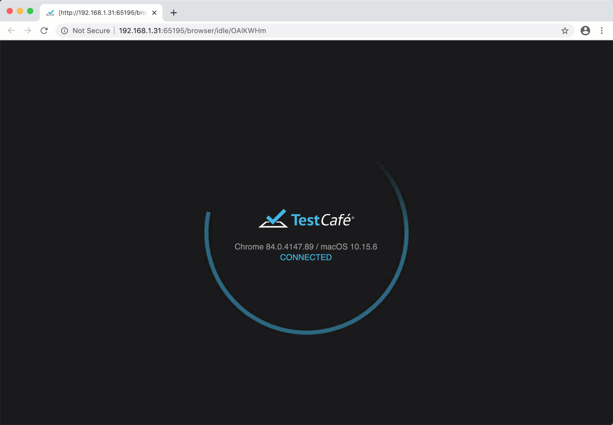

# Changelog

## v2.6.2 (2023-06-01)

TestCafe v2.6.2 introduces a number of bug fixes.

### Bug fixes

* Internet Explorer 11 hangs because it cannot process client-side scripts that ship with TestCafe v2.6.1  ([#7741](https://github.com/DevExpress/testcafe/issues/7741)).
* The `pressKey('space')` action doesn't affect checkbox status in Firefox ([#6969](https://github.com/DevExpress/testcafe/issues/6969)).

## v2.6.1 (2023-05-29)

TestCafe v2.6.1 retires **Experimental Debug** mode, and introduces a number of important bug fixes.

### Removed: Experimental debug mode

TestCafe v1.18.0 introduced [Experimental Debug mode](https://testcafe.io/403664/release-notes/framework/2021-12-22-testcafe-v1-18-0-released) --- a way to debug Selectors and Client Functions in the text editor. TestCafe v2.4.0 shipped with the [Visual Selector Debugger](https://testcafe.io/documentation/404288/guides/intermediate-guides/visual-selector-debugger), which allows users to troubleshoot Selector queries directly in the browser.

The two capabilities serve the same purpose, but the Visual Selector Debugger is more user-friendly. As such, beginning with TestCafe v2.6.1, the framework **no longer includes** Experimental Debug mode. Thank you to all the TestCafe users who tried out the capability.

### Bug fixes

* When TestCafe runs in Native Automation mode, Request Hooks yield an error ([#7683](https://github.com/DevExpress/testcafe/issues/7683)).
* When TestCafe runs in Native Automation mode, the framework incorrectly processes pages with the pound sign ("#") in the URL ([#7652](https://github.com/DevExpress/testcafe/issues/7652)).
* TestCafe incorrectly handles XHR headers in Native Automation mode ([#7664](https://github.com/DevExpress/testcafe/issues/7664), [#7686](https://github.com/DevExpress/testcafe/issues/7686), [#7645](https://github.com/DevExpress/testcafe/issues/7645)).
* TestCafe reports an incorrect browser alias when it runs tests in Microsoft Edge ([#7647](https://github.com/DevExpress/testcafe/issues/7647)).
* TestCafe fails to intercept all HTTP requests when it runs in Native Automation mode. ([#7640](https://github.com/DevExpress/testcafe/issues/7640)).
* TestCafe cannot resize browser windows in the latest version of Chrome for macOS ([#7684](https://github.com/DevExpress/testcafe/issues/7684)).
* TestCafe incorrectly processes client-side styles, causing slowdowns and errors ([#6726](https://github.com/DevExpress/testcafe/issues/6726), [#6747](https://github.com/DevExpress/testcafe/issues/6747)).
* TestCafe crashes when you use the TestCafe Test Runner API to launch multiple tests simultaneously ([#7711](https://github.com/DevExpress/testcafe/issues/7711)).

## v2.6.0 (2023-05-11)

TestCafe v2.6.0 introduces two enhancements: a new hook that allows users to modify reporter output, and support for JavaScript configuration files with the `.cjs` extension.

### New reporter hook

The [onBeforeWrite](https://testcafe.io/documentation/404388/guides/advanced-guides/modify-reporter-output) hook allows you to modify the output of a reporter.

If you want your test reports to include custom content, you can create a custom reporter from scratch. However, this approach takes time and effort. Use the `onBeforeWrite` hook if you want to make minor changes to the output of an existing reporter.

Define an `onBeforeWrite` hook in a JavaScript configuration file. The following hook adds the duration in milliseconds to every test entry in the report:

```js
//.testcaferc.js or .testcaferc.cjs
function onBeforeWriteHook(writeInfo) { // This function will fire every time the reporter calls the "write" method.
    if (writeInfo.initiator === 'reportTestDone') { // The "initiator" property contains the name of the reporter event that triggered the hook.
         const {
            name,
            testRunInfo,
            meta
        } = writeInfo.data || {}; // If you attached this hook to a compatible reporter (such as "spec" or "list"), the hook can process data related to the event.
        const testDuration = testRunInfo.durationMs; // Save the duration of the test.
        writeInfo.formattedText = writeInfo.formattedText + ' (' + testDuration + 'ms)'; // Add test duration to the reporter output.
    };
}


module.exports = { // Attach the hook
    hooks: {
        reporter: {
            onBeforeWrite: {
                'spec': onBeforeWriteHook, // This hook will fire when you use the default "spec" reporter.
            },
        },
    },
};
```


### CJS support

If you run TestCafe v2.6.0 and higher, you can now use a configuration file with the `.cjs` file extension. TestCafe detects the `.testcaferc.cjs` file on startup, alongside its `.js` and `.json` counterparts.

[TestCafe configuration files](https://testcafe.io/documentation/402638/reference/configuration-file) **only** support CommonJS syntax. Meanwhile, modern JavaScript tools often default to ESM syntax. If a JavaScript project is of type `module`, Node.js expects the project's `.js` files to contain ESM syntax.

Use the `.cjs` configuration file extension to let Node.js know that the file contains CommonJS syntax.

Many thanks to the TestCafe contributor Damien Guérin ([@gigaga](https://github.com/DevExpress/testcafe/pull/7614)) for the implementation of this capability.

### Bug fixes

* If you call the `t.skipJsErrors` method without arguments, TestCafe passes a `false` value to the method. This behavior is inconsistent with similar methods of a greater scope --- `test.skipJsErrors` and `fixture.skipJsErrors` ([#7648](https://github.com/DevExpress/testcafe/issues/7648)).
* Users cannot disable the "quarantine mode" or "skipJsErrors" settings from the command line ([#7077](https://github.com/DevExpress/testcafe/issues/7077)).
* TestCafe incorrectly processes exceptions of types other than `Error` ([#7627](https://github.com/DevExpress/testcafe/issues/7627)).
* TestCafe does not consistently execute the `t.pressKey` action in Mozilla Firefox. Attempts to press the "backspace" key and the "tab" key, among others, may fail. ([#7623](https://github.com/DevExpress/testcafe/pull/7623))
* When TestCafe runs in Native Automation mode, it incorrectly executes some instances of the `t.request` method. ([#7609](https://github.com/DevExpress/testcafe/issues/7609))
* The TestCafe proxy incorrectly processes private class properties in client-side scripts, which leads to page load failure ([#7632](https://github.com/DevExpress/testcafe/issues/7632), PR by [@sorin-davidoi](https://github.com/sorin-davidoi)).

## v2.5.0 (2023-04-06)

TestCafe v2.5.0 introduces three major enhancements:
* The new `t.report` method passes custom data to the test reporter.
* The new `--native-automation` flag enables TestCafe to automate all Chromium-based browsers with the native CDP protocol.
* The new `--esm` flag allows users to import ESM modules in test files.

### t.report

Include the [t.report()](https://testcafe.io/documentation/404350/reference/test-api/testcontroller/report) method in your test to pass custom data to the reporter.

Specify arguments of any type (string, array, Object, etc). Separate arguments with a comma:

```js
await
    t.report( 
        'text', 
        {'key': 'value'},
        ['arrayItem1', 'arrayItem2']
    );
```

The default `spec` reporter displays custom data after test completion, once for each browser that runs the test.


### CDP Automation: Now Stable

TestCafe v2.2.0 introduced an experimental [proxyless mode](https://testcafe.io/documentation/404237/guides/intermediate-guides/native-automation-mode) that automated Google Chrome with the native CDP protocol.

For the v2.5.0 release, the TestCafe team addressed most issues that our users discovered when the capability was "experimental", and gave it a new name --- Native Automation mode.

Unlike its predecessor, the Native Automation mode supports **all** Chromium-based browsers, including Microsoft Edge. Enable the `nativeAutomation` option in the [command line interface](https://testcafe.io/documentation/402639/reference/command-line-interface#--native-automation), the [configuration file](https://testcafe.io/documentation/402638/reference/configuration-file#nativeautomation), or the [runner.run()](https://testcafe.io/documentation/402655/reference/testcafe-api/runner/run#nativeautomation) function to try this capability. 

> [!IMPORTANT]
> TestCafe v2.5.0 removed the `experimentalProxyless` option from the [createTestCafe](https://testcafe.io/documentation/402662/reference/testcafe-api/global/createtestcafe) function. Use the [runner.run()](https://testcafe.io/documentation/402655/reference/testcafe-api/runner/run#nativeautomation) function to enable Native Automation mode from the TestCafe Test Runner API.

### ESM Module Support: Now Stable

TestCafe v2.5.0 **drops** the `experimental` prefix from the `--esm` [CLI flag](https://testcafe.io/documentation/402639/reference/command-line-interface#--esm). Enable the `--esm` flag to import modules that do not support CommonJS.

```sh
testcafe chrome test.js --esm
```

## v2.4.0 (2023-03-06)
TestCafe v2.4.0 introduces the Visual Selector Debugger. You can now create and debug Selector queries in the browser window.

### Visual Selector Debugger

TestCafe v2.4.0 displays the Visual Selector Debugger panel when you activate [Debug Mode](https://testcafe.io/documentation/402835/guides/basic-guides/debug-tests). Use the panel to debug Selector queries from your test, or generate new Selector queries.


If a Selector query causes your test to fail, add the [t.debug()](https://testcafe.io/documentation/402707/reference/test-api/testcontroller/debug) command after the last successful action, and launch the test.

When the test reaches the breakpoint, the window that runs the test displays the Selector Debugger panel. Copy the failing Selector query from test code to the Selector Debugger input field.

* TestCafe highlights page elements that match the Selector query.
* If no elements match the Selector query, the panel displays the **No Matching Elements** warning. 
* If your Selector query contians a syntax error, the panel displays the **Invalid Selector** warning.

To interactively generate a Selector query, click the **Pick** button, and select the target element on the page.

For more information on the panel, its capabilities, and limitations, read the [Visual Selector Debugger Guide](https://testcafe.io/documentation/404288/guides/intermediate-guides/visual-selector-debugger).

### Bug Fixes

* TestCafe cannot execute the [t.request](https://testcafe.io/documentation/403981/reference/test-api/testcontroller/request) action in [proxyless mode](https://testcafe.io/documentation/404237/guides/experimental-capabilities/proxyless-mode) ([#7523](https://github.com/DevExpress/testcafe/issues/7523)).

## v2.3.1 (2023-02-09)
TestCafe v2.3.1 introduces a number of bug fixes.

### Bug Fixes

* Client-side code with optional chaining may trigger a TestCafe error ([#7387](https://github.com/DevExpress/testcafe/issues/7387)).
* TestCafe cannot interact with images from the Shadow DOM ([#7454](https://github.com/DevExpress/testcafe/issues/7454)).
* TestCafe v2.3.0 fails to launch when the `test.meta` method precedes test code ([#7482](https://github.com/DevExpress/testcafe/issues/7482)).
* When TestCafe launches a headless instance of Google Chrome in proxyless mode, it cannot interact with elements that are overlapped by the status bar ([#7483](https://github.com/DevExpress/testcafe/issues/7483)).

## v2.3.0 (2023-01-30)

TestCafe v2.3.0 introduces `create-testcafe` --- an interactive tool that allows you to initialize a new TestCafe project in seconds. The update also includes *experimental* ECMAScript module support and a number of bug fixes.

> **_IMPORTANT:_**
> TestCafe v2.3.0 ends support for Node.js 14 due to a known vulnerability in the `babel-plugin-module-resolver` module.
>
> Install an up-to-date version of the Node.js runtime to use TestCafe v2.3.0 and up.
> 
> The official maintenance period for Node.js 14 [elapses](https://endoflife.date/nodejs) on April 1st, 2023. 


### create-testcafe

Use the [create-testcafe](https://github.com/devexpress/create-testcafe) tool to initialize a new TestCafe project, or *add* TestCafe to an existing Node.js application.

Execute the following command to launch `create-testcafe`:

```sh
npx create-testcafe
```


The `create-testcafe` tool allows you to perform the following actions with a single command:

1. Create a new folder for the TestCafe project *(optional)*.
2. Create a new local installation of TestCafe and its dependencies.
3. Create and initialize a TestCafe configuration file.
4. Create a separate subfolder for tests.
5. Populate the test folder with test examples *(optional)*.
6. Create a YAML file with a GitLab Actions workflow that runs TestCafe tests *(optional)*.

Read the [TestCafe Setup Wizard guide](https://testcafe.io/documentation/404259/guides/best-practices/create-testcafe) for more information on the create-testcafe tool.

### Experimental: ECMAScript module support

> **_IMPORTANT:_**
> ESM module suppport works with Node.js 16 and up.

TestCafe has always used *CommonJS* syntax for module imports:

```js
const { x } = require('y');
```

An increasing number of Node.JS packages abandon CommonJS in favour of [ECMAScript module syntax](https://gist.github.com/sindresorhus/a39789f98801d908bbc7ff3ecc99d99c):

```js
import {x} from 'y'
```

Enable the `--experimental-esm` [CLI flag](https://testcafe.io/documentation/402639/reference/command-line-interface#--experimental-esm) to import modules that do not support CommonJS. Note: tests with ECMASCript module syntax are subject to [additional requirements](https://testcafe.io/404257/release-notes/framework/2023-1-30-testcafe-v2-3-0-released#additional-reuqirements).

```sh
testcafe chrome test.js --experimental-esm
```

#### Additional Reuqirements

To run tests with ECMAScript `import` statements, make sure that your project meets at least one of the following requirements:

1. The value of the `type` key in your project's [package.json file](https://nodejs.org/api/packages.html#packagejson-and-file-extensions) is `module`.
2. The test files in your project use the `.mjs` extension.

### Bug Fixes

* TestCafe doesn't delete expired cookies ([#7432](https://github.com/DevExpress/testcafe/issues/7432)).
* TestCafe cannot handle windows that appear when the user clicks a link with a `_blank` target ([#6926](https://github.com/DevExpress/testcafe/issues/6926)).
* TestCafe fails to start because it triggers the `dns.setDefaultResultOrder` method in older Node.js environments ([#7447](https://github.com/DevExpress/testcafe/issues/7447)).
* TestCafe depends on a vulnerable, outdated version of the `babel-plugin-module-resolver` package ([#7456](https://github.com/DevExpress/testcafe/issues/7456)).

## v2.2.0 (2022-12-29)

TestCafe v2.2.0 introduces user-defined custom actions and an important *experimental* capability. Google Chrome users can now enable "proxyless mode" to speed up their test suite.

### Custom Action Support

TestCafe users can now define [custom test actions](xref:404150). Place the definition function in a [**JavaScript** configuration file](xref:402638#customactions):

```js
module.exports = {
  customActions: {
   async makeCoffee (args) {
        await this.click(args);
    }, 
  }
};
```

Include custom methods in your tests alongside [other TestController methods](xref:402632#test-controller-api). 
Add the `customActions` prefix when you call the action:

```js
test('Test with a custom action', async t => {
    await t.click()
        .customActions.makeCoffee()
        .click();
})
```

### Experimental: Proxyless mode

TestCafe runs an under-the-hood [reverse proxy](xref:402631#page-proxying) to automate tests across different browsers. But this technique complicates the framework. Native automation protocols offer superior automation speeds and greater stability. That's why the TestCafe team decided to gradually phase the reverse proxy out in favor of native support for these automation protocols.

TestCafe v2.2.0 includes an **experimental** option that disables the proxy for **Google Chrome**. 

```sh
testcafe chrome tests --experimental-proxyless
```

You can enable this option in the [command line interface](xref:402639#--experimental-proxyless), the [Test Runner API](xref:402662), and the [configuration file](xref:402638#experimentalproxyless). Read the [Proxyless mode guide](xref:404237) for more information.

### Bug Fixes

* TestCafe doesn't hide the live mode status bar when the bar obstructs the action target ([#7384](https://github.com/DevExpress/testcafe/issues/7384))
* The 'Target element is overlapped' message does not reference the Selector that caused the warning ([#7386](https://github.com/DevExpress/testcafe/issues/7386))
* The TestCafe Dashboard reporter includes an outdated `uuid` dependency ([testcafe-reporter-dashboard#111](https://github.com/DevExpress/testcafe-reporter-dashboard/issues/111))
* TestCafe doesn't display the correct error message when the framework throws an exception ([#6936](https://github.com/DevExpress/testcafe/issues/6936))
* TestCafe retains some cookies after the user requests their deletion (PR [testcafe-hammerhead#2818](https://github.com/DevExpress/testcafe-hammerhead/pull/2818))
* TestCafe cannot load test pages with the `localhost` URL on Node.js v17 and up ([#7396](https://github.com/DevExpress/testcafe/issues/7396))
* TestCafe cannot take screenshots in headless Chrome on Node.js v17 and up ([#7408](https://github.com/DevExpress/testcafe/issues/7408))
* Web workers that originate from Blob URLs throw an error when they call the  `importScript` function ([#7378](https://github.com/DevExpress/testcafe/issues/7378))
* TestCafe doesn't set the correct `Request` header when an `iframe` points the user to a new URL ([#7376](https://github.com/DevExpress/testcafe/issues/7376), PR [testcafe-hammerhead#2813](https://github.com/DevExpress/testcafe-hammerhead/pull/2813) by [@naggingant](https://github.com/naggingant))
* TestCafe cannot interact with options that belong to a `<select>` element with the `multiple` attribute (PR [testcafe-hammerhead#2815](https://github.com/DevExpress/testcafe-hammerhead/pull/2815))

## v2.1.0 (2022-11-10)

### Improvements

#### Improved handling of invisible elements

* [Visibility criteria](xref:402833#visibility-criteria) update: TestCafe no longer interacts with elements that have the `visibility: collapse` attribute.
* If the action target does not fit the visibility criteria, TestCafe outputs an error message that references the exact reason. ([#7310](https://github.com/DevExpress/testcafe/issues/7310)).

#### Improved handling of overlapped elements

* When another element overlaps the center of the action target, TestCafe scans the target element for available points of contact. If the selector timeout ends before TestCafe finds an unobstructed point, TestCafe outputs a warning message and interacts with the topmost element at the center of the original target ([#7309](https://github.com/DevExpress/testcafe/issues/7309)).
* TestCafe v2.1.0 contains an improved algorithm that detects whether extra scrolling can resolve an element obstruction issue. ([#6208](https://github.com/DevExpress/testcafe/issues/6208))

### Bug Fixes

* In some environments, TestCafe cannot take screenshots when the test runs in a headless Chromium-based browser ([#7224](https://github.com/DevExpress/testcafe/issues/7224)).
* Full-page screenshots in headless Chrome do not include the edges of the page ([#5961](https://github.com/DevExpress/testcafe/issues/5961)).
* TestCafe throws the "TypeError: Illegal invocation" error when the front-end code passes a number value to the  `Element.insertAdjacentText` method ([#7352](https://github.com/DevExpress/testcafe/issues/7352)).

## v2.0.2 (2022-10-31)

### Bug Fixes

* TestCafe doesn't include the flags necessary to launch Chrome in a Podman container ([PR #7307](https://github.com/DevExpress/testcafe/pull/7307) by @timnederhoff)
* TestCafe doesn't warn users when it interacts with an element that obstructs the original action target ([#2930](https://github.com/DevExpress/testcafe/issues/2930))
* TestCafe incorrectly parses regular expressions passed to the --skip-js-errors CLI flag ([#7301](https://github.com/DevExpress/testcafe/issues/7301))

## v2.0.1 (2022-09-26)

### Bug Fixes

* TestCafe yields incomplete video recordings in concurrency mode ([#7218](https://github.com/DevExpress/testcafe/issues/7218)).
* Video recordings in concurrency mode yield `EPIPE` errors that cause crashes ([#7216](https://github.com/DevExpress/testcafe/issues/7216)).
* Running TestCafe 1.20.1 and up with a high concurrency factor may nonetheless result in a `MaxListenersExceededWarning` warning ([#7188](https://github.com/DevExpress/testcafe/issues/7188)).
  
## v2.0.0 (2022-08-31)

### TypeScript update

> :warning:
> TestCafe 2.0 includes a breaking change.
The framework’s built-in TypeScript compiler has been updated from version 3.9 to version 4.7. The vast majority of TestCafe users should not experience any issues during the upgrade. However, since TypeScript does not follow the semver versioning policy, even minor TypeScript updates contain breaking changes. Some TypeScript users may need to perform additional actions to ensure the compatibility of their test code.

Read the [TestCafe 2.0 Migration Guide](https://testcafe.io/documentation/404017/recipes/migration/testcafe-2-0-migration-guide) to learn more.

### Improvement: New ways to ignore JavaScript errors

TestCafe v2.0 introduces new ways to ignore JavaScript errors during test runs.

Two new methods allow you to ignore errors on a per-test or a per-fixture basis.

* Use the [test.skipJsErrors](https://testcafe.io/documentation/404026/reference/test-api/test/skipjserrors) method to ignore JavaScript errors in specific tests.
* Use the [fixture.skipJsErrors](https://testcafe.io/documentation/404025/reference/test-api/fixture/skipjserrors) method to ignore JavaScript errors for specific fixtures.
* The [t.skipJsErrors](https://testcafe.io/documentation/404027/reference/test-api/testcontroller/skipjserrors) action lets you ignore JavaScript errors at specific points in the test.

For each of the methods above, you can define the following options:

* The pageUrl option filters errors by page URL.
* The message option filters errors by message.
* The stack option filters errors by call stack.

Read the [Skip JavaScript Errors](https://testcafe.io/documentation/404038/recipes/debugging/skip-javascript-errors) recipe to learn more.

## v1.20.1 (2022-08-08)

### Bug Fixes

* Running 11 or more tests concurrently causes a memory leak ([#7188](https://github.com/DevExpress/testcafe/issues/7188)).
* TestCafe cannot switch to iframes that descend from a shadowRoot element ([#3673](https://github.com/DevExpress/testcafe/issues/3673)).
* TestCafe attempts to execute JSON files without `fixture` and `test` definitions (PR [#7187](https://github.com/DevExpress/testcafe/pull/7187)).
* TestCafe incorrectly processes request hooks that return status code 500 ([#7213](https://github.com/DevExpress/testcafe/issues/7213))

## v1.20.0 (2022-07-14)

> :warning:
> Warning: [Impending breaking change](#coming-in-testcafe-20-typescript-4).
> TestCafe v1.20 is the final version of the framework to support TypeScript 3.
> The next update will abandon TypeScript 3 in favor of TypeScript 4.

TestCafe v1.20.0 includes two major capabilities: an [API testing toolkit](#api-testing) and the ability to set a [global test page URL](#global-starting-url). Additionally, TestCafe 1.20.0 introduces experimental support for [Chrome User Flow Replays](#experimental-chrome-user-flow-replays), as well as a number of under-the-hood improvements.

### API Testing

TestCafe v1.20.0 includes a comprehensive set of server-side API testing tools. You can add dedicated API tests to your test suite, or include API testing methods in existing functional tests.

The new [Request](https://testcafe.io/documentation/403981/reference/test-api/testcontroller/request) test action executes an HTTP request and returns the server's response.

```js
const responseBody = await t.request(`http://localhost:3000/helloworld`).body;

t.expect(responseBody).contains('Hello World') // true
```

Read the [API Testing Guide](https://testcafe.io/documentation/403971/guides/intermediate-guides/api-testing) for a full overview of the framework's API testing capabilities.

### Global starting URL

You can now define a [single starting URL](https://testcafe.io/documentation/402638/reference/configuration-file#baseurl) for all the tests in your test suite.

Declare the `baseUrl` in one of the following three ways:

* The [configuration file property](https://testcafe.io/documentation/402638/reference/configuration-file#baseurl)
* The [command line option](https://testcafe.io/documentation/402639/reference/command-line-interface#--base-url)
* The [Test Runner API option](https://testcafe.io/documentation/402655/reference/testcafe-api/runner/run)

Once you define a `baseUrl`, you can omit fixture and test URLs entirely, or define them relative to your `baseUrl`:

```json
    "baseUrl": "https://devexpress.github.io/testcafe"
```

```js
fixture`Test structure`
    .page`./example`; // starts at https://devexpress.github.io/testcafe/example
```

### Experimental: Chrome User Flow Replays

TestCafe v1.20.0 introduces **experimental, limited** support for [Google Chrome user flow recordings](https://developer.chrome.com/docs/devtools/recorder/).

Record page actions in Google Chrome and export the recording as a JSON file. TestCafe will play the recording back just like it would a generate a test report

Read the [User Flow Recordings](https://testcafe.io/documentation/403998/guides/experimental-capabilities/chrome-replay-support) guide to learn more.

### Coming in TestCafe 2.0: TypeScript 4

The next version of TestCafe will adopt TypeScript 4 and lose compatibility with TypeScript 3.X.

To [indicate the breaking change](https://semver.org), we will increment the framework's major version number - from 1 to 2.

TestCafe 2.0 will be released later this month.

### Improvements

* Better Google Chrome video capture

    TestCafe v1.20.0 uses the [Screen Capture API](https://developer.mozilla.org/en-US/docs/Web/API/Screen_Capture_API/Using_Screen_Capture) to record videos of Google Chrome test runs. This results in a significantly better test recording framerate and image quality.

    


### Bug Fixes

* When the `t.typeText` action raises an error, TestCafe mistakenly awaits the target element for the second time ([#6623](https://github.com/DevExpress/testcafe/issues/6623))

* Concurrent test runs do not always generate concurrent test run reports ([#7062](https://github.com/DevExpress/testcafe/issues/7062))

* TestCafe doesn't properly handle errors raised inside the `requestMock` function ([#6703](https://github.com/DevExpress/testcafe/issues/6703))

* The default terminal viewport width is too low for non-tty terminals  (Issue [#5919](https://github.com/DevExpress/testcafe/issues/5919), [PR #6930](https://github.com/DevExpress/testcafe/pull/6930) by @PayBas)

* TestCafe cannot switch to an invisible iframe ([#4558](https://github.com/DevExpress/testcafe/issues/4558))

* Update incorrect TypeScript definitions ([PR #7069](https://github.com/DevExpress/testcafe/pull/7069) by @karolnowinsky)

* Some SVGs don't meet the visibility criteria ([#6998](https://github.com/DevExpress/testcafe/issues/6998))

## v1.19.0 (2022-05-26)

TestCafe v1.19.0 introduces three major capabilities: a [Cookie Management API](#cookie-management), suite-wide [test hooks](#global-test-hooks), and suite-wide [request hooks](#global-request-hooks).

### New Capabilities

#### Cookie Management

Previous versions of TestCafe lacked dedicated cookie management methods. Users had to write custom [client functions](https://testcafe.io/documentation/402832/guides/basic-guides/obtain-client-side-info) to add and remove cookies. This technique was complicated and, at times, limiting. Some cookie manipulation actions --- such as HTTP-only cookie management --- were very hard to integrate into the test suite.

The latest version of the framework includes a proper set of cookie management tools that can handle a wide variety of tasks. Learn more about the new methods in our documentation: [deleteCookies](https://testcafe.io/documentation/403874/reference/test-api/testcontroller/deletecookies), [getCookies](https://testcafe.io/documentation/403873/reference/test-api/testcontroller/getcookies), [setCookies](https://testcafe.io/documentation/403872/reference/test-api/testcontroller/setcookies).

```ts
fixture('[API] Delete Cookies')
   .page('https://devexpress.github.io/testcafe/example/');

test('Should delete all the cookies with the specified url', async t => {
   // Set a cookie for the examples page.
   await t.setCookies({ name: 'apiCookie1', value: 'value1' });

   // Set a cookie for the 'thank you' page.
   await t.setCookies({
       name:  'apiCookie2',
       value: 'value2',
   }, 'https://devexpress.github.io/testcafe/example/thank-you.html');

   // Check the cookies.
   let cookies = await t.getCookies();

   await t
       .expect(cookies.length).eql(2)
       .expect(cookies[0]).contains({ name: 'apiCookie1', path: '/testcafe/example/' })
       .expect(cookies[1]).contains({ name: 'apiCookie2', path: '/testcafe/example/thank-you.html' });

    // Delete cookies from the 'thank you' page.
    await t.deleteCookies({ domain: 'devexpress.github.io', path: '/testcafe/example/thank-you.html' });

    // Check the cookies.
    cookies = await t.getCookies();

    await t
        .expect(cookies.length).eql(1)
        .expect(cookies[0]).contains({ name: 'apiCookie1', path: '/testcafe/example/' });
});
```

#### Global Test Hooks

Many TestCafe users employ test hooks --- functions that run before and after tests and fixtures. In TestCafe v1.19.0 and higher, you can attach hooks to *test runs*, as well as apply test hooks to your *entire suite*. This capability requires the use of a JavaScript configuration file.

Learn more about hooks from our newly updated [hook guide](https://testcafe.io/documentation/403435/guides/advanced-guides/hooks).

#### Global Request Hooks

Request hooks are functions that intercept HTTP requests and mock HTTP responses. Earlier versions of TestCafe let you attach request hooks to one test or fixture at a time. You can now define **global** request hooks and attach them to multiple tests or fixtures in your suite.

Read the [Request Hooks guide](https://testcafe.io/documentation/402842/guides/advanced-guides/intercept-http-requests) to learn more.

 ### Bug Fixes

 * TestCafe ignores CLI browser arguments when they conflict with the configuration file ([#6618](https://github.com/DevExpress/testcafe/issues/6618))

 * The outdated `moment.js` dependency contains a critical vulnerability (PR [#6996](https://github.com/DevExpress/testcafe/pull/6996) by [@vergilfromadyen](https://github.com/vergilfromadyen))

 * TestCafe proxy doesn't always serve cookies with the `secure` attribute ([testcafe-hammerhead/#2715](https://github.com/DevExpress/testcafe-hammerhead/issues/2715))

## v1.18.6 (2022-04-18)

### Bug Fixes

 * Faulty processing of client-side option chains leads to test execution errors ([testcafe-hammerhead/#2714](https://github.com/DevExpress/testcafe-hammerhead/issues/2714))

 * Poor Brotli compression performance ([testcafe-hammerhead/#2743](https://github.com/DevExpress/testcafe-hammerhead/issues/2743))

 * User Roles break when navigating to a new URL in a new window ([PR testcafe-hammerhead/#2754](https://github.com/DevExpress/testcafe-hammerhead/pull/2754))

 * The t.maximizeWindow method doesn't maximise browser windows on macOS ([testcafe-browser-tools/#222](https://github.com/DevExpress/testcafe-browser-tools/issues/222))

## v1.18.5 (2022-03-31)

### Bug Fixes

 * The t.scrollIntoView method causes the "Element is not visible" error when the target's `overflow` property is `hidden` ([#6601](https://github.com/DevExpress/testcafe/issues/6601))

 * TestCafe triggers click events for label elements even when the input is disabled ([#6949](https://github.com/DevExpress/testcafe/issues/6949))

 * TestCafe hangs when you change the active window between two consecutive assertions ([#6037](https://github.com/DevExpress/testcafe/issues/6037))

 * TestCafe cannot take screenshots when using the LambdaTest browser provider ([#6887](https://github.com/DevExpress/testcafe/issues/6887))

 * Pages that target a missing `<iframe>`([testcafe-hammerhead/#2178](https://github.com/DevExpress/testcafe-hammerhead/issues/2178) element with the `Element.focus` method yield a ""TypeError: window.location.toString is not a function" error.

 * TestCafe causes errors when it encounters XMLHTTPRequest calls that fetch resources from `blob:` URLs ([testcafe-hammerhead/#2634](https://github.com/DevExpress/testcafe-hammerhead/issues/2634))

 * `HTMLElement.removeAttributeNode` method calls yield unjustified exceptions ([PR testcafe-hammerhead/#2742](https://github.com/DevExpress/testcafe-hammerhead/pull/2742) by @TrevorKarjanis)

## v1.18.4 (2022-02-21)

### Bug Fixes

 * TestCafe does not display reporter output during initialization ([#6842](https://github.com/DevExpress/testcafe/issues/6842))

 * TestCafe uses outdated automation scripts after cache expiration ([testcafe-hammerhead/#2738](https://github.com/DevExpress/testcafe-hammerhead/issues/2738), [PR](https://github.com/DevExpress/testcafe-hammerhead/issues/2739) by @rr13k)

 * The `Node.append` method causes the `Illegal invocation` error ([PR testcafe-hammerhead/#2730](https://github.com/DevExpress/testcafe-hammerhead/pull/2730) by @danieltroger)

 * Scripts in SVG documents cause the `Illegal invocation` error ([testcafe-hammerhead/#2735](https://github.com/DevExpress/testcafe-hammerhead/issues/2735
))

## v1.18.3 (2022-01-25)

### Bug Fixes

* The `nanoid` package is vulnerable to CVE-2021-23566 ([#6826](https://github.com/DevExpress/testcafe/pull/6826))
* The `Selector.visibility` property does not depend on the parent elements' visibility ([#3495](https://github.com/DevExpress/testcafe/issues/3495))

## v1.18.2 (2022-01-18)

### Bug Fixes

* Tests with client scripts yield the "Cannot read property 'tests' of null" error ([#6305](https://github.com/DevExpress/testcafe/issues/6305))
* TestCafe hangs after failing to initialize a Role ([#5278](https://github.com/DevExpress/testcafe/issues/5278))
* Testcafe falsely detects filter directives in the configuration file ([#6620](https://github.com/DevExpress/testcafe/issues/6620))
* Concurrent Chrome instances cannot reconnect to TestCafe after a restart ([#4554](https://github.com/DevExpress/testcafe/issues/4554))
* TestCafe hangs if a user enters an iframe and then switches to a different browser window ([#6085](https://github.com/DevExpress/testcafe/issues/6085))
* TestCafe opens incorrect URLs when you concurrently run multiple fixtures from the same test file ([#6041](https://github.com/DevExpress/testcafe/issues/6041))
* TestCafe expands disabled `<select>` elements ([#5616](https://github.com/DevExpress/testcafe/issues/5616))
* TestCafe does not load some cross-domain iframes ([#6633](https://github.com/DevExpress/testcafe/issues/6633))
* TestCafe incorrectly sets the Document.referrer property in Chrome 89 ([#6144](https://github.com/DevExpress/testcafe/issues/6144))
* Tests hang when the test page initiates a file download ([#5796](https://github.com/DevExpress/testcafe/issues/5796))
* Requests fail because TestCafe incorrectly handles dynamic content security policy ([#6057](https://github.com/DevExpress/testcafe/issues/6057))
* TestCafe triggers pointerdown event handlers twice ([#5891](https://github.com/DevExpress/testcafe/issues/5891))
* TestCafe cannot trigger click event handlers for Angular buttons with the "disabled" attribute ([#5240](https://github.com/DevExpress/testcafe/issues/5240))

## v1.18.1 (2021-12-23)

### macOS Bug Fix

TestCafe fails to launch Safari after the v1.18.0 update.

## v1.18.0 (2021-12-22)

TestCafe v1.18.0 includes a new experimental Selector debugging capability, important improvements for macOS users and a number of routine bug fixes.

If you run TestCafe on macOS, follow the [Upgrade Guide](https://testcafe.io/403664/release-notes/framework/2021-12-22-testcafe-v1-18-0-released#upgrade-instructions) to make sure your upgrade goes smoothly.

### New Debugging Capabilities (Experimental)

If you launch TestCafe with the `--experimental-debug` flag, you can debug Selectors and Client Functions in the Watch panel of a Node.js debugger.

### macOS improvements

#### TestCafe Browser Tools on Apple Silicon

The TestCafe Browser Tools package is a communication layer that automates browsers on behalf of TestCafe. Both the TestCafe framework and TestCafe Studio include the TestCafe Browser Tools binary.

Earlier versions of TestCafe Browser Tools were optimized for the x86-64 architecture. [Apple Silicon Macs](https://support.apple.com/en-gb/HT211814/) ran those binaries through the [Rosetta 2 translation layer](https://developer.apple.com/documentation/apple-silicon/about-the-rosetta-translation-environment/). Rosetta 2 took up additional space and prevented TestCafe from taking full advantage of the processor.

TestCafe v1.18.0 includes a **Universal** TestCafe Browser Tools binary that runs natively on both x64 Macs **and** Apple Silicon Macs.

Follow the [Upgrade Instructions](https://testcafe.io/403664/release-notes/framework/2021-12-22-testcafe-v1-18-0-released#upgrade-instructions) to make sure your version of TestCafe Browser Tools is up to date.

#### TestCafe Browser Tools macOS Permission Fix

The TestCafe Browser Tools binary requires special privileges to automate browsers and take screenshots. Security improvements in recent versions of macOS made these privileges harder to obtain.

Prior to TestCafe v1.18.0, each installation of TestCafe and TestCafe Studio included a TestCafe Browser Tools binary. macOS users with multiple sets of TestCafe Browser Tools had to go through a lengthy process to obtain the necessary permissions.

TestCafe v1.18.0 and TestCafe Studio v1.7 address this issue. Beginning with this version, all TestCafe installations share a single TestCafe Browser Tools binary. TestCafe stores this binary in the user's Home directory, inside the hidden `~/.testcafe-browser-tools` folder.

Follow the [Upgrade Instructions](https://testcafe.io/403664/release-notes/framework/2021-12-22-testcafe-v1-18-0-released#upgrade-instructions) to reset TestCafe Browser Tools' permissions and enable the new binary.

### Bug Fixes

* TestCafe immediately closes new windows ([#6680](https://github.com/DevExpress/testcafe/issues/6680))
* Tests fail with the `TypeError: Invalid value used as weak map key.` error ([#6563](https://github.com/DevExpress/testcafe/issues/6563))
* The latest version of the TestCafe Docker image cannot connect to Chrome and Chromium ([#6436](https://github.com/DevExpress/testcafe/issues/6436))
* TestCafe loses test error call stack and outputs the following message instead: `"Uncaught object "[object Object]"` (Issue [#6624](https://github.com/DevExpress/testcafe/issues/6624). Discovered by [@danieltroger](https://github.com/DevExpress/testcafe/issues/6624#issuecomment-975918371), PR by [@rob4629](https://github.com/DevExpress/testcafe/pull/6719).)
* Lack of definitions for two new timeout options results in TypeScript compilation errors ([#6713](https://github.com/DevExpress/testcafe/issues/6713))
* TypeScript filter functions erroneously require a Promise return value ([#6705](https://github.com/DevExpress/testcafe/issues/6705))

## v1.17.1 (2021-11-11)

### Bug Fixes

- TestCafe incorrectly reads the 'reporter' configuration file option ([#6665](https://github.com/DevExpress/testcafe/issues/6665), [#6594](https://github.com/DevExpress/testcafe/issues/6594)).
- An error report displays multiple warnings when you debug a test in headless mode ([#6605](https://github.com/DevExpress/testcafe/issues/6605)).
- The testcafe-hammerhead proxy fails to load a web page ([testcafe-hammerhead/#2708](https://github.com/DevExpress/testcafe-hammerhead/issues/2708)).

## v1.17.0 (2021-11-02)

### Enhancements

#### Global Test and Fixture Hooks

You can now specify [global test and fixture hooks](https://testcafe.io/documentation/403435/guides/advanced-guides/hooks#global-hooks). TestCafe attaches these hooks to every test / fixture in the test suite.

```js
module.exports = {
    hooks: {
        fixture: {
            before: async (ctx) => {
                // your code
            },
            after: async (ctx) => {
                // your code
            }
        },
        test: {
            before: async (t) => {
                // your code
            },
            after: async (t) => {
                // your code
            }
        }
    }
};
```

#### Execution Timeouts

You can now specify custom timeouts for tests and test runs. If a test/test run is idle or unresponsive for the specified length of time, TestCafe terminates it. Specify these timeouts in the [configuration file](https://testcafe.io/documentation/402638/reference/configuration-file) or from the [command line](https://testcafe.io/documentation/402639/reference/command-line-interface).

**Command line interface**

```sh
testcafe chrome my-tests --test-execution-timeout 180000
testcafe chrome my-tests --run-execution-timeout 180000
```
**Configuration file**

```json
{
    "runExecutionTimeout": 180000,
    "testExecutionTimeout": 180000
}
```

### Bug Fixes

- TestCafe fails to continue the test after the user downloads a file. ([#6242](https://github.com/DevExpress/testcafe/issues/6242)).
- The TestCafe proxy does not fire the "unpipe" event when necessary. This omission leads to the "This socket has been ended by the other party" error ([#6558](https://github.com/DevExpress/testcafe/issues/6558)).
- TestCafe incorrectly handles rewritten uninitialized iframes ([testcafe-hammerhead/#2694](https://github.com/DevExpress/testcafe-hammerhead/issues/2694), [testcafe-hammerhead/#2693](https://github.com/DevExpress/testcafe-hammerhead/issues/2693)).

## v1.16.1 (2021-10-05)

### Bug Fixes

* Incorrect handling of the beforeInput Firefox event ([#6504](https://github.com/DevExpress/testcafe/issues/6504))
* Incorrect handling of page styles leads to test failure in Safari 15 ([#6546](https://github.com/DevExpress/testcafe/issues/6546))
* Incorrect stylesheet filtering procedure leads to client-side errors in IE11 ([#6439](https://github.com/DevExpress/testcafe/issues/6439))

## v1.16.0 (2021-09-08)

### Enhancements

#### Support for JavaScript configuration files

You can now store TestCafe settings in a `js` file. Configuration properties in JavaScript files can reference JavaScript methods, functions and variables, which makes it easy to create dynamic configuration files.

Just `export` the JSON name/value pairs in the file:

```js
module.exports = {
    skipJsErrors: true,
    hostname: "localhost",
    // other settings
}
```

#### Support for custom user variables in the configuration file

TestCafe v1.16.0 and later supports configuration files with variable declarations. Users can reference variables from a configuration file in the tests that utilize that configuration file. To enable access to configuration file variables, import the `userVariables` object from the `testcafe` module at the beginning of the test script.

This capability can come in handy if there's a single piece of data you want to use in multiple tests — for example, the website's URL. That way, if your website moves to a new domain name, you don't have to change your tests one by one.

If you previously used environment variables to achieve the same goal, you might prefer the new method — it significantly simplifies the setup process, and allows you to commit the data to a version control system.

Define your custom variables with the `userVariables` JSON object:

```JSON
{
  "userVariables": {
    "url": "http://devexpress.github.io/testcafe/example",
  }
}
```

Reference this variable in your test:

```js
import { userVariables } from 'testcafe';

fixture `Test user variables`
    .page(userVariables.url);

test('Type text', async t => {
    await t
        .typeText('#developer-name', 'John Smith')
        .click('#submit-button');
});
```

#### Other enhancements

* New option that disables thumbnail generation for test screenshots ([PR by @taki-fw](https://github.com/DevExpress/testcafe/pull/6078)).
* New `embedding-utils` API method that retrieves information about skipped tests ([PR by @flora8984461](https://github.com/DevExpress/testcafe/pull/6398)).
* The `Runner.filter` function supports asynchronous arguments ([PR by @eignatyev](https://github.com/DevExpress/testcafe/pull/6371)).
* You can import the `test` and `fixture` objects directly from the `testcafe` module ([PR #6338](https://github.com/DevExpress/testcafe/pull/6338)).

### Bug Fixes

* TestCafe does not keep track of file changes in live mode ([#6481](https://github.com/DevExpress/testcafe/issues/6481)).

## v1.15.3 (2021-08-19)

### Bug Fixes

* TestCafe throws an error if you use the 'all' alias in the command line to run tests in all installed browsers ([#6456](https://github.com/DevExpress/testcafe/issues/6456)).
* TestCafe does not check if the configuration file exists ([#6337](https://github.com/DevExpress/testcafe/issues/6337)).
* TestCafe cannot disable HTTP/2 to avoid compatibility issues ([testcafe-hammerhead/#2681](https://github.com/DevExpress/testcafe-hammerhead/pull/2681)).
* TestCafe works incorrectly if you use extended Function objects ([testcafe-hammerhead/#2439](https://github.com/DevExpress/testcafe-hammerhead/issues/2439)).
* TestCafe processes a test application incorrectly if it uses the Immutable.js library ([testcafe-hammerhead/#2669](https://github.com/DevExpress/testcafe-hammerhead/issues/2669)).
* TestCafe adds an element incorrectly into a nested body element ([PR testcafe-hammerhead/#2682](https://github.com/DevExpress/testcafe-hammerhead/pull/2682)).

## v1.15.2 (2021-08-11)

### Bug Fixes

* TestCafe fails to emulate the `tab` action if a page contains a cross-domain iframe ([#6405](https://github.com/DevExpress/testcafe/issues/6405)).
* TestCafe ignores the quarantine mode options if you specify the configuration file ([#6420](https://github.com/DevExpress/testcafe/issues/6420)).
* TestCafe test fails if you specify a custom option as a command line argument ([#6426](https://github.com/DevExpress/testcafe/issues/6426))
* The [ERR_HTTP2_GOAWAY_SESSION](https://nodejs.org/api/errors.html#errors_err_http2_goaway_session) error occurs randomly when you use HTTP/2 protocol ([testcafe-hammerhead/#2653](https://github.com/DevExpress/testcafe-hammerhead/issues/2653)).
* TestCafe fails if a page contains overridden getters for target elements ([testcafe-hammerhead/#2662](https://github.com/DevExpress/testcafe-hammerhead/issues/2662)).
* TestCafe incorrectly processes scripts that destruct empty elements ([testcafe-hammerhead/#2670](https://github.com/DevExpress/testcafe-hammerhead/issues/2670)).

## v1.15.1 (2021-07-28)

### Bug Fixes

* The `Element.getAttribute` method returns an incorrect value ([#5984](https://github.com/DevExpress/testcafe/issues/5984)).
* TestCafe test fails when you forget to include the `await` keyword before the assertion statement ([#4613](https://github.com/DevExpress/testcafe/issues/4613)).
* TestCafe fails to focus an element inside a shadow DOM ([#4988](https://github.com/DevExpress/testcafe/issues/4988)).
* TestCafe fails to focus SVG elements ([#6262](https://github.com/DevExpress/testcafe/issues/6262)).
* TestCafe raises the blur event when you focus a non-focusable element ([#6236](https://github.com/DevExpress/testcafe/pull/6236)).
* TestCafe test hangs when you click a link within a cross-domain iframe ([#6331](https://github.com/DevExpress/testcafe/pull/6331)).
* TestCafe loads the Babel compiler libraries multiple times ([#6310](https://github.com/DevExpress/testcafe/pull/6310)).
* TestCafe incorrectly parses the meta refresh tags ([PR testcafe-hammerhead/#2663](https://github.com/DevExpress/testcafe-hammerhead/pull/2663))
* TestCafe incorrectly processes iframe elements with the "srcdoc" attribute ([testcafe-hammerhead/#2647](https://github.com/DevExpress/testcafe-hammerhead/issues/2647)).
* TestCafe incorrectly specifies the Referer HTTP request header if you use the "navigateTo" action ([testcafe-hammerhead/#2607](https://github.com/DevExpress/testcafe-hammerhead/issues/2607)).
* An error related to the [bug in Node.js](https://github.com/nodejs/node/issues/37849) occurs ([testcafe-hammerhead/#2655](https://github.com/DevExpress/testcafe-hammerhead/pull/2655)).

## v1.15.0 (2021-07-08)

### Enhancements

#### Dispatch DOM events ([PR #6103](https://github.com/DevExpress/testcafe/pull/6103))

```plaintext
t.dispatchEvent(target, eventName[, options])
```

The [`t.dispatchEvent`](https://testcafe.io/documentation/402712/reference/test-api/testcontroller/dispatchevent) method lets you interact with the page in ways that TestCafe does not support out of the box. To implement an unsupported user action, break it down into discrete DOM events, and use the `t.dispatchEvent` method to fire them.

>Internet Explorer does [not](https://developer.mozilla.org/en-US/docs/Web/API/Event/Event) support event constructors. As such, TestCafe cannot dispatch DOM events in this browser.

The following example fires a `touchstart` action on an element with the 'button' id:

```js
await t.dispatchEvent('#button', 'touchstart',  { eventConstructor: 'TouchEvent' });
```

Read the [Custom Actions Guide](https://testcafe.io/documentation/402843/guides/advanced-guides/custom-actions) for more information on DOM events and event constructors.

#### Quarantine mode customization ([PR #6073](https://github.com/DevExpress/testcafe/pull/6073) by @rob4629)

New settings are available in [quarantine mode](https://testcafe.io/documentation/402830/guides/basic-guides/run-tests#quarantine-mode). Quarantine mode repeats failing tests to help users get conclusive test results in sub-optimal conditions. TestCafe v1.15 adds two variables - `successThreshold` and `attemptLimit` - that allow you specify when TestCafe must stop.

The `attemptLimit` variable determines the maximum possible number of test attempts.
The `successThreshold` variable determines the number of successful attempts necessary for the test to pass.

```js
testcafe chrome ./tests/ -q attemptLimit=5, successThreshold=2
```

#### Password obfuscation ([#6014](https://github.com/DevExpress/testcafe/issues/6014))

TestCafe reporters no longer receive the contents of `password` input fields, unless you explicitly specify otherwise. This improves security for users that store their test results online.

#### Support for non-HTML documents ([#1471](https://github.com/DevExpress/testcafe/issues/1471))

TestCafe now has the capability to proxy non-HTML documents such as XML and text files. Tests no longer hang upon redirection to a non-HTML address.

### Bug Fixes

* TestCafe doesn't raise an error if users specify the CDP port but do not enable concurrency ([PR #6268](https://github.com/DevExpress/testcafe/pull/6268)).
* TestCafe incorrectly processes elements with negative tabIndex values ([#4848](https://github.com/DevExpress/testcafe/issues/4848)).
* TestCafe incorrectly processes some eventListeners in multi-window mode ([#5621](https://github.com/DevExpress/testcafe/issues/5621)).
* TestCafe incorrectly processes the \<base\> HTML tag ([testcafe-hammerhead/#1965](https://github.com/DevExpress/testcafe-hammerhead/issues/1965)).
* TestCafe doesn't intercept `Navigator.prototype` requests ([PR testcafe-hammerhead/#2643](https://github.com/DevExpress/testcafe-hammerhead/pull/2643) by [@michaelficarra](https://github.com/michaelficarra)).
* TestCafe doesn't intercept `WorkerGlobalScope.importScripts()` arguments ([testcafe-hammerhead/#2521](https://github.com/DevExpress/testcafe-hammerhead/issues/2521)).
* A website parsing error causes test failure ([testcafe-hammerhead/#2650](https://github.com/DevExpress/testcafe-hammerhead/issues/2650)).
* TestCafe stops recording test videos after you skip a fixture ([#6163](https://github.com/DevExpress/testcafe/issues/6163)).
* Links with empty `download` attributes cause TestCafe to hang ([#6132](https://github.com/DevExpress/testcafe/issues/6132)).
* TestCafe reports incorrect line numbers ([#5642](https://github.com/DevExpress/testcafe/issues/5642)).
* TestCafe incorrectly processes some for-of statements ([PR testcafe-hammerhead/#2632](https://github.com/DevExpress/testcafe-hammerhead/pull/2632)).
* TestCafe sometimes directs window location queries to non-window objects ([testcafe-hammerhead/#2611](https://github.com/DevExpress/testcafe-hammerhead/issues/2611)).
* Performance enhancement: obtaining element attributes ([#6117](https://github.com/DevExpress/testcafe/issues/6117))

## v1.14.2 (2021-05-13)

## Bug Fixes

* Fixed a bug that caused the `The "--quarantine-mode" option value is not a valid key-value pair` error

## v1.14.1 (2021-05-12)

## Bug Fixes

* Fixed a bug that caused TestCafe to hang during the execution of TestCafe Studio tests ([#5207](https://github.com/DevExpress/testcafe/issues/5207))
* Added a type definition for the `disableScreenshots` Runner option ([#5735](https://github.com/DevExpress/testcafe/issues/5735))
* Fixed a multi-window mode bug that caused TestCafe to launch an empty browser window and then hang ([#6132](https://github.com/DevExpress/testcafe/issues/6132))
* Fixed a bug that denied users access to iframes with `srcdoc` attributes ([#6033](https://github.com/DevExpress/testcafe/issues/6033))
* Fixed a bug that interfered with the loading of Word Online documents in Firefox ([testcafe-hammerhead/#2287](https://github.com/DevExpress/testcafe-hammerhead/issues/2287))

## v1.14.0 (2021-4-7)

## Enhancements

### ⚙ Scroll Actions ([PR #6066](https://github.com/DevExpress/testcafe/pull/6066))

When TestCafe interacts with elements on the page, it scrolls the page automatically to reach those elements.

This release introduces actions that allow you to scroll webpage elements manually.

* [t.scroll](https://devexpress.github.io/testcafe/documentation/reference/test-api/testcontroller/scroll.html) - scrolls the element to a specified position
* [t.scrollBy](https://devexpress.github.io/testcafe/documentation/reference/test-api/testcontroller/scrollby.html) - scrolls the element by the specified number of pixels
* [t.scrollIntoView](https://devexpress.github.io/testcafe/documentation/reference/test-api/testcontroller/scrollintoview.html) - scrolls the element into view

You can use the `t.scroll` action to scroll an element to a position:

```js
 import { Selector } from 'testcafe';

 fixture`Scroll Action`
     .page('http://example.com');

 test('Scroll the container', async t => {
     const container = Selector('#container');

     await t
         .scroll(container, 'bottomRight')
 });
 ```

 `t.scrollBy` allows you to scroll an element (or the webpage) by a set amount of pixels. The example below scrolls the webpage 200px up and 500px to the right:

 ```js
 fixture`Scroll Action`
     .page('http://example.com');

 test('Scroll the webpage', async t => {
     await t
         .scrollBy(500, -200)
 });
 ```

Use `t.scrollIntoView` to scroll an element into view:

```js
 import { Selector } from 'testcafe';

 fixture `Scroll Actions`
     .page `http://www.example.com/`;

 test('Scroll element into view', async t => {
     const target = Selector('#target')

     await t
         .scrollIntoView(target)
 });
 ```

## Bug Fixes

* Fixed an error that caused [expect.contains](https://devexpress.github.io/testcafe/documentation/reference/test-api/testcontroller/expect/contains.html) assertions to display `undefined` instead of a string value in diffs ([#5473](https://github.com/DevExpress/testcafe/issues/5473))

## v1.13.0 (2021-03-22)

This release adds support for custom paths to the configuration file, support for Microsoft Edge on Linux systems, and multiple bugfixes.

### Enhancements

#### :gear: Specify Custom Path to the TestCafe Configuration File ([PR #6035](https://github.com/DevExpress/testcafe/pull/6035) by [@Chris-Greaves](https://github.com/Chris-Greaves))

TestCafe now allows you to specify a custom [configuration file](https://devexpress.github.io/testcafe/documentation/reference/configuration-file.html) path.

To set this path, use one of the following options:

* the [--config-file CLI flag](https://devexpress.github.io/testcafe/documentation/reference/command-line-interface.html#--config-file-path)
* the [configFile parameter of the createTestCafe function](https://devexpress.github.io/testcafe/documentation/reference/testcafe-api/global/createtestcafe.html#options)

#### Add Support for Microsoft Edge on Linux ([PR testcafe-browser-tools/#210](https://github.com/DevExpress/testcafe-browser-tools/pull/210) by [@dcsaszar](https://github.com/dcsaszar))

If you follow the [Microsoft Edge Insider Channels for Linux](https://www.microsoftedgeinsider.com/en-us/download?platform=linux-deb) and have Microsoft Edge installed on your Linux machine, you can now launch TestCafe tests in this browser.

```sh
testcafe edge tests/test.js
```

#### :gear: Deprecated the `t.setPageLoadTimeout` method ([PR #5979](https://github.com/DevExpress/testcafe/pull/5979))

Starting with v1.13.0, the [t.setPageLoadTimeout](https://devexpress.github.io/testcafe/documentation/reference/test-api/testcontroller/setpageloadtimeout.html) method is deprecated. To set the page load timeout, use the new [test.timeouts](https://devexpress.github.io/testcafe/documentation/reference/test-api/test/timeouts.html) method.

```js
fixture`Setting Timeouts`
    .page`http://devexpress.github.io/testcafe/example`;

test
    .timeouts({
        pageLoadTimeout: 2000
    })
    ('My test', async t => {
        //test actions
    })
```

You can also use `test.timeouts` to set the [pageRequestTimeout](https://devexpress.github.io/testcafe/documentation/reference/configuration-file.html#pagerequesttimeout) and [ajaxRequestTimeout](https://devexpress.github.io/testcafe/documentation/reference/configuration-file.html#ajaxrequesttimeout).

```js
fixture`Setting Timeouts`
    .page`http://devexpress.github.io/testcafe/example`;

test
    .timeouts({
        pageLoadTimeout:    2000,
        pageRequestTimeout: 60000,
        ajaxRequestTimeout: 60000
    })
    ('My test', async t => {
        //test actions
    })
```

### Bug Fixes

* Fixed a bug where TestCafe would sometimes be unable to trigger a `hover` event on a `radio` element ([#5916](https://github.com/DevExpress/testcafe/issues/5916))
* Fixed a bug where TestCafe was unable to register a Service Worker due to the wrong `currentScope` calculation inside a `Window.postMessage` call ([testcafe-hammerhead/#2524](https://github.com/DevExpress/testcafe-hammerhead/issues/2524))
* `RequestLogger` now shows a correct protocol for WebSocket requests ([testcafe-hammerhead/#2591](https://github.com/DevExpress/testcafe-hammerhead/issues/2591))
* Test execution now pauses when the browser window is in the background ([testcafe-browser-tools/#158](https://github.com/DevExpress/testcafe-browser-tools/issues/158))
* TestCafe now appends an extension to screenshot filenames ([#5103](https://github.com/DevExpress/testcafe/issues/5103))
* Fixed a bug where TestCafe would emit test action events after the end of a test run ([#5650](https://github.com/DevExpress/testcafe/issues/5650))
* TestCafe now closes if the `No tests to run` error occurs in Live mode ([#4257](https://github.com/DevExpress/testcafe/issues/4257))
* Fixed a freeze that happened when you run a test suite with skipped tests ([#4967](https://github.com/DevExpress/testcafe/issues/4967))
* Fixed an error where a `documentElement.transform.translate` call moved the TestCafe UI in the browser window ([#5606](https://github.com/DevExpress/testcafe/issues/5606))
* TestCafe now emits a warning if you pass an unawaited selector to an assertion ([#5554](https://github.com/DevExpress/testcafe/issues/5554))
* Fixed a crash that sometimes occurred in Chrome v85 and earlier on pages with scripts ([PR testcafe-hammerhead/#2590](https://github.com/DevExpress/testcafe-hammerhead/pull/2590))

## v1.12.0 (2021-03-03)

### Enhancements

#### :gear: Server-Side Web Assets Caching ([testcafe-hammerhead/#863](https://github.com/DevExpress/testcafe-hammerhead/issues/863))

TestCafe's proxy server can now cache web assets (like images, scripts and videos). When TestCafe revisits a website, it loads assets from this cache to save time on repetetive network requests.

To enable server-side caching, use any of the following:

* [the `--cache` CLI flag](https://devexpress.github.io/testcafe/documentation/reference/command-line-interface.html#--cache)
* [the `cache` configuration file property](https://devexpress.github.io/testcafe/documentation/reference/configuration-file.html#cache)
* [the `createTestCafe` function parameter](https://devexpress.github.io/testcafe/documentation/reference/testcafe-api/global/createtestcafe.html)

#### Initialize Request Hooks with Async Predicates

The following request hooks now support **asynchronous** predicate functions:

* [RequestHook](https://devexpress.github.io/testcafe/documentation/reference/test-api/requesthook/constructor.html#filter-with-a-predicate)
* [RequestMock.onRequestTo](https://devexpress.github.io/testcafe/documentation/reference/test-api/requestmock/onrequestto.html#filter-with-a-predicate)
* [RequestLogger](https://devexpress.github.io/testcafe/documentation/reference/test-api/requestlogger/constructor.html#filter-with-a-predicate)

**Example**

```js
const logger = RequestLogger(async request => {
    return await myAsyncFunction();
});
```

### Bug Fixes

* Fixed a bug in Multiple Windows mode where TestCafe was sometime unable to switch to the main browser window ([#5930](https://github.com/DevExpress/testcafe/issues/5930))
* Fixed the `Illegal invocation` error thrown by TestCafe when calling `Storage.prototype` methods on a `StorageWrapper` object ([#2526](https://github.com/DevExpress/testcafe-hammerhead/issues/2526))

## v1.11.0 (2021-03-02)

### Enhancements

#### :gear: Set Request Timeouts ([PR #5692](https://github.com/DevExpress/testcafe/pull/5692))

TestCafe now enables you to set request timeouts. If TestCafe receives no response within the specified period, it throws an error.

*CLI*

* [--ajax-request-timeout](https://devexpress.github.io/testcafe/documentation/reference/command-line-interface.html#--ajax-request-timeout-ms) controls the timeout for fetch/XHR requests
* [--page-request-timeout](https://devexpress.github.io/testcafe/documentation/reference/command-line-interface.html#--page-request-timeout-ms) sets the timeout for webpage requests

```sh
testcafe chrome my-tests --ajax-request-timeout 40000 --page-request-timeout 8000
```

*Configuration file*

* [ajaxRequestTimeout](https://devexpress.github.io/testcafe/documentation/reference/configuration-file.html#ajaxrequesttimeout)
* [pageRequestTimeout](https://devexpress.github.io/testcafe/documentation/reference/configuration-file.html#pagerequesttimeout)

```json
{
    "pageRequestTimeout": 8000,
    "ajaxRequestTimeout": 40000
}
```

*JavaScript API*

These options are available in the [runner.run Method](https://devexpress.github.io/testcafe/documentation/reference/testcafe-api/runner/run.html).

```js
const createTestCafe = require('testcafe');

const testcafe = await createTestCafe('localhost', 1337, 1338);

try {
    const runner = testcafe.createRunner();

    const failed = await runner.run({
        pageRequestTimeout: 8000,
        ajaxRequestTimeout: 40000
    });

    console.log('Tests failed: ' + failed);
}
finally {
    await testcafe.close();
}
```

#### :gear: Set Browser Initialization Timeout ([PR #5720](https://github.com/DevExpress/testcafe/pull/5720))

This release introduces an option to control browser initialization timeout. This timeout controls the time browsers have to connect to TestCafe before an error is thrown. You can control this timeout in one of the following ways:

* [--browser-init-timeout](https://devexpress.github.io/testcafe/documentation/reference/command-line-interface.html#--browser-init-timeout-ms) CLI option

```sh
testcafe chrome my-tests --browser-init-timeout 180000
```

* [browserInitTimeout](https://devexpress.github.io/testcafe/documentation/reference/configuration-file.html#browserinittimeout) configuration option

```json
{
    "browserInitTimeout": 180000
}
```

* [runner.run Method](https://devexpress.github.io/testcafe/documentation/reference/testcafe-api/runner/run.html) parameter

```js
runner.run({ "browserInitTimeout": 180000 })
```

This setting sets an equal timeout for local and [remote browsers](https://devexpress.github.io/testcafe/documentation/guides/concepts/browsers.html#browsers-on-remote-devices).

#### Improved `Unable To Establish Browser Connection` Error Message ([PR #5720](https://github.com/DevExpress/testcafe/pull/5720))

TestCafe raises this error when at least one local or remote browser was not able to connect. The error message now includes the number of browsers that have not established a connection.

TestCafe raises a warning if low system performance is causing the connectivity issue.

#### :gear: An Option to Retry Requests for the Test Page ([PR #5738](https://github.com/DevExpress/testcafe/pull/5738))

If a tested webpage was not served after the first request, TestCafe can now retry the request.

You can enable this functionality with a command line, API, or configuration file option:

* the [--retry-test-pages](https://devexpress.github.io/testcafe/documentation/using-testcafe/command-line-interface.html#--retry-test-pages) command line argument

    ```sh
    testcafe chrome test.js --retry-test-pages
    ```

* the [createTestCafe](https://devexpress.github.io/testcafe/documentation/reference/testcafe-api/global/createtestcafe.html) function parameter

    ```js
    const createTestCafe = require('testcafe');

    const testcafe = await createTestCafe('localhost', 1337, 1338, retryTestPages)
    ```

* the [retryTestPages](https://devexpress.github.io/testcafe/documentation/using-testcafe/configuration-file.html#retrytestpages) configuration file property

    ```json
    {
        "retryTestPages": true
    }
    ```

### Bug Fixes

* Fixed a bug where `Selector.withText` couldn't locate elements inside an `iframe` ([#5886](https://github.com/DevExpress/testcafe/issues/5886))
* Fixed a bug where TestCafe was sometimes unable to detect when a browser instance closes ([#5857](https://github.com/DevExpress/testcafe/issues/5857))
* You can now install TestCafe with `Yarn 2` ([PR #5872](https://github.com/DevExpress/testcafe/pull/5872) by [@NiavlysB](https://github.com/NiavlysB))
* Fixed a bug where the `typeText` action does not always replace existing text ([PR #5942](https://github.com/DevExpress/testcafe/pull/5942) by [@rueyaa332266](https://github.com/rueyaa332266))
* Fixed a bug where TestCafe was sometimes unable to create a `Web Worker` from an object ([testcafe-hammerhead/#2512](https://github.com/DevExpress/testcafe-hammerhead/issues/2512))
* Fixed an error thrown by TestCafe proxy when trying to delete an object property that does not exist ([testcafe-hammerhead/#2504](https://github.com/DevExpress/testcafe-hammerhead/issues/2504))
* Fixed an error thrown by TestCafe proxy when a Service Worker overwrites properties of a `window` object ([testcafe-hammerhead/#2538](https://github.com/DevExpress/testcafe-hammerhead/issues/2538))
* Fixed a bug where `t.openWindow` method requested a URL twice ([testcafe-hammerhead/#2544](https://github.com/DevExpress/testcafe-hammerhead/issues/2544))
* Fixed an error (`TypeError: Illegal invocation`) thrown by TestCafe on pages that contain an XMLDocument with an `iframe` ([testcafe-hammerhead/#2554](https://github.com/DevExpress/testcafe-hammerhead/issues/2554))
* Fixed an error (`SyntaxError: Identifier has already been declared`) thrown by TestCafe on pages with scripts that create nested JavaScript objects ([testcafe-hammerhead/#2506](https://github.com/DevExpress/testcafe-hammerhead/issues/2506))
* Fixed a bug where TestCafe was unable to focus elements within shadow DOM ([testcafe-hammerhead/#2408](https://github.com/DevExpress/testcafe-hammerhead/issues/2408))
* TestCafe now throws an error when an entity of type other than `Error` is thrown in a test script ([PR testcafe-hammerhead/#2536](https://github.com/DevExpress/testcafe-hammerhead/pull/2536))
* Fixed a bug where TestCafe was sometimes unable to resolve relative URLs ([testcafe-hammerhead/#2399](https://github.com/DevExpress/testcafe-hammerhead/issues/2399))
* Properties of `window.location.constructor` are now shadowed correctly by TestCafe proxy ([testcafe-hammerhead/#2423](https://github.com/DevExpress/testcafe-hammerhead/issues/2423))
* TestCafe proxy now correctly handles requests that are not permitted by the CORS policy ([testcafe-hammerhead/#1263](https://github.com/DevExpress/testcafe-hammerhead/issues/1263))
* Improved compatibility with test pages that use `with` statements ([testcafe-hammerhead/#2434](https://github.com/DevExpress/testcafe-hammerhead/issues/2434))
* TestCafe proxy can now properly parse statements that use a comma operator in `for..of` loops ([testcafe-hammerhead/#2573](https://github.com/DevExpress/testcafe-hammerhead/issues/2573))
* Fixed a bug where TestCafe would open a new window even if `preventDefault` is present in element's event handler ([testcafe-hammerhead/#2582](https://github.com/DevExpress/testcafe-hammerhead/pull/2582))

### Vulnerability Fix ([PR #5843](https://github.com/DevExpress/testcafe/pull/5843), [PR testcafe-hammerhead#2531](https://github.com/DevExpress/testcafe-hammerhead/pull/2531))

We have fixed a vulnerability found in the [debug](https://www.npmjs.com/package/debug) module we use for debugging.
The vulnerability was a [ReDos Vulnerability Regression](https://github.com/visionmedia/debug/issues/797) that affected all TestCafe users. TestCafe now uses `debug@4.3.1`, where the issue is fixed.

## v1.10.1 (2020-12-24)

### Bug Fixes

* Fixed an error thrown when TestCafe runs TypeScript tests ([#5808](https://github.com/DevExpress/testcafe/issues/5808))
* Implemented a Service Worker that allows TestCafe to re-try failed requests to the tested page. This improves test stability ([#5239](https://github.com/DevExpress/testcafe/issues/5239))
* Fixed an error thrown when you call the `t.getBrowserConsoleMessages` method ([#5600](https://github.com/DevExpress/testcafe/issues/5600))

## v1.10.0 (2020-12-15)

### Enhancements

#### Window Resize and Screenshot Support for Child Windows in Chrome ([PR #5661](https://github.com/DevExpress/testcafe/pull/5661), [PR #5567](https://github.com/DevExpress/testcafe/pull/5567))

You can now use the following actions in Google Chrome when you switch the test context to a [child window](https://devexpress.github.io/testcafe/documentation/guides/advanced-guides/multiple-browser-windows.html):

* [t.maximizeWindow](https://devexpress.github.io/testcafe/documentation/reference/test-api/testcontroller/maximize.html)
* [t.resizeWindow](https://devexpress.github.io/testcafe/documentation/reference/test-api/testcontroller/resizewindow.html)
* [t.resizeWindowToFitDevice](https://devexpress.github.io/testcafe/documentation/reference/test-api/testcontroller/resizewindowtofitdevice.html)
* [t.takeElementScreenshot](https://devexpress.github.io/testcafe/documentation/reference/test-api/testcontroller/takeelementscreenshot.html)
* [t.takeScreenshot](https://devexpress.github.io/testcafe/documentation/reference/test-api/testcontroller/takescreenshot.html)

#### New API to Specify Compiler Options ([#5519](https://github.com/DevExpress/testcafe/issues/5519))

In previous versions, you used the following methods to specify TypeScript compiler options:

* the [--ts-config-path](https://devexpress.github.io/testcafe/documentation/reference/command-line-interface.html#--ts-config-path-path) command line flag

    ```sh
    testcafe chrome my-tests --ts-config-path path/to/config.json
    ```

* the [runner.tsConfigPath](https://devexpress.github.io/testcafe/documentation/reference/testcafe-api/runner/tsconfigpath.html) method

    ```js
    runner.tsConfigPath('path/to/config.json');
    ```

* the [tsConfigPath](https://devexpress.github.io/testcafe/documentation/reference/configuration-file.html#tsconfigpath) configuration file property

    ```json
    {
        "tsConfigPath": "path/to/config.json"
    }
    ```

In v1.10.0, we introduced a new easy-to-use API that allows you to specify the compiler options in the command line, API or TestCafe configuration file, without creating a separate JSON file. The new API is also designed to accept options for more compilers (for instance, Babel) in future releases.

The API consists of the following members:

* the [--compiler-options](https://devexpress.github.io/testcafe/documentation/reference/command-line-interface.html#--compiler-options-options) command line flag

    ```sh
    testcafe chrome my-tests --compiler-options typescript.experimentalDecorators=true
    ```

* the [runner.compilerOptions](https://devexpress.github.io/testcafe/documentation/reference/testcafe-api/runner/compileroptions.html) method

    ```js
    runner.compilerOptions({
        typescript: {
            experimentalDecorators: true
        }
    });
    ```

* the [compilerOptions](https://devexpress.github.io/testcafe/documentation/reference/configuration-file.html#compileroptions) configuration file property

    ```json
    {
        "compilerOptions": {
            "typescript": {
                "experimentalDecorators": true
            }
        }
    }
    ```

If you prefer to keep compiler settings in a configuration file, you can use the new API to specify the path to this file:

```sh
testcafe chrome my-tests --compiler-options typescript.configPath='path/to/config.json'
```

In v1.10.0, you can customize TypeScript compiler options only.

For more information, see [TypeScript and CoffeeScript](https://devexpress.github.io/testcafe/documentation/guides/concepts/typescript-and-coffeescript.html).

#### Added a Selector Method to Access Shadow DOM ([PR #5560](https://github.com/DevExpress/testcafe/pull/5560) by [@mostlyfabulous](https://github.com/mostlyfabulous))

This release introduces the [selector.shadowRoot](https://devexpress.github.io/testcafe/documentation/reference/test-api/selector/shadowroot.html) method that allows you to access and interact with the shadow DOM elements. This method returns a shadow DOM root hosted in the selector's matched element.

```js
import { Selector } from 'testcafe'

fixture `Target Shadow DOM elements`
    .page('https://devexpress.github.io/testcafe/example')

test('Get text within shadow tree', async t => {
    const shadowRoot = Selector('div').withAttribute('id', 'shadow-host').shadowRoot();
    const paragraph  = shadowRoot.child('p');

    await t.expect(paragraph.textContent).eql('This paragraph is in the shadow tree');
});
```

Note that you should chain other [selector methods](https://devexpress.github.io/testcafe/documentation/guides/basic-guides/select-page-elements.html#member-tables) to [selector.shadowRoot](https://devexpress.github.io/testcafe/documentation/reference/test-api/selector/shadowroot.html) to access elements in the shadow DOM. You cannot interact with the root element (an error occurs if you specify `selector.shadowRoot` as an action's target element).

### Bug Fixes

* Browsers now restart correctly on BrowserStack when the connection is lost ([#5238](https://github.com/DevExpress/testcafe/issues/5238))
* Fixed an error that occurs if a child window is opened in an `iframe` ([#5033](https://github.com/DevExpress/testcafe/issues/5033))
* TestCafe can now switch between the child and parent windows after the parent window is reloaded ([#5463](https://github.com/DevExpress/testcafe/issues/5463), [#5597](https://github.com/DevExpress/testcafe/issues/5597))
* Fixed an issue when touch and mouse events fired on mobile devices even though the mouse event was prevented in page code ([#5380](https://github.com/DevExpress/testcafe/issues/5380))
* Cross-domain `iframes` are now focused correctly in Safari ([#4793](https://github.com/DevExpress/testcafe/issues/4793))
* Fixed an excessive warning displayed when an assertion is executed in a loop or against an element returned by a `selector.xxxSibling` method ([#5449](https://github.com/DevExpress/testcafe/issues/5449), [#5389](https://github.com/DevExpress/testcafe/issues/5389))
* A page error is no longer emitted if the destination server responded with the `304` status ([#5025](https://github.com/DevExpress/testcafe/issues/5025))
* Fixed an issue when TestCafe could not authenticate websites that use MSAL ([#4834](https://github.com/DevExpress/testcafe/issues/4834))
* The `srcdoc` attributes for `iframes` are now processed ([testcafe-hammerhead/#1237](https://github.com/DevExpress/testcafe-hammerhead/issues/1237))
* The `authorization` header is now preserved in response headers of fetch requests ([testcafe-hammerhead/#2334](https://github.com/DevExpress/testcafe-hammerhead/issues/2334))
* The `document.title` for an `iframe` without `src` can now be correctly obtained in Firefox ([PR testcafe-hammerhead/#2466](https://github.com/DevExpress/testcafe-hammerhead/pull/2466))
* TestCafe UI is now displayed correctly if the tested page's body content is added dynamically ([PR testcafe-hammerhead/#2454](https://github.com/DevExpress/testcafe-hammerhead/pull/2454))
* Service Workers now receive `fetch` events ([testcafe-hammerhead/#2412](https://github.com/DevExpress/testcafe-hammerhead/issues/2412))
* Fixed the case of headers sent to the web app server ([testcafe-hammerhead/#2344](https://github.com/DevExpress/testcafe-hammerhead/issues/2344))
* `Location` objects in `iframes` without `src` now contain the correct data ([PR testcafe-hammerhead/#2448](https://github.com/DevExpress/testcafe-hammerhead/pull/2448))
* Native function wrappers are now converted to strings correctly ([testcafe-hammerhead/#2394](https://github.com/DevExpress/testcafe-hammerhead/issues/2394))
* Values retrieved from the local storage are now converted to strings ([testcafe-hammerhead/#2313](https://github.com/DevExpress/testcafe-hammerhead/issues/2313))
* Fixed an issue when relative URLs were resolved incorrectly in `iframes` ([testcafe-hammerhead/#2461](https://github.com/DevExpress/testcafe-hammerhead/issues/2461))
* Fixed an issue when TestCafe took a very long time to process large CSS files ([testcafe-hammerhead/#2475](https://github.com/DevExpress/testcafe-hammerhead/issues/2475))
* Fixed an issue with client-side JavaScript processing ([testcafe-hammerhead/#2442](https://github.com/DevExpress/testcafe-hammerhead/issues/2442))
* Fixed an issue that suppressed Adobe Launch Analytics requests ([testcafe-hammerhead/#2453](https://github.com/DevExpress/testcafe-hammerhead/issues/2453))
* Added support for Web Workers created from Blob URLs ([testcafe-hammerhead/#1221](https://github.com/DevExpress/testcafe-hammerhead/issues/1221))
* Fixed an issue when network requests were not received by the server ([testcafe-hammerhead/#2467](https://github.com/DevExpress/testcafe-hammerhead/issues/2467))
* Cross-domain `iframe` source links now have the correct protocol when SSL is used ([PR testcafe-hammerhead/#2478](https://github.com/DevExpress/testcafe-hammerhead/pull/2478))

## v1.9.4 (2020-10-2)

### Bug Fixes

* Fixed an error thrown when TestCafe tested pages that access `document.title` ([#5559](https://github.com/DevExpress/testcafe/issues/5559), [PR testcafe-hammerhead/#2451](https://github.com/DevExpress/testcafe-hammerhead/pull/2451), [PR testcafe-hammerhead/#2446](https://github.com/DevExpress/testcafe-hammerhead/pull/2446))
* Fixed a crash occurred when `null` was passed to the `createTestCafe()` API function ([#5549](https://github.com/DevExpress/testcafe/issues/5549))
* Fixed an error thrown when the `content-encoding` header value was in the upper case ([testcafe-hammerhead/#2427](https://github.com/DevExpress/testcafe-hammerhead/issues/2427))
* Fixed a crash that occurred in IE11 when Web Workers were used ([PR testcafe-hammerhead/#2441](https://github.com/DevExpress/testcafe-hammerhead/pull/2441) by [@danielroe](https://github.com/danielroe))
* HTML nodes are now ordered correctly on tested web pages with Shadow UI ([PR testcafe-hammerhead/#2447](https://github.com/DevExpress/testcafe-hammerhead/pull/2447))

## v1.9.3 (2020-9-17)

### Bug Fixes

* Fixed the `RequestMock` type definitions to accept any type for the headers ([#5529](https://github.com/DevExpress/testcafe/issues/5529))
* TestCafe no longer displays a warning about missing `await` when you save a snapshot property to a variable but do not use it later in the test ([#5534](https://github.com/DevExpress/testcafe/issues/5534))
* Consecutive `document.getElementsByTagName('body')` calls now produce the correct results even if the first call was made before a document body was parsed entirely ([#5322](https://github.com/DevExpress/testcafe/issues/5322))

## v1.9.2 (2020-9-2)

### Bug Fixes

* TestCafe's TypeScript definitions now allow `null` as an expected value in assertions ([PR #5456](https://github.com/DevExpress/testcafe/pull/5456))
* Added warnings displayed when a user tries to get a snapshot property value and misses `await` ([PR #5383](https://github.com/DevExpress/testcafe/pull/5383), part of [#5087](https://github.com/DevExpress/testcafe/issues/5087))
* Tested app's standard output and error streams are forwarded to the TestCafe's debug log now ([#5423](https://github.com/DevExpress/testcafe/issues/5423))
* Tested apps no longer cause buffer overflow errors when they output too much data to standard streams ([#2857](https://github.com/DevExpress/testcafe/issues/2857))
* TestCafe now correctly waits for elements on tested pages that mock date functions ([#5447](https://github.com/DevExpress/testcafe/issues/5447))
* HTTP header overflow errors now occur less frequently due to the increased maximum header size. Enhanced the error message with troubleshooting instructions ([testcafe-hammerhead/#2356](https://github.com/DevExpress/testcafe-hammerhead/issues/2356))
* Added a descriptive message with troubleshooting instructions for the error thrown when the tested web server sends malformed or non-standard headers ([testcafe-hammerhead/#2188](https://github.com/DevExpress/testcafe-hammerhead/issues/2188))
* Fixed a CSRF error on tested pages that use the `Request` class ([testcafe-hammerhead/#2140](https://github.com/DevExpress/testcafe-hammerhead/issues/2140))
* `t.hover` now works correctly for tested pages built with the Styled Components framework ([#3830](https://github.com/DevExpress/testcafe/issues/3830))
* Fixed script processing that could cause unhandled exceptions on some pages ([testcafe-hammerhead/#2417](https://github.com/DevExpress/testcafe-hammerhead/issues/2417))
* Fixed the 'TypeError: r is not a function' uncaught exception on some pages with an `<iframe>` ([testcafe-hammerhead/#2392](https://github.com/DevExpress/testcafe-hammerhead/issues/2392))

## v1.9.1 (2020-8-12)

### Bug Fixes

* Pages proxied with TestCafe now expose the correct `File` object for uploaded files ([testcafe-hammerhead/#2338](https://github.com/DevExpress/testcafe-hammerhead/issues/2338))

## v1.9.0 (2020-8-6)

### Enhancements

#### 🌟 Multi Window Support (Beta)

TestCafe can now automate user actions in multiple windows. You can switch between open windows during the test. Make edits in one window and check that the other window's content changes dynamically to reflect these modifications.



When the main window opens a child window, TestCafe automatically switches to this new window and continues test actions there:

```js
import { Selector } from 'testcafe';

fixture `Login page`
    .page('https://login.wrike.com/login/');

const googleButton = Selector('div.login-panel-footer__login-with > button');

test('Login via Google', async t => {
    await t
        .click(googleButton)
        .typeText('input[type=email]', 'This text will be entered inside the pop-up');
});
```

You can use the [t.openWindow](https://devexpress.github.io/testcafe/documentation/reference/test-api/testcontroller/openwindow.html) method to open a child window in test code:

```js
import { Selector, ClientFunction } from 'testcafe';

fixture `Test page`
    .page('https://devexpress.github.io/testcafe/example/');

test('Open a new window', async t => {
    await t.openWindow('http://example.com');

    const url = await t.eval(() => document.documentURI);

    await t.expect(url).eql('http://example.com');
});
```

The [t.switchToWindow](https://devexpress.github.io/testcafe/documentation/reference/test-api/testcontroller/switchtowindow.html) method enables you to switch between open windows. You can use a window descriptor or a predicate to specify the window that should be activated:

```js
fixture `Example page`
    .page('https://example.com');

test('Switch to a specific window', async t => {
    const initialWindow = await t.getCurrentWindow();
    const popUp1        = await t.openWindow('https://devexpress.com');
    const popUp2        = await t.openWindow('https://github.com');

    await t.switchToWindow(initialWindow);

    const url = t.eval(() => document.documentURI);

    await t.expect(url).eql('https://example.com/');

    await t
        .switchToWindow(w => w.url.host === 'github.com')
        .expect(url).eql('https://github.com');
});
```

The [t.switchToParentWindow](https://devexpress.github.io/testcafe/documentation/reference/test-api/testcontroller/switchtoparentwindow.html) and [t.switchToPreviousWindow](https://devexpress.github.io/testcafe/documentation/reference/test-api/testcontroller/switchtopreviouswindow.html) methods allow you to switch back to the parent window or the previously active window.

The [t.closeWindow](https://devexpress.github.io/testcafe/documentation/reference/test-api/testcontroller/closewindow.html) method closes the current window when called without arguments, or the specified window if you pass a descriptor or predicate:

```js
fixture `Example page`
    .page('http://www.example.com');

test('Close the current window', async t => {
    const window1 = await t.openWindow('http://devexpress.com');

    await t.closeWindow();

    const url = await t.eval(() => document.documentURI);

    await t.expect(url).eql('http://www.example.com/');
});

test('Close a specific window', async t => {
    const window1 = await t.openWindow('http://devexpress.com');

    await t.closeWindow(window1);
});
```

#### Detailed Diffs in Failed Assertions

Test run reports now show the differences between an assertion's actual and expected values:


TestCafe can display difference between values, arrays, objects, and even functions.

### Bug Fixes

* TestCafe now throws a descriptive error when it attempts to start the browser UI on Linux without the X11 server ([4461](https://github.com/DevExpress/testcafe/issues/4461))
* Exception no longer thrown when you use remote browsers on Linux without X11 or run Windows browsers from WSL2 ([#4742](https://github.com/DevExpress/testcafe/issues/4742))
* Fixed a syntax error on pages whose code destructures empty function parameters ([testcafe-hammerhead/#2391](https://github.com/DevExpress/testcafe-hammerhead/issues/2391))
* Fixed a bug when page titles were displayed incorrectly ([testcafe-hammerhead/#2374](https://github.com/DevExpress/testcafe-hammerhead/issues/2374))

## v1.8.8 (2020-7-6)

### Bug Fixes

* TestCafe now emits warnings when `ClientFunction` and `Selector` instances are asserted without a call ([#5211](https://github.com/DevExpress/testcafe/pull/5211))
* Fixed click simulation for Ionic framework elements that use the `disabled` attribute ([#5141](https://github.com/DevExpress/testcafe/issues/5141))
* Improved compatibility with test pages that use destructuring in the `for..of` loops ([testcafe-hammerhead#2363](https://github.com/DevExpress/testcafe-hammerhead/issues/2363))
* Improved compatibility with test pages that use destructuring in ternary expressions ([testcafe-hammerhead#2362](https://github.com/DevExpress/testcafe-hammerhead/issues/2362))
* Improved compatibility with pages that use SVG elements with the `title` tag ([testcafe-hammerhead#2364](https://github.com/DevExpress/testcafe-hammerhead/issues/2364))
* Fixed the `Failed to execute 'postMessage' on 'Window'` exception for test pages that use the `<iframe>` tags ([testcafe-hammerhead#2165](https://github.com/DevExpress/testcafe-hammerhead/issues/2165))

## v1.8.7 (2020-6-23)

### Bug Fixes

* TestCafe now shows the emulated device's name in the report when tests run in Chrome Emulation Mode ([#3290](https://github.com/DevExpress/testcafe/issues/3290))
* Event simulation for Knockout.js inputs has been enhanced ([#4881](https://github.com/DevExpress/testcafe/issues/4881))
* Fixed authentication issues for specific web apps ([testcafe-hammerhead/#2344](https://github.com/DevExpress/testcafe-hammerhead/issues/2344))
* Enhanced interoperability for pages that use ES6 destructuring ([testcafe-hammerhead/#642](https://github.com/DevExpress/testcafe-hammerhead/issues/642))
* Fixed `<title>` element handling in iframes ([testcafe-hammerhead/#2340](https://github.com/DevExpress/testcafe-hammerhead/issues/2340))
* Enhanced compatibility with the `axe` accessibility testing library ([testcafe-hammerhead/#2350](https://github.com/DevExpress/testcafe-hammerhead/issues/2350))

## v1.8.6 (2020-6-1)

### Bug Fixes

* Added TypeScript definitions for the `RequestMock.onRequestTo` and `RequestMock.respond` methods ([#5108](https://github.com/DevExpress/testcafe/issues/5108))
* Added a TypeScript definition for the client script's `module` option ([#5071](https://github.com/DevExpress/testcafe/issues/5071))
* TestCafe can now run `.jsx` and `.tsx` files with test code ([#4817](https://github.com/DevExpress/testcafe/issues/4817))
* Firefox now uses the system certificate storage by default on Windows ([PR#5077](https://github.com/DevExpress/testcafe/pull/5077)) by [@rybesh](https://github.com/rybesh)
* Fixed an error that occurred in PowerShell Strict Mode ([#4665](https://github.com/DevExpress/testcafe/issues/4665))
* Fixed a bug that prevented tested pages from changing their title ([testcafe-hammerhead/#2328](https://github.com/DevExpress/testcafe-hammerhead/issues/2328))
* Fixed an `Invalid Calling Object` error in IE11 ([testcafe-hammerhead/#2236](https://github.com/DevExpress/testcafe-hammerhead/issues/2236))
* Fixed an error (`Cannot read property 'on' of undefined`) that occurred when testing iframes ([testcafe-hammerhead/#2326](https://github.com/DevExpress/testcafe-hammerhead/issues/2326))
* Fixed a bug when `MutationObserver.prevSibling` and `MutationObserver.nextSibling` returned wrong values ([testcafe-hammerhead/#2321](https://github.com/DevExpress/testcafe-hammerhead/issues/2321))
* Fixed a page render error that occurred when using ES6 `Proxy` ([testcafe-hammerhead/#2056](https://github.com/DevExpress/testcafe-hammerhead/issues/2056))
* Fixed the `ERR_HTTP_HEADERS_SENT` error ([testcafe-hammerhead/#2317](https://github.com/DevExpress/testcafe-hammerhead/issues/2317))
* Fixed a `QuotaExceedError` error occurred when the `LocalStorage` API was used ([testcafe-hammerhead/#1454](https://github.com/DevExpress/testcafe-hammerhead/issues/1454))

## v1.8.5 (2020-5-19)

### Bug Fixes

* The Linux version in the Docker image was updated to support the latest browsers ([#5057](https://github.com/DevExpress/testcafe/issues/5057))
* Fixed a regression in `selector.filterVisible` behavior ([#5002](https://github.com/DevExpress/testcafe/issues/5002))
* Fixed a bug when `iframe` content did not load ([#3904](https://github.com/DevExpress/testcafe/issues/3904))
* Enhanced a number of error messages ([#4841](https://github.com/DevExpress/testcafe/issues/4841), [#4860](https://github.com/DevExpress/testcafe/issues/4860), [testcafe-hammerhead/PR#2288](https://github.com/DevExpress/testcafe-hammerhead/pull/2288))
* Fixed an exception that occurred when selecting text in `email` inputs ([#4893](https://github.com/DevExpress/testcafe/issues/4893))
* Fixed a bug when the `www-authenticate` header was skipped ([testcafe-hammerhead/#2286](https://github.com/DevExpress/testcafe-hammerhead/issues/2286))
* Fixed stack overflow caused by `WindowSync.syncBetweenWindows` ([testcafe-hammerhead/#2285](https://github.com/DevExpress/testcafe-hammerhead/issues/2285))
* Fixed an issue with HTTP requests broken due to the `cache-control` header ([testcafe-hammerhead/#2226](https://github.com/DevExpress/testcafe-hammerhead/issues/2226))
* Fixed an authentication issue related to cookies set by mistake ([testcafe-hammerhead/#2166](https://github.com/DevExpress/testcafe-hammerhead/issues/2166))

## v1.8.4 (2020-4-7)

### Bug Fixes

* TestCafe no longer throws an error when you access the `visible` selector property for a non-existing element ([#2386](https://github.com/DevExpress/testcafe/issues/2386))
* `t.pressKey` now works if the active element is inside the Shadow DOM ([#2432](https://github.com/DevExpress/testcafe/issues/2432))
* An original Node.js error is displayed if a browser provider was unable to load ([#4522](https://github.com/DevExpress/testcafe/issues/4522))
* Custom hooks that use `responseEventConfigureOpts` now trigger the `onResponse` handler for AJAX requests ([testcafe-hammerhead/#2190](https://github.com/DevExpress/testcafe-hammerhead/issues/2190))

## v1.8.3 (2020-3-17)

### Bug Fixes

* Added TypeScript definitions for the `disablePageCaching` and `disablePageReload` methods ([PR #4751](https://github.com/DevExpress/testcafe/pull/4751) by [@jaypea](https://github.com/jaypea))
* Fixed a bug where tests hung at random moments in Chrome ([#4530](https://github.com/DevExpress/testcafe/issues/4530))
* Fixed a bug that led to crashes when TestCafe clicked an SVG element in IE11 ([#4709](https://github.com/DevExpress/testcafe/issues/4709))
* Tests can now click buttons inside elements whose `disabled` property is set to `true` ([testcafe-hammerhead/#2234](https://github.com/DevExpress/testcafe-hammerhead/issues/2234))
* TestCafe now emits the `change` event in Chrome when an input's `disabled` property is set to `true` ([testcafe-hammerhead/#2240](https://github.com/DevExpress/testcafe-hammerhead/issues/2240))
* TestCafe Hammerhead now processed `await` keywords with a parenthesis in client scripts correctly ([testcafe-hammerhead/#2255](https://github.com/DevExpress/testcafe-hammerhead/issues/2255))
* The `click` event action now crosses into the standard DOM from Web Component's shadow DOM ([testcafe-hammerhead/#2272](https://github.com/DevExpress/testcafe-hammerhead/issues/2272))

## v1.8.2 (2020-2-17)

### Bug Fixes

* Added new device names to the `t.resizeWindowToFitDevice` action ([#3767](https://github.com/DevExpress/testcafe/issues/3767))
* You can now use several reporters with no output stream specified if only one reporter writes to `stdout` ([#3765](https://github.com/DevExpress/testcafe/issues/3765), [#4675](https://github.com/DevExpress/testcafe/issues/4675))
* Added TypeScript definitions for the `timestamp` property in request and response data objects ([#4718](https://github.com/DevExpress/testcafe/issues/4718))
* You can now execute asynchronous code in the custom response function ([#4467](https://github.com/DevExpress/testcafe/issues/4467))
* TestCafe now emits the `beforeInput` event for `contentEditable` elements ([#4644](https://github.com/DevExpress/testcafe/issues/4644))
* Added TypeScript definitions for the `runner.video` method ([PR#4636](https://github.com/DevExpress/testcafe/pull/4636))
* Hammerhead now overrides the `EventTarget` class methods ([testcafe-hammerhead/#1902](https://github.com/DevExpress/testcafe-hammerhead/issues/1902))
* A proxied request no longer hangs if the request to the original site emits an error ([testcafe-hammerhead/#1961](https://github.com/DevExpress/testcafe-hammerhead/issues/1961))
* Fixed a memory leak that occurred due to unclosed sockets ([testcafe-hammerhead/#2149](https://github.com/DevExpress/testcafe-hammerhead/issues/2149))
* Pages that iterate through large element collections before `DOMContentLoaded` no longer hang ([testcafe-hammerhead/#2198](https://github.com/DevExpress/testcafe-hammerhead/issues/2198))
* Hammerhead no longer throws a JavaScript error when it proxies pages with the YouTube player ([testcafe-hammerhead/#2220](https://github.com/DevExpress/testcafe-hammerhead/issues/2220))
* Fixed a wrong code instrumentation ([testcafe-hammerhead/#2212](https://github.com/DevExpress/testcafe-hammerhead/issues/2212))

## v1.8.1 (2020-1-23)

### Bug Fixes

* TestCafe now starts correctly when unsupported browsers are installed in the system ([#4661](https://github.com/DevExpress/testcafe/issues/4661))
* `t.getBrowserConsoleMessages` now returns a list of recorded console messages instead of `undefined` ([#4662](https://github.com/DevExpress/testcafe/issues/4662))

## v1.8.0 (2020-1-17)

### :star2: Support for the New Microsoft Edge

TestCafe v1.8.0 supports the new Microsoft Edge based on Chromium. The new Edge is available under the same [alias](https://devexpress.github.io/testcafe/documentation/using-testcafe/common-concepts/browsers/browser-support.html#locally-installed-browsers): `edge`.

```sh
testcafe edge test.js
```

```js
await runner
    .src('test.js')
    .browsers('edge')
    .run();
```

Supported Edge's features include [headless mode](https://devexpress.github.io/testcafe/documentation/using-testcafe/common-concepts/browsers/testing-in-headless-mode.html), [mobile device emulation](https://devexpress.github.io/testcafe/documentation/using-testcafe/common-concepts/browsers/using-chrome-device-emulation.html), and [video recording](https://devexpress.github.io/testcafe/documentation/using-testcafe/common-concepts/screenshots-and-videos.html#record-videos).

### Bug Fixes

* Fixed an error thrown when the webpage creates a `Proxy` ([testcafe-hammerhead/#2206](https://github.com/DevExpress/testcafe-hammerhead/issues/2206)) by [@link89](https://github.com/link89)
* Event handlers are no longer cleared after the `document.open` function call ([testcafe-hammerhead/#1881](https://github.com/DevExpress/testcafe-hammerhead/issues/1881))

## v1.7.1 (2019-12-19)

### Bug Fixes

* Status bar has been redesigned to fit the debug panel into small screens and emulated mobile devices ([#2510](https://github.com/DevExpress/testcafe/issues/2510))
* Added timestamp to requests logged with `RequestLogger` ([#3738](https://github.com/DevExpress/testcafe/issues/3738))
* `t.typeText` now fires the `beforeInput` event ([#4486](https://github.com/DevExpress/testcafe/issues/4486))
* The `t.hover` action can now be detected with the jQuery `:hover` pseudoselector ([#4493](https://github.com/DevExpress/testcafe/issues/4493))
* `Object.assign` now merges `Symbol` properties on tested pages correctly ([testcafe-hammerhead/#2189](https://github.com/DevExpress/testcafe-hammerhead/issues/2189))

## v1.7.0 (2019-11-21)

### Enhancements

#### :gear: Identify the Browser and Platform in Test Code ([#481](https://github.com/DevExpress/testcafe/issues/481))

TestCafe now allows you to obtain information about the current user agent. These data identify the operating system, platform type, browser, engine, etc.

Use the [t.browser](https://devexpress.github.io/testcafe/documentation/test-api/identify-the-browser-and-platform.html) property to access user agent data.

```js
import { Selector } from 'testcafe';

fixture `My fixture`
    .page `https://example.com`;

test('My test', async t => {
    if (t.browser.name !== 'Chrome')
        await t.expect(Selector('div').withText('Browser not supported').visible).ok();
});
```

The [t.browser](https://devexpress.github.io/testcafe/documentation/test-api/identify-the-browser-and-platform.html) object exposes the following properties:

Property | Type | Description   | Example
-------- | ---- | ------------- | -------
[alias](https://devexpress.github.io/testcafe/documentation/test-api/identify-the-browser-and-platform.html#alias) | String | The browser alias string specified when tests were launched. | `firefox:headless`
[name](https://devexpress.github.io/testcafe/documentation/test-api/identify-the-browser-and-platform.html#name) | String | The browser name. | `Chrome`
[version](https://devexpress.github.io/testcafe/documentation/test-api/identify-the-browser-and-platform.html#version) | String | The browser version. | `77.0.3865.120`
[platform](https://devexpress.github.io/testcafe/documentation/test-api/identify-the-browser-and-platform.html#platform) | String | The platform type. | `desktop`
[headless](https://devexpress.github.io/testcafe/documentation/test-api/identify-the-browser-and-platform.html#headless) | Boolean | `true` if the browser runs in headless mode. | `false`
[os](https://devexpress.github.io/testcafe/documentation/test-api/identify-the-browser-and-platform.html#os) | Object | The name and version of the operating system. | `{ name: 'macOS', version: '10.15.1' }`
[engine](https://devexpress.github.io/testcafe/documentation/test-api/identify-the-browser-and-platform.html#engine) | Object | The name and version of the browser engine. |  `{ name: 'Gecko', version: '20100101' }`
[userAgent](https://devexpress.github.io/testcafe/documentation/test-api/identify-the-browser-and-platform.html#useragent) | String | The user agent string. | `Mozilla/5.0 (Windows NT 10.0; Win64; x64) AppleWebKit/537.36 (KHTML, like Gecko) HeadlessChrome/77.0.3865.120 Safari/537.36`
[prettyUserAgent](https://devexpress.github.io/testcafe/documentation/test-api/identify-the-browser-and-platform.html#prettyuseragent) | String | Formatted string with the browser's and operating system's name and version. | `Chrome 77.0.3865.75 / macOS 10.14.0`

The following example shows how to create a [beforeEach](https://devexpress.github.io/testcafe/documentation/test-api/test-code-structure.html#test-hooks) hook that runs for specific [browser engines](https://devexpress.github.io/testcafe/documentation/test-api/identify-the-browser-and-platform.html#engine).

```js
import { Selector } from 'testcafe';

fixture `My fixture`
    .page `https://example.com`
    .beforeEach(async t => {
        if (t.browser.engine.name === 'Blink')
            return;
        // ...
    });
```

You can also use [t.browser](https://devexpress.github.io/testcafe/documentation/test-api/identify-the-browser-and-platform.html) to generate the screenshot path based on the [browser name](https://devexpress.github.io/testcafe/documentation/test-api/identify-the-browser-and-platform.html#name). This prevents screenshots taken with [t.takeElementScreenshot](https://devexpress.github.io/testcafe/documentation/test-api/actions/take-screenshot.html#take-a-screenshot-of-a-page-element) in different browsers from being overwritten.

```js
import { Selector } from 'testcafe';

fixture `My fixture`
    .page `https://example.com`;

test('My test', async t => {
    const loginButton = Selector('div').withText('Login');

    await t.takeElementScreenshot(loginButton, `auth/${t.browser.name}/login-button.png`);
});
```

For more information and examples, see [Identify the Browser and Platform](https://devexpress.github.io/testcafe/documentation/test-api/identify-the-browser-and-platform.html).

### Bug Fixes

* Fixed an error on pages that submit forms immediately after loading ([#4360](https://github.com/DevExpress/testcafe/issues/4360) by [@bill-looby-i](https://github.com/bill-looby-i))
* TestCafe now scrolls to elements located inside Shadow DOM roots ([#4222](https://github.com/DevExpress/testcafe/issues/4222))
* Fixed an error that occurred when TypeScripts tests that use Node.js globals were run with TestCafe installed globally ([#4437](https://github.com/DevExpress/testcafe/issues/4437))
* Fixed the TypeScript definition for the `Selector.withAttribute` method's return type ([#4448](https://github.com/DevExpress/testcafe/issues/4448))
* Fixed an issue when custom browser providers could not take screenshots ([#4477](https://github.com/DevExpress/testcafe/issues/4477))
* Support pages that use advanced ES6 module export ([testcafe-hammerhead/#2137](https://github.com/DevExpress/testcafe-hammerhead/issues/2137))
* Fixed compatibility issues with Salesforce Lightning Web Components ([testcafe-hammerhead/#2152](https://github.com/DevExpress/testcafe-hammerhead/issues/2152))

## v1.6.1 (2019-10-29)

### Bug Fixes

* Fixed a conflict with Jest type definitions that caused a TypeScript error ([#4405](https://github.com/DevExpress/testcafe/issues/4405))
* TestCafe no longer deletes screenshots with no page content detected ([#3552](https://github.com/DevExpress/testcafe/issues/3552))
* Fixed a bug when TestCafe did not use the default path to the test files ([#4331](https://github.com/DevExpress/testcafe/issues/4331))
* Fixed a bug when the FFmpeg library could not be detected in the `PATH` locations ([PR #4377](https://github.com/DevExpress/testcafe/pull/4377))
* Added a TypeScript definition for `runner.tsConfigPath` ([PR #4403](https://github.com/DevExpress/testcafe/pull/4403))

## v1.6.0 (2019-10-16)

### :star2: Support for macOS 10.15 Catalina

This version provides compatibility with macOS 10.15. Update TestCafe to v1.6.0 if you run macOS Catalina.

### Enhancements

#### :gear: Full-Page Screenshots ([#1520](https://github.com/DevExpress/testcafe/issues/1520))

TestCafe can now take screenshots that show the full page, including content that is not visible due to overflow.

Enable the `fullPage` option in CLI, API or configuration file to capture the full page on all screenshots. You can also pass this option to `t.takeScreenshot` to capture a single full-page screenshot.

*Command line interface*

Enable the [fullPage](https://devexpress.github.io/testcafe/documentation/using-testcafe/command-line-interface.html#fullpage) parameter of the [-s (--screenshots)](https://devexpress.github.io/testcafe/documentation/using-testcafe/command-line-interface.html#-s---screenshots-optionvalueoption2value2) flag:

```sh
testcafe chrome test.js -s fullPage=true
```

*API*

Pass the `fullPage` option to [runner.screenshots](https://devexpress.github.io/testcafe/documentation/using-testcafe/programming-interface/runner.html#screenshots):

```js
runner.screenshots({
    fullPage: true
});
```

*Configuration file*

Set the [screenshots.fullPage](https://devexpress.github.io/testcafe/documentation/using-testcafe/configuration-file.html#screenshotsfullpage) property:

```json
{
    "screenshots": {
        "fullPage": true
    }
}
```

*Test code*

Pass the `fullPage` option to the [t.takeScreenshot](https://devexpress.github.io/testcafe/documentation/test-api/actions/take-screenshot.html#take-a-screenshot-of-the-entire-page) action:

```js
t.takeScreenshot({
    fullPage: true
});
```

#### :gear: Compound Screenshot Options

The command line interface and configuration file schema have been updated to provide a more concise way to specify the screenshot options.

> TestCafe v1.6.0 also supports the existing options to maintain backward compatibility. However, these options are now marked *obsolete* in the documentation. In the future updates, we will deprecate them and emit warnings.

*Command line interface*

Screenshot options in CLI are now consolidated under the [-s (--screenshots)](https://devexpress.github.io/testcafe/documentation/using-testcafe/command-line-interface.html#-s---screenshots-optionvalueoption2value2) flag in an `option=value` string:

```sh
testcafe chrome test.js -s takeOnFails=true,pathPattern=${DATE}_${TIME}/${FILE_INDEX}.png
```

Old Usage                                      | New Usage
---------------------------------------------- | -----------
`-s artifacts/screenshots`                     | `-s path=artifacts/screenshots`
`-S`, `--screenshots-on-fails`                 | `-s takeOnFails=true`
`-p ${DATE}_${TIME}/${FILE_INDEX}.png`         | `-s pathPattern=${DATE}_${TIME}/${FILE_INDEX}.png`

*Configuration file*

Configuration file properties that specify screenshot options are now combined in the [screenshots](https://devexpress.github.io/testcafe/documentation/using-testcafe/configuration-file.html#screenshots) object:

```json
{
    "screenshots": {
        "path": "artifacts/screenshots",
        "takeOnFails": true,
        "pathPattern": "${DATE}_${TIME}/${FILE_INDEX}.png"
    }
}
```

Old Property             | New Property
------------------------ | ----------------------------
`screenshotPath`         | `screenshots.path`
`takeScreenshotsOnFails` | `screenshots.takeOnFails`
`screenshotPathPattern`  | `screenshots.pathPattern`

#### :gear: Default Screenshot Directory

TestCafe now saves the screenshots to `./screenshots` if the base directory is not specified.

The [--screenshots](https://devexpress.github.io/testcafe/documentation/using-testcafe/command-line-interface.html#-s---screenshots-optionvalueoption2value2) CLI flag, the [runner.screenshots](https://devexpress.github.io/testcafe/documentation/using-testcafe/programming-interface/runner.html#screenshots) method or the [screenshotPath](https://devexpress.github.io/testcafe/documentation/using-testcafe/configuration-file.html#screenshotpath) configuration option are not required to take screenshots. For instance, you can run TestCafe with no additional parameters and use the [t.takeScreenshot](https://devexpress.github.io/testcafe/documentation/test-api/actions/take-screenshot.html#take-a-screenshot-of-the-entire-page) action in test code:

```sh
testcafe chrome test.js
```

*test.js*

```js
fixture `My fixture`
    .page `https://example.com`;

test('Take a screenshot', async t => {
    await t.takeScreenshot();
});
```

The `path` argument in [runner.screenshots](https://devexpress.github.io/testcafe/documentation/using-testcafe/programming-interface/runner.html#screenshots) is now optional.

```js
runner.screenshots({
    takeOnFails: true
});
```

#### :gear: New Option to Disable Screenshots

We have added an option that allows you to disable taking screenshots. If this option is specified, TestCafe does not take screenshots when a test fails and when the [t.takeScreenshot](https://devexpress.github.io/testcafe/documentation/test-api/actions/take-screenshot.html#take-a-screenshot-of-the-entire-page) or [t.takeElementScreenshot](https://devexpress.github.io/testcafe/documentation/test-api/actions/take-screenshot.html#take-a-screenshot-of-a-page-element) action is executed.

You can disable screenshots with a command line, API or configuration file option:

* the [--disable-screenshots](https://devexpress.github.io/testcafe/documentation/using-testcafe/command-line-interface.html#--disable-screenshots) command line flag

    ```sh
    testcafe chrome my-tests --disable-screenshots
    ```

* the `disableScreenshots` option in the [runner.run](https://devexpress.github.io/testcafe/documentation/using-testcafe/programming-interface/runner.html#run) method

    ```js
    runner.run({ disableScreenshots: true });
    ```

* the [disableScreenshots](https://devexpress.github.io/testcafe/documentation/using-testcafe/configuration-file.html#disablescreenshots) configuration file property

    ```json
    {
        "disableScreenshots": true
    }
    ```

### Bug Fixes

* Fixed an error thrown when you pass the `-b` command line flag ([#4294](https://github.com/DevExpress/testcafe/issues/4294))
* TestCafe no longer hangs when Firefox downloads a file ([#2741](https://github.com/DevExpress/testcafe/issues/2741))
* You can now start tests from TypeScript code executed with `ts-node` ([#4276](https://github.com/DevExpress/testcafe/issues/4276))
* Fixed TypeScript definitions for client script injection API ([PR #4272](https://github.com/DevExpress/testcafe/pull/4272))
* Fixed TypeScript definitions for `disablePageCaching` ([PR #4274](https://github.com/DevExpress/testcafe/pull/4274))
* Fixed a bug when anchor links did not navigate to their target destinations ([testcafe-hammerhead/#2080](https://github.com/DevExpress/testcafe-hammerhead/issues/2080))

## v1.5.0 (2019-9-12)

### Enhancements

#### :gear: Page Caching Can be Disabled ([#3780](https://github.com/DevExpress/testcafe/issues/3780))

TestCafe may be unable to log in to the tested website correctly if the web server uses caching for authentication pages or pages to which users are redirected after login. See the [User Roles](https://devexpress.github.io/testcafe/documentation/test-api/authentication/user-roles.html#test-actions-fail-after-authentication) topic for details.

If tests fail unexpectedly after authentication, disable page caching in TestCafe.

Use the [fixture.disablePageCaching](https://devexpress.github.io/testcafe/documentation/test-api/test-code-structure.html#disable-page-caching) and [test.disablePageCaching](https://devexpress.github.io/testcafe/documentation/test-api/test-code-structure.html#disable-page-caching) methods to disable caching during a particular fixture or test.

```js
fixture
    .disablePageCaching `My fixture`
    .page `https://example.com`;
```

```js
test
    .disablePageCaching
    ('My test', async t => { /* ... */ });
```

To disable page caching during the entire test run, use either of the following options:

* the [--disable-page-caching](https://devexpress.github.io/testcafe/documentation/using-testcafe/command-line-interface.html#--disable-page-caching) command line flag

    ```sh
    testcafe chrome my-tests --disable-page-caching
    ```

* the `disablePageCaching` option in the [runner.run](https://devexpress.github.io/testcafe/documentation/using-testcafe/programming-interface/runner.html#run) method

    ```js
    runner.run({ disablePageCaching: true });
    ```

* the [disablePageCaching](https://devexpress.github.io/testcafe/documentation/using-testcafe/configuration-file.html#disablepagecaching) configuration file property

    ```json
    {
        "disablePageCaching": true
    }
    ```

If tests run correctly without page caching, we recommend that you adjust the server settings to disable caching for authentication pages and pages to which the server redirects from them.

### Bug Fixes

* Fixed an error that occurred when a selector matched an `<svg>` element ([#3684](https://github.com/DevExpress/testcafe/issues/3684))
* Fixed an issue when the `reporter` configuration file option was not applied ([#4234](https://github.com/DevExpress/testcafe/issues/4234))
* Fixed a warning message about invalid `tsconfig.json` file ([#4154](https://github.com/DevExpress/testcafe/issues/4154))
* `LiveRunner.stop()` now closes the browsers ([#4107](https://github.com/DevExpress/testcafe/issues/4107))
* Quarantined tests now re-run correctly in live mode ([#4093](https://github.com/DevExpress/testcafe/issues/4093))
* Fixed a bug when client scripts were not injected in live mode when it re-executed tests ([#4183](https://github.com/DevExpress/testcafe/issues/4183))
* `form.elements.length` now returns the correct value for forms with file inputs ([testcafe-hammerhead/#2034](https://github.com/DevExpress/testcafe-hammerhead/issues/2034))
* Fixed a bug when images were not displayed in inputs with the `image` type ([testcafe-hammerhead/#2116](https://github.com/DevExpress/testcafe-hammerhead/issues/2116))
* Fixed an AngularJS compatibility issue that caused a `TypeError` ([testcafe-hammerhead/#2099](https://github.com/DevExpress/testcafe-hammerhead/issues/2099))
* TestCafe now works correctly with servers that use `JSZip` to unpack uploaded files ([testcafe-hammerhead/#2115](https://github.com/DevExpress/testcafe-hammerhead/issues/2115))

## v1.4.3 (2019-9-2)

* Information about TestCafe Studio is no longer displayed in the console.

## v1.4.2 (2019-8-28)

### Bug Fixes

* Added support for pages that reference ES6 modules ([testcafe-hammerhead/#1725](https://github.com/DevExpress/testcafe-hammerhead/issues/1725))
* Events are now emulated correctly if the mouse pointer does not move during scrolling ([#3564](https://github.com/DevExpress/testcafe/issues/3564))
* Fixed a Capacitor.js compatibility issue ([testcafe-hammerhead/#2094](https://github.com/DevExpress/testcafe-hammerhead/issues/2094))
* Fixed Node.js TLS warning suppression ([testcafe-hammerhead/PR#2109](https://github.com/DevExpress/testcafe-hammerhead/pull/2109))
* Fixed a warning about injecting duplicated scripts ([#4116](https://github.com/DevExpress/testcafe/issues/4116))
* Fixed a bug when information messages were printed in `stderr` ([#3873](https://github.com/DevExpress/testcafe/issues/3873))

## v1.4.1 (2019-8-15)

### Bug Fixes

* Drag now works correctly in Chrome Mobile on Android and Chrome device emulator with touch screens ([#3948](https://github.com/DevExpress/testcafe/issues/3948))
* Live Mode no longer fails when it restarts tests that import other modules on Node.js v12 ([#4052](https://github.com/DevExpress/testcafe/issues/4052))
* TestCafe now types into inputs wrapped in `label` elements correctly ([#4068](https://github.com/DevExpress/testcafe/issues/4068))
* `test.clientScripts` no longer override `fixture.clientScripts` ([#4122](https://github.com/DevExpress/testcafe/issues/4122))

## v1.4.0 (2019-8-7)

### Enhancements

#### :gear: Inject Scripts Into Tested Pages ([#1739](https://github.com/DevExpress/testcafe/issues/1739))

TestCafe now allows you to [inject scripts](https://devexpress.github.io/testcafe/documentation/using-testcafe/common-concepts/inject-scripts-into-tested-pages.html) into pages visited during the tests. Use this feature to add helper functions, mock browser API or import modules.

To add client scripts to all tests, specify them in the command line, API or configuration file. Use the following options:

* the [--cs (--client-scripts)](https://devexpress.github.io/testcafe/documentation/using-testcafe/command-line-interface.html#--cs-pathpath2---client-scripts-pathpath2) command line argument

    ```sh
    testcafe chrome test.js --client-scripts mockDate.js,assets/react-helpers.js
    ```

* the [runner.clientScripts](https://devexpress.github.io/testcafe/documentation/using-testcafe/programming-interface/runner.html#clientscripts) API method

    ```js
    runner.clientScripts('mockDate.js', 'scripts/react-helpers.js');
    ```

* the [clientScripts](https://devexpress.github.io/testcafe/documentation/using-testcafe/configuration-file.html#clientscripts) configuration file property

    ```json
    {
        "clientScripts": ["mockDate.js", "scripts/react-helpers.js"]
    }
    ```

If you need to add scripts to individual fixtures or tests, use the [fixture.clientScripts](https://devexpress.github.io/testcafe/documentation/test-api/test-code-structure.html#inject-scripts-into-tested-pages) and [test.clientScripts](https://devexpress.github.io/testcafe/documentation/test-api/test-code-structure.html#inject-scripts-into-tested-pages) methods in test code.

```js
fixture `My fixture`
    .page `http://example.com`
    .clientScripts('mockDate.js', 'scripts/react-helpers.js');
```

```js
test
    ('My test', async t => { /* ... */ })
    .clientScripts('mockDate.js', 'scripts/react-helpers.js');
```

TestCafe also allows you to [inject scripts into specific pages](https://devexpress.github.io/testcafe/documentation/using-testcafe/common-concepts/inject-scripts-into-tested-pages.html#provide-scripts-for-specific-pages).

```js
fixture `My fixture`
    .clientScripts({
        page: 'https://myapp.com/page/',
        path: 'scripts/vue-helpers.js'
    });
```

This is helpful when you need to override the browser API on particular pages and use the default behavior everywhere else.

You can specify the scripts to inject as follows:

* pass the [path to a JavaScript file](https://devexpress.github.io/testcafe/documentation/using-testcafe/common-concepts/inject-scripts-into-tested-pages.html#inject-a-javascript-file) to inject its content:

    ```js
    fixture `My fixture`
        .clientScripts({ path: 'assets/jquery.js' });
    ```

* use the [module name](https://devexpress.github.io/testcafe/documentation/using-testcafe/common-concepts/inject-scripts-into-tested-pages.html#inject-a-module) to inject a module:

    ```js
    fixture `My fixture`
        .clientScripts({ module: 'async' });
    ```

    TestCafe searches for the module's entry point with Node.js mechanisms and injects its content. Note that the browser must be able to execute this module.

* pass the [code](https://devexpress.github.io/testcafe/documentation/using-testcafe/common-concepts/inject-scripts-into-tested-pages.html#inject-script-code) you need to inject:

    ```js
    fixture `My fixture`
        .clientScripts({ content: 'Geolocation.prototype.getCurrentPosition = () => new Position(0, 0);' });
    ```

For more information, see [Inject Scripts into Tested Pages](https://devexpress.github.io/testcafe/documentation/using-testcafe/common-concepts/inject-scripts-into-tested-pages.html).

### Bug Fixes

* The browser no longer displays 404 errors after the test submits a form ([#3560](https://github.com/DevExpress/testcafe/issues/3560)
* TestCafe can now download files when testing in headless mode ([#3127](https://github.com/DevExpress/testcafe/issues/3127))
* TypeScript no longer throws an error when `fixture` or `fixture.page` uses a tag function ([#4042](https://github.com/DevExpress/testcafe/issues/4042))
* The `load` event now correctly fires for cached images ([testcafe-hammerhead/#1959](https://github.com/DevExpress/testcafe-hammerhead/issues/1959))
* TestCafe can now read resources from `asar` archives ([testcafe-hammerhead/#2033](https://github.com/DevExpress/testcafe-hammerhead/issues/2033))
* Fixed a bug when `testcafe-hammerhead` event listeners were called twice ([testcafe-hammerhead/#2062](https://github.com/DevExpress/testcafe-hammerhead/issues/2062))

## v1.3.3 (2019-7-17)

### Bug Fixes

* TestCafe now throws an error if the specified TypeScript configuration file does not exist ([#3991](https://github.com/DevExpress/testcafe/issues/3991))
* TypeScript compilation time has been reduced for a large number of files ([#4010](https://github.com/DevExpress/testcafe/issues/4010))
* Expressions with the `+=` operator are now expanded only when required ([testcafe-hammerhead/#2029](https://github.com/DevExpress/testcafe-hammerhead/issues/2029))
* Parentheses around the `await` expression are now preserved in the processed scripts ([testcafe-hammerhead/#2072](https://github.com/DevExpress/testcafe-hammerhead/issues/2072))
* Fixed a compatibility issue with Firefox 68 that prevented text selection ([testcafe-hammerhead/#2071](https://github.com/DevExpress/testcafe-hammerhead/issues/2071))

## v1.3.2 (2019-7-11)

### :gear: Package dependencies have been upgraded to avoid CVEs found in the 'lodash' package

### Bug Fixes

* TestCafe no longer hangs when a disconnected browser reconnects to the network ([#3929](https://github.com/DevExpress/testcafe/issues/3929))

## v1.3.1 (2019-7-5)

This release fixes an issue caused by `tsconfig.json` auto-detection.

### Breaking Changes

#### :boom: TypeScript Configuration File Location is Required to Apply the Custom Compiler Settings ([#3983](https://github.com/DevExpress/testcafe/issues/3983))

Version 1.3.0 introduced support for [custom TypeScript configuration files](https://devexpress.github.io/testcafe/documentation/test-api/typescript-support.html#customize-compiler-options) where you can provide the compiler options. This feature included automatic detection of these configuration files. If the directory from which you run tests contained a `tsconfig.json` file, TestCafe would apply it by default.

However, this behavior caused troubles for users who have already had `tsconfig.json` files with conflicting settings in their projects. TestCafe attempted to apply these configurations, which resulted in issues with test compilation.

In v1.3.1, we have disabled `tsconfig.json` auto-detection. Now you must explicitly specify the `tsconfig.json` file location to apply the compiler settings. You can do it in one of the following ways:

* the [--ts-config-path](https://devexpress.github.io/testcafe/documentation/using-testcafe/command-line-interface.html#--ts-config-path-path) command line parameter,

    ```sh
    testcafe chrome my-tests --ts-config-path /Users/s.johnson/testcafe/tsconfig.json
    ```

* the [runner.tsConfigPath](https://devexpress.github.io/testcafe/documentation/using-testcafe/programming-interface/runner.html#tsconfigpath) API method,

    ```js
    runner.tsConfigPath('/Users/s.johnson/testcafe/tsconfig.json');
    ```

* the [tsConfigPath](https://devexpress.github.io/testcafe/documentation/using-testcafe/configuration-file.html#tsconfigpath) configuration file property.

    ```json
    {
        "tsConfigPath": "/Users/s.johnson/testcafe/tsconfig.json"
    }
    ```

We strongly recommend that you upgrade to v1.3.1. We apologize for any inconvenience.

## v1.3.0 (2019-7-2)

### Enhancements

#### :gear: Customize TypeScript Compiler Options ([#1845](https://github.com/DevExpress/testcafe/issues/1845))

> **Update:** v1.3.1 disables automatic detection of the `tsconfig.json` file. See [v1.3.1 release notes](https://devexpress.github.io/testcafe/blog/testcafe-v1-3-1-released.html) for more information.

TestCafe now allows you to specify the [TypeScript compiler options](https://www.typescriptlang.org/docs/handbook/compiler-options.html) in the `tsconfig.json` configuration file. You can use these options to enable JSX compilation, import code or typings with `paths` aliases, set aliases to React typings, or customize other compiler settings.

Define the `compilerOptions` property in `tsconfig.json` and specify the compiler options in this property:

```json
{
    "compilerOptions": {
        "jsx": "react",
        "jsxFactory": "myFactory",
        "paths": {
            "jquery": [ "node_modules/jquery/dist/jquery" ]
        },
        "alwaysStrict": true
    }
}
```

Save this file to the directory from which you run tests (or use the [tsConfigPath](https://devexpress.github.io/testcafe/documentation/using-testcafe/configuration-file.html#tsconfigpath) setting in the main configuration file to specify a different location).

See [Customize Compiler Options](https://devexpress.github.io/testcafe/documentation/test-api/typescript-support.html#customize-compiler-options) for more information.

### Bug Fixes

* TestCafe now waits for asynchronous tasks in `reportTaskDone` to complete before it exits ([#3835](https://github.com/DevExpress/testcafe/issues/3835))
* `childNodes.length` now returns the correct result after you type in an `iframe` ([#3887](https://github.com/DevExpress/testcafe/issues/3887))
* TestCafe no longer hangs when a custom request hook throws an error ([#3786](https://github.com/DevExpress/testcafe/issues/3786))
* Error messages now show the correct selector chains for selectors that use the `with` method ([#3874](https://github.com/DevExpress/testcafe/issues/3874))
* TestCafe can now work with test files located on a Windows network drive ([#3918](https://github.com/DevExpress/testcafe/issues/3918))
* Page elements overlapped by the TestCafe status panel are now scrolled into view correctly ([#3924](https://github.com/DevExpress/testcafe/issues/3924))
* Labels with the `tabIndex` and `for` attributes are now focused correctly ([#3501](https://github.com/DevExpress/testcafe/issues/3501))
* Fixed a bug that prevented elements behind the footer from being scrolled up on some pages ([#2601](https://github.com/DevExpress/testcafe/issues/2601))
* Enhanced the previous fix for a Chrome 75 compatibility issue when `t.typeText` typed each character at the beginning of the input ([#3865](https://github.com/DevExpress/testcafe/issues/3865))
* jQuery scroll functions no longer cause errors ([testcafe-hammerhead/#2045](https://github.com/DevExpress/testcafe-hammerhead/issues/2045))

## v1.2.1 (2019-6-10)

### Bug Fixes

* Fixed a Chrome 75 compatibility issue when `t.typeText` typed each character at the beginning of the input ([#3865](https://github.com/DevExpress/testcafe/issues/3865))
* Fixed a bug when a test with an unhandled promise rejection passed ([#3787](https://github.com/DevExpress/testcafe/issues/3787))
* The native dialog handler is now applied when a role redirects to the login page ([#2969](https://github.com/DevExpress/testcafe/issues/2969))

## v1.2.0 (2019-5-28)

### Enhancements

#### :gear: Custom Reporters Can Now Handle Test Start ([#3715](https://github.com/DevExpress/testcafe/issues/3715)) by [@Ivan-Katovich](https://github.com/Ivan-Katovich)

We have added an optional `reportTestStart` method to reporter API. This method fires each time a test starts. You can override it to output information about the started test:

```js
async reportTestStart (name, meta) {
    this.write(`Starting test: ${name} (${meta.severity})`)
        .newline();
}
```

This method also enables better integration with third-party reporter frameworks. For instance, [allure](https://github.com/allure-framework/allure2) requires that you perform some actions (namely, [specify the test steps](https://docs.qameta.io/allure/#_steps_6)) before a test starts. Now you can do this in the `reportTestStart` method in a custom reporter.

See the `reportTestStart` method description in [Reporter Methods](https://devexpress.github.io/testcafe/documentation/extending-testcafe/reporter-plugin/reporter-methods.html#reportteststart).

### Bug Fixes

* Fixed a regression that prevented non-responsive browsers from restarting ([#3781](https://github.com/DevExpress/testcafe/issues/3781))
* Fixed an issue when `t.click` triggered the `click` event twice ([#3645](https://github.com/DevExpress/testcafe/issues/3645))
* Fixed a regression that prevented TestCafe from checking `checkbox` inputs with `t.click` ([#3482](https://github.com/DevExpress/testcafe/issues/3482))
* TestCafe TypeScript definitions no longer cause the `Cannot find namespace 'NodeJS'` error ([#3719](https://github.com/DevExpress/testcafe/issues/3719))
* TestCafe no longer removes the `Authorization` header when Fetch API is used ([testcafe-hammerhead/#2020](https://github.com/DevExpress/testcafe-hammerhead/issues/2020))
* TestCafe now provides correct values for the `form.elements.length` property ([testcafe-hammerhead/#2009](https://github.com/DevExpress/testcafe-hammerhead/issues/2009))
* Fixed the `Invariant Violation` React error caused by TestCafe Hammerhead ([testcafe-hammerhead/#2000](https://github.com/DevExpress/testcafe-hammerhead/issues/2000))
* Fixed a regression that disabled the `IE=edge` meta tag ([testcafe-hammerhead/#1963](https://github.com/DevExpress/testcafe-hammerhead/issues/1963))
* Fixed an issue that prevented `t.setFilesToUpload` from raising the `change` event on some file inputs ([testcafe-hammerhead/#2007](https://github.com/DevExpress/testcafe-hammerhead/issues/2007))

## v1.1.4 (2019-5-6)

### Bug Fixes

* Roles now work when navigation to the login URL does not trigger page reload ([#2195](https://github.com/DevExpress/testcafe/issues/2195))
* TestCafe no longer emits the `touchmove` events when it simulates clicks on Android devices ([#3465](https://github.com/DevExpress/testcafe/issues/3465))
* `t.takeElementScreenshot` now works if the display has custom color correction ([#2918](https://github.com/DevExpress/testcafe/issues/2918))
* Fixed a regression that prevented `t.typeText` from working within iframes in IE 11 ([#3724](https://github.com/DevExpress/testcafe/issues/3724))
* TestCafe now displays the correct error message when a browser is disconnected ([#3711](https://github.com/DevExpress/testcafe/issues/3711))
* URLs that contain authentication credentials are now processed correctly ([testcafe-hammerhead/#1990](https://github.com/DevExpress/testcafe-hammerhead/issues/1990))
* TestCafe no longer breaks `async` functions inside constructors ([testcafe-hammerhead/#2002](https://github.com/DevExpress/testcafe-hammerhead/issues/2002))

## v1.1.3 (2019-4-18)

### Bug Fixes

* TestCafe now shows a warning when the `t.resizeWindow` action is used during video recording ([#3513](https://github.com/DevExpress/testcafe/issues/3513))
* Debugging in the Docker image can now be enabled with the `--inspect` and `--inspect-brk` flags ([#3646](https://github.com/DevExpress/testcafe/issues/3646))
* You can now use the `--window-width` flag to set the emulated window width for headless Chrome ([#3456](https://github.com/DevExpress/testcafe/issues/3456))
* TestCafe now shows the correct error message when an iframe is not visible ([#3681](https://github.com/DevExpress/testcafe/issues/3681))
* The Unlock Page button no longer throws an error when clicked ([#3652](https://github.com/DevExpress/testcafe/issues/3652))
* The `change` event for a file input is no longer emulated unless the `t.setFilesToUpload` method changes the input value ([testcafe-hammerhead/#1844](https://github.com/DevExpress/testcafe-hammerhead/issues/1844))
* The upload native dialog is no longer shown in Firefox after a click is simulated ([testcafe-hammerhead/#1984](https://github.com/DevExpress/testcafe-hammerhead/issues/1984))
* The `style` attribute and the `HTMLElement.style` property values are now synchronized ([testcafe-hammerhead/#1922](https://github.com/DevExpress/testcafe-hammerhead/issues/1922))

## v1.1.2 (2019-4-10)

### Bug Fixes

* TestCafe now captures full-size screenshots on macOS systems with a Retina display ([#3541](https://github.com/DevExpress/testcafe/issues/3541))
* The `referrer` property is now encoded correctly ([testcafe-hammerhead/#1953](https://github.com/DevExpress/testcafe-hammerhead/issues/1953))

## v1.1.1 (2019-4-4)

### Bug Fixes

* TestCafe no longer crashes if the tested page contains many cross-domain iframes ([testcafe-hammerhead/#1885](https://github.com/DevExpress/testcafe-hammerhead/issues/1885))
* TestCafe now displays a more concise message when it cannot find and run Chrome or Firefox ([#3534](https://github.com/DevExpress/testcafe/issues/3534))
* TestCafe no longer creates temporary video files in the concurrency mode ([#3508](https://github.com/DevExpress/testcafe/issues/3508))
* The `--no-sandbox` and `--disable-dev-shm-usage` flags are now applied automatically when TestCafe runs in a Docker container ([#3531](https://github.com/DevExpress/testcafe/issues/3531))
* In live mode, TestCafe now hides the spinner when it displays a message or if test compilation has failed ([#3451](https://github.com/DevExpress/testcafe/issues/3451) and ([#3452](https://github.com/DevExpress/testcafe/issues/3452)))
* TypeScript definitions for `t.expect().contains` have been fixed to support different types ([#3537](https://github.com/DevExpress/testcafe/issues/3537))
* The `keyPress` event simulation now works properly on Android ([#2236](https://github.com/DevExpress/testcafe/issues/2236))
* Salesforce Lightning Experience components are now rendered correctly ([testcafe-hammerhead/#1874](https://github.com/DevExpress/testcafe-hammerhead/issues/1874))

## v1.1.0 (2019-2-28)

### Enhancements

#### :gear: TypeScript 3 Support ([#3401](https://github.com/DevExpress/testcafe/issues/3401))

TypeScript test files can now use the new syntax features introduced in [TypeScript 3.0](https://www.typescriptlang.org/docs/handbook/release-notes/typescript-3-0.html) and [TypeScript 3.3](https://www.typescriptlang.org/docs/handbook/release-notes/typescript-3-3.html).

#### :gear: Enhanced TypeScript Definitions for Client Functions ([#3431](https://github.com/DevExpress/testcafe/pull/3431)) by [@vitalics](https://github.com/vitalics)

The updated type definitions allow the TypeScript compiler to determine client function's return value type. Static typing now warns you when you call wrong methods for the return value.

```js
const getFoo = ClientFunction(() => 42);
const foo    = await getFoo();
foo.match(/foo/);
```

Before v1.1.0, an error occurred during test execution:

```text
$ testcafe chrome tests.ts
 Running tests in:
 - Chrome 72.0.3626 / Windows 10.0.0
 Fixture 1
 √ Test 1
 √ Test 2
 ...
 × Test N
   1) TypeError: foo.match is not a function
```

With v1.1.0, the TypeScript compiler throws an error before tests are started:

```text
$ testcafe chrome tests.ts
  ERROR Cannot prepare tests due to an error.
  Error: TypeScript compilation failed.

  tests.ts (4, 2): Property 'match' does not exist on type 'number'.
```

### Bug Fixes

* TestCafe no longer ignores test and fixture metadata filters specified in the configuration file ([#3443](https://github.com/DevExpress/testcafe/issues/3443)) by [@NanjoW](https://github.com/NanjoW)
* TestCafe no longer resolves placeholders to `null` in video path patterns ([#3455](https://github.com/DevExpress/testcafe/issues/3455))
* Fixed the `KeyboardEvent`'s `key` property emulation for Safari ([#3282](https://github.com/DevExpress/testcafe/issues/3282))
* TestCafe now correctly captures element screenshots after the page was scrolled ([#3292](https://github.com/DevExpress/testcafe/issues/3292))
* Reduced TypeScript compilation time for a large number of files ([#3475](https://github.com/DevExpress/testcafe/issues/3475))
* Reach Router can now navigate correctly on tested pages ([testcafe-hammerhead/#1863](https://github.com/DevExpress/testcafe-hammerhead/issues/1863))
* TestCafe now correctly handles websites that use the `WebKitMutationObserver` class ([testcafe-hammerhead/#1912](https://github.com/DevExpress/testcafe-hammerhead/issues/1912))
* TestCafe now processes ECMAScript modules in `<script>` tags ([testcafe-hammerhead/#1725](https://github.com/DevExpress/testcafe-hammerhead/issues/1725))

## v1.0.1 (2019-2-15)

### :gear: Package dependencies have been upgraded to avoid CVEs found in the 'lodash' package

### Bug Fixes

* TestCafe no longer hangs when CLI argument validation fails in live mode ([#3402](https://github.com/DevExpress/testcafe/issues/3402))
* TestCafe no longer fails with the `ERR_STREAM_WRITE_AFTER_END` error after restarting tests in live mode ([#3322](https://github.com/DevExpress/testcafe/issues/3322))
* TestCafe does not ignore video and encoding options specified in a configuration file ([#3415](https://github.com/DevExpress/testcafe/issues/3415))
* You can now specify only tests in TestCafe CLI if browsers are specified in a configuration file ([#3421](https://github.com/DevExpress/testcafe/issues/3421))
* Live mode: TestCafe no longer stops test execution in multiple browsers if tests do not contain actions ([#3410](https://github.com/DevExpress/testcafe/issues/3410))
* TestCafe now correctly handles the `data-parsley-multiple` attribute ([testcafe-hammerhead/#1845](https://github.com/DevExpress/testcafe-hammerhead/issues/1845))
* TestCafe now allows passing the `headers` option of the `fetch` function as an Array ([testcafe-hammerhead/#1898](https://github.com/DevExpress/testcafe-hammerhead/issues/1898))
* No error occurs when page scripts pass a number as an argument to the `window.open` function ([testcafe-hammerhead/#1908](https://github.com/DevExpress/testcafe-hammerhead/issues/1908))
* TestCafe now correctly processes rewritten stylesheets ([testcafe-hammerhead/#1919](https://github.com/DevExpress/testcafe-hammerhead/pull/1919))
* TestCafe now correctly processes source maps in stylesheets ([testcafe-hammerhead/#1907](https://github.com/DevExpress/testcafe-hammerhead/issues/1907))

## v1.0.0 (2019-2-7)

### Breaking Changes

#### :boom: Test Syntax Validation Disabled: All Input Files Are Executed

Previous versions performed *test syntax validation* within input script files before executing them. Only files that contained the [fixture](https://devexpress.github.io/testcafe/documentation/test-api/test-code-structure.html#fixtures) and [test](https://devexpress.github.io/testcafe/documentation/test-api/test-code-structure.html#tests) directives were executed.

Starting with v1.0.0, input script files are **never** validated. This means that TestCafe executes all the scripts you specify as test sources. If you use Glob patterns to specify input test files, please recheck these patterns to avoid unintended file matches.

The `--disable-test-syntax-validation` command line flag and the `disableTestSyntaxValidation` option for the [runner.run](https://devexpress.github.io/testcafe/documentation/using-testcafe/programming-interface/runner.html#run) API method that disabled test syntax validation were removed in v1.0.0.

##### What Has Improved

You can now load tests dynamically without additional customization. The following example illustrates how tests can be imported from an external library.

**external-lib.js**

```js
export default function runFixture(name, url) {
    fixture(name)
        .page(url);

    test(`${url} test`, async t => {
        // ...
    });
}
```

**test.js**

```js
import runFixture from './external-lib';

const fixtureName = 'My fixture';
const url = 'https://testPage';

runFixture(fixtureName, url);
```

#### :boom: Programming Interface: Multiple Method Calls Prohibited

Previous versions allowed you to call the [runner.src](https://devexpress.github.io/testcafe/documentation/using-testcafe/programming-interface/runner.html#src), [runner.browsers](https://devexpress.github.io/testcafe/documentation/using-testcafe/programming-interface/runner.html#browsers) and [runner.reporter](https://devexpress.github.io/testcafe/documentation/using-testcafe/programming-interface/runner.html#reporter) methods several times to specify multiple test files, browsers or reporters.

```js
const stream = fs.createWriteStream('report.json');

runner
    .src('/home/user/tests/fixture1.js')
    .src('fixture5.js')
    .browsers('chrome')
    .browsers('firefox:headless')
    .reporter('minimal')
    .reporter('json', stream);
```

Starting with v1.0.0, pass arrays to these methods to specify multiple values.

To use a reporter that writes to a file, add a `{ name, output }` object to an array (see the [runner.reporter](https://devexpress.github.io/testcafe/documentation/using-testcafe/programming-interface/runner.html#reporter) description for details).

```js
runner
    .src(['/home/user/tests/fixture1.js', 'fixture5.js'])
    .browsers(['chrome', 'firefox:headless'])
    .reporter(['minimal', { name: 'json', output: 'report.json' }]);
```

##### What Has Improved

This change was necessary to implement the [configuration file](https://devexpress.github.io/testcafe/documentation/using-testcafe/configuration-file.html) in a way that is consistent with the API and command line interface.

#### :boom: Custom Request Hooks: Asynchronous API

[Request hook](https://devexpress.github.io/testcafe/documentation/test-api/intercepting-http-requests/) methods became asynchronous in TestCafe v1.0.0.

If the [onRequest](https://devexpress.github.io/testcafe/documentation/test-api/intercepting-http-requests/creating-a-custom-http-request-hook.html#the-onrequest-method) or [onResponse](https://devexpress.github.io/testcafe/documentation/test-api/intercepting-http-requests/creating-a-custom-http-request-hook.html#the-onresponse-method) method in your custom hook returns a Promise, TestCafe now waits for this Promise to resolve.

This does not necessarily leads to unexpected behavior, but still be aware of possible side effects.

Since the [onRequest](https://devexpress.github.io/testcafe/documentation/test-api/intercepting-http-requests/creating-a-custom-http-request-hook.html#the-onrequest-method) and [onResponse](https://devexpress.github.io/testcafe/documentation/test-api/intercepting-http-requests/creating-a-custom-http-request-hook.html#the-onresponse-method) methods are now asynchronous, add the `async` keyword to their declarations.

```js
import { RequestHook } from 'testcafe';

class MyRequestHook extends RequestHook {
    constructor (requestFilterRules, responseEventConfigureOpts) {
        super(requestFilterRules, responseEventConfigureOpts);
        // ...
    }

    async onRequest (event) {
        // ...
    }

    async onResponse (event) {
        // ...
    }
}
```

##### What Has Improved

You can call asynchronous [fs](https://nodejs.org/api/fs.html) functions, invoke a [child_process](https://nodejs.org/api/child_process.html), or perform asynchronous network requests (to a database or any other server) from inside the hooks.

#### :boom: Custom Reporter Plugins: Asynchronous API

TestCafe v1.0.0 also introduces asynchronous API for [reporter plugins](https://devexpress.github.io/testcafe/documentation/extending-testcafe/reporter-plugin/).

Similarly to [request hooks](#-boom-custom-request-hooks-asynchronous-api), if any of the custom reporter's methods ([reportTaskStart](https://devexpress.github.io/testcafe/documentation/extending-testcafe/reporter-plugin/reporter-methods.html#reporttaskstart), [reportFixtureStart](https://devexpress.github.io/testcafe/documentation/extending-testcafe/reporter-plugin/reporter-methods.html#reportfixturestart), [reportTestDone](https://devexpress.github.io/testcafe/documentation/extending-testcafe/reporter-plugin/reporter-methods.html#reporttestdone) or [reportTaskDone](https://devexpress.github.io/testcafe/documentation/extending-testcafe/reporter-plugin/reporter-methods.html#reporttaskdone)) returns a Promise, this Promise is now awaited.

Side effects may show up in certain cases.

Since the reporter methods are now asynchronous, add the `async` keyword to their declarations.

```js
async reportTaskStart (startTime, userAgents, testCount) {
    // ...
},

async reportFixtureStart (name, path, meta) {
    // ...
},

async reportTestDone (name, testRunInfo, meta) {
    // ...
},

async reportTaskDone (endTime, passed, warnings, result) {
    // ...
}
```

##### What Has Improved

Reporters can call asynchronous [fs](https://nodejs.org/api/fs.html) functions, invoke a [child_process](https://nodejs.org/api/child_process.html), or perform asynchronous network requests (to send an email, use REST API, connect to a database, etc).

### Enhancements

#### :gear: Video Recording ([#2151](https://github.com/DevExpress/testcafe/issues/2151))

You can now [record videos of test runs](https://devexpress.github.io/testcafe/documentation/using-testcafe/common-concepts/screenshots-and-videos.html#record-videos) in Google Chrome and Mozilla Firefox. To enable video recording, [install the FFmpeg library](https://devexpress.github.io/testcafe/documentation/using-testcafe/common-concepts/screenshots-and-videos.html#prerequisites) and then do one of the following:

* specify the [--video](https://devexpress.github.io/testcafe/documentation/using-testcafe/command-line-interface.html#--video-basepath) command line flag,

    ```sh
    testcafe chrome test.js --video artifacts/videos/
    ```

* call the [runner.video](https://devexpress.github.io/testcafe/documentation/using-testcafe/programming-interface/runner.html#video) API method,

    ```js
    runner.video('artifacts/videos/');
    ```

* specify the [videoPath](https://devexpress.github.io/testcafe/documentation/using-testcafe/configuration-file.html#videopath) configuration file property (configuration file is also a new feature, see below).

    ```json
    {
        "videoPath": "artifacts/videos/"
    }
    ```

TestCafe records all tests and saves each recording in a separate file. You can change this behavior in [video options](https://devexpress.github.io/testcafe/documentation/using-testcafe/common-concepts/screenshots-and-videos.html#basic-video-options). You can also customize [video encoding parameters](https://devexpress.github.io/testcafe/documentation/using-testcafe/common-concepts/screenshots-and-videos.html#video-encoding-options).

#### :gear: Configuration File ([#3131](https://github.com/DevExpress/testcafe/issues/3131))

TestCafe now allows you to store its settings in the `.testcaferc.json` [configuration file](https://devexpress.github.io/testcafe/documentation/using-testcafe/configuration-file.html) (with support for [JSON5 syntax](https://json5.org/)).

```json5
{
    "browsers": "chrome",
    "src": ["/home/user/auth-tests/fixture-1.js", "/home/user/mobile-tests/"],
    "reporter": {
        "name": "xunit",
        "output": "reports/report.xml"
    },
    "screenshotPath": "/home/user/tests/screenshots/",
    "takeScreenshotsOnFails": true,
    "videoPath": "/home/user/tests/videos/",
    "pageLoadTimeout": 1000,
    "hostname": "host.mycorp.com"
    // and more
}
```

Keep the configuration file in the project's root directory from which you run TestCafe.

Settings you specify when you launch tests from the command line and programming interfaces override settings from `.testcaferc.json`.

See [Configuration File](https://devexpress.github.io/testcafe/documentation/using-testcafe/configuration-file.html) for more information.

#### :gear: Live Mode ([#3215](https://github.com/DevExpress/testcafe/issues/3215))

We have integrated the [testcafe-live](https://github.com/DevExpress/testcafe-live) module into our main code so you can now use the new [live mode](https://devexpress.github.io/testcafe/documentation/using-testcafe/common-concepts/live-mode.html).

Live mode keeps the TestCafe process and browsers opened the whole time you are working on tests. Changes you make in code immediately restart the tests. That is, live mode allows you to see test results instantly. See [How Live Mode Works](https://devexpress.github.io/testcafe/documentation/using-testcafe/common-concepts/live-mode.html#how-live-mode-works).

Use the [-L (--live)](https://devexpress.github.io/testcafe/documentation/using-testcafe/command-line-interface.html#-l---live) flag to enable live mode from the command line interface.

```sh
testcafe chrome tests/test.js -L
```

In the API, create a [live mode runner](https://devexpress.github.io/testcafe/documentation/using-testcafe/programming-interface/livemoderunner.html) with the [testcafe.createLiveModeRunner](https://devexpress.github.io/testcafe/documentation/using-testcafe/programming-interface/testcafe.html#createlivemoderunner) function and use it instead of a [regular test runner](https://devexpress.github.io/testcafe/documentation/using-testcafe/programming-interface/runner.html).

```js
const createTestCafe = require('testcafe');
let testcafe         = null;

createTestCafe('localhost', 1337, 1338)
    .then(tc => {
        testcafe         = tc;
        const liveRunner = testcafe.createLiveModeRunner();
        return liveRunner
            .src('tests/test.js')
            .browsers('chrome')
            .run();
    })
    .then(() => {
        return testcafe.close();
    });
```

#### :gear: Custom Reporter API Enhancements (Part of [#2753](https://github.com/DevExpress/testcafe/issues/2753); [Pull Request](https://github.com/DevExpress/testcafe/pull/3177))

* You can now access warnings that appeared during the test run from the [reportTestDone](https://devexpress.github.io/testcafe/documentation/extending-testcafe/reporter-plugin/reporter-methods.html#reporttestdone) method. Use the `warnings` property of the [testRunInfo](https://devexpress.github.io/testcafe/documentation/extending-testcafe/reporter-plugin/reporter-methods.html#testruninfo-object) object.

    ```js
    async reportTestDone (name, testRunInfo, meta) {
        const warnings    = testRunInfo.warnings;
        const hasWarnings = !!warnings.length;

        if(hasWarnings) {
            this.newline()
                .write('Warnings:');

            warnings.forEach(warning => {
                this.newline()
                    .write(warning);
            });
        }
    }
    ```

* The [reportTaskDone](https://devexpress.github.io/testcafe/documentation/extending-testcafe/reporter-plugin/reporter-methods.html#reporttaskdone) method now receives the [result](https://devexpress.github.io/testcafe/documentation/extending-testcafe/reporter-plugin/reporter-methods.html#result-object) parameter that contains information about the number of passed, failed, and skipped tests.

    ```js
    async reportTaskDone (endTime, passed, warnings, result) {
        this.write(`Testing finished!`)
            .newline()
            .write(`Passed: ${result.passedCount}`)
            .newline()
            .write(`Failed: ${result.failedCount}`)
            .newline();
            .write(`Skipped: ${result.skippedCount}`)
            .newline();
    }
    ```

#### :gear: Typings for Programming Interface ([#3341](https://github.com/DevExpress/testcafe/issues/3341)) by [@infctr](https://github.com/infctr)

TestCafe [programming interface](https://devexpress.github.io/testcafe/documentation/using-testcafe/programming-interface/) now features TypeScript typings.


#### :gear: Programming Interface: Simpler API to Write Reports to a File

You no longer need to use `fs.createWriteStream` to create a stream that writes a report to a file. You can now pass the file name as the [runner.reporter](https://devexpress.github.io/testcafe/documentation/using-testcafe/programming-interface/runner.html#reporter) parameter.

```js
runner.reporter('json', 'reports/report.json');
```

### Bug Fixes

* The test runner no longer hangs when a custom reporter implementation uses synchronous callbacks ([#3209](https://github.com/DevExpress/testcafe/issues/3209))
* Fixture hooks for two adjacent fixtures are now executed in the correct order ([#3298](https://github.com/DevExpress/testcafe/issues/3298))
* Iframes no longer throw an error after a `document.open` call in IE and Edge ([#3343](https://github.com/DevExpress/testcafe/issues/3343))
* TestCafe no longer triggers a click event when you disable a button with a `span` element inside ([#2902](https://github.com/DevExpress/testcafe/issues/2902))
* Fixed a bug that led to errors in certain cases ([#3189](https://github.com/DevExpress/testcafe/issues/3189))
* We have improved the status panel design and adaptivity ([#3073](https://github.com/DevExpress/testcafe/issues/3073))
* Redirects through several pages in iframes now work correctly ([testcafe-hammerhead/#1825](https://github.com/DevExpress/testcafe-hammerhead/issues/1825))
* TestCafe can now correctly work with pages that override `HTMLElement.classList` in IE11 ([testcafe-hammerhead/#1890](https://github.com/DevExpress/testcafe-hammerhead/issues/1890))

## v0.23.3 (2018-12-19)

### Bug Fixes

* Remote browsers now start after tests are compiled ([#3219](https://github.com/DevExpress/testcafe/issues/3219)) by [@link89](https://github.com/link89)
* The TestCafe Docker image now includes version tags ([#2315](https://github.com/DevExpress/testcafe/issues/2315))
* Tests now fail with a meaningful error if no fixture is defined ([#2913](https://github.com/DevExpress/testcafe/issues/2913))
* Tests now resume correctly after a long waiting ([#3070](https://github.com/DevExpress/testcafe/issues/3070))
* TestCafe now throws a meaningful exception when taking screenshots in a browser that does not support it ([#2878](https://github.com/DevExpress/testcafe/issues/2878))
* Events are now simulated in the correct order when focusing an element after another element was focused on the `changed` event ([#3098](https://github.com/DevExpress/testcafe/issues/3098))
* The `Invalid calling object` exception is no longer thrown in IE11 ([testcafe-hammerhead/#1846](https://github.com/DevExpress/testcafe-hammerhead/issues/1846))
* The JSON parse error is no longer thrown when sending an XHR request ([testcafe-hammerhead/#1839](https://github.com/DevExpress/testcafe-hammerhead/issues/1839))
* Overridden functions now have the right prototype in an `iframe` without `src` ([testcafe-hammerhead/#1824](https://github.com/DevExpress/testcafe-hammerhead/issues/1824))
* `gulp-testcafe` now correctly closes Chrome after tests are finished ([testcafe-hammerhead/#1826](https://github.com/DevExpress/testcafe-hammerhead/issues/1826))
* Saving the `window` prototype to a property now works correctly ([testcafe-hammerhead/#1828](https://github.com/DevExpress/testcafe-hammerhead/issues/1828))
* Hammerhead is now retained after `document.close` in Firefox ([testcafe-hammerhead/#1821](https://github.com/DevExpress/testcafe-hammerhead/issues/1821))

## v0.23.2 (2018-11-12)

### Bug Fixes

* TestCafe no longer posts internal messages to the browser console ([#3099](https://github.com/DevExpress/testcafe/issues/3099))
* The TestCafe process no longer terminates before the report is written to a file ([#2502](https://github.com/DevExpress/testcafe/issues/2502))

## v0.23.1 (2018-11-7)

### Enhancements

#### :gear: Select Tests and Fixtures to Run by Their Metadata ([#2527](https://github.com/DevExpress/testcafe/issues/2527)) by [@NickCis](https://github.com/NickCis)

You can now run only those tests or fixtures whose [metadata](https://devexpress.github.io/testcafe/documentation/test-api/test-code-structure.html#specifying-testing-metadata) contains a specific set of values. Use the [--test-meta](https://devexpress.github.io/testcafe/documentation/using-testcafe/command-line-interface.html#--test-meta-keyvaluekey2value2) and [--fixture-meta](https://devexpress.github.io/testcafe/documentation/using-testcafe/command-line-interface.html#--fixture-meta-keyvaluekey2value2) flags to specify these values.

```sh
testcafe chrome my-tests --test-meta device=mobile,env=production
```

```sh
testcafe chrome my-tests --fixture-meta subsystem=payments,type=regression
```

In the API, test and fixture metadata is now passed to the [runner.filter](https://devexpress.github.io/testcafe/documentation/using-testcafe/programming-interface/runner.html#filter) method in the `testMeta` and `fixtureMeta` parameters. Use this metadata to build a logic that determines whether to run the current test.

```js
runner.filter((testName, fixtureName, fixturePath, testMeta, fixtureMeta) => {
    return testMeta.mobile === 'true' &&
        fixtureMeta.env === 'staging';
});
```

#### :gear: Run Dynamically Loaded Tests ([#2074](https://github.com/DevExpress/testcafe/issues/2074))

You can now run tests imported from external libraries or generated dynamically even if the `.js` file does not contain any tests.

Previously, test files had to contain the [fixture](https://devexpress.github.io/testcafe/documentation/test-api/test-code-structure.html#fixtures) and [test](https://devexpress.github.io/testcafe/documentation/test-api/test-code-structure.html#tests) directives. You can now add the `--disable-test-syntax-validation` command line flag to bypass this check.

```sh
testcafe safari test.js --disable-test-syntax-validation
```

In the API, use the `disableTestSyntaxValidation` option.

```js
runner.run({ disableTestSyntaxValidation: true })
```

### Bug Fixes

* Touch events are now simulated with correct touch properties (`touches`, `targetTouches`, `changedTouches`) ([#2856](https://github.com/DevExpress/testcafe/issues/2856))
* Google Chrome now closes correctly on macOS after tests are finished ([#2860](https://github.com/DevExpress/testcafe/issues/2860))
* Internal attribute and node changes no longer trigger `MutationObserver` notifications ([testcafe-hammerhead/#1769](https://github.com/DevExpress/testcafe-hammerhead/issues/1769))
* The `ECONNABORTED` error is no longer raised ([testcafe-hammerhead/#1744](https://github.com/DevExpress/testcafe-hammerhead/issues/1744))
* Websites that use `Location.ancestorOrigins` are now proxied correctly ([testcafe-hammerhead/#1342](https://github.com/DevExpress/testcafe-hammerhead/issues/1342))

## v0.23.0 (2018-10-25)

### Enhancements

#### :gear: Stop Test Run After the First Test Fail ([#1323](https://github.com/DevExpress/testcafe/issues/1323))

You can now configure TestCafe to stop the entire test run after the first test fail. This saves your time when you fix problems with your tests one by one.

Specify the [--sf](https://devexpress.github.io/testcafe/documentation/using-testcafe/command-line-interface.html#--sf---stop-on-first-fail) flag to enable this feature when you run tests from the command line.

```sh
testcafe chrome my-tests --sf
```

In the API, use the [stopOnFirstFail](https://devexpress.github.io/testcafe/documentation/using-testcafe/programming-interface/runner.html#run) option.

```js
runner.run({ stopOnFirstFail: true })
```

#### :gear: View the JavaScript Errors' Stack Traces in Reports ([#2043](https://github.com/DevExpress/testcafe/issues/2043))

Now when a JavaScript error occurs on the tested webpage, the test run report includes a stack trace for this error (only if the [--skip-js-errors](https://devexpress.github.io/testcafe/documentation/using-testcafe/command-line-interface.html#-e---skip-js-errors) option is disabled).


#### :gear: Browsers are Automatically Restarted When They Stop Responding ([#1815](https://github.com/DevExpress/testcafe/issues/1815))

If a browser stops responding while it executes tests, TestCafe restarts the browser and reruns the current test in a new browser instance.
If the same problem occurs with this test two more times, the test run finishes and an error is thrown.

### Bug Fixes

* An error message about an unawaited call to an async function is no longer displayed when an uncaught error occurs ([#2557](https://github.com/DevExpress/testcafe/issues/2557))
* A request hook is no longer added multiple times when a filter rule is used ([#2650](https://github.com/DevExpress/testcafe/issues/2650))
* Screenshot links in test run reports now contain paths specified by the `--screenshot-pattern` option ([#2726](https://github.com/DevExpress/testcafe/issues/2726))
* Assertion chains no longer produce unhandled promise rejections ([#2852](https://github.com/DevExpress/testcafe/issues/2852))
* The `moment` loader now works correctly in the Jest environment ([#2500](https://github.com/DevExpress/testcafe/issues/2500))
* TestCafe no longer hangs if the screenshot directory contains forbidden symbols ([#681](https://github.com/DevExpress/testcafe/issues/681))
* The `--ssl` option's parameters are now parsed correctly ([#2924](https://github.com/DevExpress/testcafe/issues/2924))
* TestCafe now throws a meaningful error if an assertion method is missing ([#1063](https://github.com/DevExpress/testcafe/issues/1063))
* TestCafe no longer hangs when it clicks a custom element ([#2861](https://github.com/DevExpress/testcafe/issues/2861))
* TestCafe now performs keyboard navigation between radio buttons/groups in a way that matches the native browser behavior ([#2067](https://github.com/DevExpress/testcafe/issues/2067), [#2045](https://github.com/DevExpress/testcafe/issues/2045))
* The `fetch` method can now be used with data URLs ([#2865](https://github.com/DevExpress/testcafe/issues/2865))
* The `switchToIframe` function no longer throws an error ([#2956](https://github.com/DevExpress/testcafe/issues/2956))
* TestCafe can now scroll through fixed elements when the action has custom offsets ([#2978](https://github.com/DevExpress/testcafe/issues/2978))
* You can now specify the current directory or its parent directories as the base path to store screenshots ([#2975](https://github.com/DevExpress/testcafe/issues/2975))
* Tests no longer hang up when you try to debug in headless browsers ([#2846](https://github.com/DevExpress/testcafe/issues/2846))
* The `removeEventListener` function now works correctly when an object is passed as its third argument ([testcafe-hammerhead/#1737](https://github.com/DevExpress/testcafe-hammerhead/issues/1737))
* Hammerhead no longer adds the `event` property to a null `contentWindow` in IE11 ([testcafe-hammerhead/#1684](https://github.com/DevExpress/testcafe-hammerhead/issues/1684))
* The browser no longer resets connection with the server for no reason ([testcafe-hammerhead/#1647](https://github.com/DevExpress/testcafe-hammerhead/issues/1647))
* Hammerhead now stringifies values correctly before outputting them to the console ([testcafe-hammerhead/#1750](https://github.com/DevExpress/testcafe-hammerhead/issues/1750))
* A document fragment from the top window can now be correctly appended to an iframe ([testcafe-hammerhead/#912](https://github.com/DevExpress/testcafe-hammerhead/issues/912))
* Lifecycle callbacks that result from the `document.registerElement` method are no longer called twice ([testcafe-hammerhead/#695](https://github.com/DevExpress/testcafe-hammerhead/issues/695))

## v0.22.0 (2018-9-3)

### Enhancements

#### :gear: CoffeeScript Support ([#1556](https://github.com/DevExpress/testcafe/issues/1556)) by [@GeoffreyBooth](https://github.com/GeoffreyBooth)

TestCafe now allows you to write tests in CoffeeScript. You do not need to compile CoffeeScript manually or make any customizations - everything works out of the box.

```coffee
import { Selector } from 'testcafe'

fixture 'CoffeeScript Example'
    .page 'https://devexpress.github.io/testcafe/example/'

nameInput = Selector '#developer-name'

test 'Test', (t) =>
    await t
        .typeText(nameInput, 'Peter')
        .typeText(nameInput, 'Paker', { replace: true })
        .typeText(nameInput, 'r', { caretPos: 2 })
        .expect(nameInput.value).eql 'Parker';
```

#### :gear: Failed Selector Method Pinpointed in the Report ([#2568](https://github.com/DevExpress/testcafe/issues/2568))

Now the test run report can identify which selector's method does not match any DOM element.


#### :gear: Fail on Uncaught Server Errors ([#2546](https://github.com/DevExpress/testcafe/issues/2546))

Previously, TestCafe ignored uncaught errors and unhandled promise rejections that occurred on the server. Whenever an error or a promise rejection happened, test execution continued.

Starting from v0.22.0, tests fail if a server error or promise rejection is unhandled. To return to the previous behavior, we have introduced the `skipUncaughtErrors` option. Use the [--skip-uncaught-errors](https://devexpress.github.io/testcafe/documentation/using-testcafe/command-line-interface.html#-u---skip-uncaught-errors) flag in the command line or the [skipUncaughtErrors](https://devexpress.github.io/testcafe/documentation/using-testcafe/programming-interface/runner.html#run) option in the API.

```sh
testcafe chrome tests/fixture.js --skipUncaughtErrors
```

```js
runner.run({skipUncaughtErrors:true})
```

#### :gear: Use Glob Patterns in `runner.src` ([#980](https://github.com/DevExpress/testcafe/issues/980))

You can now use [glob patterns](https://github.com/isaacs/node-glob#glob-primer) in the [runner.src](https://devexpress.github.io/testcafe/documentation/using-testcafe/programming-interface/runner.html#src) method to specify a set of test files.

```js
runner.src(['/home/user/tests/**/*.js', '!/home/user/tests/foo.js']);
```

### Bug Fixes

* `RequestLogger` no longer fails when it tries to stringify a null request body ([#2718](https://github.com/DevExpress/testcafe/issues/2718))
* Temporary directories are now correctly removed when the test run is finished ([#2735](https://github.com/DevExpress/testcafe/issues/2735))
* TestCafe no longer throws `ECONNRESET` when run against a Webpack project ([#2711](https://github.com/DevExpress/testcafe/issues/2711))
* An error is no longer thrown when TestCafe tests Sencha ExtJS applications in IE11 ([#2639](https://github.com/DevExpress/testcafe/issues/2639))
* Firefox no longer waits for page elements to appear without necessity ([#2080](https://github.com/DevExpress/testcafe/issues/2080))
* `${BROWSER}` in the screenshot pattern now correctly resolves to the browser name ([#2742](https://github.com/DevExpress/testcafe/issues/2742))
* The `toString` function now returns a native string for overridden descriptor ancestors ([testcafe-hammerhead/#1713](https://github.com/DevExpress/testcafe-hammerhead/issues/1713))
* The `iframe` flag is no longer added when a form with `target="_parent"` is submitted ([testcafe-hammerhead/#1680](https://github.com/DevExpress/testcafe-hammerhead/issues/1680))
* Hammerhead no longer sends request headers in lower case ([testcafe-hammerhead/#1380](https://github.com/DevExpress/testcafe-hammerhead/issues/1380))
* The overridden `createHTMLDocument` method has the right context now ([testcafe-hammerhead/#1722](https://github.com/DevExpress/testcafe-hammerhead/issues/1722))
* Tests no longer lose connection ([testcafe-hammerhead/#1647](https://github.com/DevExpress/testcafe-hammerhead/issues/1647))
* The case when both the `X-Frame-Options` header and a CSP with `frame-ancestors` are set is now handled correctly ([testcafe-hammerhead/#1666](https://github.com/DevExpress/testcafe-hammerhead/issues/1666))
* The mechanism that resolves URLs on the client now works correctly ([testcafe-hammerhead/#1701](https://github.com/DevExpress/testcafe-hammerhead/issues/1701))
* `LiveNodeListWrapper` now imitates the native behavior correctly ([testcafe-hammerhead/#1376](https://github.com/DevExpress/testcafe-hammerhead/issues/1376))

## v0.21.1 (2018-8-8)

### Bug fixes

* The `RequestLogger.clear` method no longer raises an error if it is called during a long running request ([#2688](https://github.com/DevExpress/testcafe/issues/2688))
* TestCafe now uses native methods to work with the `fetch` request ([#2686](https://github.com/DevExpress/testcafe/issues/2686))
* A URL now resolves correctly for elements in a `document.implementation` instance ([testcafe-hammerhead/#1673](https://github.com/DevExpress/testcafe-hammerhead/issues/1673))
* Response header names specified via the `respond` function are lower-cased now ([testcafe-hammerhead/#1704](https://github.com/DevExpress/testcafe-hammerhead/issues/1704))
* The cookie domain validation rule on the client side has been fixed ([testcafe-hammerhead/#1702](https://github.com/DevExpress/testcafe-hammerhead/issues/1702))

## v0.21.0 (2018-8-2)

### Enhancements

#### :gear: Test Web Pages Served Over HTTPS ([#1985](https://github.com/DevExpress/testcafe/issues/1985))

Some browser features (like [Service Workers](https://developer.mozilla.org/en-US/docs/Web/API/Service_Worker_API), [Geolocation API](https://developer.mozilla.org/en-US/docs/Web/API/Geolocation_API), [ApplePaySession](https://developer.apple.com/documentation/apple_pay_on_the_web/applepaysession), or [SubtleCrypto](https://developer.mozilla.org/en-US/docs/Web/API/SubtleCrypto)) require a secure origin. This means that the website should use the HTTPS protocol.

Starting with v0.21.0, TestCafe can serve proxied web pages over HTTPS. This allows you to test pages that require a secure origin.

To enable HTTPS when you use TestCafe through the command line, specify the [--ssl](https://devexpress.github.io/testcafe/documentation/using-testcafe/command-line-interface.html#--ssl-options) flag followed by the [HTTPS server options](https://nodejs.org/api/https.html#https_https_createserver_options_requestlistener). The most commonly used options are described in the [TLS topic](https://nodejs.org/api/tls.html#tls_tls_createsecurecontext_options) in the Node.js documentation.

```sh
testcafe --ssl pfx=path/to/file.pfx;rejectUnauthorized=true;...
```

When you use a programming API, pass the HTTPS server options to the [createTestCafe](https://devexpress.github.io/testcafe/documentation/using-testcafe/programming-interface/createtestcafe.html) method.

```js
'use strict';

const createTestCafe        = require('testcafe');
const selfSignedCertificate = require('openssl-self-signed-certificate');
let runner                  = null;

const sslOptions = {
    key:  selfSignedCertificate.key,
    cert: selfSignedCertificate.cert
};

createTestCafe('localhost', 1337, 1338, sslOptions)
    .then(testcafe => {
        runner = testcafe.createRunner();
    })
    .then(() => {
        return runner
            .src('test.js')

            // Browsers restrict self-signed certificate usage unless you
            // explicitly set a flag specific to each browser.
            // For Chrome, this is '--allow-insecure-localhost'.
            .browsers('chrome --allow-insecure-localhost')
            .run();
    });
```

See [Connect to TestCafe Server over HTTPS](https://devexpress.github.io/testcafe/documentation/using-testcafe/common-concepts/connect-to-the-testcafe-server-over-https.html) for more information.

#### :gear: Construct Screenshot Paths with Patterns ([#2152](https://github.com/DevExpress/testcafe/issues/2152))

You can include placeholders in the path, for example, `${DATE}`, `${TIME}`, `${USERAGENT}`, etc. For a complete list, refer to [Path Pattern Placeholders](https://devexpress.github.io/testcafe/documentation/using-testcafe/common-concepts/screenshots-and-videos.html#path-pattern-placeholders).

You should specify a screenshot path pattern when you run tests. Each time TestCafe takes a screenshot, it substitutes the placeholders with actual values and saves the screenshot to the resulting path.

The following example shows how to use the command line to specify a screenshot path pattern:

```sh
testcafe all test.js -s path=screenshots,pathPattern=${DATE}_${TIME}/test-${TEST_INDEX}/${USERAGENT}/${FILE_INDEX}.png
```

When you use a programming API, pass the screenshot path pattern to the [runner.screenshots method](https://devexpress.github.io/testcafe/documentation/using-testcafe/programming-interface/runner.html#screenshots).

```js
runner.screenshots({
    path: 'reports/screenshots/',
    takeOnFails: true,
    pathPattern: '${TEST_INDEX}/${OS}/${BROWSER}-v${BROWSER_VERSION}/${FILE_INDEX}.png'
});
```

#### :gear: Add Info About Screenshots and Quarantine Attempts to Custom Reports ([#2216](https://github.com/DevExpress/testcafe/issues/2216))

Custom reporters can now access screenshots' data and the history of quarantine attempts (if the test run in the quarantine mode).

The following information about screenshots is now available:

* the path to the screenshot file,
* the path to the thumbnail image,
* the browser's user agent,
* the quarantine attempt number (if the screenshot was taken in the quarantine mode),
* whether the screenshot was taken because the test failed.

If the test was run in the quarantine mode, you can also determine which attempts failed and passed.

Refer to the [reportTestDone method description](https://devexpress.github.io/testcafe/documentation/extending-testcafe/reporter-plugin/reporter-methods.html#reporttestdone) for details on how to access this information.

### Bug Fixes

* HTML5 drag events are no longer simulated if `event.preventDefault` is called for the `mousedown` event ([#2529](https://github.com/DevExpress/testcafe/issues/2529))
* File upload no longer causes an exception when there are several file inputs on the page ([#2642](https://github.com/DevExpress/testcafe/issues/2642))
* File upload now works with inputs that have the `required` attribute ([#2509](https://github.com/DevExpress/testcafe/issues/2509))
* The `load` event listener is no longer triggered when added to an image ([testcafe-hammerhead/#1688](https://github.com/DevExpress/testcafe-hammerhead/issues/1688))

## v0.20.5 (2018-7-18)

### Bug fixes

* The `buttons` property was added to the `MouseEvent` instance ([#2056](https://github.com/DevExpress/testcafe/issues/2056))
* Response headers were converted to lowercase ([#2534](https://github.com/DevExpress/testcafe/issues/2534))
* Updated flow definitions ([#2053](https://github.com/DevExpress/testcafe/issues/2053))
* An `AttributesWrapper` instance is now updated when the the element's property specifies the `disabled` attribute ([#2539](https://github.com/DevExpress/testcafe/issues/2539))
* TestCafe no longer hangs when it redirects from a tested page to the 'about:error' page with a hash ([#2371](https://github.com/DevExpress/testcafe/issues/2371))
* TestCafe now reports a warning for a mocked request if CORS validation failed ([#2482](https://github.com/DevExpress/testcafe/issues/2482))
* Prevented situations when a request logger tries to stringify a body that is not logged ([#2555](https://github.com/DevExpress/testcafe/issues/2555))
* The Selector API now reports `NaN` instead of `integer` when type validation fails ([#2470](https://github.com/DevExpress/testcafe/issues/2470))
* Enabled `noImplicitAny` and disabled `skipLibCheck` in the TypeScript compiler ([#2497](https://github.com/DevExpress/testcafe/issues/2497))
* Pages with `rel=prefetch` links no longer hang during test execution ([#2528](https://github.com/DevExpress/testcafe/issues/2528))
* Fixed the `TypeError: this.res.setHeader is not a function` error in Firefox ([#2438](https://github.com/DevExpress/testcafe/issues/2438))
* The `formtarget` attribute was overridden ([testcafe-hammerhead/#1513](https://github.com/DevExpress/testcafe-hammerhead/issues/1513))
* `fetch.toString()` now equals `function fetch() { [native code] }` ([testcafe-hammerhead/#1662](https://github.com/DevExpress/testcafe-hammerhead/issues/1662))

## v0.20.4 (2018-6-25)

### Enhancements

#### TestCafe now takes screenshots using browsers' debug protocols ([#2492](https://github.com/DevExpress/testcafe/pull/2492))

### Bug fixes

* `fetch` requests now correctly proxied in a specific case ([testcafe-hammerhead/#1613](https://github.com/DevExpress/testcafe-hammerhead/issues/1613))
* Resources responding with `304` HTTP status code and with the 'content-length: ' header are proxied correctly now ([testcafe-hammerhead/#1602](https://github.com/DevExpress/testcafe-hammerhead/issues/1602))
* The `transfer` argument of `window.postMessage` is passed correctly now ([testcafe-hammerhead/#1535](https://github.com/DevExpress/testcafe-hammerhead/issues/1535))
* Incorrect focus events order in IE has been fixed ([#2072](https://github.com/DevExpress/testcafe/issues/2072))

## v0.20.3 (2018-6-6)

### Enhancements

#### :gear: Add TS definitions to the Docker image ([#2481](https://github.com/DevExpress/testcafe/pull/2481))

### Bug fixes

* Selection in a `contenteditable` `div` now works properly in a specific scenario ([#2365](https://github.com/DevExpress/testcafe/issues/2365))
* A collision related to several `moment-duration-format` package versions is now fixed ([#1750](https://github.com/DevExpress/testcafe/issues/1750))
* TestCafe now reports a warning when saving several screenshots at the same path ([#2213](https://github.com/DevExpress/testcafe/issues/2213))
* A regression related to wrongly processed `document.write` in IE11 is now fixed ([#2469](https://github.com/DevExpress/testcafe/issues/2469))
* An out of memory crash on calling console methods is now fixed ([testcafe-hammerhead/#1546](https://github.com/DevExpress/testcafe-hammerhead/issues/1546))
* `Click` action for an element with 1px height or width works properly now ([#2020](https://github.com/DevExpress/testcafe/issues/2020))
* Touch emulation for the latest Google Chrome was fixed ([#2448](https://github.com/DevExpress/testcafe/issues/2448))

## v0.20.2 (2018-5-24)

### :gear: Package dependencies have been upgraded to avoid CVEs reported by Node Security Platform

### Bug fixes

* Enabled the screenshot and window resizing functionalities in the concurrency mode for Firefox and Chrome on macOS [#2095](https://github.com/DevExpress/testcafe/issues/2095)

## v0.20.1 (2018-5-21)

### :gear: Typescript definitions for new features from v0.20.0 have been added ([#2428](https://github.com/DevExpress/testcafe/issues/2428))

### Bug fixes

* Now sites with the overridden `Element.prototype.matches` method work properly [#2241](https://github.com/DevExpress/testcafe/issues/2241)
* `window.Blob` now returns a correct result when Array of `ArrayBuffer` is passed as a parameter ([testcafe-hammerhead/#1599](https://github.com/DevExpress/testcafe-hammerhead/issues/1599))
* Firefox Shield popup is not shown during test execution now ([#2421](https://github.com/DevExpress/testcafe/pull/2421))

## v0.20.0 (2018-5-15)

### Request Hooks: Intercepting HTTP requests ([#1341](https://github.com/DevExpress/testcafe/issues/1341))

TestCafe now allows you to record HTTP request data or mock responses. You can also create a custom HTTP request hook to emulate authentications like  **Kerberos** or **Client Certificate Authentication**.

See [Intercepting HTTP Requests](https://devexpress.github.io/testcafe/documentation/test-api/intercepting-http-requests) for more information.

### Enhancements

#### :gear: Specifying resources accessed by bypassing a proxy server ([#1791](https://github.com/DevExpress/testcafe/issues/1791))

TestCafe now allows you to bypass the proxy server when accessing specific resources.

To specify resources that require direct access, use the [--proxy-bypass](https://devexpress.github.io/testcafe/documentation/using-testcafe/command-line-interface.html#--proxy-bypass-rules) flag in the command line or the [useProxy](https://devexpress.github.io/testcafe/documentation/using-testcafe/programming-interface/runner.html) API method's parameters.

```sh
testcafe chrome my-tests/**/*.js --proxy proxy.corp.mycompany.com --proxy-bypass localhost:8080,internal-resource.corp.mycompany.com
```

```js
runner.useProxy('172.0.10.10:8080', ['localhost:8080', 'internal-resource.corp.mycompany.com']);
```

#### :gear: Specifying testing metadata ([#2242](https://github.com/DevExpress/testcafe/issues/2242))

TestCafe allows you to specify additional information for tests in the form of key-value metadata and use it in reports.

You can define metadata for a fixture or a test using the [meta](https://devexpress.github.io/testcafe/documentation/test-api/test-code-structure.html#specifying-testing-metadata) method:

```js
fixture `My Fixture`
    .meta('fixtureID', 'f-0001')
    .meta({ author: 'John', creationDate: '05/03/2018' });
```

```js
test
    .meta('testID', 't-0005')
    .meta({ severity: 'critical', testedAPIVersion: '1.0' })
    ('MyTest', async t => { /* ... */});
```

To include testing metadata to reports, use the [custom reporter methods](https://devexpress.github.io/testcafe/documentation/extending-testcafe/reporter-plugin/reporter-methods.html).

#### :gear: Passing a regular promise to `t.expect` is deprecated now ([#2207](https://github.com/DevExpress/testcafe/issues/2207))

TestCafe now throws an error if you pass a regular promise to the assertion's `expect` method.

If you need to assert a regular promise, set the [allowUnawaitedPromise](https://devexpress.github.io/testcafe/documentation/test-api/assertions/#optionsallowunawaitedpromise) option to `true`.

```js
await t.expect(doSomethingAsync()).ok('check that a promise is returned', { allowUnawaitedPromise: true });
```

### Bug Fixes

* The session recovery bubble in Firefox is disabled ([#2341](https://github.com/DevExpress/testcafe/pull/2341))
* TestCafe works properly if a `body` element has the `pointer-events: none;` css style rule ([#2251](https://github.com/DevExpress/testcafe/issues/2251))
* Resizing Chrome in the emulation mode works correctly ([#2154](https://github.com/DevExpress/testcafe/issues/2154))
* The location port is used for service messages ([#2308](https://github.com/DevExpress/testcafe/pull/2308))
* A browser instance shuts down correctly on Unix systems ([#2226](https://github.com/DevExpress/testcafe/issues/2226))
* An `Integrity` attribute is removed from `script` and `link` tags ([testcafe-hammerhead/#235](https://github.com/DevExpress/testcafe-hammerhead/issues/235))
* The `event.preventDefault()` method call changes the `event.defaultPrevented` property value ([testcafe-hammerhead/#1588](https://github.com/DevExpress/testcafe-hammerhead/issues/1588))
* It is possible to set the `meta` element's `content` attribute ([testcafe-hammerhead/#1586](https://github.com/DevExpress/testcafe-hammerhead/issues/1586))
* TestCafe no longer overrides attributes used in a non-standard way with `null` ([testcafe-hammerhead/#1583](https://github.com/DevExpress/testcafe-hammerhead/pull/1583))
* The `Change` event fires correctly if the `target.value` changes ([#2319](https://github.com/DevExpress/testcafe/issues/2319))
* `MouseEvent.screenX` and `MouseEvent.screenY` are added to the emulated events ([#2325](https://github.com/DevExpress/testcafe/issues/2325))
* Cookies on `localhost` are processed correctly ([testcafe-hammerhead/#1491](https://github.com/DevExpress/testcafe-hammerhead/issues/1491))
* Setting the `//` url for an image works correctly ([#2312](https://github.com/DevExpress/testcafe/issues/2312))
* `shadowUI` internal elements are no longer processed ([#2281](https://github.com/DevExpress/testcafe/issues/2281))
* `typeInput` event is raised correctly ([#1956](https://github.com/DevExpress/testcafe/issues/1956))
* Selecting text in contenteditable elements works properly ([#2301](https://github.com/DevExpress/testcafe/issues/2301))

## v0.19.2 (2018-4-11)

### Enhancements

#### Added support for browser providers from private repositories ([#2221](https://github.com/DevExpress/testcafe/issues/2221))

### Bug Fixes

* Restored the screenshot functionality in legacy tests ([#2235](https://github.com/DevExpress/testcafe/issues/2235))
* Updated the list of emulation devices in Google Chrome ([#2257](https://github.com/DevExpress/testcafe/issues/2257))
* Fixed touch events emulation ([#2268](https://github.com/DevExpress/testcafe/issues/2268))
* The `event.relatedTarget` property is set correctly for the emulated focus and drag events ([#2197](https://github.com/DevExpress/testcafe/issues/2197))
* The `event.detail` property is set correctly for the emulated mouse events ([#2232](https://github.com/DevExpress/testcafe/issues/2232))
* The `Element.innerHTML` property is processed correctly in certain cases ([testcafe-hammerhead/#1538](https://github.com/DevExpress/testcafe-hammerhead/issues/1538))
* The iframe location has the correct value when it is not initialized ([testcafe-hammerhead/#1531](https://github.com/devexpress/testcafe-hammerhead/issues/1531))
* A trailing slash is added to test page URL when necessary ([#2005](https://github.com/DevExpress/testcafe/issues/2005))
* The `focus` event is not called for a disabled input ([#2123](https://github.com/devexpress/testcafe/issues/2123))

## v0.19.1 (2018-3-13)

### Backward compatibility with the legacy test syntax has been restored ([#2210](https://github.com/DevExpress/testcafe/issues/2210))

### Bug Fixes

* The `document.all` property is overridden ([testcafe-hammerhead/#1046](https://github.com/DevExpress/testcafe-hammerhead/issues/1046))
* Proxying properties in `async` class methods are supported ([testcafe-hammerhead/#1510](https://github.com/DevExpress/testcafe-hammerhead/issues/1510))
* Fixed wrongly proxying a `localStorage` check-in WebWorkers ([testcafe-hammerhead/#1496](https://github.com/DevExpress/testcafe-hammerhead/issues/1496))

## v0.19.0 (2018-3-1)

### TestCafe Live: See instant feedback when working on tests ([#1624](https://github.com/DevExpress/testcafe/issues/1624))

We have prepared a new tool for rapid test development.

TestCafe Live provides a service that keeps the TestCafe process and browsers opened while you are working on tests. Changes you make in code immediately restart the tests. That is, TestCafe Live allows you to see test results instantly.

[](https://www.youtube.com/watch?v=RWQtB6Xv01Q)

See [TestCafe Live](https://github.com/DevExpress/testcafe-live) for more information.

### Enhancements

#### :gear: Taking Screenshots of Individual Page Elements ([#1496](https://github.com/DevExpress/testcafe/issues/1496))

We have added the [t.takeElementScreenshot](https://devexpress.github.io/testcafe/documentation/test-api/actions/take-screenshot.html#take-a-screenshot-of-a-page-element) action that allows you to take a screenshot of an individual page element.

```js
import { Selector } from 'testcafe';

fixture `My fixture`
    .page `http://devexpress.github.io/testcafe/example/`;

test('Take a screenshot of a fieldset', async t => {
    await t
        .click('#reusing-js-code')
        .click('#continuous-integration-embedding')
        .takeElementScreenshot(Selector('fieldset').nth(1), 'my-fixture/important-features.png');
});
```

This action provides additional customization that allows you to adjust the screenshot's center or crop it. Refer to the [t.takeElementScreenshot](https://devexpress.github.io/testcafe/documentation/test-api/actions/take-screenshot.html#take-a-screenshot-of-a-page-element) description for more information.

#### :gear: Filtering Elements by Their Visibility ([#1018](https://github.com/DevExpress/testcafe/issues/1018))

You can now use the [filterVisible](https://devexpress.github.io/testcafe/documentation/test-api/selecting-page-elements/selectors/functional-style-selectors.html#filtervisible) and [filterHidden](https://devexpress.github.io/testcafe/documentation/test-api/selecting-page-elements/selectors/functional-style-selectors.html#filterhidden) methods to display only visible or hidden elements.

```js
import { Selector } from 'testcafe';

fixture `My fixture`
    .page `http://devexpress.github.io/testcafe/example/`;

test('Filter visible and hidden elements', async t => {
    const inputs        = Selector('input');
    const hiddenInput   = inputs.filterHidden();
    const visibleInputs = inputs.filterVisible();

    await t
        .expect(hiddenInput.count).eql(1)
        .expect(visibleInputs.count).eql(11);
});
```

#### :gear: Finding Elements by the Exact Matching Text ([#1292](https://github.com/DevExpress/testcafe/issues/1292))

The current selector's [withText](https://devexpress.github.io/testcafe/documentation/test-api/selecting-page-elements/selectors/functional-style-selectors.html#withtext) method looks for elements whose text content *contains* the specified string. With this release, we have added the [withExactText](https://devexpress.github.io/testcafe/documentation/test-api/selecting-page-elements/selectors/functional-style-selectors.html#withexacttext) method that searches by *strict match*.

```js
import { Selector } from 'testcafe';

fixture `My fixture`
    .page `http://devexpress.github.io/testcafe/example/`;

test('Search by exact text', async t => {
    const labels       = Selector('label');
    const winLabel     = labels.withExactText('Windows');
    const reusingLabel = labels.withText('JavaScript');

    await t
        .expect(winLabel.exists).ok()
        .expect(reusingLabel.exists).ok();
});
```

#### :gear: Using Decorators in TypeScript Code ([#2117](https://github.com/DevExpress/testcafe/issues/2117)) by [@pietrovich](https://github.com/pietrovich)

TestCafe now allows you to use [decorators](https://www.typescriptlang.org/docs/handbook/decorators.html) when [writing tests in TypeScript](https://devexpress.github.io/testcafe/documentation/test-api/typescript-support.html).

Note that decorators are still an experimental feature in TypeScript.

### Bug Fixes

* TestCafe can scroll a webpage when the `body` has a scroll bar ([#1940](https://github.com/DevExpress/testcafe/issues/1940))
* Firefox no longer hangs with a dialog asking to set it as the default browser ([#1926](https://github.com/DevExpress/testcafe/issues/1926))
* Legacy APIs no longer freeze because of an unexpected error ([#1790](https://github.com/DevExpress/testcafe/issues/1790))
* Clicking an element that was hidden and then recreated on timeout works correctly ([#1994](https://github.com/DevExpress/testcafe/issues/1994))
* TestCafe finds browsers in headless mode on macOS when tests are executing concurrently ([#2035](https://github.com/DevExpress/testcafe/issues/2035))
* The local storage is restored correctly ([#2015](https://github.com/DevExpress/testcafe/issues/2015)) when roles are switched using the `preserverUrl` flag
* TestCafe progress bar is no longer visible on screenshots ([#2076](https://github.com/DevExpress/testcafe/issues/2076))
* Window manipulations wait for pages to load ([#2000](https://github.com/DevExpress/testcafe/issues/2000))
* All toolbars are hidden when taking screenshots ([#1445](https://github.com/DevExpress/testcafe/issues/1445))
* TestCafe works with the latest CucumberJS version ([#2107](https://github.com/DevExpress/testcafe/issues/2107))
* Fixed an error connected to file permissions on Ubuntu ([#2144](https://github.com/DevExpress/testcafe/issues/2144))
* Browser manipulations can be executed step-by-step ([#2150](https://github.com/DevExpress/testcafe/issues/2150))
* Fixed a bug where a page does not load because of an error in `generateCallExpression` ([testcafe-hammerhead/#1389](https://github.com/DevExpress/testcafe-hammerhead/issues/1389))
* The overridden Blob constructor does not process data unnecessarily ([testcafe-hammerhead/#1359](https://github.com/DevExpress/testcafe-hammerhead/issues/1359))
* The `target` attribute is not set for a button after clicking on it ([testcafe-hammerhead/#1437](https://github.com/DevExpress/testcafe-hammerhead/issues/1437))
* The `sandbox`, `target` and `style` attributes are cleaned up ([testcafe-hammerhead/#1448](https://github.com/DevExpress/testcafe-hammerhead/issues/1448))
* A `RangeError` with the message `Maximum call stack size exceeded` is no longer raised ([testcafe-hammerhead/#1452](https://github.com/DevExpress/testcafe-hammerhead/issues/1452))
* A script error is no longer raised on pages that contain a `beforeunload` handler ([testcafe-hammerhead/#1419](https://github.com/DevExpress/testcafe-hammerhead/issues/1419))
* Fixed wrongly overridding an event object ([testcafe-hammerhead/#1445](https://github.com/DevExpress/testcafe-hammerhead/issues/1445))
* An illegal invocation error is no longer raised when calling the `FileListWrapper.item` method ([testcafe-hammerhead/#1446](https://github.com/DevExpress/testcafe-hammerhead/issues/1446)) by [@javiercbk](https://github.com/javiercbk)
* A script error is no longer raised when `Node.nextSibling` is `null` ([testcafe-hammerhead/#1469](https://github.com/DevExpress/testcafe-hammerhead/issues/1469))
* The `isShadowUIElement` check is performed for `Node.nextSibling` when a node is not an element ([testcafe-hammerhead/#1465](https://github.com/DevExpress/testcafe-hammerhead/issues/1465))
* The `toString` function is overridden for anchor elements ([testcafe-hammerhead/#1483](https://github.com/DevExpress/testcafe-hammerhead/issues/1483))

## v0.18.6 (2017-12-28)

### Enhancements

#### Chrome DevTools are opened in a separate window during test execution ([#1964](https://github.com/DevExpress/testcafe/issues/1964))

### Bug Fixes

* In Chrome, disabled showing the 'Save password' prompt after typing text in the `password` input ([#1913](https://github.com/DevExpress/testcafe/issues/1913))
* TestCafe correctly scrolls a page to an element when this page has scrollbars ([#1955](https://github.com/DevExpress/testcafe/pull/1955))
* Fixed the 'Cannot redefine property %testCafeCore%' script error ([#1996](https://github.com/DevExpress/testcafe/issues/1996))
* TestCafe rounds off dimension values when it calculates scrolling ([#2004](https://github.com/DevExpress/testcafe/pull/2004))
* In Chrome, the 'Download multiple files' dialog no longer prevents the test execution process ([#2017](https://github.com/DevExpress/testcafe/issues/2017))
* TestCafe closes a connection to the specified resource if the destination server hangs ([testcafe-hammerhead/#1384](https://github.com/DevExpress/testcafe-hammerhead/issues/1384))
* Proxying the `location's` `href` property works correctly ([testcafe-hammerhead/#1362](https://github.com/DevExpress/testcafe-hammerhead/issues/1362))
* The proxy supports `https` requests for node 8.6 and higher ([testcafe-hammerhead/#1401](https://github.com/DevExpress/testcafe-hammerhead/issues/1401))
* Added support for pages with the `super` keyword ([testcafe-hammerhead/#1390](https://github.com/DevExpress/testcafe-hammerhead/issues/1390))
* The proxy emulates native browser behavior for non-success status codes ([testcafe-hammerhead/#1397](https://github.com/DevExpress/testcafe-hammerhead/issues/1397))
* The proxied `ServiceWorker.register` method returns a rejected Promise for unsecure URLs ([testcafe-hammerhead/#1411](https://github.com/DevExpress/testcafe-hammerhead/issues/1411))
* Added support for `javascript` protocol expressions applied to the location's properties ([testcafe-hammerhead/#1274](https://github.com/DevExpress/testcafe-hammerhead/issues/1274))

## v0.18.5 (2017-11-23): Security Update

### Vulnerability Fix ([testcafe-legacy-api/#26](https://github.com/DevExpress/testcafe-legacy-api/issues/26))

We have fixed a vulnerability related to the dependency on [uglify-js v1.x](https://github.com/mishoo/UglifyJS). We used it in our [testcafe-legacy-api](https://github.com/DevExpress/testcafe-legacy-api/) module that provides backward compatibility with older APIs from the paid TestCafe version.

This vulnerability affected only those who run tests created with the commercial version of TestCafe in the new open-source TestCafe.

## v0.18.4 (2017-11-17)

### Enhancements

#### :gear: WebSockets support ([testcafe-hammerhead/#911](https://github.com/DevExpress/testcafe-hammerhead/issues/911))

TestCafe provides full-featured WebSocket support (`wss` and `ws` protocols, request authentication, etc.).

### Bug Fixes

* You can click on elements under the Status bar and specify the `transition` css property ([#1934](https://github.com/DevExpress/testcafe/issues/1934))
* Added support for pages with the `rest` and `default parameter` instructions ([testcafe-hammerhead/#1336](https://github.com/DevExpress/testcafe-hammerhead/issues/1336))
* Pages with several `base` tags are supported ([testcafe-hammerhead/#1349](https://github.com/DevExpress/testcafe-hammerhead/issues/1349))
* Redirects from cross-domain to same-domain pages are processed ([#1922](https://github.com/DevExpress/testcafe/issues/1922))
* Contenteditable custom elements are correctly recognized ([testcafe-hammerhead/#1366](https://github.com/DevExpress/testcafe-hammerhead/issues/1366))
* Internal headers for `fetch` requests are set correctly ([testcafe-hammerhead/#1360](https://github.com/DevExpress/testcafe-hammerhead/issues/1360))

## v0.18.3 (2017-11-08)

### Bug Fixes

* Readonly instrumented DOM properties are now set correctly for plain objects ([testcafe-hammerhead/#1351](https://github.com/DevExpress/testcafe-hammerhead/issues/1351)).
* The `HTMLElement.style` property is proxied on the client side now ([testcafe-hammerhead/#1348](https://github.com/DevExpress/testcafe-hammerhead/issues/1348)).
* The `Refresh` response header is proxied now ([testcafe-hammerhead/#1354](https://github.com/DevExpress/testcafe-hammerhead/issues/1354])).

## v0.18.2 (2017-10-26)

### Bug Fixes

* Screenshots are captured correctly when using High DPI monitor configurations on Windows ([#1896](https://github.com/DevExpress/testcafe/issues/1896))
* Fixed the `Cannot read property 'getItem' of null` error which is raised when a console message was printed in an iframe before it is completely loaded  ([#1875](https://github.com/DevExpress/testcafe/issues/1875))
* Fixed the `Content iframe did not load` error which is raised if an iframe reloaded during the `switchToIframe` command execution ([#1842](https://github.com/DevExpress/testcafe/issues/1842))
* Selector options are passed to all derivative selectors ([#1907](https://github.com/DevExpress/testcafe/issues/1907))
* Fixed a memory leak in IE related to live node collection proxying ([testcafe-hammerhead/#1262](https://github.com/DevExpress/testcafe-hammerhead/issues/1262))
* `DocumentFragment` nodes are correctly processed ([testcafe-hammerhead/#1334](https://github.com/DevExpress/testcafe-hammerhead/issues/1334))

## v0.18.1 (2017-10-17): a recovery release following v0.18.0

### --reporter flag name fixed ([#1881](https://github.com/DevExpress/testcafe/issues/1881))

In v0.18.0, we changed the [--reporter](https://devexpress.github.io/testcafe/documentation/using-testcafe/command-line-interface.html#-r-nameoutput---reporter-nameoutput) CLI flag to `--reporters`. In this release, we rolled back to the previous flag name.

### Compatibility with RequireJS restored ([#1874](https://github.com/DevExpress/testcafe/issues/1874))

Changes in v0.18.0 made TestCafe incompatible with [RequireJS](http://requirejs.org). It is fixed in this recovery release.

We apologize for any inconvenience.

## v0.18.0 (2017-10-10)

### Enhancements

#### :gear: Testing in headless Firefox

We have added support for [headless](https://developer.mozilla.org/en-US/Firefox/Headless_mode) testing in Firefox (version 56+) and Chrome.

```sh
testcafe firefox:headless tests/sample-fixture.js
```

```js
runner
    .src('tests/sample-fixture.js')
    .browsers('firefox:headless')
    .run()
    .then(failedCount => {
        // ...
    });
```

#### :gear: Outputting test results to multiple channels ([#1412](https://github.com/DevExpress/testcafe/issues/1412))

You can now print a report in the console and saved it to a `.json` file by specifying multiple reporters when running tests.

```sh
testcafe all tests/sample-fixture.js -r spec,json:report.json
```

```js
const stream = fs.createWriteStream('report.json');

runner
    .src('tests/sample-fixture.js')
    .browsers('chrome')
    .reporter('spec')
    .reporter('json', stream)
    .run()
    .then(failedCount => {
        stream.end();
    });
```

#### :gear: Entering the debug mode when a test fails ([#1608](https://github.com/DevExpress/testcafe/issues/1608))

TestCafe can now automatically switch to the debug mode when a test fails. Test execution is paused so that you can explore the tested page to determine the failure's cause.

To enable this behavior, use the `--debug-on-fail` flag in the command line or the `debugOnFail` option in the API.

```sh
testcafe chrome tests/fixture.js --debug-on-fail
```

```js
runner.run({ debugOnFail: true });
```

#### :gear: Interacting with the tested page in debug mode ([#1848](https://github.com/DevExpress/testcafe/issues/1848))

When debugging your tests, you can now interact with the tested page. Click the **Unlock page** button in the page footer to enable interaction.


Click **Resume** to continue running the test or click **Next Step** to skip to the next step.

#### :gear: Chrome and Firefox are opened with clean profiles by default ([#1623](https://github.com/DevExpress/testcafe/issues/1623))

TestCafe now opens Chrome and Firefox with empty profiles to eliminate profile settings' and extensions' influence on tests.

However, you can **return to the previous behavior** using the `:userProfile` browser option.

```sh
testcafe firefox:userProfile tests/test.js
```

```js
runner
    .src('tests/fixture1.js')
    .browsers('firefox:userProfile')
    .run();
```

#### :gear: Customizable timeout to wait for the `window.load` event ([#1645](https://github.com/DevExpress/testcafe/issues/1645))

Previously, TestCafe started a test when the `DOMContentLoaded` event was raised. However, there are many pages that execute initialization code on the `window.load` event (which is raised after `DOMContentLoaded` because it waits for all stylesheets, images and subframes to load). In this case, you need to wait for the `window.load` event to fire before running tests.

With this release, TestCafe waits `3` seconds for the `window.load` event.
We have also added a `pageLoadTimeout` setting that allows you to customize this interval.
You can set it to `0` to skip waiting for `window.load`.

The following examples show how to use the `pageLoadTimeout` setting from the command line and API:

```sh
testcafe chrome test.js --page-load-timeout 0
```

```js
runner.run({
    pageLoadTimeout: 0
});
```

You can also use the `setPageLoadTimeout` method in the test API to set the timeout for an individual test.

```js
fixture `Page load timeout`
    .page `http://devexpress.github.io/testcafe/example/`;

test(`Page load timeout`, async t => {
    await t
        .setPageLoadTimeout(0)
        .navigateTo('http://devexpress.github.io/testcafe/');
});
```

#### :gear: Access messages output by the tested app to the browser console ([#1738](https://github.com/DevExpress/testcafe/issues/1738))

You can now obtain messages that the tested app outputs to the browser console. This is useful if your application or the framework it uses posts errors, warnings or other informative messages to the console.

Use the `t.getBrowserConsoleMessages` method that returns the following object:

```js
{
    error: ["Cannot access the 'db' database. Wrong credentials.", '...'], // error messages
    warn: ['The setTimeout property is deprecated', '...'],                // warning messages
    log: ['[09:12:08] Logged in', '[09:25:43] Changes saved', '...'],      // log messages
    info: ['The application was updated since your last visit.', '...']    // info messages
}
```

Note that this method returns only messages posted via the `console.error`, `console.warn`, `console.log` and `console.info` methods. Messages the browser outputs (like when an unhandled exception occurs on the page) are not returned.

For instance, you can use React's typechecking feature, [PropTypes](https://reactjs.org/docs/typechecking-with-proptypes.html), to check that you assigned valid values to the component's props. If a `PropTypes` rule is violated, React posts an error to the JavaScript console.

The following example shows how to check the React prop types for errors using the `t.getBrowserConsoleMessages` method:

```js
// check-prop-types.js
import { t } from 'testcafe';

export default async function () {
    const { error } = await t.getBrowserConsoleMessages();

    await t.expect(error[0]).notOk();
}

// test.js
import { Selector } from 'testcafe';
import checkPropTypes from './check-prop-types';

fixture `react example`
    .page `http://localhost:8080/`  // https://github.com/mzabriskie/react-example
    .afterEach(() => checkPropTypes());

test('test', async t => {
    await t
        .typeText(Selector('.form-control'), 'devexpress')
        .click(Selector('button').withText('Go'))
        .click(Selector('h4').withText('Organizations'));
});
```

#### :gear: Defining drag end point on the destination element ([#982](https://github.com/DevExpress/testcafe/issues/982))

The `t.dragToElement` action can now drop a dragged element at any point inside the destination element.
You can specify the target point using the `destinationOffsetX` and `destinationOffsetY` options.

```js
import { Selector } from 'testcafe';

const fileIcon      = Selector('.file-icon');
const directoryPane = Selector('.directory');

fixture `My Fixture`
    .page `https://example.com/`;

test('My Test', async t => {
    await t
        .dragToElement(fileIcon, directoryPane, {
            offsetX: 10,
            offsetY: 10,
            destinationOffsetX: 100,
            destinationOffsetY: 50,
            modifiers: {
                shift: true
            }
        });
});
```

#### :gear: TestCafe exits gracefully when the process is interrupted ([#1378](https://github.com/DevExpress/testcafe/issues/1378))

Previously, TestCafe left browsers open when you exited the process by pressing `Ctrl+C` in the terminal.
Now TestCafe exits gracefully closing all browsers opened for testing.

### Bug Fixes

* Tests no longer hang in Nightmare ([#1493](https://github.com/DevExpress/testcafe/issues/1493))
* The `focus` event is raised when clicking links with `tabIndex="0"` ([#1803](https://github.com/DevExpress/testcafe/issues/1803))
* Headless Chrome processes no longer hang after test runs ([#1826](https://github.com/DevExpress/testcafe/issues/1826))
* `setFilesToUpload` no longer throws a `RangeError` on websites that use Angular ([#1731](https://github.com/DevExpress/testcafe/issues/1731))
* Fixed a bug where an `iframe` got a wrong origin ([#1753](https://github.com/DevExpress/testcafe/issues/1753))
* `document.open` does not throw an error if `document.defaultView` is `null` ([testcafe-hammerhead/#1272](https://github.com/DevExpress/testcafe-hammerhead/issues/1272))
* No error is thrown when the handler passed to `addEventListener` is `undefined` ([testcafe-hammerhead/#1251](https://github.com/DevExpress/testcafe-hammerhead/issues/1251))
* An error is no longer raised if the processed element is not extendible ([testcafe-hammerhead/#1300](https://github.com/DevExpress/testcafe-hammerhead/issues/1300))
* Fixed a bug where an `onclick` handler did not work after click on a `Submit` button ([testcafe-hammerhead/#1291](https://github.com/DevExpress/testcafe-hammerhead/issues/1291))
* Images with `style = background-image: url("img.png");` are loaded correctly ([testcafe-hammerhead/#1212](https://github.com/DevExpress/testcafe-hammerhead/issues/1212))
* Documents can contain two `ShadowUI` roots ([testcafe-hammerhead/#1246](https://github.com/DevExpress/testcafe-hammerhead/issues/1246))
* HTML in an overridden `document.write` function is processed correctly ([testcafe-hammerhead/#1311](https://github.com/DevExpress/testcafe-hammerhead/issues/1311))
* Elements processing works for a `documentFragment` as it is added to the DOM ([testcafe-hammerhead/#1334](https://github.com/DevExpress/testcafe-hammerhead/issues/1334))

## v0.17.2 (2017-9-6)

### Bug Fixes

* Taking a screenshot on teamcity agent works correctly ([#1625](https://github.com/DevExpress/testcafe/issues/1625))
* It is possible to run tests on remote devices from a docker container ([#1728](https://github.com/DevExpress/testcafe/issues/1728))
* TestCafe compiles TypeScript tests correctly if Mocha or Jest typedefs are included in the project ([#1537](https://github.com/DevExpress/testcafe/issues/1537))
* Running on remote devices works correctly on MacOS ([#1732](https://github.com/DevExpress/testcafe/issues/1732))
* A target directory is checked before creating a screenshot ([#1551](https://github.com/DevExpress/testcafe/issues/1551))
* TypeScript definitions allow you to send any objects as `dependencies` for `ClientFunctions` ([#1713](https://github.com/DevExpress/testcafe/issues/1713))
* The second `MutationObserver` callback argument is not missed ([testcafe-hammerhead/#1268](https://github.com/DevExpress/testcafe-hammerhead/issues/1268))
* Link's `href` property with an unsupported protocol is set correctly ([testcafe-hammerhead/#1276](https://github.com/DevExpress/testcafe-hammerhead/issues/1276))
* The `document.documentURI` property is processed correctly in IE ([testcafe-hammerhead/#1270](https://github.com/DevExpress/testcafe-hammerhead/issues/1270))
* `JSON.stringify` and `Object.keys` functions work properly for a `MessageEvent` instance ([testcafe-hammerhead/#1277](https://github.com/DevExpress/testcafe-hammerhead/issues/1277))

## v0.17.1 (2017-8-17)

### Bug Fixes

* The `hover` action no longer fails for elements that hide on mouseover ([#1679](https://github.com/DevExpress/testcafe/issues/1679))
* SelectText and SelectTextAreaContent TypeScript definitions match the documentation ([#1697](https://github.com/DevExpress/testcafe/issues/1697))
* TestCafe finds browsers installed for the current user on Windows ([#1688](https://github.com/DevExpress/testcafe/issues/1688))
* TestCafe can resize MS Edge 15 window ([#1517](https://github.com/DevExpress/testcafe/issues/1517))
* Google Chrome Canary has a dedicated `chrome-canary` alias ([#1711](https://github.com/DevExpress/testcafe/issues/1711))
* Test no longer hangs when `takeScreenshot` is called in headless Chrome Canary on Windows ([#1685](https://github.com/DevExpress/testcafe/issues/1685))
* Tests fail if the `uncaughtRejection` exception is raised ([#1473](https://github.com/DevExpress/testcafe/issues/1473))
* TypeScript tests run on macOS with no errors ([#1696](https://github.com/DevExpress/testcafe/issues/1696))
* The test duration is reported accurately ([#1674](https://github.com/DevExpress/testcafe/issues/1674))
* XHR requests with an overridden `setRequestHeader` function returned by the `XhrSandbox.openNativeXhr` method are now handled properly ([testcafe-hammerhead/#1252](https://github.com/DevExpress/testcafe-hammerhead/issues/1252))
* HTML in an overridden `document.write` function is now processed correctly ([testcafe-hammerhead/#1218](https://github.com/DevExpress/testcafe-hammerhead/issues/1218))
* `Object.assign` is overridden ([testcafe-hammerhead/#1208](https://github.com/DevExpress/testcafe-hammerhead/issues/1208))
* Scripts with `async` functions are processed correctly ([testcafe-hammerhead/#1260](https://github.com/DevExpress/testcafe-hammerhead/issues/1260))

## v0.17.0 (2017-8-2)

### Enhancements

#### :gear: Testing Electron applications ([testcafe-browser-provider-electron](https://github.com/DevExpress/testcafe-browser-provider-electron))

We have created a browser provider that allows you to test Electron applications with TestCafe.

To do this, install the browser provider plugin from npm:

```sh
npm install testcafe-browser-provider-electron
```

Create a `.testcafe-electron-rc` file that contains the Electron plugin's configurations.
The only required setting here is `mainWindowUrl`. It is a URL (or path) to the main window page that relates to the application's directory.

```json
{
    "mainWindowUrl": "./index.html"
}
```

Place this file in the application root directory.

Next, install the Electron module.

```sh
npm install electron@latest
```

You can now run tests. Specify the `electron` browser name and the application path
when the test launches.

```sh
testcafe "electron:/home/user/electron-app" "path/to/test/file.js"
```

```js
testCafe
    .createRunner()
    .src('path/to/test/file.js')
    .browsers('electron:/home/user/electron-app')
    .run();
```

Nota that you can also test the Electron app's executable files. See the plugin [readme](https://github.com/DevExpress/testcafe-browser-provider-electron) to learn more about the Electron browser provider.

#### :gear: Concurrent test execution ([#1165](https://github.com/DevExpress/testcafe/issues/1165))

We have added concurrent test launch. This makes a test batch complete faster.

TestCafe launches one instance of each specified browser by default. Tests are run one by one in each of them.

Enable *concurrency* and TestCafe launches multiple instances of each browser. It distributes the test batch among them. The tests are run in parallel.

To enable concurrency, add `-c`in the command line or use the `runner.concurrency()` API method.
Specify the number of instances for each browser.

```js
testcafe -c 3 chrome tests/test.js
```

```js
var testRunPromise = runner
    .src('tests/test.js')
    .browsers('chrome')
    .concurrency(3)
    .run();
```

See [Concurrent Test Execution](https://devexpress.github.io/testcafe/documentation/using-testcafe/common-concepts/concurrent-test-execution.html) for more details.

#### :gear: Further improvements in automatic waiting mechanism ([#1521](https://github.com/DevExpress/testcafe/issues/1521))

We have enhanced the waiting mechanism behavior in certain scenarios which required `wait` actions.

#### :gear: User roles preserve the local storage ([#1454](https://github.com/DevExpress/testcafe/issues/1454))

TestCafe now saves the local storage state when switching between roles. You get the same local storage content you left when you switch back.

This is useful for testing websites that perform authentication via local storage instead of cookies.

### Bug Fixes

* Selector's `withAttribute` method supports searching by strict match ([#1548](https://github.com/DevExpress/testcafe/issues/1548]))
* Description for the `path` parameter of the `t.takeScreenshot` action has been corrected ([#1515](https://github.com/DevExpress/testcafe/issues/1515))
* Local storage is now cleaned appropriately after the test run.([#1546](https://github.com/DevExpress/testcafe/issues/1546))
* TestCafe now checks element visibility with a timeout when the target element's `style.top` is negative ([#1185](https://github.com/DevExpress/testcafe/issues/1185))
* Fetching an absolute CORS URL now works correctly. ([#1629](https://github.com/DevExpress/testcafe/issues/1629))
* Add partial support for proxying live node collections (the `GetElementsByTagName` method) ([#1442](https://github.com/DevExpress/testcafe/issues/1442))
* TypeScript performance has been enhanced. ([#1591](https://github.com/DevExpress/testcafe/issues/1591))
* The right port is now applied to a cross-domain iframe location after redirect. ([testcafe-hammerhead/#1191](https://github.com/DevExpress/testcafe-hammerhead/issues/1191))
* All internal properties are marked as non-enumerable. ([testcafe-hammerhead/#1182](https://github.com/DevExpress/testcafe-hammerhead/issues/1182))
* Support proxying pages with defined referrer policy. ([testcafe-hammerhead/#1195](https://github.com/DevExpress/testcafe-hammerhead/issues/1195))
* WebWorker content is now correctly proxied in FireFox 54. ([testcafe-hammerhead/#1216](https://github.com/DevExpress/testcafe-hammerhead/issues/1216))
* Code instrumentation for the `document.activeElement` property works properly if it is `null`. ([testcafe-hammerhead/#1226](https://github.com/DevExpress/testcafe-hammerhead/issues/1226))
* `length`, `item` and `namedItem` are no longer own properties of `LiveNodeListWrapper`. ([testcafe-hammerhead/#1222](https://github.com/DevExpress/testcafe-hammerhead/issues/1222))
* The `scope` option in the `serviceWorker.register` function is processed correctly. ([testcafe-hammerhead/#1233](https://github.com/DevExpress/testcafe-hammerhead/issues/1233))
* Promises from a fetch request are now processed correctly. ([testcafe-hammerhead/#1234](https://github.com/DevExpress/testcafe-hammerhead/issues/1234))
* Fix transpiling for the `for..of` loop to support browsers without `window.Iterator`. ([testcafe-hammerhead/#1231](https://github.com/DevExpress/testcafe-hammerhead/issues/1231))

## v0.16.2 (2017-6-27)

### Bug Fixes

* Typing text now raises the `onChange` event in latest React versions. ([#1558](https://github.com/DevExpress/testcafe/issues/1558))
* Screenshots can now be taken when TestCafe runs from the Docker image. ([#1540](https://github.com/DevExpress/testcafe/issues/1540))
* The native `value` property setters of `HTMLInputElement` and `HTMLTextAreaElement` prototypes are now saved. ([testcafe-hammerhead/#1185](https://github.com/DevExpress/testcafe-hammerhead/issues/1185))
* The `name` and `namedItem` methods of an `HTMLCollection` are now marked as non-enumerable. ([testcafe-hammerhead/#1172](https://github.com/DevExpress/testcafe-hammerhead/issues/1172))
* Code instrumentation of the `length` property runs faster. ([testcafe-hammerhead/#979](https://github.com/DevExpress/testcafe-hammerhead/issues/979))

## v0.16.1 (2017-6-21)

### Bug Fixes

* A typo in RoleOptions typedefs was fixed ([#1541](https://github.com/DevExpress/testcafe/issues/1541))
* TestCafe no longer crashes on node 4 with an unmet dependency ([#1547](https://github.com/DevExpress/testcafe/issues/1547))
* Markup imported via `meta[rel="import"]` is now processed. ([testcafe-hammerhead/#1161](https://github.com/DevExpress/testcafe-hammerhead/issues/1161))
* The correct context is passed to `MutationObserver`. ([testcafe-hammerhead/#1178](https://github.com/DevExpress/testcafe-hammerhead/issues/1178))
* The `innerHtml` property is no longer processed for elements that don't have this property. ([testcafe-hammerhead/#1164](https://github.com/DevExpress/testcafe-hammerhead/issues/1164))

## v0.16.0 (2017-6-13)

TypeScript support, seamless testing in headless Chrome and device emulator, and numerous bug fixes.

### Enhancements

#### :gear: TypeScript support ([#408](https://github.com/DevExpress/testcafe/issues/408))

In this release, we have added the capability to write tests in [TypeScript](https://www.typescriptlang.org/). By using TypeScript to write your TestCafe tests, you get the advantages of strongly-typed languages such as: rich coding assistance, painless scalability, check-as-you-type code verification, and much more.

TestCafe bundles TypeScript declaration file with the npm package, so you have no need to install any additional packages.

Just create a `.ts` file with the

<!-- Use `js` instead of `ts` for this code block for proper code highlighting -->

```js
import { Selector } from 'testcafe';
```

and write your test.

For details, see [TypeScript Support](https://devexpress.github.io/testcafe/documentation/test-api/typescript-support.html)

#### :gear: Support running in Chrome in headless mode and in device emulator ([#1417](https://github.com/DevExpress/testcafe/issues/1417))

Now TestCafe allows you to run your tests in Google Chrome in headless and device emulation modes.

[Headless mode](https://developers.google.com/web/updates/2017/04/headless-chrome) allows you to run tests in Chrome without any visible UI shell. To run tests in headless mode, use the `:headless` postfix:

```sh
testcafe "chrome:headless" tests/sample-fixture.js
```

Device emulation mode allows you to check how your tests works on mobile devices via Chrome's built-in [device emulator](https://developers.google.com/web/tools/chrome-devtools/device-mode/). To run tests in device emulation mode, specify `emulation:` and [device parameters](https://devexpress.github.io/testcafe/documentation/using-testcafe/common-concepts/browser-support.html#available-chrome-options):

```sh
testcafe "chrome:emulation:device=iphone 6" tests/sample-fixture.js
```

For details, see [Using Chrome-specific Features](https://devexpress.github.io/testcafe/documentation/using-testcafe/common-concepts/browser-support.html#using-chrome-specific-features).

#### :gear: Support HTML5 Drag and Drop ([#897](https://github.com/DevExpress/testcafe/issues/897))

Starting with this release, TestCafe supports HTML5 drag and drop, so you can test elements with the `draggable` [attribute](http://w3c.github.io/html/editing.html#the-draggable-attribute).

#### :gear: Fixed URL for opening remote browsers ([#1476](https://github.com/DevExpress/testcafe/issues/1476))

We have simplified the format of links that TestCafe generates when you [run tests on remote browsers](https://devexpress.github.io/testcafe/documentation/using-testcafe/common-concepts/browser-support.html#browsers-on-remote-devices).

Now, you have no need to type a unique link for each test run, all the links became constant. So, it is easier now to run tests on a remote device repeatedly: you can run them by navigating a link from your browser history.

### Bug Fixes

* No TestCafe UI on screenshots created during testing ([#1357](https://github.com/DevExpress/testcafe/issues/1357))
* `mouseenter` and `mouseleave` events are not triggered during cursor moving ([#1426](https://github.com/DevExpress/testcafe/issues/1426))
* The runner's speed option affects the speed of `doubleClick` action ([#1486](https://github.com/DevExpress/testcafe/issues/1486))
* Press action shortcuts work wrong if input's value ends with '.' or starts with '-.' ([#1499](https://github.com/DevExpress/testcafe/issues/1499))
* A test report has too small line length on Travis ([#1469](https://github.com/DevExpress/testcafe/issues/1469))
* Service messages with cookies do not have enough time to come to server before a new page is loaded ([testcafe-hammerhead/#1086](https://github.com/DevExpress/testcafe-hammerhead/issues/1086))
* The `window.history.replaceState` function is overridden incorrectly ([testcafe-hammerhead/#1146](https://github.com/DevExpress/testcafe-hammerhead/issues/1146))
* Hammerhead crashes if a script file contains a sourcemap comment ([testcafe-hammerhead/#1052](https://github.com/DevExpress/testcafe-hammerhead/issues/1052))
* The proxy should override the `DOMParser.parseFromString` method ([testcafe-hammerhead/#1133](https://github.com/DevExpress/testcafe-hammerhead/issues/1133))
* The `fetch` method should emulate the native behavior on header merge ([testcafe-hammerhead/#1116](https://github.com/DevExpress/testcafe-hammerhead/issues/1116))
* The `EventSource` requests are broken when used via proxy ([testcafe-hammerhead/#1106](https://github.com/DevExpress/testcafe-hammerhead/issues/1106))
* The code processing may cause syntax errors in some cases because of wrong `location` property wrapping ([testcafe-hammerhead/#1101](https://github.com/DevExpress/testcafe-hammerhead/issues/1101))
* When calling the `fetch` function without parameters, we should return its native result instead of `window.Promise.reject` ([testcafe-hammerhead/#1099](https://github.com/DevExpress/testcafe-hammerhead/issues/1099))
* The `querySelector` function is overridden incorrectly ([testcafe-hammerhead/#1131](https://github.com/DevExpress/testcafe-hammerhead/issues/1131))

## v0.15.0 (2017-4-26)

Plugins for React and Vue.js, TestCafe Docker image, support for Internet access proxies and lots of bug fixes.

### Breaking Changes

#### New calls to selector's withText method no longer override previous calls

We have changed the way the [withText](https://devexpress.github.io/testcafe/documentation/test-api/selecting-page-elements/selectors.html#withtext)
method behaves when it is called in a chain.

```js
const el = Selector('div').withText('This is').withText('my element');
```

In previous versions, this selector searched for a `div` with text `my element` because the second call to `withText` overrode the first one.

Now this code returns an element whose text contains both `This is` and `my element` as the second call compounds with the first one.

### Enhancements

#### :gear: Plugin for testing React apps

In this release cycle, we have created a plugin for testing React applications.
This plugin allows you to select React components by their names.

```js
import ReactSelector from 'testcafe-react-selector';

const TodoList         = ReactSelector('TodoApp TodoList');
const itemsCountStatus = ReactSelector('TodoApp div');
const itemsCount       = ReactSelector('TodoApp div span');
```

And it enables you to get React component's `state` and `props`.

```js
import ReactSelector from 'testcafe-react-selector';

fixture `TODO list test`
    .page('http://localhost:1337');

test('Check list item', async t => {
    const el = ReactSelector('TodoList');

    await t.expect(el.getReact().props.priority).eql('High');
    await t.expect(el.getReact().state.isActive).eql(false);
});
```

To learn more, see the [testcafe-react-selectors](https://github.com/DevExpress/testcafe-react-selectors/) repository.

#### :gear: Plugin for testing Vue.js apps

In addition to the React plugin, we have released a plugin that facilitates testing Vue.js applications.

In the same manner, it allows you to select Vue.js components with `VueSelector` selectors.

```js
import VueSelector from 'testcafe-vue-selectors';

const rootVue   = VueSelector();
const todoInput = VueSelector('todo-input');
const todoItem  = VueSelector('todo-list todo-item');
```

These selectors allow you to get Vue component's `props`, `state` and `computed` properties.

```js
import VueSelector from 'testcafe-vue-selector';

fixture `TODO list test`
    .page('http://localhost:1337');

test('Check list item', async t => {
    const todoItem = VueSelector('todo-item');

    await t
        .expect(todoItem.getVue().props.priority).eql('High')
        .expect(todoItem.getVue().state.isActive).eql(false)
        .expect(todoItem.getVue().computed.text).eql('Item 1');
});
```

To learn more, see the [testcafe-vue-selectors](https://github.com/DevExpress/testcafe-vue-selectors) repository.

#### :gear: TestCafe Docker image ([#1141](https://github.com/DevExpress/testcafe/issues/1141))

We have created a Docker image with TestCafe, Chromium and Firefox preinstalled.

You no longer need to manually install browsers or the testing framework on your server.
Pull the Docker image from the repository and run TestCafe immediately.

```sh
docker pull testcafe/testcafe
docker run -v //user/tests:/tests -it testcafe/testcafe firefox tests/**/*.js
```

To learn more, see [Using TestCafe Docker Image](https://devexpress.github.io/testcafe/documentation/using-testcafe/installing-testcafe.html#using-testcafe-docker-image)

#### :gear: Support for Internet access proxies ([#1206](https://github.com/DevExpress/testcafe/issues/1206))

If your local network uses a proxy server to access the Internet, TestCafe can use it reach the external webpages.

To specify the proxy server, use a command line option

```sh
testcafe chrome my-tests/**/*.js --proxy 172.0.10.10:8080
```

or a method in the API.

```js
runner.useProxy('username:password@proxy.mycorp.com');
```

Note that you can pass the credentials with the proxy server host.

#### :gear: Debugging mode option ([#1347](https://github.com/DevExpress/testcafe/issues/1347))

As an alternative to calling the [t.debug](https://devexpress.github.io/testcafe/documentation/test-api/debugging.html#client-side-debugging) method
in test code, you can now specify the `--debug-mode` command line option to pause the test before the first action or assertion.
When the test is paused, you can debug in the browser developer tools as well as continue test execution step by step.

```sh
testcafe chrome my-tests/**/*.js --debug-mode
```

If you use TestCafe API, provide the `debugMode` option to the `runner.run` method.

```js
runner.run({ debugMode: true });
```

#### :gear: Filtering selector's matched set by attribute ([#1346](https://github.com/DevExpress/testcafe/issues/1346))

You can now use the `withAttribute` method to select elements that have a particular attribute set to a specific value.
You can omit the attribute value to select elements that simply have the specified attribute.

```js
const el = Selector('div').withAttribute('attributeName', 'value').nth(2);
```

#### :gear: hasAttribute method added to DOM node state ([#1045](https://github.com/DevExpress/testcafe/issues/1045))

For you convenience, the DOM node state object now provides the `hasAttribute` method that allows you to determine if an element has a particular attribute.

```js
const el = Selector('div.button');

t.expect(el.hasAttribute('disabled')).ok();
```

#### :gear: Redirection when switching between roles ([#1339](https://github.com/DevExpress/testcafe/issues/1339))

[User roles](https://devexpress.github.io/testcafe/documentation/test-api/authentication/user-roles.html) now provide a `preserveUrl` option
that allows you to save the webpage URL to which the browser was redirected after logging in. If you enable this option when creating a role,
the browser will be redirected to the saved URL every time you switch to this role.

```js
const regularUser = Role(url, async t => {
    /* authentication code */
}, { preserveUrl: true })
```

### Bug Fixes

* Fixed a bug where incorrect call site and callstack were generated for an assertion that failed in a class method ([#1267](https://github.com/DevExpress/testcafe/issues/1267))
* Incorrect validation result no longer appears when a test controller is used inside an async function ([#1285](https://github.com/DevExpress/testcafe/issues/1285))
* Click on the status panel no longer affects the page state ([#1389](https://github.com/DevExpress/testcafe/issues/1389))
* The `input` event is now raised with a correct selection value when input value was changed ([#1388](https://github.com/DevExpress/testcafe/issues/1388))
* Inline source maps are now placed in transpiled files so that breakpoints work correctly ([#1375](https://github.com/DevExpress/testcafe/issues/1375))
* `value` and `selectedIndex` in the `input` event handler for the dropdown element are now valid ([#1366](https://github.com/DevExpress/testcafe/issues/1366))
* A `presskey('enter')` call now raises the `click` event on a button element ([#1424](https://github.com/DevExpress/testcafe/issues/1424))
* The cursor position in Monaco editor is now set correctly on the click action ([#1385](https://github.com/DevExpress/testcafe/issues/1385))
* `hasScroll` now works correctly if the `body` has absolute positioning ([#1353](https://github.com/DevExpress/testcafe/issues/1353))
* Text can now be typed into HTML5 input elements ([#1327](https://github.com/DevExpress/testcafe/issues/1327))
* `focusin` and `focusout` events are now raised when the browser window is in the background ([testcafe-hammerhead/#1044](https://github.com/DevExpress/testcafe-hammerhead/issues/1044))
* `caretPositionFromPoint` and `caretRangeFromPoint` now ignore TestCafe UI elements on the page ([testcafe-hammerhead/#1084](https://github.com/DevExpress/testcafe-hammerhead/issues/1084))
* Images created with the `Image` constructor are now loaded through the proxy ([testcafe-hammerhead/#1087](https://github.com/DevExpress/testcafe-hammerhead/issues/1087))
* The `innerText` return value is now clear of script and style code ([testcafe-hammerhead/#1079](https://github.com/DevExpress/testcafe-hammerhead/issues/1079))
* Non-string values for element's text properties are now converted to `String` ([testcafe-hammerhead/#1091](https://github.com/DevExpress/testcafe-hammerhead/issues/1091))
* SVG elements are now processed correctly in IE ([testcafe-hammerhead/#1083](https://github.com/DevExpress/testcafe-hammerhead/issues/1083))

## v0.14.0 (2017-3-28)

Authentication via user roles, client-side debugging and numerous bug fixes.

### Enhancements

#### :gear: Authentication via user roles ([#243](https://github.com/DevExpress/testcafe/issues/243))

Many test scenarios involve the activity of more than one user. TestCafe addresses these scenarios by providing a convenient way
to isolate authentication test actions and apply them easily whenever you need to switch the user account.

A piece of logic that logs in a particular user is called a *role*. It is a good practice to create a role for each user account participating in your test.

Create roles via the `Role` constructor. You can keep them in a separate helper file.

*helper.js*

```js
import { Role } from 'testcafe';

export var regularAccUser = Role('http://example.com/login', async t => {
    await t
        .typeText('#login', 'TestUser')
        .typeText('#password', 'testpass')
        .click('#sign-in');
});

export var facebookAccUser = Role('http://example.com/login', async t => {
    await t
        .click('#sign-in-with-facebook')
        .typeText('#email', 'testuser@mycompany.com')
        .typeText('#pass', 'testpass')
        .click('#submit');
});

export var admin = Role('http://example.com/login', async t => {
    await t
        .typeText('#login', 'Admin')
        .typeText('#password', 'adminpass')
        .click('#sign-in');
});
```

In test code, use the `t.useRole` method to switch between roles.

*test.js*

```js
import { regularAccUser, admin } from './helper';
import { Selector } from 'testcafe';

const entry        = Selector('#entry');
const removeButton = Selector('#remove-entry');

fixture `My Fixture`
    .page `http://example.com`;

test('test that involves two users', async t => {
    await t
        .useRole(regularAccUser)
        .expect(entry.exists).ok()
        .expect(removeButton.visible).notOk()
        .useRole(admin)
        .expect(removeButton.visible).ok()
        .click(removeButton)
        .expect(entry.exists).notOk()
});
```

To learn more, see [User Roles](https://devexpress.github.io/testcafe/documentation/test-api/authentication/user-roles.html).

#### :gear: BrowserStack support

We have released the [BrowserStack](https://www.browserstack.com/) browser provider [plugin](https://github.com/DevExpress/testcafe-browser-provider-browserstack).

Install this plugin from `npm`.

```sh
npm install testcafe-browser-provider-browserstack
```

And save the BrowserStack username and access key to environment variables `BROWSERSTACK_USERNAME` and `BROWSERSTACK_ACCESS_KEY`.

Now you can run tests on any virtual machine available on BrowserStack.

```sh
testcafe "browserstack:Chrome@53.0:Windows 10" "path/to/test/file.js"
```

#### :gear: Client-side debugging ([#918](https://github.com/DevExpress/testcafe/issues/918))

We have added a new `t.debug` method to debug test behavior on the client.

When test execution reaches `t.debug`, it pauses so that you can open browser's developer tools
and check the web page state, DOM elements location, their CSS styles.

```js
fixture `My fixture`
    .page `https://devexpress.github.io/testcafe/example`;

test('My test', async t => {
    await t
        .debug()
        .setNativeDialogHandler(() => true)
        .click('#populate')
        .click('#submit-button');
});
```

In the footer, you'll find buttons that allow you to continue test execution or step to the next test action.


TestCafe logs points in code where the debugger stopped.


#### :gear: Testing local webpages ([#1286](https://github.com/DevExpress/testcafe/issues/1286))

You can now run tests against local webpages. To do this, specify a URL with the `file://` scheme or a relative path when calling the [page](https://devexpress.github.io/testcafe/documentation/test-api/test-code-structure.html#specifying-the-start-webpage) function.

```js
fixture `MyFixture`
    .page `file:///user/my-website/index.html`;
```

```js
fixture `MyFixture`
    .page `../my-project/index.html`;
```

You can also navigate to local pages with the [t.navigateTo](https://devexpress.github.io/testcafe/documentation/test-api/actions/navigate.html) action.

```js
fixture `My fixture`
    .page `http://www.example.com/`;

test('Navigate to local pages', async t => {
    await t
        .navigateTo('file:///user/my-website/index.html')
        .navigateTo('../my-project/index.html');
});
```

#### :gear: Adding custom methods to the selector ([#1212](https://github.com/DevExpress/testcafe/issues/1212))

You can now extend selectors with custom methods executed on the client. Use the [addCustomMethods](https://devexpress.github.io/testcafe/documentation/test-api/selecting-page-elements/selectors.html#custom-methods) method to provide custom methods.

```js
const myTable = Selector('.my-table').addCustomMethods({
    getCellText: (table, rowIndex, columnIndex) =>
        table.rows[rowIndex].cells[columnIndex].innerText
});

await t.expect(myTable.getCellText(1, 1)).contains('hey!');
```

Use this feature to build selectors that reflect the specifics of your web app.

#### :gear: Removing the native dialog handler ([#243](https://github.com/DevExpress/testcafe/issues/243))

We have added the capability to remove a [native dialog handler](https://devexpress.github.io/testcafe/documentation/test-api/handling-native-dialogs.html) by passing `null` to the `t.setNativeDialogHandler` method.

```js
fixture `My fixture`
    .page `https://devexpress.github.io/testcafe/example`;

test('My test', async t => {
    await t
        .setNativeDialogHandler(() => true)
        .click('#populate')
        .setNativeDialogHandler(null)
        .click('#submit-button');
});
```

### Bug Fixes

* Fixed a bug that led to an incorrect callstack in test run report ([#1226](https://github.com/DevExpress/testcafe/issues/1226))
* Cursor is now hidden on screenshots created using the `t.takeScreenshot` action ([#1245](https://github.com/DevExpress/testcafe/issues/1245))
* Error no longer appears when selecting a non-existent child by index ([#1240](https://github.com/DevExpress/testcafe/issues/1240))
* The blur event is now raised on time when an input is hidden in IE ([#1275](https://github.com/DevExpress/testcafe/issues/1275))
* TestCafe no longer fails if a client function argument contains ES6 class method syntax ([#1279](https://github.com/DevExpress/testcafe/issues/1279))
* TestCafe now reports errors that occur during browser provider initialization ([#1282](https://github.com/DevExpress/testcafe/issues/1282))
* Click on the debugger panel no longer affects the tested page ([#1200](https://github.com/DevExpress/testcafe/issues/1200))
* An unhandled error no longer occurs when running a fixture without tests ([#1302](https://github.com/DevExpress/testcafe/issues/1302))
* The `input` event is now raised when the value of a `select` element is changed ([#1311](https://github.com/DevExpress/testcafe/issues/1311))
* You can now perform actions with ShadowDOM elements ([#1312](https://github.com/DevExpress/testcafe/issues/1312))
* Server no longer responds with status 222 when window.fetch() is called in Chrome ([#1134](https://github.com/DevExpress/testcafe/issues/1134))
* The JSON reporter no longer returns `screenshotPath: null` if a screenshot path is not specified ([#1269](https://github.com/DevExpress/testcafe/issues/1269))
* The `navigateTo` action no longer fails silently with schemes like `http*string*://` ([#965](https://github.com/DevExpress/testcafe/issues/965))
* The SVG `use` tag is no longer broken when the parent page has a `file://` URL ([testcafe-hammerhead/#1051](https://github.com/DevExpress/testcafe-hammerhead/issues/1051))
* Fixed a bug where `toString` was used instead of `instanceToString` from DOM utils ([testcafe-hammerhead/#1055](https://github.com/DevExpress/testcafe-hammerhead/issues/1055))
* File download is no longer raised if the resource is fetched by setting the script src ([testcafe-hammerhead/#1062](https://github.com/DevExpress/testcafe-hammerhead/issues/1062))
* Fixed wrong CORS emulation for `fetch` requests ([testcafe-hammerhead/#1059](https://github.com/DevExpress/testcafe-hammerhead/issues/1059))
* `Navigator.sendBeacon` function is now overridden ([testcafe-hammerhead/#1035](https://github.com/DevExpress/testcafe-hammerhead/issues/1035))

## v0.13.0 (2017-2-16)

IDE plugins, fixture hooks, `speed` option for test actions, a couple of API enhancements and lots of bug fixes.

### Enhancements

#### :gear: IDE Plugins

With this release, we have prepared test runner plugins for
[VSCode](https://github.com/romanresh/vscode-testcafe) and [SublimeText](https://github.com/churkin/testcafe-sublimetext).
These plugins allow you to

* Run a particular test, fixture, all tests in a file or directory via the context menu or built-in commands,
* Automatically detect browsers installed on the local machine,
* Repeat last test run,
* Debug tests,
* View test results in the `Debug Console` panel.

#### :gear: Fixture hooks ([#903](https://github.com/DevExpress/testcafe/issues/903))

You can now specify fixture hooks that will be executed before the first test in a fixture is started and after the last test is finished.

```js
fixture `My fixture`
    .page `http://example.com`
    .before( async ctx => {
        /* fixture initialization code */
    })
    .after( async ctx => {
        /* fixture finalization code */
    });
```

Unlike test hooks, fixture hooks are executed between test runs and do not have access to the tested page.
Use them to perform server-side operations like preparing the server that hosts the tested app.

##### Sharing variables between fixture hooks and test code

Use the `ctx` parameter passed to `fixture.before` and `fixture.after` methods (*fixture context*) to share values and objects with test code.
You can assign to `ctx` parameter's properties or add new properties.

In test code, use the `t.fixtureCtx` property to access the fixture context.

```js
fixture `Fixture1`
    .before(async ctx  => {
        ctx.someProp = 123;
    })
    .after(async ctx  => {
        console.log(ctx.newProp); // > abc
    });

test('Test1', async t => {
    console.log(t.fixtureCtx.someProp); // > 123
});

test('Test2', async t => {
    t.fixtureCtx.newProp = 'abc';
});
```

#### :gear: Speed option for test actions ([#865](https://github.com/DevExpress/testcafe/issues/865))

You can now specify speed for individual test actions using the `speed` option.

```js
import { Selector } from 'testcafe';

const nameInput = Selector('#developer-name');

fixture `My Fixture`
    .page `http://devexpress.github.io/testcafe/example/`

test('My Test', async t => {
    await t
        .typeText(nameInput, 'Peter')
        .typeText(nameInput, ' Parker', { speed: 0.1 });
});
```

If speed is also specified for the whole test, the action speed setting overrides test speed.

#### :gear: Setting test speed from test code ([#865](https://github.com/DevExpress/testcafe/issues/865))

You can now specify test speed from code using the `t.setTestSpeed` method.

```js
import { Selector } from 'testcafe';

fixture `Test Speed`
    .page `http://devexpress.github.io/testcafe/example/`;

const nameInput = Selector('#developer-name');

test(`Test Speed`, async t => {
    await t
        .typeText(nameInput, 'Peter')
        .setTestSpeed(0.1)
        .typeText(nameInput, ' Parker');
});
```

#### :gear: Using test controller outside of test code ([#1166](https://github.com/DevExpress/testcafe/issues/1166))

You may sometimes need to call test API from outside of test code. For instance, your [page model](https://devexpress.github.io/testcafe/documentation/recipes/extract-reusable-test-code/use-page-model.html)
can contain methods that perform common operations used in many tests, like authentication.

```js
import { Selector } from 'testcafe';

export default class Page {
    constructor () {
        this.loginInput    = Selector('#login');
        this.passwordInput = Selector('#password');
        this.signInButton  = Selector('#sign-in-button');
    }
    async login (t) {
        await t
            .typeText(this.loginInput, 'MyLogin')
            .typeText(this.passwordInput, 'Pa$$word')
            .click(this.signInButton);
    }
}
```

In this instance, you need to access the test controller from the page model's `login` method.

TestCafe allows you to avoid passing the test controller to the method explicitly.
Instead, you can simply import `t` to the page model file.

```js
import { Selector, t } from 'testcafe';

export default class Page {
    constructor () {
        this.loginInput    = Selector('#login');
        this.passwordInput = Selector('#password');
        this.signInButton  = Selector('#sign-in-button');
    }
    async login () {
        await t
            .typeText(this.loginInput, 'MyLogin')
            .typeText(this.passwordInput, 'Pa$$word')
            .click(this.signInButton);
    }
}
```

TestCafe will implicitly resolve test context and provide the right test controller.

#### :gear: Inserting text with one keystroke with t.typeText action (by [@ericyd](https://github.com/ericyd)) ([#1230](https://github.com/DevExpress/testcafe/issues/1230))

The new `paste` option allows you to insert a portion of text with one keystroke, similar to the paste operation.

```js
import { Selector } from 'testcafe';

fixture `My fixture`
    .page `http://devexpress.github.io/testcafe/example/`;

const nameInput = Selector('#developer-name');

test(`My test`, async t => {
    await t
        .typeText(nameInput, 'Peter')
        .typeText(nameInput, ' Parker', { paste: true });
});
```

#### :gear: prevSibling and nextSibling selector's DOM search methods ([#1218](https://github.com/DevExpress/testcafe/issues/1218))

The new `prevSibling` and `nextSibling` methods allow you to search among sibling elements that reside before and after the selector's matching elements in the DOM tree.

```js
Selector('li .active').prevSibling(2);
Selector('li').nextSibling('.checked');
```

#### :gear: Deprecated functionality removed ([#1167](https://github.com/DevExpress/testcafe/issues/1167))

The following deprecated members have been removed from the API.

* `t.select` method - use `Selector` instead:

```js
const id = await t.select('.someClass').id;

// can be replaced with

const id = await Selector('.someClass').id;
```

* `selectorOptions.index` - use [selector.nth()](http://devexpress.github.io/testcafe/documentation/test-api/selecting-page-elements/selectors.html#nth) instead.
* `selectorOptions.text` - use [selector.withText()](http://devexpress.github.io/testcafe/documentation/test-api/selecting-page-elements/selectors.html#withtext) instead.
* `selectorOptions.dependencies` - use [filtering](https://devexpress.github.io/testcafe/documentation/test-api/selecting-page-elements/selectors.html#filter-dom-nodes) and [hierarchical](https://devexpress.github.io/testcafe/documentation/test-api/selecting-page-elements/selectors.html#search-for-elements-in-the-dom-hierarchy) methods to build combined selectors instead.

### Bug Fixes

* Fixed a bug where tests failed with a script error ([#1188](https://github.com/DevExpress/testcafe/issues/1188))
* Text can now be typed to an input field with type "email" in Firefox ([#1187](https://github.com/DevExpress/testcafe/issues/1187))
* `npm install` no longer displays warnings ([#769](https://github.com/DevExpress/testcafe/issues/769))
* Dev Tools can now be opened with a keyboard shortcut or right click on macOS ([#1193](https://github.com/DevExpress/testcafe/issues/1193))
* A warning no longer appears when using ClientFunction with dependencies ([#1168](https://github.com/DevExpress/testcafe/issues/1168))
* Tests can now run against React Storybook ([#1147](https://github.com/DevExpress/testcafe/issues/1147))
* Script error is no longer thrown in iOS webviews (Firefox, Chrome of iOS) ([#1189](https://github.com/DevExpress/testcafe/issues/1189))
* XhrSandbox.createNativeXHR now works correctly ([testcafe-hammerhead/#1042](https://github.com/DevExpress/testcafe-hammerhead/issues/1042))
* Window.prototype is no longer used for NativeMethods initialization ([testcafe-hammerhead/#1040](https://github.com/DevExpress/testcafe-hammerhead/issues/1040))
* Functions from the 'vm' module are now overridden on the client ([testcafe-hammerhead/#1029](https://github.com/DevExpress/testcafe-hammerhead/issues/1029))
* Input type is now changed while setting the selection range in Firefox ([testcafe-hammerhead/#1025](https://github.com/DevExpress/testcafe-hammerhead/issues/1025))
* An iframe with the `about:blank` src can now send `postMessage` ([testcafe-hammerhead/#1026](https://github.com/DevExpress/testcafe-hammerhead/issues/1026))
* The `formaction` attribute is now overridden correctly after it is appended in DOM ([testcafe-hammerhead/#1021](https://github.com/DevExpress/testcafe-hammerhead/issues/1021))
* Fixed a bug where the Authorization Header was wrongly removed ([testcafe-hammerhead/#1016](https://github.com/DevExpress/testcafe-hammerhead/issues/1016))
* The `file://` protocol is now supported ([testcafe-hammerhead/#908](https://github.com/DevExpress/testcafe-hammerhead/issues/908))

## v0.12.1 (2017-1-20)

:racing_car: A recovery release following [v0.12.0](#v0120-2017-1-19) with an important fix. :racing_car:

### Bug Fixes

* Fixed a bug when the cursor was not visible while running tests ([#1156](https://github.com/DevExpress/testcafe/issues/1156)).

## v0.12.0 (2017-1-19)

HTTP authentication support, a CI-friendly way to start and stop the tested app and lots of API enhancements.

### Enhancements

#### :gear: HTTP authentication support ([#955](https://github.com/DevExpress/testcafe/issues/955), [#1109](https://github.com/DevExpress/testcafe/issues/1109))

TestCafe now supports testing webpages protected with HTTP Basic and NTLM authentication.

Use the [httpAuth](https://devexpress.github.io/testcafe/documentation/test-api/http-authentication.html) function in fixture or test declaration to specify the credentials.

```js
fixture `My fixture`
    .page `http://example.com`
    .httpAuth({
        username: 'username',
        password: 'Pa$$word',

        // Optional parameters, can be required for the NTLM authentication.
        domain:      'CORP-DOMAIN',
        workstation: 'machine-win10'
    });

test('Test1', async t => {});          // Logs in as username

test                                   // Logs in as differentUserName
    .httpAuth({
        username: 'differentUserName',
        password: 'differentPa$$word'
    })
    ('Test2', async t => {});
```

#### :gear: Built-in CI-friendly way to start and stop the tested web app ([#1047](https://github.com/DevExpress/testcafe/issues/1047))

When launching tests, you can now specify a command that starts the tested application.
TestCafe will automatically execute this command before running tests and stop the process when tests are finished.

```sh
testcafe chrome tests/ --app "node server.js"
```

```js
runner
    .startApp('node server.js')
    .run();
```

You can also specify how long TestCafe should wait until the tested application initializes (the default is 1 sec).

```sh
testcafe chrome tests/ --app "node server.js" --app-init-delay 4000
```

```js
runner
    .startApp('node server.js', 4000)
    .run();
```

#### :gear: Screenshot and window resize actions now work on Linux ([#1117](https://github.com/DevExpress/testcafe/issues/1117))

The `t.takeScreenshot`, `t.resizeWindow`, `t.resizeWindowToFitDevice` and `t.maximizeWindow` actions can now be executed on Linux machines.

#### :gear: Adding custom properties to the element state ([#749](https://github.com/DevExpress/testcafe/issues/749))

The state of webpage elements can now be extended with custom properties.

We have added the [addCust.htmlOMProperties](https://devexpress.github.io/testcafe/documentation/test-api/selecting-page-elements/selectors.html#adding-custom-properties-to-element-state)
method to the selector, so that you can add properties to the element state like in the following example.

```js
import { Selector } from 'testcafe'

fixture `My fixture`
    .page `https://devexpress.github.io/testcafe/example/`;

test('Check Label HTML', async t => {
    const label = Selector('label').addCust.htmlOMProperties({
        innerHTML: el => el.innerHTML
    });

    await t.expect(label.innerHTML).contains('input type="checkbox" name="remote"');
});
```

#### :gear: Skipping tests ([#246](https://github.com/DevExpress/testcafe/issues/246))

TestCafe now allows you to specify that a particular test or fixture should be skipped when running tests.
Use the `fixture.skip` and `test.skip` methods for this.

```js
fixture.skip `Fixture1`; // All tests in this fixture will be skipped

test('Fixture1Test1', () => {});
test('Fixture1Test2', () => {});

fixture `Fixture2`;

test('Fixture2Test1', () => {});
test.skip('Fixture2Test2', () => {}); // This test will be skipped
test('Fixture2Test3', () => {});
```

You can also use the `only` method to specify that only a particular test or fixture should run while all others should be skipped.

```js
fixture.only `Fixture1`;
test('Fixture1Test1', () => {});
test('Fixture1Test2', () => {});

fixture `Fixture2`;
test('Fixture2Test1', () => {});
test.only('Fixture2Test2', () => {});
test('Fixture2Test3', () => {});

// Only tests in Fixture1 and the Fixture2Test2 test will run
```

#### :gear: Specifying the start webpage for a test ([#501](https://github.com/DevExpress/testcafe/issues/501))

An individual test can now override the fixture's `page` setting and start on a different page.

 ```js
 fixture `MyFixture`
     .page `http://devexpress.github.io/testcafe/example`;

 test('Test1', async t => {
     // Starts at http://devexpress.github.io/testcafe/example
 });

 test
     .page `http://devexpress.github.io/testcafe/blog/`
     ('Test2', async t => {
         // Starts at http://devexpress.github.io/testcafe/blog/
     });
 ```

#### :gear: Initialization and finalization methods for a test ([#1108](https://github.com/DevExpress/testcafe/issues/1108))

We have added the [before](https://devexpress.github.io/testcafe/documentation/test-api/test-code-structure.html#initialization-and-clean-up)
and [after](https://devexpress.github.io/testcafe/documentation/test-api/test-code-structure.html#initialization-and-clean-up) methods to the test declaration.
Use them to provide code that will be executed before a test is started and after it is finished.

```js
test
    .before( async t => {
        /* test initialization code */
    })
    ('My Test', async t => {
        /* test code */
    })
    .after( async t => {
        /* test finalization code */
    });
```

#### :gear: Sharing variables between hooks and test code ([#841](https://github.com/DevExpress/testcafe/issues/841))

You can now share variables between `fixture.beforeEach`, `fixture.afterEach`, `test.before`, `test.after` functions and test code
by using the *test context* object.

Test context is available through the `t.ctx` property.

Instead of using a global variable, assign the object you want to share directly to `t.ctx` or create a property like in the following example.

```js
fixture `Fixture1`
    .beforeEach(async t  => {
        t.ctx.someProp = 123;
    });

test
    ('Test1', async t => {
        console.log(t.ctx.someProp); // > 123
    })
    .after(async t => {
        console.log(t.ctx.someProp); // > 123
    });
```

#### :gear: Assertion methods to check for regexp match ([#1038](https://github.com/DevExpress/testcafe/issues/1038))

We have added `match` and `notMatch` methods to check if a string matches a particular regular expression.

```js
await t.expect('foobar').match(/^f/, 'this assertion passes');
```

```js
await t.expect('foobar').notMatch(/^b/, 'this assertion passes');
```

#### :gear: Improved filtering by predicates in selectors ([#1025](https://github.com/DevExpress/testcafe/issues/1025) and [#1065](https://github.com/DevExpress/testcafe/issues/1065))

Selector's filter predicates now receive more information about the current node, which enables you to implement more advanced filtering logic.

The `filter`, `find`, `parent`, `child` and `sibling` methods now pass the node's index to the predicate.
The `find`, `parent`, `child` and `sibling` methods now also pass a node from the preceding selector.

```js
Selector('ul').find((node, idx, originNode) => {
    // node === the <ul>'s descendant node
    // idx === index of the current <ul>'s descendant node
    // originNode === the <ul> element
});
```

In addition, all these methods now allow you to pass objects to the predicate's scope on the client. To this end, we have added
an optional `dependencies` parameter.

```js
const isNodeOk = ClientFunction(node => { /*...*/ });
const flag = getFlag();

Selector('ul').child(node => {
    return isNodeOk(node) && flag;
}, { isNodeOk, flag });
```

#### :gear: Filtering by negative index in selectors ([#738](https://github.com/DevExpress/testcafe/issues/738))

You can now pass negative `index` values to selector methods. In this instance, index is counted from the end of the matched set.

```js
const lastChild = Selector('.someClass').child(-1);
```

#### :gear: Improved cursor positioning in test actions ([#981](https://github.com/DevExpress/testcafe/issues/981))

In action options, X and Y offsets that define the point where action is performed can now be negative.
In this instance, the cursor position is calculated from the bottom-right corner of the target element.

```js
await t.click('#element', { offsetX: -10, offsetY: -30 });
```

#### :gear: Client functions as an assertion's actual value ([#1009](https://github.com/DevExpress/testcafe/issues/1009))

You can now pass client functions to assertion's `expect` method. In this instance, the
[Smart Assertion Query Mechanism](https://devexpress.github.io/testcafe/documentation/test-api/assertions/#smart-assertion-query-mechanism)
will run this client function and use the return value as the assertion's actual value.

```js
import { ClientFunction } from 'testcafe';

const windowLocation = ClientFunction(() => window.location.toString());

fixture `My Fixture`
    .page `http://www.example.com`;

test('My Test', async t => {
    await t.expect(windowLocation()).eql('http://www.example.com');
});
```

#### :gear: Automatic waiting for scripts added during a test action ([#1072](https://github.com/DevExpress/testcafe/issues/1072))

If a test action adds scripts on a page, TestCafe now automatically waits for them to finish before proceeding to the next test action.

#### :gear: New ESLint plugin ([#1083](https://github.com/DevExpress/testcafe/issues/1083))

We have prepared an [ESLint plugin](https://github.com/miherlosev/eslint-plugin-testcafe).
Get it to ensure that ESLint does not fail on TestCafe test code.

### Bug Fixes

* Remote browser connection timeout has been increased ([#1078](https://github.com/DevExpress/testcafe/issues/1078))
* You can now run tests located in directories with a large number of files ([#1090](https://github.com/DevExpress/testcafe/issues/1090))
* Key identifiers for all keys are now passed to key events ([#1079](https://github.com/DevExpress/testcafe/issues/1079))
* Touch events are no longer emulated for touch monitors ([#984](https://github.com/DevExpress/testcafe/issues/984))
* v8 flags can now be passed to Node.js when using TestCafe from the command line ([#1006](https://github.com/DevExpress/testcafe/issues/1006))
* ShadowUI root is now hidden for `elementFromPoint` in an iframe in IE ([#1029](https://github.com/DevExpress/testcafe/issues/1029))
* Preventing the form submit event no longer leads to additional delay between actions ([#1115](https://github.com/DevExpress/testcafe/issues/1115))
* TestCafe no longer hangs when a cursor is moved out of a reloading iframe ([#1140](https://github.com/DevExpress/testcafe/issues/1140))
* Onclick event handler is now executed correctly during click automation in specific cases ([#1138](https://github.com/DevExpress/testcafe/issues/1138))
* The `application/pdf` mime type is no longer recognized as a page ([testcafe-hammerhead#1014](https://github.com/DevExpress/testcafe-hammerhead/issues/1014))
* Limited support for the `frameset` tag is implemented ([testcafe-hammerhead#1009](https://github.com/DevExpress/testcafe-hammerhead/issues/1009))
* `Function.prototype.toString` is now proxied correctly when it is overridden in a user script ([testcafe-hammerhead#999](https://github.com/DevExpress/testcafe-hammerhead/issues/999))
* Script processing no longer hangs on chained assignments ([testcafe-hammerhead#866](https://github.com/DevExpress/testcafe-hammerhead/issues/866))
* `formaction` attribute is now processed ([testcafe-hammerhead#988](https://github.com/DevExpress/testcafe-hammerhead/issues/988))
* `document.styleSheets` is now overridden ([testcafe-hammerhead#1000](https://github.com/DevExpress/testcafe-hammerhead/issues/1000))
* `href` attribute is now processed correctly in an iframe without src when it is set from the main window ([testcafe-hammerhead#620](https://github.com/DevExpress/testcafe-hammerhead/issues/620))
* Cookies without a key are now set correctly ([testcafe-hammerhead#899](https://github.com/DevExpress/testcafe-hammerhead/issues/899))
* The `noscript` tag is now processed correctly when it was added via `innerHTML` ([testcafe-hammerhead#987](https://github.com/DevExpress/testcafe-hammerhead/issues/987))
* `Element.insertAdjacentHTML` function is now overridden in IE ([testcafe-hammerhead#954](https://github.com/DevExpress/testcafe-hammerhead/issues/954))
* Browser behavior is now emulated correctly when the cookie size is bigger than the browser limit ([testcafe-hammerhead#767](https://github.com/DevExpress/testcafe-hammerhead/issues/767))

## v0.11.1 (2016-12-8)

:racing_car: A quick follow-up for the [v0.11.0](#v0110-2016-12-8) with important fix for Firefox users. :racing_car:

### Bug Fixes

* Firefox now launches successfully if TestCafe installation directory contains whitespaces ([#1042](https://github.com/DevExpress/testcafe/issues/1042)).

## v0.11.0 (2016-12-8)

### Enhancements

#### :gear: Redesigned selector system. ([#798](https://github.com/DevExpress/testcafe/issues/798))

##### New selector methods

Multiple [filtering](https://devexpress.github.io/testcafe/documentation/test-api/selecting-page-elements/selectors.html#filter-multiple-dom-nodes) and [hierarchical](https://devexpress.github.io/testcafe/documentation/test-api/selecting-page-elements/selectors.html#find-elements-by-dom-hierarchy) methods were introduced for selectors.
Now you can build flexible, lazily-evaluated functional-style selector chains.

*Here are some examples:*

```js
Selector('ul').find('label').parent('div.someClass')
```

Finds all `ul` elements on page. Then, in each found `ul` element finds `label` elements.
Then, for each `label` element finds a parent that matches the `div.someClass` selector.

------

Like in jQuery, if you request a [property](https://devexpress.github.io/testcafe/documentation/test-api/selecting-page-elements/dom-node-state.html#members-common-across-all-nodes) of the matched set or try evaluate
a [snapshot](https://devexpress.github.io/testcafe/documentation/test-api/selecting-page-elements/selectors.html#dom-node-state), the selector returns values for the first element in the set.

```js
// Returns id of the first element in the set
const id = await Selector('ul').find('label').parent('div.someClass').id;

// Returns snapshot for the first element in the set
const snapshot = await Selector('ul').find('label').parent('div.someClass')();
```

------

However, you can obtain data for any element in the set by using `nth` filter.

```js
// Returns id of the third element in the set
const id = await Selector('ul').find('label').parent('div.someClass').nth(2).id;

// Returns snapshot for the fourth element in the set
const snapshot = await Selector('ul').find('label').parent('div.someClass').nth(4)();
```

------

Note that you can add text and index filters in the selector chain.

```js
Selector('.container').parent(1).nth(0).find('.content').withText('yo!').child('span');
```

In this example the selector:

1. finds the second parent (parent of parent) of `.container` elements;
2. peeks the first element in the matched set;
3. in that element, finds elements that match the `.content` selector;
4. filters them by text `yo!`;
5. in each filtered element, searches for a child with tag name `span`.

------

##### Getting selector matched set length

Also, now you can get selector matched set length and check matching elements existence by using selector [`count` and `exists` properties](https://devexpress.github.io/testcafe/documentation/test-api/selecting-page-elements/selectors.html#get-selector-matching-set-length).

##### Unawaited parametrized selector calls now allowed outside test context

Previously selector call outside of text context thrown an error:

```js
const selector = Selector(arg => /* selector code */);

selector('someArg'); // <-- throws

test ('Some test', async t=> {
...
});
```

Now it's not a case if selector is not awaited. It's useful when you need to build a page model outside the test context:

```js
const selector = Selector(arg => /* selector code */);
const selector2 = selector('someArg').find('span'); // <-- doesn't throw anymore

test ('Some test', async t=> {
...
});
```

However, once you'll try to obtain element property outside of test context it will throw:

```js
const selector = Selector(arg => /* selector code */);

async getId() {
  return await selector('someArg').id; // throws
}

getId();

test ('Some test', async t=> {
...
});
```

##### Index filter is not ignored anymore if selector returns single node

Previously if selector returned single node `index` was ignored:

```js
Selector('#someId', { index: 2 } ); // index is ignored and selector returns element with id `someId`
```

however it's not a case now:

```js
Selector('#someId').nth(2); // returns `null`, since there is only one element in matched set with id `someId`
```

##### Deprecated API

* [`t.select` method](http://devexpress.github.io/testcafe/documentation/test-api/selecting-page-elements/selectors.html#one-time-selection) - use `Selector` instead:

```js
const id = await t.select('.someClass').id;

// can be replaced with

const id = await Selector('.someClass').id;
```

* [selectorOptions.index](http://devexpress.github.io/testcafe/documentation/test-api/selecting-page-elements/selector-options.html#optionsindex) - use [selector.nth()](http://devexpress.github.io/testcafe/documentation/test-api/selecting-page-elements/selectors.html#nth) instead.
* [selectorOptions.text](http://devexpress.github.io/testcafe/documentation/test-api/selecting-page-elements/selector-options.html#optionstext) - use [selector.withText()](http://devexpress.github.io/testcafe/documentation/test-api/selecting-page-elements/selectors.html#withtext) instead.
* [selectorOptions.dependencies](http://devexpress.github.io/testcafe/documentation/test-api/selecting-page-elements/selector-options.html#optionsdependencies) - use [filtering](https://devexpress.github.io/testcafe/documentation/test-api/selecting-page-elements/selectors.html#filter-multiple-dom-nodes) and [hierarchical](https://devexpress.github.io/testcafe/documentation/test-api/selecting-page-elements/selectors.html#find-elements-by-dom-hierarchy) methods to build combined selectors instead.

#### :gear: Built-in assertions. ([#998](https://github.com/DevExpress/testcafe/issues/998))

TestCafe now ships with [numerous built-in BDD-style assertions](http://devexpress.github.io/testcafe/documentation/test-api/assertions/assertion-api.html).
If the TestCafe assertion receives a [Selector's property](https://devexpress.github.io/testcafe/documentation/test-api/selecting-page-elements/dom-node-state.html#members-common-across-all-nodes) as an actual value, TestCafe uses the [smart assertion query mechanism](http://devexpress.github.io/testcafe/documentation/test-api/assertions/index.html#smart-assertion-query-mechanism):
if an assertion did not passed, the test does not fail immediately. The assertion retries to pass multiple times and each time it re-requests the actual shorthand value. The test fails if the assertion could not complete successfully within a timeout.
This approach allows you to create stable tests that lack random errors and decrease the amount of time required to run all your tests due to the lack of extra waitings.

*Example page markup:*

```html
<div id="btn"></div>
<script>
var btn = document.getElementById('btn');

btn.addEventListener(function() {
    window.setTimeout(function() {
        btn.innerText = 'Loading...';
    }, 100);
});
</script>
```

*Example test code:*

```js
test('Button click', async t => {
    const btn = Selector('#btn');

    await t
        .click(btn)
        // Regular assertion will fail immediately, but TestCafe retries to run DOM state
        // assertions many times until this assertion pass successfully within the timeout.
        // The default timeout is 3000 ms.
        .expect(btn.textContent).contains('Loading...');
});
```

#### :gear: Added [`selected` and `selectedIndex` DOM node state properties](https://devexpress.github.io/testcafe/documentation/test-api/selecting-page-elements/dom-node-state.html#members-common-across-all-nodes). ([#951](https://github.com/DevExpress/testcafe/issues/951))

#### :gear: It's now possible to start browser with arguments. ([#905](https://github.com/DevExpress/testcafe/issues/905))

If you need to pass arguments for the specified browser, write them right after browser alias. Surround the browser call and its arguments with quotation marks:

```sh
testcafe "chrome --start-fullscreen",firefox tests/test.js
```

See [Starting browser with arguments](https://devexpress.github.io/testcafe/documentation/using-testcafe/command-line-interface.html#starting-browser-with-arguments).

### Bug Fixes

* Action keyboard events now have `event.key` and `event.keyIdentifier` properties set ([#993](https://github.com/DevExpress/testcafe/issues/993)).
* `document.body.nextSibling`, that was broken is some cases previously, now operates properly ([#958](https://github.com/DevExpress/testcafe/issues/958)).
* Now it's possible to use `t.setFilesToUpload` and `t.clearUpload` methods with the hidden inputs ([#963](https://github.com/DevExpress/testcafe/issues/963)).
* Now test not hangs if object `toString` method uses `this.location` getter ([#953](https://github.com/DevExpress/testcafe/issues/953)).
* Touch events now correctly dispatched in latest Chrome versions with touch monitor ([#944](https://github.com/DevExpress/testcafe/issues/944)).
* Now test compilation doesn't fail if imported helper contains module re-export (e.g. `export * from './mod'`) ([#969](https://github.com/DevExpress/testcafe/issues/969)).
* Actions now scroll to element to make it completely visible (there possible) ([#987](https://github.com/DevExpress/testcafe/issues/987), [#973](https://github.com/DevExpress/testcafe/issues/973)).
* Dispatched key events now successfully pass `instanceof` check ([#964](https://github.com/DevExpress/testcafe/issues/964)).
* Ember elements doesn't throw `Uncaught TypeError: e.getAttribute is not a function` anymore ([#966](https://github.com/DevExpress/testcafe/issues/966)).
* First run wizards now automatically disabled in Chrome in Firefox ([testcafe-browser-tools#102](https://github.com/DevExpress/testcafe-browser-tools/issues/102)).
* `<td>` now correctly focused on actions ([testcafe-hammerhead#901](https://github.com/DevExpress/testcafe-hammerhead/issues/901)).
* `document.baseURI` now returns correct value ([testcafe-hammerhead#920](https://github.com/DevExpress/testcafe-hammerhead/issues/920)).
* `Function.constructor` now returns correct value ([testcafe-hammerhead#913](https://github.com/DevExpress/testcafe-hammerhead/issues/913)).
* Setting `location` to the URL hash value doesn't lead to JavaScript error anymore ([testcafe-hammerhead#917](https://github.com/DevExpress/testcafe-hammerhead/issues/917)).
* Fixed corruption of `<template>` content ([testcafe-hammerhead#912](https://github.com/DevExpress/testcafe-hammerhead/issues/912)).
* Fixed `querySelector` for `href` attribute if value contains URL hash ([testcafe-hammerhead#922](https://github.com/DevExpress/testcafe-hammerhead/issues/922)).
* HTTP responses with [Brotli](https://github.com/google/brotli) encoding now processed correctly ([testcafe-hammerhead#900](https://github.com/DevExpress/testcafe-hammerhead/issues/900)).
* `Element.attributes` now behaves as a live collection ([testcafe-hammerhead#924](https://github.com/DevExpress/testcafe-hammerhead/issues/924)).
* TestCafe doesn't fail with `Error: Can't set headers after they are sent.` error on network errors ([testcafe-hammerhead#937](https://github.com/DevExpress/testcafe-hammerhead/issues/937)).
* Element property value setters now return correct value ([testcafe-hammerhead#907](https://github.com/DevExpress/testcafe-hammerhead/issues/907)).
* `window.fetch` without parameters now returns rejected promise as expected ([testcafe-hammerhead#939](https://github.com/DevExpress/testcafe-hammerhead/issues/939)).
* Hyperlinks created in iframe and added to the top window now have correct URL ([testcafe-hammerhead#564](https://github.com/DevExpress/testcafe-hammerhead/issues/564)).
* `autocomplete` attribute now not forced on all elements ([testcafe-hammerhead#955](https://github.com/DevExpress/testcafe-hammerhead/issues/955)).
* Cookies set via XHR response now available from client code ([testcafe-hammerhead#905](https://github.com/DevExpress/testcafe-hammerhead/issues/905)).
* Fixed client rendering problems caused by incorrect DOM element determination ([testcafe-hammerhead#953](https://github.com/DevExpress/testcafe-hammerhead/issues/953)).

## v0.10.0 (2016-11-8)

### Enhancements

#### :gear: Snapshot API shorthands. ([#771](https://github.com/DevExpress/testcafe/issues/771))

  Previously, if you needed to use a single property from the snapshot, you had to introduce two assignments

  ```js
  const snapshot = await selector();
  const nodeType = snapshot.nodeType;
  ```

  or additional parentheses.

  ```js
  const nodeType = (await selector()).nodeType;
  ```

  Now snapshot methods and property getters are exposed by selectors
  (and selector promises as well) so that you can write more compact code.

  ```js
  const nodeType = await selector.nodeType;

  // or

  const nodeType = await selector('someParam').nodeType;
  ```

  However, shorthand properties do not allow you to omit parentheses when working with dictionary properties
  like `style`, `attributes` or `boundingClientRect`.

  ```js
  const width = (await selector.style)['width'];
  ```

  That is why we have also introduced shorthand methods for these dictionaries: `getStyleProperty`, `getAttribute` and `getBoundingClientRectProperty`.

  ```js
  const width = await selector.getStyleProperty('width');
  const id    = await selector.getAttribute('id');
  const left  = await selector.getBoundingClientRectProperty('left');
  ```

  Finally, we have added the `hasClass` method.

  ```js
  if (await selector.hasClass('foo')) {
      //...
  }
  ```

  See [Snapshot API Shorthands](http://devexpress.github.io/testcafe/documentation/test-api/selecting-page-elements/selectors.html#obtain-element-state).

#### :gear: Improved automatic wait mechanism. ([#245](https://github.com/DevExpress/testcafe/issues/245))

  We got rid of unnecessary waiting so that tests now run almost two times faster.

  

#### :gear: Test execution speed control. ([#938](https://github.com/DevExpress/testcafe/issues/938))

  We have introduced an option that allows you to specify how fast tests run.

  By default, tests run at the maximum speed. However, if you need to watch a test running to understand what happens in it,
  this speed may seem too fast. In this instance, use the new `speed` option to slow the test down.

  This option is available from the command line

  ```sh
  testcafe chrome my-tests --speed 0.1
  ```

  and from the API.

  ```js
  await runner.run({
      speed: 0.1
  })
  ```

  You can use factor values between `1` (the fastest, used by default) and `0.01` (the slowest).

#### :gear: `t.maximizeWindow` test action. ([#812](https://github.com/DevExpress/testcafe/issues/812))

  We have added a test action that maximizes the browser window.

  ```js
  import { expect } from 'chai';
  import { Selector } from 'testcafe';

  const menu = Selector('#side-menu');

  fixture `My fixture`
      .page `http://www.example.com/`;

  test('Side menu is displayed in full screen', async t => {
      await t.maximizeWindow();

      expect(await menu.visible).to.be.ok;
  });
  ```

### Bug Fixes

* The `t.resizeWindow` and `t.resizeWindowToFitDevice` actions now work correctly on macOS ([#816](https://github.com/DevExpress/testcafe/issues/816))
* Browser aliases are now case insensitive in the command line ([#890](https://github.com/DevExpress/testcafe/issues/890))
* Tests no longer hang if target scrolling coordinates are fractional ([#882](https://github.com/DevExpress/testcafe/issues/882))
* The 'Element is not visible' error is no longer raised when scrolling a document in Quirks mode ([#883](https://github.com/DevExpress/testcafe/issues/883))
* `<table>` child elements are now focused correctly ([#889](https://github.com/DevExpress/testcafe/issues/889))
* The page is no longer scrolled to the parent element when focusing on a non-focusable child during click automation ([#913](https://github.com/DevExpress/testcafe/issues/913))
* Browser auto-detection now works with all the Linux distributions ([#104](https://github.com/DevExpress/testcafe-browser-tools/issues/104),
  [#915](https://github.com/DevExpress/testcafe/issues/915))

## v0.9.0 (2016-10-18)

:tada: Initial release :tada:
