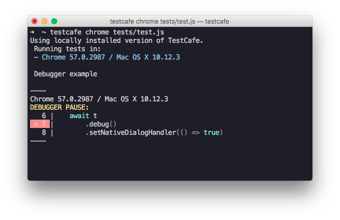

# Changelog

## v0.19.2 (2018-4-11)

### Enhancements

#### Added support for browser providers from private repositories ([#2221](https://github.com/DevExpress/testcafe/issues/2221))

### Bug Fixes

* Restored the screenshot functionality in legacy tests ([#2235](https://github.com/DevExpress/testcafe/issues/2235))
* Updated the list of devices available for emulation in Google Chrome ([#2257](https://github.com/DevExpress/testcafe/issues/2257))
* Fixed touch events emulation ([#2268](https://github.com/DevExpress/testcafe/issues/2268))
* Now the `event.relatedTarget` property is set correctly for the emulated focus and drag events ([#2197](https://github.com/DevExpress/testcafe/issues/2197))
* Now the `event.detail` property is set correctly for the emulated mouse events ([#2232](https://github.com/DevExpress/testcafe/issues/2232))
* The `Element.innerHTML` property is now processed correctly in certain special cases ([testcafe-hammerhead/#1538](https://github.com/DevExpress/testcafe-hammerhead/issues/1538))
* Now the iframe location has the correct value when it is not initialized([testcafe-hammerhead/#1531](https://github.com/devexpress/testcafe-hammerhead/issues/1531))
* A trailing slash is now added to test page URL if it is necessary ([#2005](https://github.com/DevExpress/testcafe/issues/2005))
* The `focus` event is not called for a disabled input now ([#2123](https://github.com/devexpress/testcafe/issues/2123))

## v0.19.1 (2018-3-13)

### Backward compatibility with the legacy test syntax has been restored ([#2210](https://github.com/DevExpress/testcafe/issues/2210))

### Bug Fixes

* The `document.all` property is now overridden ([testcafe-hammerhead/#1046](https://github.com/DevExpress/testcafe-hammerhead/issues/1046))
* Proxying properties in `async` class methods is now supported ([testcafe-hammerhead/#1510](https://github.com/DevExpress/testcafe-hammerhead/issues/1510))
* Fixed wrong proxying of a `localStorage` check in WebWorkers ([testcafe-hammerhead/#1496](https://github.com/DevExpress/testcafe-hammerhead/issues/1496))

## v0.19.0 (2018-3-1)

### TestCafe Live: See instant feedback when working on tests ([#1624](https://github.com/DevExpress/testcafe/issues/1624))

We have prepared a new tool for rapid test development.

TestCafe Live provides a service that keeps the TestCafe process and browsers opened the whole time you are working on tests. Changes you make in code immediately restart the tests. That is, TestCafe Live allows you to see test results instantly.

[](https://www.youtube.com/watch?v=RWQtB6Xv01Q)

For more information, see [TestCafe Live](https://github.com/DevExpress/testcafe-live).

### Enhancements

#### :gear: Taking Screenshots of Individual Page Elements ([#1496](https://github.com/DevExpress/testcafe/issues/1496))

We have added the [t.takeElementScreenshot](https://devexpress.github.io/testcafe/documentation/test-api/actions/take-screenshot.html#take-a-screenshot-of-a-page-element) action that allows you to take a screenshot of an individual page element.

```js
import { Selector } from 'testcafe';

fixture `My fixture`
    .page `http://devexpress.github.io/testcafe/example/`;

test('Take a screenshot of a fieldset', async t => {
    await t
        .click('#reusing-js-code')
        .click('#continuous-integration-embedding')
        .takeElementScreenshot(Selector('fieldset').nth(1), 'my-fixture/important-features.png');
});
```

This action provides additional customization that allows you to position the center of the screenshot or crop it. For more information, see the [documentation](https://devexpress.github.io/testcafe/documentation/test-api/actions/take-screenshot.html#take-a-screenshot-of-a-page-element).

Note that if the screenshot directory is not specified with the [runner.screenshots](https://devexpress.github.io/testcafe/documentation/using-testcafe/programming-interface/runner.html#screenshots) API method or the [screenshots](https://devexpress.github.io/testcafe/documentation/using-testcafe/command-line-interface.html#-s-path---screenshots-path) command line option, the `t.takeElementScreenshot` action will be ignored.

#### :gear: Filtering Elements by Their Visibility ([#1018](https://github.com/DevExpress/testcafe/issues/1018))

You can now filter the selector's matching set to leave only visible or hidden elements. To do this, use the [filterVisible](https://devexpress.github.io/testcafe/documentation/test-api/selecting-page-elements/selectors/functional-style-selectors.html#filtervisible) and [filterHidden](https://devexpress.github.io/testcafe/documentation/test-api/selecting-page-elements/selectors/functional-style-selectors.html#filterhidden) methods.

```js
import { Selector } from 'testcafe';

fixture `My fixture`
    .page `http://devexpress.github.io/testcafe/example/`;

test('Filter visible and hidden elements', async t => {
    const inputs        = Selector('input');
    const hiddenInput   = inputs.filterHidden();
    const visibleInputs = inputs.filterVisible();

    await t
        .expect(hiddenInput.count).eql(1)
        .expect(visibleInputs.count).eql(11);
});
```

#### :gear: Finding Elements by the Exact Matching Text ([#1292](https://github.com/DevExpress/testcafe/issues/1292))

The current selector's [withText](https://devexpress.github.io/testcafe/documentation/test-api/selecting-page-elements/selectors/functional-style-selectors.html#withtext) method looks for elements whose text content *contains* the specified string. With this release, we have added the [withExactText](https://devexpress.github.io/testcafe/documentation/test-api/selecting-page-elements/selectors/functional-style-selectors.html#withexacttext) method that performs search by *strict match*.

```js
import { Selector } from 'testcafe';

fixture `My fixture`
    .page `http://devexpress.github.io/testcafe/example/`;

test('Search by exact text', async t => {
    const labels       = Selector('label');
    const winLabel     = labels.withExactText('Windows');
    const reusingLabel = labels.withText('JavaScript');

    await t
        .expect(winLabel.exists).ok()
        .expect(reusingLabel.exists).ok();
});
```

#### :gear: Using Decorators in TypeScript Code ([#2117](https://github.com/DevExpress/testcafe/issues/2117)) by [@pietrovich](https://github.com/pietrovich)

TestCafe now allows you to use [decorators](https://www.typescriptlang.org/docs/handbook/decorators.html) when [writing tests in TypeScript](https://devexpress.github.io/testcafe/documentation/test-api/typescript-support.html).

Note that decorators are still an experimental feature in TypeScript.

### Bug Fixes

* TestCafe can now scroll a webpage when `body` has a scroll bar ([#1940](https://github.com/DevExpress/testcafe/issues/1940))
* Firefox no longer hangs with a dialog asking to set it as the default browser ([#1926](https://github.com/DevExpress/testcafe/issues/1926))
* Legacy API no longer freezes because of an unexpected error ([#1790](https://github.com/DevExpress/testcafe/issues/1790))
* Click on an element that was hidden and then recreated on timeout now works correctly ([#1994](https://github.com/DevExpress/testcafe/issues/1994))
* TestCafe now correctly finds browsers in headless mode on macOS when tests are executing concurrently ([#2035](https://github.com/DevExpress/testcafe/issues/2035))
* When roles are switched using the `preserverUrl` flag, the local storage now restores correctly ([#2015](https://github.com/DevExpress/testcafe/issues/2015))
* TestCafe progress bar is no longer visible on screenshots ([#2076](https://github.com/DevExpress/testcafe/issues/2076))
* Window manipulations now wait for page loading ([#2000](https://github.com/DevExpress/testcafe/issues/2000))
* All toolbars are now hidden when taking screenshots ([#1445](https://github.com/DevExpress/testcafe/issues/1445))
* TestCafe now works normally with the latest version of CucumberJS ([#2107](https://github.com/DevExpress/testcafe/issues/2107))
* Fixed an error connected to file permissions on Ubuntu ([#2144](https://github.com/DevExpress/testcafe/issues/2144))
* Browser manipulations can now be executed step-by-step ([#2150](https://github.com/DevExpress/testcafe/issues/2150))
* Fixed a bug where a page wouldn't load because of an error in `generateCallExpression` ([testcafe-hammerhead/#1389](https://github.com/DevExpress/testcafe-hammerhead/issues/1389))
* Now the overridden Blob constructor doesn't process data unnecessarily ([testcafe-hammerhead/#1359](https://github.com/DevExpress/testcafe-hammerhead/issues/1359))
* Now the `target` attribute is not set for a button after a click on it ([testcafe-hammerhead/#1437](https://github.com/DevExpress/testcafe-hammerhead/issues/1437))
* The `sandbox`, `target` and `style` attributes are now cleaned up ([testcafe-hammerhead/#1448](https://github.com/DevExpress/testcafe-hammerhead/issues/1448))
* A `RangeError` with the message `Maximum call stack size exceeded` is no longer raised ([testcafe-hammerhead/#1452](https://github.com/DevExpress/testcafe-hammerhead/issues/1452))
* A script error is no longer raised on pages that contain a `beforeunload` handler ([testcafe-hammerhead/#1419](https://github.com/DevExpress/testcafe-hammerhead/issues/1419))
* Fixed wrong overridding of an event object ([testcafe-hammerhead/#1445](https://github.com/DevExpress/testcafe-hammerhead/issues/1445))
* Illegal invocation error is no longer raised when calling the `FileListWrapper.item` method ([testcafe-hammerhead/#1446](https://github.com/DevExpress/testcafe-hammerhead/issues/1446)) by [@javiercbk](https://github.com/javiercbk)
* A script error is no longer raised when `Node.nextSibling` is `null` ([testcafe-hammerhead/#1469](https://github.com/DevExpress/testcafe-hammerhead/issues/1469))
* The `isShadowUIElement` check is now performed for `Node.nextSibling` when a node is not an element ([testcafe-hammerhead/#1465](https://github.com/DevExpress/testcafe-hammerhead/issues/1465))
* The `toString` function is now overridden for anchor elements ([testcafe-hammerhead/#1483](https://github.com/DevExpress/testcafe-hammerhead/issues/1483))

## v0.18.6 (2017-12-28)

### Enhancements

#### Chrome DevTools are opened in a separate window during test execution ([#1964](https://github.com/DevExpress/testcafe/issues/1964))

### Bug Fixes

* In Chrome, disabled showing the 'Save password' prompt after typing text in the input of the `password` type ([#1913](https://github.com/DevExpress/testcafe/issues/1913))
* Now TestCafe correctly scrolls a page to an element when this page has scrollbars ([#1955](https://github.com/DevExpress/testcafe/pull/1955))
* Fixed the 'Cannot redefine property %testCafeCore%' script error ([#1996](https://github.com/DevExpress/testcafe/issues/1996))
* TestCafe now rounds off dimension values when it calculates scrolling ([#2004](https://github.com/DevExpress/testcafe/pull/2004))
* In Chrome, the 'Download multiple files' dialog no longer prevents test execution process ([#2017](https://github.com/DevExpress/testcafe/issues/2017))
* TestCafe now closes a connection to the specified resource if the destination server hangs up ([testcafe-hammerhead/#1384](https://github.com/DevExpress/testcafe-hammerhead/issues/1384))
* Proxying the `location's` `href` property now works correctly ([testcafe-hammerhead/#1362](https://github.com/DevExpress/testcafe-hammerhead/issues/1362))
* The proxy now supports `https` requests for node 8.6 and higher ([testcafe-hammerhead/#1401](https://github.com/DevExpress/testcafe-hammerhead/issues/1401))
* Added support for pages with the `super` keyword ([testcafe-hammerhead/#1390](https://github.com/DevExpress/testcafe-hammerhead/issues/1390))
* The proxy now properly emulates native browser behavior for non-success status codes ([testcafe-hammerhead/#1397](https://github.com/DevExpress/testcafe-hammerhead/issues/1397))
* The proxied `ServiceWorker.register` method now returns a rejected Promise for unsecure urls ([testcafe-hammerhead/#1411](https://github.com/DevExpress/testcafe-hammerhead/issues/1411))
* Added support for `javascript` protocol expressions applied to the location's properties ([testcafe-hammerhead/#1274](https://github.com/DevExpress/testcafe-hammerhead/issues/1274))

## v0.18.5 (2017-11-23): Security Update

### Vulnerability Fix ([testcafe-legacy-api/#26](https://github.com/DevExpress/testcafe-legacy-api/issues/26))

We have fixed a vulnerability related to the dependency on [uglify-js v1.x](https://github.com/mishoo/UglifyJS). We used it in our [testcafe-legacy-api](https://github.com/DevExpress/testcafe-legacy-api/) module that provides backward compatibility with old API from the paid TestCafe version.

Thus, this vulnerability affected only those who run old tests created with the commercial version of TestCafe in the new open-source TestCafe.

## v0.18.4 (2017-11-17)

### Enhancements

#### :gear: WebSockets support ([testcafe-hammerhead/#911](https://github.com/DevExpress/testcafe-hammerhead/issues/911))

TestCafe now provides full-featured WebSockets support (`wss` and `ws` protocols, request authentication, etc.).

### Bug Fixes

* TestCafe can now click on elements that are located under the Status bar and have the `transition` css property specified ([#1934](https://github.com/DevExpress/testcafe/issues/1934))
* Added support for pages with the `rest` and `default parameter` instructions ([testcafe-hammerhead/#1336](https://github.com/DevExpress/testcafe-hammerhead/issues/1336))
* Pages with several `base` tags are supported now ([testcafe-hammerhead/#1349](https://github.com/DevExpress/testcafe-hammerhead/issues/1349))
* Redirects from cross-domain to same-domain pages are processed now ([#1922](https://github.com/DevExpress/testcafe/issues/1922))
* Contenteditable custom elements are correctly recognized now ([testcafe-hammerhead/#1366](https://github.com/DevExpress/testcafe-hammerhead/issues/1366))
* Internal headers for `fetch` requests are set correctly now ([testcafe-hammerhead/#1360](https://github.com/DevExpress/testcafe-hammerhead/issues/1360))

## v0.18.3 (2017-11-08)

### Bug Fixes

* Readonly instrumented DOM properties are now set correctly for plain objects ([testcafe-hammerhead/#1351](https://github.com/DevExpress/testcafe-hammerhead/issues/1351)).
* The `HTMLElement.style` property is proxied on the client side now ([testcafe-hammerhead/#1348](https://github.com/DevExpress/testcafe-hammerhead/issues/1348)).
* The `Refresh` response header is proxied now ([testcafe-hammerhead/#1354](https://github.com/DevExpress/testcafe-hammerhead/issues/1354])).

## v0.18.2 (2017-10-26)

### Bug Fixes

* Screenshots are now captured correctly when using High DPI monitor configurations on Windows ([#1896](https://github.com/DevExpress/testcafe/issues/1896))
* Fixed the `Cannot read property 'getItem' of null` error which is raised when a console message was printed in an iframe before it's loaded completely ([#1875](https://github.com/DevExpress/testcafe/issues/1875))
* Fixed the `Content iframe did not load` error which is raised if an iframe reloaded during the `switchToIframe` command execution ([#1842](https://github.com/DevExpress/testcafe/issues/1842))
* Selector options are now passed to all derivative selectors ([#1907](https://github.com/DevExpress/testcafe/issues/1907))
* Fixed a memory leak in IE related to live node collections proxying ([testcafe-hammerhead/#1262](https://github.com/DevExpress/testcafe-hammerhead/issues/1262))
* `DocumentFragment` nodes now are correctly processed ([testcafe-hammerhead/#1334](https://github.com/DevExpress/testcafe-hammerhead/issues/1334))

## v0.18.1 (2017-10-17): a recovery release following v0.18.0

### --reporter flag name fixed ([#1881](https://github.com/DevExpress/testcafe/issues/1881))

In v0.18.0, we have accidentally changed the [--reporter](https://devexpress.github.io/testcafe/documentation/using-testcafe/command-line-interface.html#-r-namefile---reporter-namefile) CLI flag to `--reporters`. In this recovery release, we roll back to the previous flag name.

### Compatibility with RequireJS restored ([#1874](https://github.com/DevExpress/testcafe/issues/1874))

Changes in v0.18.0 made TestCafe incompatible with [RequireJS](http://requirejs.org). It is fixed in this recovery release.

We apologize for any inconvenience.

## v0.18.0 (2017-10-10)

### Enhancements

#### :gear: Testing in headless Firefox

In addition to Chrome headless, we have added support for testing in [headless](https://developer.mozilla.org/en-US/Firefox/Headless_mode) Firefox (version 56+).

```sh
testcafe firefox:headless tests/sample-fixture.js
```

```js
runner
    .src('tests/sample-fixture.js')
    .browsers('firefox:headless')
    .run()
    .then(failedCount => {
        // ...
    });
```

#### :gear: Outputting test results to multiple channels ([#1412](https://github.com/DevExpress/testcafe/issues/1412))

If you need a report to be printed in the console and saved to a `.json` file,
you can now do this by specifying multiple reporters when running tests.

```sh
testcafe all tests/sample-fixture.js -r spec,json:report.json
```

```js
const stream = fs.createWriteStream('report.json');

runner
    .src('tests/sample-fixture.js')
    .browsers('chrome')
    .reporter('spec')
    .reporter('json', stream)
    .run()
    .then(failedCount => {
        stream.end();
    });
```

#### :gear: Entering the debug mode when a test fails ([#1608](https://github.com/DevExpress/testcafe/issues/1608))

TestCafe can now automatically switch to the debug mode whenever a test fails. Test execution will be paused, so that you can explore the tested page to determine the cause of the fail.

To enable this behavior, use the `--debug-on-fail` flag in the command line or the `debugOnFail` option in the API.

```sh
testcafe chrome tests/fixture.js --debug-on-fail
```

```js
runner.run({ debugOnFail: true });
```

#### :gear: Interacting with the tested page in debug mode ([#1848](https://github.com/DevExpress/testcafe/issues/1848))

When debugging your tests, you can now interact with the tested page. Click the **Unlock page** button in the page footer to enable interaction.


After that, you can do anything with the webpage. This gives you additional powers to detect problems in your tests.

Click **Resume** to continue running the test or click **Next Step** to step over.

#### :gear: Chrome and Firefox are opened with clean profiles by default ([#1623](https://github.com/DevExpress/testcafe/issues/1623))

TestCafe now opens Chrome and Firefox with empty profiles to eliminate the influence of profile settings and extensions on test running.

However, you can **return to the previous behavior** by using the `:userProfile` browser option.

```sh
testcafe firefox:userProfile tests/test.js
```

```js
runner
    .src('tests/fixture1.js')
    .browsers('firefox:userProfile')
    .run();
```

#### :gear: Customizable timeout to wait for the `window.load` event ([#1645](https://github.com/DevExpress/testcafe/issues/1645))

Previously, TestCafe started a test when the `DOMContentLoaded` event was raised. However, there are many pages that execute some kind of initialization code on the `window.load` event (which is raised after `DOMContentLoaded` because it waits for all stylesheets, images and subframes to load). In this instance, you need to wait for the `window.load` event to fire before running tests.

With this release, TestCafe waits for the `window.load` event for `3` seconds.
We have also added a `pageLoadTimeout` setting that allows you to customize this interval.
You can set it to `0` to skip waiting for `window.load`.

The following examples show how to use the `pageLoadTimeout` setting from the command line and API.

```sh
testcafe chrome test.js --page-load-timeout 0
```

```js
runner.run({
    pageLoadTimeout: 0
});
```

You can also use the `setPageLoadTimeout` method in test API to set the timeout for an individual test.

```js
fixture `Page load timeout`
    .page `http://devexpress.github.io/testcafe/example/`;

test(`Page load timeout`, async t => {
    await t
        .setPageLoadTimeout(0)
        .navigateTo('http://devexpress.github.io/testcafe/');
});
```

#### :gear: Access messages output by the tested app to the browser console ([#1738](https://github.com/DevExpress/testcafe/issues/1738))

You can now obtain messages that the tested app outputs to the browser console. This is useful if your application or the framework it uses posts errors, warnings or other informative messages into the console.

Use the `t.getBrowserConsoleMessages` method that returns the following object.

```js
{
    error: ["Cannot access the 'db' database. Wrong credentials.", '...'], // error messages
    warn: ['The setTimeout property is deprecated', '...'],                // warning messages
    log: ['[09:12:08] Logged in', '[09:25:43] Changes saved', '...'],      // log messages
    info: ['The application was updated since your last visit.', '...']    // info messages
}
```

Note that this method returns only messages posted via the `console.error`, `console.warn`, `console.log` and `console.info` methods. Messages output by the browser (like when an unhandled exception occurs on the page) will not be returned.

For instance, consider the React's typechecking feature, [PropTypes](https://reactjs.org/docs/typechecking-with-proptypes.html). You can use it to check that you assign valid values to the component's props. If a `PropTypes` rule is violated, React posts an error into the JavaScript console.

The following example shows how to check the React prop types for errors using the `t.getBrowserConsoleMessages` method.

```js
// check-prop-types.js
import { t } from 'testcafe';

export default async function () {
    const { error } = await t.getBrowserConsoleMessages();

    await t.expect(error[0]).notOk();
}

// test.js
import { Selector } from 'testcafe';
import checkPropTypes from './check-prop-types';

fixture `react example`
    .page `http://localhost:8080/`  // https://github.com/mzabriskie/react-example
    .afterEach(() => checkPropTypes());

test('test', async t => {
    await t
        .typeText(Selector('.form-control'), 'devexpress')
        .click(Selector('button').withText('Go'))
        .click(Selector('h4').withText('Organizations'));
});
```

#### :gear: Defining drag end point on the destination element ([#982](https://github.com/DevExpress/testcafe/issues/982))

The `t.dragToElement` action can now drop a dragged element at any point inside the destination element.
You can specify the target point using the `destinationOffsetX` and `destinationOffsetY` options.

```js
import { Selector } from 'testcafe';

const fileIcon      = Selector('.file-icon');
const directoryPane = Selector('.directory');

fixture `My Fixture`
    .page `https://example.com/`;

test('My Test', async t => {
    await t
        .dragToElement(fileIcon, directoryPane, {
            offsetX: 10,
            offsetY: 10,
            destinationOffsetX: 100,
            destinationOffsetY: 50,
            modifiers: {
                shift: true
            }
        });
});
```

#### :gear: TestCafe exits gracefully when the process is interrupted ([#1378](https://github.com/DevExpress/testcafe/issues/1378))

Previously, TestCafe left browsers open when you exited the process by pressing `Ctrl+C` in the terminal.
Now TestCafe exits gracefully closing all browsers opened for testing.

### Bug Fixes

* Tests no longer hang in Nightmare ([#1493](https://github.com/DevExpress/testcafe/issues/1493))
* The `focus` event is now raised when clicking links with `tabIndex="0"` ([#1803](https://github.com/DevExpress/testcafe/issues/1803))
* Headless Chrome processes no longer hang after test runs ([#1826](https://github.com/DevExpress/testcafe/issues/1826))
* `setFilesToUpload` no longer throws a `RangeError` on websites that use Angular ([#1731](https://github.com/DevExpress/testcafe/issues/1731))
* Fixed a bug where an `iframe` got wrong origin ([#1753](https://github.com/DevExpress/testcafe/issues/1753))
* `document.open` now doesn't throw an error if `document.defaultView` is `null` ([testcafe-hammerhead/#1272](https://github.com/DevExpress/testcafe-hammerhead/issues/1272))
* No error is thrown when the handler passed to `addEventListener` is `undefined` ([testcafe-hammerhead/#1251](https://github.com/DevExpress/testcafe-hammerhead/issues/1251))
* An error is no longer raised if the processed element is not extendible ([testcafe-hammerhead/#1300](https://github.com/DevExpress/testcafe-hammerhead/issues/1300))
* Fixed a bug where an `onclick` handler did not work after click on a `Submit` button ([testcafe-hammerhead/#1291](https://github.com/DevExpress/testcafe-hammerhead/issues/1291))
* Images with `style = background-image: url("img.png");` are now loaded correctly ([testcafe-hammerhead/#1212](https://github.com/DevExpress/testcafe-hammerhead/issues/1212))
* Documents can now contain two `ShadowUI` roots ([testcafe-hammerhead/#1246](https://github.com/DevExpress/testcafe-hammerhead/issues/1246))
* HTML in an overridden `document.write` function is now processed correctly ([testcafe-hammerhead/#1311](https://github.com/DevExpress/testcafe-hammerhead/issues/1311))
* Elements processing now works for a `documentFragment` as it is added to the DOM ([testcafe-hammerhead/#1334](https://github.com/DevExpress/testcafe-hammerhead/issues/1334))

## v0.17.2 (2017-9-6)

### Bug Fixes

* Taking a screenshot on teamcity agent works correctly now ([#1625](https://github.com/DevExpress/testcafe/issues/1625))
* It is possible to run tests on remote devices from a docker container ([#1728](https://github.com/DevExpress/testcafe/issues/1728))
* TestCafe compiles TypeScript tests correctly now if Mocha or Jest typedefs are included in the project ([#1537](https://github.com/DevExpress/testcafe/issues/1537))
* Running on remote devices works correctly on MacOS now ([#1732](https://github.com/DevExpress/testcafe/issues/1732))
* A target directory is checked before creating a screenshot ([#1551](https://github.com/DevExpress/testcafe/issues/1551))
* TypeScript definitions allow you to send any objects as `dependencies` for `ClientFunctions` now. ([#1713](https://github.com/DevExpress/testcafe/issues/1713))
* The second `MutationObserver` callback argument is not missed now ([testcafe-hammerhead/#1268](https://github.com/DevExpress/testcafe-hammerhead/issues/1268))
* Link's `href` property with an unsupported protocol is set correctly now ([testcafe-hammerhead/#1276](https://github.com/DevExpress/testcafe-hammerhead/issues/1276))
* The `document.documentURI` property is now processed correctly in IE ([testcafe-hammerhead/#1270](https://github.com/DevExpress/testcafe-hammerhead/issues/1270))
* `JSON.stringify` and `Object.keys` functions now work properly for a `MessageEvent` instance ([testcafe-hammerhead/#1277](https://github.com/DevExpress/testcafe-hammerhead/issues/1277))

## v0.17.1 (2017-8-17)

### Bug Fixes

* The `hover` action no longer fails for elements that hide on mouseover ([#1679](https://github.com/DevExpress/testcafe/issues/1679))
* SelectText and SelectTextAreaContent TypeScript definitions now match the documentation ([#1697](https://github.com/DevExpress/testcafe/issues/1697))
* TestCafe now finds browsers installed for the current user on Windows ([#1688](https://github.com/DevExpress/testcafe/issues/1688))
* TestCafe can now resize MS Edge 15 window ([#1517](https://github.com/DevExpress/testcafe/issues/1517))
* Google Chrome Canary has a dedicated `chrome-canary` alias now ([#1711](https://github.com/DevExpress/testcafe/issues/1711))
* Test no longer hangs when `takeScreenshot` is called in headless Chrome Canary on Windows ([#1685](https://github.com/DevExpress/testcafe/issues/1685))
* Tests now fail if the `uncaughtRejection` exception is raised ([#1473](https://github.com/DevExpress/testcafe/issues/1473))
* TypeScript tests now run on macOS with no errors ([#1696](https://github.com/DevExpress/testcafe/issues/1696))
* Test duration is now reported accurately ([#1674](https://github.com/DevExpress/testcafe/issues/1674))
* XHR requests with an overridden `setRequestHeader` function returned by the `XhrSandbox.openNativeXhr` method are now handled properly ([testcafe-hammerhead/#1252](https://github.com/DevExpress/testcafe-hammerhead/issues/1252))
* HTML in an overridden `document.write` function is now processed correctly ([testcafe-hammerhead/#1218](https://github.com/DevExpress/testcafe-hammerhead/issues/1218))
* `Object.assign` is now overridden ([testcafe-hammerhead/#1208](https://github.com/DevExpress/testcafe-hammerhead/issues/1208))
* Scripts with `async` functions are processed correctly now ([testcafe-hammerhead/#1260](https://github.com/DevExpress/testcafe-hammerhead/issues/1260))

## v0.17.0 (2017-8-2)

### Enhancements

#### :gear: Testing Electron applications ([testcafe-browser-provider-electron](https://github.com/DevExpress/testcafe-browser-provider-electron))

We have created a browser provider that allows you to test Electron applications with TestCafe.

Getting it to work is simple. First, install the browser provider plugin from npm.

```sh
npm install testcafe-browser-provider-electron
```

We assume that you have a JavaScript application that you wish to run in Electron.

Create a `.testcafe-electron-rc` file that contains configurations for the Electron plugin.
The only required setting here is `mainWindowUrl`. It's a URL (or path) to the main window page relative to the application directory.

```json
{
    "mainWindowUrl": "./index.html"
}
```

Place this file into the application root directory.

At the next step, install the Electron module.

```sh
npm install electron@latest
```

Now you are ready to run tests. Specify the `electron` browser name and the application path
at the test launch.

```sh
testcafe "electron:/home/user/electron-app" "path/to/test/file.js"
```

```js
testCafe
    .createRunner()
    .src('path/to/test/file.js')
    .browsers('electron:/home/user/electron-app')
    .run();
```

Nota that you can also test Electron app's executable files. To learn more about the Electron browser provider, see the plugin [readme](https://github.com/DevExpress/testcafe-browser-provider-electron).

#### :gear: Concurrent test execution ([#1165](https://github.com/DevExpress/testcafe/issues/1165))

We've added concurrent test launch. This makes a test batch complete faster.

By default TestCafe launches one instance of each specified browser. Tests run one by one in each of them.

Enable *concurrency* and TestCafe will launch multiple instances of each browser. It will distribute the test batch among them. The tests will run in parallel.

To enable concurrency, add `-c`in the command line. Or use the `runner.concurrency()` API method.
Specify the number of instances to invoke for each browser.

```js
testcafe -c 3 chrome tests/test.js
```

```js
var testRunPromise = runner
    .src('tests/test.js')
    .browsers('chrome')
    .concurrency(3)
    .run();
```

For details, see [Concurrent Test Execution](https://devexpress.github.io/testcafe/documentation/using-testcafe/common-concepts/concurrent-test-execution.html).

#### :gear: Further improvements in automatic waiting mechanism ([#1521](https://github.com/DevExpress/testcafe/issues/1521))

We have enhanced the waiting mechanism behavior in certain scenarios where you still used to need `wait` actions.
Now automatic waiting is much smarter and chances that you need to wait manually are diminished.

#### :gear: User roles preserve the local storage ([#1454](https://github.com/DevExpress/testcafe/issues/1454))

TestCafe now saves the local storage state when switching between roles. You get the same local storage content you left when you switch back.

This is useful for testing websites that perform authentication via local storage instead of cookies.

### Bug Fixes

* Selector's `withAttribute` method supports search by strict match ([#1548](https://github.com/DevExpress/testcafe/issues/1548]))
* Description for the `path` parameter of the `t.takeScreenshot` action has been corrected ([#1515](https://github.com/DevExpress/testcafe/issues/1515))
* Local storage is now cleaned appropriately after the test run.([#1546](https://github.com/DevExpress/testcafe/issues/1546))
* TestCafe now checks element visibility with a timeout when the target element's `style.top` is negative ([#1185](https://github.com/DevExpress/testcafe/issues/1185))
* Fetching an absolute CORS URL now works correctly. ([#1629](https://github.com/DevExpress/testcafe/issues/1629))
* Add partial support for proxying live node collections (the `GetElementsByTagName` method) ([#1442](https://github.com/DevExpress/testcafe/issues/1442))
* TypeScript performance has been enhanced. ([#1591](https://github.com/DevExpress/testcafe/issues/1591))
* The right port is now applied to a cross-domain iframe location after redirect. ([testcafe-hammerhead/#1191](https://github.com/DevExpress/testcafe-hammerhead/issues/1191))
* All internal properties are marked as non-enumerable. ([testcafe-hammerhead/#1182](https://github.com/DevExpress/testcafe-hammerhead/issues/1182))
* Support proxying pages with defined referrer policy. ([testcafe-hammerhead/#1195](https://github.com/DevExpress/testcafe-hammerhead/issues/1195))
* WebWorker content is now correctly proxied in FireFox 54. ([testcafe-hammerhead/#1216](https://github.com/DevExpress/testcafe-hammerhead/issues/1216))
* Code instrumentation for the `document.activeElement` property works properly if it is `null`. ([testcafe-hammerhead/#1226](https://github.com/DevExpress/testcafe-hammerhead/issues/1226))
* `length`, `item` and `namedItem` are no longer own properties of `LiveNodeListWrapper`. ([testcafe-hammerhead/#1222](https://github.com/DevExpress/testcafe-hammerhead/issues/1222))
* The `scope` option in the `serviceWorker.register` function is now processed correctly. ([testcafe-hammerhead/#1233](https://github.com/DevExpress/testcafe-hammerhead/issues/1233))
* Promises from a fetch request are now processed correctly. ([testcafe-hammerhead/#1234](https://github.com/DevExpress/testcafe-hammerhead/issues/1234))
* Fix transpiling for the `for..of` loop to support browsers without `window.Iterator`. ([testcafe-hammerhead/#1231](https://github.com/DevExpress/testcafe-hammerhead/issues/1231))

## v0.16.2 (2017-6-27)

### Bug Fixes

* Typing text now raises the `onChange` event in latest React versions. ([#1558](https://github.com/DevExpress/testcafe/issues/1558))
* Screenshots can now be taken when TestCafe runs from the Docker image. ([#1540](https://github.com/DevExpress/testcafe/issues/1540))
* The native `value` property setters of `HTMLInputElement` and `HTMLTextAreaElement` prototypes are now saved. ([testcafe-hammerhead/#1185](https://github.com/DevExpress/testcafe-hammerhead/issues/1185))
* The `name` and `namedItem` methods of an `HTMLCollection` are now marked as non-enumerable. ([testcafe-hammerhead/#1172](https://github.com/DevExpress/testcafe-hammerhead/issues/1172))
* Code instrumentation of the `length` property runs faster. ([testcafe-hammerhead/#979](https://github.com/DevExpress/testcafe-hammerhead/issues/979))

## v0.16.1 (2017-6-21)

### Bug Fixes

* A typo in RoleOptions typedefs was fixed ([#1541](https://github.com/DevExpress/testcafe/issues/1541))
* TestCafe no longer crashes on node 4 with an unmet dependency ([#1547](https://github.com/DevExpress/testcafe/issues/1547))
* Markup imported via `meta[rel="import"]` is now processed. ([testcafe-hammerhead/#1161](https://github.com/DevExpress/testcafe-hammerhead/issues/1161))
* The correct context is passed to `MutationObserver`. ([testcafe-hammerhead/#1178](https://github.com/DevExpress/testcafe-hammerhead/issues/1178))
* The `innerHtml` property is no longer processed for elements that don't have this property. ([testcafe-hammerhead/#1164](https://github.com/DevExpress/testcafe-hammerhead/issues/1164))

## v0.16.0 (2017-6-13)

TypeScript support, seamless testing in headless Chrome and device emulator, and numerous bug fixes.

### Enhancements

#### :gear: TypeScript support ([#408](https://github.com/DevExpress/testcafe/issues/408))

In this release, we have added the capability to write tests in [TypeScript](https://www.typescriptlang.org/). By using TypeScript to write your TestCafe tests, you get the advantages of strongly-typed languages such as: rich coding assistance, painless scalability, check-as-you-type code verification, and much more.

TestCafe bundles TypeScript declaration file with the npm package, so you have no need to install any additional packages.

Just create a `.ts` file with the

<!-- Use `js` instead of `ts` for this code block for proper code highlighting -->

```js
import { Selector } from 'testcafe';
```

and write your test.

For details, see [TypeScript Support](https://devexpress.github.io/testcafe/documentation/test-api/typescript-support.html)

#### :gear: Support running in Chrome in headless mode and in device emulator ([#1417](https://github.com/DevExpress/testcafe/issues/1417))

Now TestCafe allows you to run your tests in Google Chrome in headless and device emulation modes.

[Headless mode](https://developers.google.com/web/updates/2017/04/headless-chrome) allows you to run tests in Chrome without any visible UI shell. To run tests in headless mode, use the `:headless` postfix:

```sh
testcafe "chrome:headless" tests/sample-fixture.js
```

Device emulation mode allows you to check how your tests works on mobile devices via Chrome's built-in [device emulator](https://developers.google.com/web/tools/chrome-devtools/device-mode/). To run tests in device emulation mode, specify `emulation:` and [device parameters](https://devexpress.github.io/testcafe/documentation/using-testcafe/common-concepts/browser-support.html#available-chrome-options):

```sh
testcafe "chrome:emulation:device=iphone 6" tests/sample-fixture.js
```

For details, see [Using Chrome-specific Features](https://devexpress.github.io/testcafe/documentation/using-testcafe/common-concepts/browser-support.html#using-chrome-specific-features).

#### :gear: Support HTML5 Drag and Drop ([#897](https://github.com/DevExpress/testcafe/issues/897))

Starting with this release, TestCafe supports HTML5 drag and drop, so you can test elements with the `draggable` [attribute](http://w3c.github.io/html/editing.html#the-draggable-attribute).

#### :gear: Fixed URL for opening remote browsers ([#1476](https://github.com/DevExpress/testcafe/issues/1476))

We have simplified the format of links that TestCafe generates when you [run tests on remote browsers](https://devexpress.github.io/testcafe/documentation/using-testcafe/common-concepts/browser-support.html#browsers-on-remote-devices).

Now, you have no need to type a unique link for each test run, all the links became constant. So, it is easier now to run tests on a remote device repeatedly: you can run them by navigating a link from your browser history.

### Bug Fixes

* No TestCafe UI on screenshots created during testing ([#1357](https://github.com/DevExpress/testcafe/issues/1357))
* `mouseenter` and `mouseleave` events are not triggered during cursor moving ([#1426](https://github.com/DevExpress/testcafe/issues/1426))
* The runner's speed option affects the speed of `doubleClick` action ([#1486](https://github.com/DevExpress/testcafe/issues/1486))
* Press action shortcuts work wrong if input's value ends with '.' or starts with '-.' ([#1499](https://github.com/DevExpress/testcafe/issues/1499))
* A test report has too small line length on Travis ([#1469](https://github.com/DevExpress/testcafe/issues/1469))
* Service messages with cookies do not have enough time to come to server before a new page is loaded ([testcafe-hammerhead/#1086](https://github.com/DevExpress/testcafe-hammerhead/issues/1086))
* The `window.history.replaceState` function is overridden incorrectly ([testcafe-hammerhead/#1146](https://github.com/DevExpress/testcafe-hammerhead/issues/1146))
* Hammerhead crashes if a script file contains a sourcemap comment ([testcafe-hammerhead/#1052](https://github.com/DevExpress/testcafe-hammerhead/issues/1052))
* The proxy should override the `DOMParser.parseFromString` method ([testcafe-hammerhead/#1133](https://github.com/DevExpress/testcafe-hammerhead/issues/1133))
* The `fetch` method should emulate the native behaviour on merging headers ([testcafe-hammerhead/#1116](https://github.com/DevExpress/testcafe-hammerhead/issues/1116))
* The `EventSource` requests are broken when used via proxy ([testcafe-hammerhead/#1106](https://github.com/DevExpress/testcafe-hammerhead/issues/1106))
* The code processing may cause syntax errors in some cases because of wrong `location` property wrapping ([testcafe-hammerhead/#1101](https://github.com/DevExpress/testcafe-hammerhead/issues/1101))
* When calling the `fetch` function without parameters, we should return its native result instead of `window.Promise.reject` ([testcafe-hammerhead/#1099](https://github.com/DevExpress/testcafe-hammerhead/issues/1099))
* The `querySelector` function is overridden incorrectly ([testcafe-hammerhead/#1131](https://github.com/DevExpress/testcafe-hammerhead/issues/1131))

## v0.15.0 (2017-4-26)

Plugins for React and Vue.js, TestCafe Docker image, support for Internet access proxies and lots of bug fixes.

### Breaking Changes

#### New calls to selector's withText method no longer override previous calls

We have changed the way the [withText](https://devexpress.github.io/testcafe/documentation/test-api/selecting-page-elements/selectors.html#withtext)
method behaves when it is called in a chain.

```js
const el = Selector('div').withText('This is').withText('my element');
```

In previous versions, this selector searched for a `div` with text `my element` because the second call to `withText` overrode the first one.

Now this code returns an element whose text contains both `This is` and `my element` as the second call compounds with the first one.

### Enhancements

#### :gear: Plugin for testing React apps

In this release cycle, we have created a plugin for testing React applications.
This plugin allows you to select React components by their names.

```js
import ReactSelector from 'testcafe-react-selector';

const TodoList         = ReactSelector('TodoApp TodoList');
const itemsCountStatus = ReactSelector('TodoApp div');
const itemsCount       = ReactSelector('TodoApp div span');
```

And it enables you to get React component's `state` and `props`.

```js
import ReactSelector from 'testcafe-react-selector';

fixture `TODO list test`
    .page('http://localhost:1337');

test('Check list item', async t => {
    const el = ReactSelector('TodoList');

    await t.expect(el.getReact().props.priority).eql('High');
    await t.expect(el.getReact().state.isActive).eql(false);
});
```

To learn more, see the [testcafe-react-selectors](https://github.com/DevExpress/testcafe-react-selectors/) repository.

#### :gear: Plugin for testing Vue.js apps

In addition to the React plugin, we have released a plugin that facilitates testing Vue.js applications.

In the same manner, it allows you to select Vue.js components with `VueSelector` selectors.

```js
import VueSelector from 'testcafe-vue-selectors';

const rootVue   = VueSelector();
const todoInput = VueSelector('todo-input');
const todoItem  = VueSelector('todo-list todo-item');
```

These selectors allow you to get Vue component's `props`, `state` and `computed` properties.

```js
import VueSelector from 'testcafe-vue-selector';

fixture `TODO list test`
    .page('http://localhost:1337');

test('Check list item', async t => {
    const todoItem = VueSelector('todo-item');

    await t
        .expect(todoItem.getVue().props.priority).eql('High')
        .expect(todoItem.getVue().state.isActive).eql(false)
        .expect(todoItem.getVue().computed.text).eql('Item 1');
});
```

To learn more, see the [testcafe-vue-selectors](https://github.com/DevExpress/testcafe-vue-selectors) repository.

#### :gear: TestCafe Docker image ([#1141](https://github.com/DevExpress/testcafe/issues/1141))

We have created a Docker image with TestCafe, Chromium and Firefox preinstalled.

You no longer need to manually install browsers or the testing framework on your server.
Pull the Docker image from the repository and run TestCafe immediately.

```sh
docker pull testcafe/testcafe
docker run -v //user/tests:/tests -it testcafe/testcafe firefox tests/**/*.js
```

To learn more, see [Using TestCafe Docker Image](https://devexpress.github.io/testcafe/documentation/using-testcafe/installing-testcafe.html#using-testcafe-docker-image)

#### :gear: Support for Internet access proxies ([#1206](https://github.com/DevExpress/testcafe/issues/1206))

If your local network uses a proxy server to access the Internet, TestCafe can use it reach the external webpages.

To specify the proxy server, use a command line option

```sh
testcafe chrome my-tests/**/*.js --proxy 172.0.10.10:8080
```

or a method in the API.

```js
runner.useProxy('username:password@proxy.mycorp.com');
```

Note that you can pass the credentials with the proxy server host.

#### :gear: Debugging mode option ([#1347](https://github.com/DevExpress/testcafe/issues/1347))

As an alternative to calling the [t.debug](https://devexpress.github.io/testcafe/documentation/test-api/debugging.html#client-side-debugging) method
in test code, you can now specify the `--debug-mode` command line option to pause the test before the first action or assertion.
When the test is paused, you can debug in the browser developer tools as well as continue test execution step by step.

```sh
testcafe chrome my-tests/**/*.js --debug-mode
```

If you use TestCafe API, provide the `debugMode` option to the `runner.run` method.

```js
runner.run({ debugMode: true });
```

#### :gear: Filtering selector's matching set by attribute ([#1346](https://github.com/DevExpress/testcafe/issues/1346))

You can now use the `withAttribute` method to select elements that have a particular attribute set to a specific value.
You can omit the attribute value to select elements that simply have the specified attribute.

```js
const el = Selector('div').withAttribute('attributeName', 'value').nth(2);
```

#### :gear: hasAttribute method added to DOM node state ([#1045](https://github.com/DevExpress/testcafe/issues/1045))

For you convenience, the DOM node state object now provides the `hasAttribute` method that allows you to determine if an element has a particular attribute.

```js
const el = Selector('div.button');

t.expect(el.hasAttribute('disabled')).ok();
```

#### :gear: Redirection when switching between roles ([#1339](https://github.com/DevExpress/testcafe/issues/1339))

[User roles](https://devexpress.github.io/testcafe/documentation/test-api/authentication/user-roles.html) now provide a `preserveUrl` option
that allows you to save the webpage URL to which the browser was redirected after logging in. If you enable this option when creating a role,
the browser will be redirected to the saved URL every time you switch to this role.

```js
const regularUser = Role(url, async t => {
    /* authentication code */
}, { preserveUrl: true })
```

### Bug Fixes

* Fixed a bug where incorrect call site and callstack were generated for an assertion that failed in a class method ([#1267](https://github.com/DevExpress/testcafe/issues/1267))
* Incorrect validation result no longer appears when a test controller is used inside an async function ([#1285](https://github.com/DevExpress/testcafe/issues/1285))
* Click on the status panel no longer affects the page state ([#1389](https://github.com/DevExpress/testcafe/issues/1389))
* The `input` event is now raised with a correct selection value when input value was changed ([#1388](https://github.com/DevExpress/testcafe/issues/1388))
* Inline source maps are now placed in transpiled files so that breakpoints work correctly ([#1375](https://github.com/DevExpress/testcafe/issues/1375))
* `value` and `selectedIndex` in the `input` event handler for the dropdown element are now valid ([#1366](https://github.com/DevExpress/testcafe/issues/1366))
* A `presskey('enter')` call now raises the `click` event on a button element ([#1424](https://github.com/DevExpress/testcafe/issues/1424))
* The cursor position in Monaco editor is now set correctly on the click action ([#1385](https://github.com/DevExpress/testcafe/issues/1385))
* `hasScroll` now works correctly if the `body` has absolute positioning ([#1353](https://github.com/DevExpress/testcafe/issues/1353))
* Text can now be typed into HTML5 input elements ([#1327](https://github.com/DevExpress/testcafe/issues/1327))
* `focusin` and `focusout` events are now raised when the browser window is in the background ([testcafe-hammerhead/#1044](https://github.com/DevExpress/testcafe-hammerhead/issues/1044))
* `caretPositionFromPoint` and `caretRangeFromPoint` now ignore TestCafe UI elements on the page ([testcafe-hammerhead/#1084](https://github.com/DevExpress/testcafe-hammerhead/issues/1084))
* Images created with the `Image` constructor are now loaded through the proxy ([testcafe-hammerhead/#1087](https://github.com/DevExpress/testcafe-hammerhead/issues/1087))
* The `innerText` return value is now clear of script and style code ([testcafe-hammerhead/#1079](https://github.com/DevExpress/testcafe-hammerhead/issues/1079))
* Non-string values for element's text properties are now converted to `String` ([testcafe-hammerhead/#1091](https://github.com/DevExpress/testcafe-hammerhead/issues/1091))
* SVG elements are now processed correctly in IE ([testcafe-hammerhead/#1083](https://github.com/DevExpress/testcafe-hammerhead/issues/1083))

## v0.14.0 (2017-3-28)

Authentication via user roles, client-side debugging and numerous bug fixes.

### Enhancements

#### :gear: Authentication via user roles ([#243](https://github.com/DevExpress/testcafe/issues/243))

Many test scenarios involve the activity of more than one user. TestCafe addresses these scenarios by providing a convenient way
to isolate authentication test actions and apply them easily whenever you need to switch the user account.

A piece of logic that logs in a particular user is called a *role*. It is a good practice to create a role for each user account participating in your test.

Create roles via the `Role` constructor. You can keep them in a separate helper file.

*helper.js*

```js
import { Role } from 'testcafe';

export var regularAccUser = Role('http://example.com/login', async t => {
    await t
        .typeText('#login', 'TestUser')
        .typeText('#password', 'testpass')
        .click('#sign-in');
});

export var facebookAccUser = Role('http://example.com/login', async t => {
    await t
        .click('#sign-in-with-facebook')
        .typeText('#email', 'testuser@mycompany.com')
        .typeText('#pass', 'testpass')
        .click('#submit');
});

export var admin = Role('http://example.com/login', async t => {
    await t
        .typeText('#login', 'Admin')
        .typeText('#password', 'adminpass')
        .click('#sign-in');
});
```

In test code, use the `t.useRole` method to switch between roles.

*test.js*

```js
import { regularAccUser, admin } from './helper';
import { Selector } from 'testcafe';

const entry        = Selector('#entry');
const removeButton = Selector('#remove-entry');

fixture `My Fixture`
    .page `http://example.com`;

test('test that involves two users', async t => {
    await t
        .useRole(regularAccUser)
        .expect(entry.exists).ok()
        .expect(removeButton.visible).notOk()
        .useRole(admin)
        .expect(removeButton.visible).ok()
        .click(removeButton)
        .expect(entry.exists).notOk()
});
```

To learn more, see [User Roles](https://devexpress.github.io/testcafe/documentation/test-api/authentication/user-roles.html).

#### :gear: BrowserStack support

We have released the [BrowserStack](https://www.browserstack.com/) browser provider [plugin](https://github.com/DevExpress/testcafe-browser-provider-browserstack).

Install this plugin from `npm`.

```sh
npm install testcafe-browser-provider-browserstack
```

And save the BrowserStack username and access key to environment variables `BROWSERSTACK_USERNAME` and `BROWSERSTACK_ACCESS_KEY`.

Now you can run tests on any virtual machine available on BrowserStack.

```sh
testcafe "browserstack:Chrome@53.0:Windows 10" "path/to/test/file.js"
```

#### :gear: Client-side debugging ([#918](https://github.com/DevExpress/testcafe/issues/918))

We have added a new `t.debug` method to debug test behavior on the client.

When test execution reaches `t.debug`, it pauses so that you can open browser's developer tools
and check the web page state, DOM elements location, their CSS styles.

```js
fixture `My fixture`
    .page `https://devexpress.github.io/testcafe/example`;

test('My test', async t => {
    await t
        .debug()
        .setNativeDialogHandler(() => true)
        .click('#populate')
        .click('#submit-button');
});
```

In the footer, you'll find buttons that allow you to continue test execution or step to the next test action.


TestCafe logs points in code where the debugger stopped.



#### :gear: Testing local webpages ([#1286](https://github.com/DevExpress/testcafe/issues/1286))

You can now run tests against local webpages. To do this, specify a URL with the `file://` scheme or a relative path when calling the [page](https://devexpress.github.io/testcafe/documentation/test-api/test-code-structure.html#specifying-the-start-webpage) function.

```js
fixture `MyFixture`
    .page `file:///user/my-website/index.html`;
```

```js
fixture `MyFixture`
    .page `../my-project/index.html`;
```

You can also navigate to local pages with the [t.navigateTo](https://devexpress.github.io/testcafe/documentation/test-api/actions/navigate.html) action.

```js
fixture `My fixture`
    .page `http://www.example.com/`;

test('Navigate to local pages', async t => {
    await t
        .navigateTo('file:///user/my-website/index.html')
        .navigateTo('../my-project/index.html');
});
```

#### :gear: Adding custom methods to the selector ([#1212](https://github.com/DevExpress/testcafe/issues/1212))

You can now extend selectors with custom methods executed on the client. Use the [addCustomMethods](https://devexpress.github.io/testcafe/documentation/test-api/selecting-page-elements/selectors.html#custom-methods) method to provide custom methods.

```js
const myTable = Selector('.my-table').addCustomMethods({
    getCellText: (table, rowIndex, columnIndex) =>
        table.rows[rowIndex].cells[columnIndex].innerText
});

await t.expect(myTable.getCellText(1, 1)).contains('hey!');
```

Use this feature to build selectors that reflect the specifics of your web app.

#### :gear: Removing the native dialog handler ([#243](https://github.com/DevExpress/testcafe/issues/243))

We have added the capability to remove a [native dialog handler](https://devexpress.github.io/testcafe/documentation/test-api/handling-native-dialogs.html) by passing `null` to the `t.setNativeDialogHandler` method.

```js
fixture `My fixture`
    .page `https://devexpress.github.io/testcafe/example`;

test('My test', async t => {
    await t
        .setNativeDialogHandler(() => true)
        .click('#populate')
        .setNativeDialogHandler(null)
        .click('#submit-button');
});
```

### Bug Fixes

* Fixed a bug that led to an incorrect callstack in test run report ([#1226](https://github.com/DevExpress/testcafe/issues/1226))
* Cursor is now hidden on screenshots created using the `t.takeScreenshot` action ([#1245](https://github.com/DevExpress/testcafe/issues/1245))
* Error no longer appears when selecting a non-existent child by index ([#1240](https://github.com/DevExpress/testcafe/issues/1240))
* The blur event is now raised on time when an input is hidden in IE ([#1275](https://github.com/DevExpress/testcafe/issues/1275))
* TestCafe no longer fails if a client function argument contains ES6 class method syntax ([#1279](https://github.com/DevExpress/testcafe/issues/1279))
* TestCafe now reports errors that occur during browser provider initialization ([#1282](https://github.com/DevExpress/testcafe/issues/1282))
* Click on the debugger panel no longer affects the tested page ([#1200](https://github.com/DevExpress/testcafe/issues/1200))
* An unhandled error no longer occurs when running a fixture without tests ([#1302](https://github.com/DevExpress/testcafe/issues/1302))
* The `input` event is now raised when the value of a `select` element is changed ([#1311](https://github.com/DevExpress/testcafe/issues/1311))
* You can now perform actions with ShadowDOM elements ([#1312](https://github.com/DevExpress/testcafe/issues/1312))
* Server no longer responds with status 222 when window.fetch() is called in Chrome ([#1134](https://github.com/DevExpress/testcafe/issues/1134))
* The JSON reporter no longer returns `screenshotPath: null` if a screenshot path is not specified ([#1269](https://github.com/DevExpress/testcafe/issues/1269))
* The `navigateTo` action no longer fails silently with schemes like `http*string*://` ([#965](https://github.com/DevExpress/testcafe/issues/965))
* The SVG `use` tag is no longer broken when the parent page has a `file://` URL ([testcafe-hammerhead/#1051](https://github.com/DevExpress/testcafe-hammerhead/issues/1051))
* Fixed a bug where `toString` was used instead of `instanceToString` from DOM utils ([testcafe-hammerhead/#1055](https://github.com/DevExpress/testcafe-hammerhead/issues/1055))
* File download is no longer raised if the resource is fetched by setting the script src ([testcafe-hammerhead/#1062](https://github.com/DevExpress/testcafe-hammerhead/issues/1062))
* Fixed wrong CORS emulation for `fetch` requests ([testcafe-hammerhead/#1059](https://github.com/DevExpress/testcafe-hammerhead/issues/1059))
* `Navigator.sendBeacon` function is now overridden ([testcafe-hammerhead/#1035](https://github.com/DevExpress/testcafe-hammerhead/issues/1035))

## v0.13.0 (2017-2-16)

IDE plugins, fixture hooks, `speed` option for test actions, a couple of API enhancements and lots of bug fixes.

### Enhancements

#### :gear: IDE Plugins

With this release, we have prepared test runner plugins for
[VSCode](https://github.com/romanresh/vscode-testcafe) and [SublimeText](https://github.com/churkin/testcafe-sublimetext).
These plugins allow you to

* Run a particular test, fixture, all tests in a file or directory via the context menu or built-in commands,
* Automatically detect browsers installed on the local machine,
* Repeat last test run,
* Debug tests,
* View test results in the `Debug Console` panel.

#### :gear: Fixture hooks ([#903](https://github.com/DevExpress/testcafe/issues/903))

You can now specify fixture hooks that will be executed before the first test in a fixture is started and after the last test is finished.

```js
fixture `My fixture`
    .page `http://example.com`
    .before( async ctx => {
        /* fixture initialization code */
    })
    .after( async ctx => {
        /* fixture finalization code */
    });
```

Unlike test hooks, fixture hooks are executed between test runs and do not have access to the tested page.
Use them to perform server-side operations like preparing the server that hosts the tested app.

##### Sharing variables between fixture hooks and test code

Use the `ctx` parameter passed to `fixture.before` and `fixture.after` methods (*fixture context*) to share values and objects with test code.
You can assign to `ctx` parameter's properties or add new properties.

In test code, use the `t.fixtureCtx` property to access the fixture context.

```js
fixture `Fixture1`
    .before(async ctx  => {
        ctx.someProp = 123;
    })
    .after(async ctx  => {
        console.log(ctx.newProp); // > abc
    });

test('Test1', async t => {
    console.log(t.fixtureCtx.someProp); // > 123
});

test('Test2', async t => {
    t.fixtureCtx.newProp = 'abc';
});
```

#### :gear: Speed option for test actions ([#865](https://github.com/DevExpress/testcafe/issues/865))

You can now specify speed for individual test actions using the `speed` option.

```js
import { Selector } from 'testcafe';

const nameInput = Selector('#developer-name');

fixture `My Fixture`
    .page `http://devexpress.github.io/testcafe/example/`

test('My Test', async t => {
    await t
        .typeText(nameInput, 'Peter')
        .typeText(nameInput, ' Parker', { speed: 0.1 });
});
```

If speed is also specified for the whole test, the action speed setting overrides test speed.

#### :gear: Setting test speed from test code ([#865](https://github.com/DevExpress/testcafe/issues/865))

You can now specify test speed from code using the `t.setTestSpeed` method.

```js
import { Selector } from 'testcafe';

fixture `Test Speed`
    .page `http://devexpress.github.io/testcafe/example/`;

const nameInput = Selector('#developer-name');

test(`Test Speed`, async t => {
    await t
        .typeText(nameInput, 'Peter')
        .setTestSpeed(0.1)
        .typeText(nameInput, ' Parker');
});
```

#### :gear: Using test controller outside of test code ([#1166](https://github.com/DevExpress/testcafe/issues/1166))

You may sometimes need to call test API from outside of test code. For instance, your [page model](../recipes/using-page-model.md)
can contain methods that perform common operations used in many tests, like authentication.

```js
import { Selector } from 'testcafe';

export default class Page {
    constructor () {
        this.loginInput    = Selector('#login');
        this.passwordInput = Selector('#password');
        this.signInButton  = Selector('#sign-in-button');
    }
    async login (t) {
        await t
            .typeText(this.loginInput, 'MyLogin')
            .typeText(this.passwordInput, 'Pa$$word')
            .click(this.signInButton);
    }
}
```

In this instance, you need to access the test controller from the page model's `login` method.

TestCafe allows you to avoid passing the test controller to the method explicitly.
Instead, you can simply import `t` to the page model file.

```js
import { Selector, t } from 'testcafe';

export default class Page {
    constructor () {
        this.loginInput    = Selector('#login');
        this.passwordInput = Selector('#password');
        this.signInButton  = Selector('#sign-in-button');
    }
    async login () {
        await t
            .typeText(this.loginInput, 'MyLogin')
            .typeText(this.passwordInput, 'Pa$$word')
            .click(this.signInButton);
    }
}
```

TestCafe will implicitly resolve test context and provide the right test controller.

#### :gear: Inserting text with one keystroke with t.typeText action (by [@ericyd](https://github.com/ericyd)) ([#1230](https://github.com/DevExpress/testcafe/issues/1230))

The new `paste` option allows you to insert a portion of text with one keystroke, similar to the paste operation.

```js
import { Selector } from 'testcafe';

fixture `My fixture`
    .page `http://devexpress.github.io/testcafe/example/`;

const nameInput = Selector('#developer-name');

test(`My test`, async t => {
    await t
        .typeText(nameInput, 'Peter')
        .typeText(nameInput, ' Parker', { paste: true });
});
```

#### :gear: prevSibling and nextSibling selector's DOM search methods ([#1218](https://github.com/DevExpress/testcafe/issues/1218))

The new `prevSibling` and `nextSibling` methods allow you to search among sibling elements that reside before and after the selector's matching elements in the DOM tree.

```js
Selector('li .active').prevSibling(2);
Selector('li').nextSibling('.checked');
```

#### :gear: Deprecated functionality removed ([#1167](https://github.com/DevExpress/testcafe/issues/1167))

The following deprecated members have been removed from the API.

* `t.select` method - use `Selector` instead:

```js
const id = await t.select('.someClass').id;

// can be replaced with

const id = await Selector('.someClass').id;
```

* `selectorOptions.index` - use [selector.nth()](http://devexpress.github.io/testcafe/documentation/test-api/selecting-page-elements/selectors.html#nth) instead.
* `selectorOptions.text` - use [selector.withText()](http://devexpress.github.io/testcafe/documentation/test-api/selecting-page-elements/selectors.html#withtext) instead.
* `selectorOptions.dependencies` - use [filtering](https://devexpress.github.io/testcafe/documentation/test-api/selecting-page-elements/selectors.html#filter-dom-nodes) and [hierarchical](https://devexpress.github.io/testcafe/documentation/test-api/selecting-page-elements/selectors.html#search-for-elements-in-the-dom-hierarchy) methods to build combined selectors instead.

### Bug Fixes

* Fixed a bug where tests failed with a script error ([#1188](https://github.com/DevExpress/testcafe/issues/1188))
* Text can now be typed to an input field with type "email" in Firefox ([#1187](https://github.com/DevExpress/testcafe/issues/1187))
* `npm install` no longer displays warnings ([#769](https://github.com/DevExpress/testcafe/issues/769))
* Dev Tools can now be opened with a keyboard shortcut or right click on macOS ([#1193](https://github.com/DevExpress/testcafe/issues/1193))
* A warning no longer appears when using ClientFunction with dependencies ([#1168](https://github.com/DevExpress/testcafe/issues/1168))
* Tests can now run against React Storybook ([#1147](https://github.com/DevExpress/testcafe/issues/1147))
* Script error is no longer thrown in iOS webviews (Firefox, Chrome of iOS) ([#1189](https://github.com/DevExpress/testcafe/issues/1189))
* XhrSandbox.createNativeXHR now works correctly ([testcafe-hammerhead/#1042](https://github.com/DevExpress/testcafe-hammerhead/issues/1042))
* Window.prototype is no longer used for NativeMethods initialization ([testcafe-hammerhead/#1040](https://github.com/DevExpress/testcafe-hammerhead/issues/1040))
* Functions from the 'vm' module are now overridden on the client ([testcafe-hammerhead/#1029](https://github.com/DevExpress/testcafe-hammerhead/issues/1029))
* Input type is now changed while setting the selection range in Firefox ([testcafe-hammerhead/#1025](https://github.com/DevExpress/testcafe-hammerhead/issues/1025))
* An iframe with the `about:blank` src can now send `postMessage` ([testcafe-hammerhead/#1026](https://github.com/DevExpress/testcafe-hammerhead/issues/1026))
* The `formaction` attribute is now overridden correctly after it is appended in DOM ([testcafe-hammerhead/#1021](https://github.com/DevExpress/testcafe-hammerhead/issues/1021))
* Fixed a bug where the Authorization Header was wrongly removed ([testcafe-hammerhead/#1016](https://github.com/DevExpress/testcafe-hammerhead/issues/1016))
* The `file://` protocol is now supported ([testcafe-hammerhead/#908](https://github.com/DevExpress/testcafe-hammerhead/issues/908))

## v0.12.1 (2017-1-20)

:racing_car: A recovery release following [v0.12.0](#v0120-2017-1-19) with an important fix. :racing_car:

### Bug Fixes

* Fixed a bug when the cursor was not visible while running tests ([#1156](https://github.com/DevExpress/testcafe/issues/1156)).

## v0.12.0 (2017-1-19)

HTTP authentication support, a CI-friendly way to start and stop the tested app and lots of API enhancements.

### Enhancements

#### :gear: HTTP authentication support ([#955](https://github.com/DevExpress/testcafe/issues/955), [#1109](https://github.com/DevExpress/testcafe/issues/1109))

TestCafe now supports testing webpages protected with HTTP Basic and NTLM authentication.

Use the [httpAuth](https://devexpress.github.io/testcafe/documentation/test-api/http-authentication.html) function in fixture or test declaration to specify the credentials.

```js
fixture `My fixture`
    .page `http://example.com`
    .httpAuth({
        username: 'username',
        password: 'Pa$$word',

        // Optional parameters, can be required for the NTLM authentication.
        domain:      'CORP-DOMAIN',
        workstation: 'machine-win10'
    });

test('Test1', async t => {});          // Logs in as username

test                                   // Logs in as differentUserName
    .httpAuth({
        username: 'differentUserName',
        password: 'differentPa$$word'
    })
    ('Test2', async t => {});
```

#### :gear: Built-in CI-friendly way to start and stop the tested web app ([#1047](https://github.com/DevExpress/testcafe/issues/1047))

When launching tests, you can now specify a command that starts the tested application.
TestCafe will automatically execute this command before running tests and stop the process when tests are finished.

```sh
testcafe chrome tests/ --app "node server.js"
```

```js
runner
    .startApp('node server.js')
    .run();
```

You can also specify how long TestCafe should wait until the tested application initializes (the default is 1 sec).

```sh
testcafe chrome tests/ --app "node server.js" --app-init-delay 4000
```

```js
runner
    .startApp('node server.js', 4000)
    .run();
```

#### :gear: Screenshot and window resize actions now work on Linux ([#1117](https://github.com/DevExpress/testcafe/issues/1117))

The `t.takeScreenshot`, `t.resizeWindow`, `t.resizeWindowToFitDevice` and `t.maximizeWindow` actions can now be executed on Linux machines.

#### :gear: Adding custom properties to the element state ([#749](https://github.com/DevExpress/testcafe/issues/749))

The state of webpage elements can now be extended with custom properties.

We have added the [addCustomDOMProperties](https://devexpress.github.io/testcafe/documentation/test-api/selecting-page-elements/selectors.html#adding-custom-properties-to-element-state)
method to the selector, so that you can add properties to the element state like in the following example.

```js
import { Selector } from 'testcafe'

fixture `My fixture`
    .page `https://devexpress.github.io/testcafe/example/`;

test('Check Label HTML', async t => {
    const label = Selector('label').addCustomDOMProperties({
        innerHTML: el => el.innerHTML
    });

    await t.expect(label.innerHTML).contains('input type="checkbox" name="remote"');
});
```

#### :gear: Skipping tests ([#246](https://github.com/DevExpress/testcafe/issues/246))

TestCafe now allows you to specify that a particular test or fixture should be skipped when running tests.
Use the `fixture.skip` and `test.skip` methods for this.

```js
fixture.skip `Fixture1`; // All tests in this fixture will be skipped

test('Fixture1Test1', () => {});
test('Fixture1Test2', () => {});

fixture `Fixture2`;

test('Fixture2Test1', () => {});
test.skip('Fixture2Test2', () => {}); // This test will be skipped
test('Fixture2Test3', () => {});
```

You can also use the `only` method to specify that only a particular test or fixture should run while all others should be skipped.

```js
fixture.only `Fixture1`;
test('Fixture1Test1', () => {});
test('Fixture1Test2', () => {});

fixture `Fixture2`;
test('Fixture2Test1', () => {});
test.only('Fixture2Test2', () => {});
test('Fixture2Test3', () => {});

// Only tests in Fixture1 and the Fixture2Test2 test will run
```

#### :gear: Specifying the start webpage for a test ([#501](https://github.com/DevExpress/testcafe/issues/501))

An individual test can now override the fixture's `page` setting and start on a different page.

 ```js
 fixture `MyFixture`
     .page `http://devexpress.github.io/testcafe/example`;

 test('Test1', async t => {
     // Starts at http://devexpress.github.io/testcafe/example
 });

 test
     .page `http://devexpress.github.io/testcafe/blog/`
     ('Test2', async t => {
         // Starts at http://devexpress.github.io/testcafe/blog/
     });
 ```

#### :gear: Initialization and finalization methods for a test ([#1108](https://github.com/DevExpress/testcafe/issues/1108))

We have added the [before](https://devexpress.github.io/testcafe/documentation/test-api/test-code-structure.html#initialization-and-clean-up)
and [after](https://devexpress.github.io/testcafe/documentation/test-api/test-code-structure.html#initialization-and-clean-up) methods to the test declaration.
Use them to provide code that will be executed before a test is started and after it is finished.

```js
test
    .before( async t => {
        /* test initialization code */
    })
    ('My Test', async t => {
        /* test code */
    })
    .after( async t => {
        /* test finalization code */
    });
```

#### :gear: Sharing variables between hooks and test code ([#841](https://github.com/DevExpress/testcafe/issues/841))

You can now share variables between `fixture.beforeEach`, `fixture.afterEach`, `test.before`, `test.after` functions and test code
by using the *test context* object.

Test context is available through the `t.ctx` property.

Instead of using a global variable, assign the object you want to share directly to `t.ctx` or create a property like in the following example.

```js
fixture `Fixture1`
    .beforeEach(async t  => {
        t.ctx.someProp = 123;
    });

test
    ('Test1', async t => {
        console.log(t.ctx.someProp); // > 123
    })
    .after(async t => {
        console.log(t.ctx.someProp); // > 123
    });
```

#### :gear: Assertion methods to check for regexp match ([#1038](https://github.com/DevExpress/testcafe/issues/1038))

We have added `match` and `notMatch` methods to check if a string matches a particular regular expression.

```js
await t.expect('foobar').match(/^f/, 'this assertion passes');
```

```js
await t.expect('foobar').notMatch(/^b/, 'this assertion passes');
```

#### :gear: Improved filtering by predicates in selectors ([#1025](https://github.com/DevExpress/testcafe/issues/1025) and [#1065](https://github.com/DevExpress/testcafe/issues/1065))

Selector's filter predicates now receive more information about the current node, which enables you to implement more advanced filtering logic.

The `filter`, `find`, `parent`, `child` and `sibling` methods now pass the node's index to the predicate.
The `find`, `parent`, `child` and `sibling` methods now also pass a node from the preceding selector.

```js
Selector('ul').find((node, idx, originNode) => {
    // node === the <ul>'s descendant node
    // idx === index of the current <ul>'s descendant node
    // originNode === the <ul> element
});
```

In addition, all these methods now allow you to pass objects to the predicate's scope on the client. To this end, we have added
an optional `dependencies` parameter.

```js
const isNodeOk = ClientFunction(node => { /*...*/ });
const flag = getFlag();

Selector('ul').child(node => {
    return isNodeOk(node) && flag;
}, { isNodeOk, flag });
```

#### :gear: Filtering by negative index in selectors ([#738](https://github.com/DevExpress/testcafe/issues/738))

You can now pass negative `index` values to selector methods. In this instance, index is counted from the end of the matching set.

```js
const lastChild = Selector('.someClass').child(-1);
```

#### :gear: Improved cursor positioning in test actions ([#981](https://github.com/DevExpress/testcafe/issues/981))

In action options, X and Y offsets that define the point where action is performed can now be negative.
In this instance, the cursor position is calculated from the bottom-right corner of the target element.

```js
await t.click('#element', { offsetX: -10, offsetY: -30 });
```

#### :gear: Client functions as an assertion's actual value ([#1009](https://github.com/DevExpress/testcafe/issues/1009))

You can now pass client functions to assertion's `expect` method. In this instance, the
[Smart Assertion Query Mechanism](https://devexpress.github.io/testcafe/documentation/test-api/assertions/#smart-assertion-query-mechanism)
will run this client function and use the return value as the assertion's actual value.

```js
import { ClientFunction } from 'testcafe';

const windowLocation = ClientFunction(() => window.location.toString());

fixture `My Fixture`
    .page `http://www.example.com`;

test('My Test', async t => {
    await t.expect(windowLocation()).eql('http://www.example.com');
});
```

#### :gear: Automatic waiting for scripts added during a test action ([#1072](https://github.com/DevExpress/testcafe/issues/1072))

If a test action adds scripts on a page, TestCafe now automatically waits for them to finish before proceeding to the next test action.

#### :gear: New ESLint plugin ([#1083](https://github.com/DevExpress/testcafe/issues/1083))

We have prepared an [ESLint plugin](https://github.com/miherlosev/eslint-plugin-testcafe).
Get it to ensure that ESLint does not fail on TestCafe test code.

### Bug Fixes

* Remote browser connection timeout has been increased ([#1078](https://github.com/DevExpress/testcafe/issues/1078))
* You can now run tests located in directories with a large number of files ([#1090](https://github.com/DevExpress/testcafe/issues/1090))
* Key identifiers for all keys are now passed to key events ([#1079](https://github.com/DevExpress/testcafe/issues/1079))
* Touch events are no longer emulated for touch monitors ([#984](https://github.com/DevExpress/testcafe/issues/984))
* v8 flags can now be passed to Node.js when using TestCafe from the command line ([#1006](https://github.com/DevExpress/testcafe/issues/1006))
* ShadowUI root is now hidden for `elementFromPoint` in an iframe in IE ([#1029](https://github.com/DevExpress/testcafe/issues/1029))
* Preventing the form submit event no longer leads to additional delay between actions ([#1115](https://github.com/DevExpress/testcafe/issues/1115))
* TestCafe no longer hangs when a cursor is moved out of a reloading iframe ([#1140](https://github.com/DevExpress/testcafe/issues/1140))
* Onclick event handler is now executed correctly during click automation in specific cases ([#1138](https://github.com/DevExpress/testcafe/issues/1138))
* The `application/pdf` mime type is no longer recognized as a page ([testcafe-hammerhead#1014](https://github.com/DevExpress/testcafe-hammerhead/issues/1014))
* Limited support for the `frameset` tag is implemented ([testcafe-hammerhead#1009](https://github.com/DevExpress/testcafe-hammerhead/issues/1009))
* `Function.prototype.toString` is now proxied correctly when it is overriden in a user script ([testcafe-hammerhead#999](https://github.com/DevExpress/testcafe-hammerhead/issues/999))
* Script processing no longer hangs on chained assignments ([testcafe-hammerhead#866](https://github.com/DevExpress/testcafe-hammerhead/issues/866))
* `formaction` attribute is now processed ([testcafe-hammerhead#988](https://github.com/DevExpress/testcafe-hammerhead/issues/988))
* `document.styleSheets` is now overrided ([testcafe-hammerhead#1000](https://github.com/DevExpress/testcafe-hammerhead/issues/1000))
* `href` attribute is now processed correctly in an iframe without src when it is set from the main window ([testcafe-hammerhead#620](https://github.com/DevExpress/testcafe-hammerhead/issues/620))
* Cookies without a key are now set correctly ([testcafe-hammerhead#899](https://github.com/DevExpress/testcafe-hammerhead/issues/899))
* The `noscript` tag is now processed correctly when it was added via `innerHTML` ([testcafe-hammerhead#987](https://github.com/DevExpress/testcafe-hammerhead/issues/987))
* `Element.insertAdjacentHTML` function is now overrided in IE ([testcafe-hammerhead#954](https://github.com/DevExpress/testcafe-hammerhead/issues/954))
* Browser behaviour is now emulated correctly when the cookie size is bigger than the browser limit ([testcafe-hammerhead#767](https://github.com/DevExpress/testcafe-hammerhead/issues/767))

## v0.11.1 (2016-12-8)

:racing_car: A quick follow-up for the [v0.11.0](#v0110-2016-12-8) with important fix for Firefox users. :racing_car:

### Bug Fixes

* Firefox now launches successfully if TestCafe installation directory contains whitespaces ([#1042](https://github.com/DevExpress/testcafe/issues/1042)).

## v0.11.0 (2016-12-8)

### Enhancements

#### :gear: Redesigned selector system. ([#798](https://github.com/DevExpress/testcafe/issues/798))

##### New selector methods

Multiple [filtering](https://devexpress.github.io/testcafe/documentation/test-api/selecting-page-elements/selectors.html#filter-multiple-dom-nodes) and [hierarchical](https://devexpress.github.io/testcafe/documentation/test-api/selecting-page-elements/selectors.html#find-elements-by-dom-hierarchy) methods were introduced for selectors.
Now you can build flexible, lazily-evaluated functional-style selector chains.

*Here are some examples:*

```js
Selector('ul').find('label').parent('div.someClass')
```

Finds all `ul` elements on page. Then, in each found `ul` element finds `label` elements.
Then, for each `label` element finds a parent that matches the `div.someClass` selector.

------

Like in jQuery, if you request a [property](https://devexpress.github.io/testcafe/documentation/test-api/selecting-page-elements/dom-node-state.html#members-common-across-all-nodes) of the matching set or try evaluate
a [snapshot](https://devexpress.github.io/testcafe/documentation/test-api/selecting-page-elements/selectors.html#dom-node-snapshot), the selector returns values for the first element in the set.

```js
// Returns id of the first element in the set
const id = await Selector('ul').find('label').parent('div.someClass').id;

// Returns snapshot for the first element in the set
const snapshot = await Selector('ul').find('label').parent('div.someClass')();
```

------

However, you can obtain data for any element in the set by using `nth` filter.

```js
// Returns id of the third element in the set
const id = await Selector('ul').find('label').parent('div.someClass').nth(2).id;

// Returns snapshot for the fourth element in the set
const snapshot = await Selector('ul').find('label').parent('div.someClass').nth(4)();
```

------

Note that you can add text and index filters in the selector chain.

```js
Selector('.container').parent(1).nth(0).find('.content').withText('yo!').child('span');
```

In this example the selector:

1. finds the second parent (parent of parent) of `.container` elements;
2. peeks the first element in the matching set;
3. in that element, finds elements that match the `.content` selector;
4. filters them by text `yo!`;
5. in each filtered element, searches for a child with tag name `span`.

------

##### Getting selector matching set length

Also, now you can get selector matching set length and check matching elements existence by using selector [`count` and `exists` properties](https://devexpress.github.io/testcafe/documentation/test-api/selecting-page-elements/selectors.html#get-selector-matching-set-length).

##### Unawaited parametrized selector calls now allowed outside test context

Previously selector call outside of text context thrown an error:

```js
const selector = Selector(arg => /* selector code */);

selector('someArg'); // <-- throws

test ('Some test', async t=> {
...
});
```

Now it's not a case if selector is not awaited. It's useful when you need to build a page model outside the test context:

```js
const selector = Selector(arg => /* selector code */);
const selector2 = selector('someArg').find('span'); // <-- doesn't throw anymore

test ('Some test', async t=> {
...
});
```

However, once you'll try to obtain element property outside of test context it will throw:

```js
const selector = Selector(arg => /* selector code */);

async getId() {
  return await selector('someArg').id; // throws
}

getId();

test ('Some test', async t=> {
...
});
```

##### Index filter is not ignored anymore if selector returns single node

Previously if selector returned single node `index` was ignored:

```js
Selector('#someId', { index: 2 } ); // index is ignored and selector returns element with id `someId`
```

however it's not a case now:

```js
Selector('#someId').nth(2); // returns `null`, since there is only one element in matching set with id `someId`
```

##### Deprecated API

* [`t.select` method](http://devexpress.github.io/testcafe/documentation/test-api/selecting-page-elements/selectors.html#one-time-selection) - use `Selector` instead:

```js
const id = await t.select('.someClass').id;

// can be replaced with

const id = await Selector('.someClass').id;
```

* [selectorOptions.index](http://devexpress.github.io/testcafe/documentation/test-api/selecting-page-elements/selector-options.html#optionsindex) - use [selector.nth()](http://devexpress.github.io/testcafe/documentation/test-api/selecting-page-elements/selectors.html#nth) instead.
* [selectorOptions.text](http://devexpress.github.io/testcafe/documentation/test-api/selecting-page-elements/selector-options.html#optionstext) - use [selector.withText()](http://devexpress.github.io/testcafe/documentation/test-api/selecting-page-elements/selectors.html#withtext) instead.
* [selectorOptions.dependencies](http://devexpress.github.io/testcafe/documentation/test-api/selecting-page-elements/selector-options.html#optionsdependencies) - use [filtering](https://devexpress.github.io/testcafe/documentation/test-api/selecting-page-elements/selectors.html#filter-multiple-dom-nodes) and [hierarchical](https://devexpress.github.io/testcafe/documentation/test-api/selecting-page-elements/selectors.html#find-elements-by-dom-hierarchy) methods to build combined selectors instead.

#### :gear: Built-in assertions. ([#998](https://github.com/DevExpress/testcafe/issues/998))

TestCafe now ships with [numerous built-in BDD-style assertions](http://devexpress.github.io/testcafe/documentation/test-api/assertions/assertion-api.html).
If the TestCafe assertion receives a [Selector's property](https://devexpress.github.io/testcafe/documentation/test-api/selecting-page-elements/dom-node-state.html#members-common-across-all-nodes) as an actual value, TestCafe uses the [smart assertion query mechanism](http://devexpress.github.io/testcafe/documentation/test-api/assertions/index.html#smart-assertion-query-mechanism):
if an assertion did not passed, the test does not fail immediately. The assertion retries to pass multiple times and each time it re-requests the actual shorthand value. The test fails if the assertion could not complete successfully within a timeout.
This approach allows you to create stable tests that lack random errors and decrease the amount of time required to run all your tests due to the lack of extra waitings.

*Example page markup:*

```html
<div id="btn"></div>
<script>
var btn = document.getElementById('btn');

btn.addEventListener(function() {
    window.setTimeout(function() {
        btn.innerText = 'Loading...';
    }, 100);
});
</script>
```

*Example test code:*

```js
test('Button click', async t => {
    const btn = Selector('#btn');

    await t
        .click(btn)
        // Regular assertion will fail immediately, but TestCafe retries to run DOM state
        // assertions many times until this assertion pass successfully within the timeout.
        // The default timeout is 3000 ms.
        .expect(btn.textContent).contains('Loading...');
});
```

#### :gear: Added [`selected` and `selectedIndex` DOM node state properties](https://devexpress.github.io/testcafe/documentation/test-api/selecting-page-elements/dom-node-state.html#members-common-across-all-nodes). ([#951](https://github.com/DevExpress/testcafe/issues/951))

#### :gear: It's now possible to start browser with arguments. ([#905](https://github.com/DevExpress/testcafe/issues/905))

If you need to pass arguments for the specified browser, write them right after browser alias. Surround the browser call and its arguments with quotation marks:

```sh
testcafe "chrome --start-fullscreen",firefox tests/test.js
```

See [Starting browser with arguments](https://devexpress.github.io/testcafe/documentation/using-testcafe/command-line-interface.html#starting-browser-with-arguments).

### Bug Fixes

* Action keyboard events now have `event.key` and `event.keyIdentifier` properties set ([#993](https://github.com/DevExpress/testcafe/issues/993)).
* `document.body.nextSibling`, that was broken is some cases previously, now operates properly ([#958](https://github.com/DevExpress/testcafe/issues/958)).
* Now it's possible to use `t.setFilesToUpload` and `t.clearUpload` methods with the hidden inputs ([#963](https://github.com/DevExpress/testcafe/issues/963)).
* Now test not hangs if object `toString` method uses `this.location` getter ([#953](https://github.com/DevExpress/testcafe/issues/953)).
* Touch events now correctly dispatched in latest Chrome versions with touch monitor ([#944](https://github.com/DevExpress/testcafe/issues/944)).
* Now test compilation doesn't fail if imported helper contains module re-export (e.g. `export * from './mod'`) ([#969](https://github.com/DevExpress/testcafe/issues/969)).
* Actions now scroll to element to make it completely visible (there possible) ([#987](https://github.com/DevExpress/testcafe/issues/987), [#973](https://github.com/DevExpress/testcafe/issues/973)).
* Dispatched key events now successfully pass `instanceof` check ([#964](https://github.com/DevExpress/testcafe/issues/964)).
* Ember elements doesn't throw `Uncaught TypeError: e.getAttribute is not a function` anymore ([#966](https://github.com/DevExpress/testcafe/issues/966)).
* First run wizards now automatically disabled in Chrome in Firefox ([testcafe-browser-tools#102](https://github.com/DevExpress/testcafe-browser-tools/issues/102)).
* `<td>` now correctly focused on actions ([testcafe-hammerhead#901](https://github.com/DevExpress/testcafe-hammerhead/issues/901)).
* `document.baseURI` now returns correct value ([testcafe-hammerhead#920](https://github.com/DevExpress/testcafe-hammerhead/issues/920)).
* `Function.constructor` now returns correct value ([testcafe-hammerhead#913](https://github.com/DevExpress/testcafe-hammerhead/issues/913)).
* Setting `location` to the URL hash value doesn't lead to JavaScript error anymore ([testcafe-hammerhead#917](https://github.com/DevExpress/testcafe-hammerhead/issues/917)).
* Fixed corruption of `<template>` content ([testcafe-hammerhead#912](https://github.com/DevExpress/testcafe-hammerhead/issues/912)).
* Fixed `querySelector` for `href` attribute if value contains URL hash ([testcafe-hammerhead#922](https://github.com/DevExpress/testcafe-hammerhead/issues/922)).
* HTTP responses with [Brotli](https://github.com/google/brotli) encoding now processed correctly ([testcafe-hammerhead#900](https://github.com/DevExpress/testcafe-hammerhead/issues/900)).
* `Element.attributes` now behaves as a live collection ([testcafe-hammerhead#924](https://github.com/DevExpress/testcafe-hammerhead/issues/924)).
* TestCafe doesn't fail with `Error: Can't set headers after they are sent.` error on network errors ([testcafe-hammerhead#937](https://github.com/DevExpress/testcafe-hammerhead/issues/937)).
* Element property value setters now return correct value ([testcafe-hammerhead#907](https://github.com/DevExpress/testcafe-hammerhead/issues/907)).
* `window.fetch` without parameters now returns rejected promise as expected ([testcafe-hammerhead#939](https://github.com/DevExpress/testcafe-hammerhead/issues/939)).
* Hyperlinks created in iframe and added to the top window now have correct URL ([testcafe-hammerhead#564](https://github.com/DevExpress/testcafe-hammerhead/issues/564)).
* `autocomplete` attribute now not forced on all elements ([testcafe-hammerhead#955](https://github.com/DevExpress/testcafe-hammerhead/issues/955)).
* Cookies set via XHR response now available from client code ([testcafe-hammerhead#905](https://github.com/DevExpress/testcafe-hammerhead/issues/905)).
* Fixed client rendering problems caused by incorrect DOM element determination ([testcafe-hammerhead#953](https://github.com/DevExpress/testcafe-hammerhead/issues/953)).

## v0.10.0 (2016-11-8)

### Enhancements

#### :gear: Snapshot API shorthands. ([#771](https://github.com/DevExpress/testcafe/issues/771))

  Previously, if you needed to use a single property from the snapshot, you had to introduce two assignments

  ```js
  const snapshot = await selector();
  const nodeType = snapshot.nodeType;
  ```

  or additional parentheses.

  ```js
  const nodeType = (await selector()).nodeType;
  ```

  Now snapshot methods and property getters are exposed by selectors
  (and selector promises as well) so that you can write more compact code.

  ```js
  const nodeType = await selector.nodeType;

  // or

  const nodeType = await selector('someParam').nodeType;
  ```

  However, shorthand properties do not allow you to omit parentheses when working with dictionary properties
  like `style`, `attributes` or `boundingClientRect`.

  ```js
  const width = (await selector.style)['width'];
  ```

  That is why we have also introduced shorthand methods for these dictionaries: `getStyleProperty`, `getAttribute` and `getBoundingClientRectProperty`.

  ```js
  const width = await selector.getStyleProperty('width');
  const id    = await selector.getAttribute('id');
  const left  = await selector.getBoundingClientRectProperty('left');
  ```

  Finally, we have added the `hasClass` method.

  ```js
  if (await selector.hasClass('foo')) {
      //...
  }
  ```

  See [Snapshot API Shorthands](http://devexpress.github.io/testcafe/documentation/test-api/selecting-page-elements/selectors.html#obtain-element-state).

#### :gear: Improved automatic wait mechanism. ([#245](https://github.com/DevExpress/testcafe/issues/245))

  We got rid of unnecessary waiting so that tests now run almost two times faster.

  

#### :gear: Test execution speed control. ([#938](https://github.com/DevExpress/testcafe/issues/938))

  We have introduced an option that allows you to specify how fast tests run.

  By default, tests run at the maximum speed. However, if you need to watch a test running to understand what happens in it,
  this speed may seem too fast. In this instance, use the new `speed` option to slow the test down.

  This option is available from the command line

  ```sh
  testcafe chrome my-tests --speed 0.1
  ```

  and from the API.

  ```js
  await runner.run({
      speed: 0.1
  })
  ```

  You can use factor values between `1` (the fastest, used by default) and `0.01` (the slowest).

#### :gear: `t.maximizeWindow` test action. ([#812](https://github.com/DevExpress/testcafe/issues/812))

  We have added a test action that maximizes the browser window.

  ```js
  import { expect } from 'chai';
  import { Selector } from 'testcafe';

  const menu = Selector('#side-menu');

  fixture `My fixture`
      .page `http://www.example.com/`;

  test('Side menu is displayed in full screen', async t => {
      await t.maximizeWindow();

      expect(await menu.visible).to.be.ok;
  });
  ```

### Bug Fixes

* The `t.resizeWindow` and `t.resizeWindowToFitDevice` actions now work correctly on macOS ([#816](https://github.com/DevExpress/testcafe/issues/816))
* Browser aliases are now case insensitive in the command line ([#890](https://github.com/DevExpress/testcafe/issues/890))
* Tests no longer hang if target scrolling coordinates are fractional ([#882](https://github.com/DevExpress/testcafe/issues/882))
* The 'Element is not visible' error is no longer raised when scrolling a document in Quirks mode ([#883](https://github.com/DevExpress/testcafe/issues/883))
* `<table>` child elements are now focused correctly ([#889](https://github.com/DevExpress/testcafe/issues/889))
* The page is no longer scrolled to the parent element when focusing on a non-focusable child during click automation ([#913](https://github.com/DevExpress/testcafe/issues/913))
* Browser auto-detection now works with all the Linux distributions ([#104](https://github.com/DevExpress/testcafe-browser-tools/issues/104),
  [#915](https://github.com/DevExpress/testcafe/issues/915))

## v0.9.0 (2016-10-18)

:tada: Initial release :tada:
