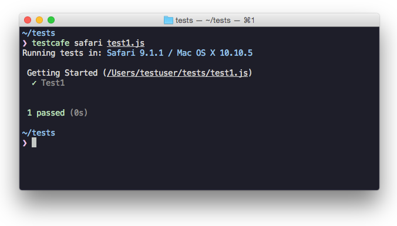

<p align="center">
  <a href="https://www.devexpress.com/products/testcafestudio/?utm_source=github.com&utm_medium=referral&utm_campaign=tc-gh-banner">
    
  </a>
</p>

<p align="center">
    <a href="https://devexpress.github.io/testcafe">
        
    </a>
</p>

<p align="center">
<a href="https://ci.appveyor.com/project/DevExpress/testcafe"></a>
<a href="https://travis-ci.org/DevExpress/testcafe"></a>
<a href="https://www.npmjs.com/package/testcafe"></a>
</p>

<p align="center">
<i>A Node.js tool to automate end-to-end web testing.<br/>Write tests in JS or TypeScript, run them and view results.</i>
</p>

<p align="center">
  <a href="https://devexpress.github.io/testcafe/">Homepage</a> &nbsp&nbsp•&nbsp&nbsp
  <a href="https://devexpress.github.io/testcafe/documentation/getting-started/">Documentation</a> &nbsp&nbsp•&nbsp&nbsp
  <a href="https://devexpress.github.io/testcafe/faq/">FAQ</a> &nbsp&nbsp•&nbsp&nbsp
  <a href="https://devexpress.github.io/testcafe/support/">Support</a>
</p>

* **Works on all popular environments**: TestCafe runs on Windows, MacOS, and Linux. It supports desktop, mobile, remote and cloud [browsers](https://devexpress.github.io/testcafe/documentation/using-testcafe/common-concepts/browsers/browser-support.html) (UI or headless).
* **1 minute to set up**: You [do not need WebDriver](https://devexpress.github.io/testcafe/faq/#i-have-heard-that-testcafe-does-not-use-selenium-how-does-it-operate) or any other testing software. Install TestCafe with one command, and you are ready to test: `npm install -g testcafe`
* **Free and open source**: TestCafe is free to use under the [MIT license](https://github.com/DevExpress/testcafe/blob/master/LICENSE). [Plugins](#plugins) provide custom reports, integration with other tools, launching tests from IDE, etc. You can use the plugins made by the GitHub community or make your own.


<p align="center">
<i>Running a sample test in Safari</i>
</p>

## Table of contents

* [Features](#features)
* [TestCafe Studio: IDE for End-to-End Web Testing](#testcafe-studio-ide-for-end-to-end-web-testing)
* [Getting Started](#getting-started)
* [Documentation](#documentation)
* [Get Help](#get-help)
* [Issue Tracker](#issue-tracker)
* [Stay in Touch](#stay-in-touch)
* [Contributing](#contributing)
* [Plugins](#plugins)
* [Different Versions of TestCafe](#different-versions-of-testcafe)
* [Badge](#badge)
* [License](#license)
* [Creators](#creators)

## Features

**Stable tests and no manual timeouts**<br/>
TestCafe automatically waits for page loads and XHRs before the test starts and after each action.
It also features smart test actions and assertions that wait for page elements to appear.
You can change the maximum wait time.
If elements load faster, tests skip the timeout and continue.

**Rapid test development tool**<br/>
Changes in test code immediately restart the test, and you see the results instantly.<br/>
See how it works in the [TestCafe Live repository](https://github.com/DevExpress/testcafe-live).

**Latest JS and TypeScript support**<br/>
TestCafe supports the latest JavaScript features, including ES2017 (for example, async/await).
You can also [use TypeScript](https://devexpress.github.io/testcafe/documentation/test-api/typescript-support.html)
if you prefer a strongly typed language.

**Detects JS errors in your code**<br/>
TestCafe reports JS errors that it finds on the webpage.
Tests automatically fail because of that.
However, you can disable this.

**Concurrent tests launch**<br/>
TestCafe can open multiple instances of the same browser to run parallel
tests which decreases test execution time.

**PageObject pattern support**<br/>
The TestCafe's [Test API](https://devexpress.github.io/testcafe/documentation/test-api/)
includes a high-level selector library, assertions, etc.
You can combine them to implement readable tests with the [PageObject pattern](https://devexpress.github.io/testcafe/documentation/recipes/using-page-model.html).

```js
const macOSInput = Selector('.column').find('label').withText('MacOS').child('input');
```

**Easy to include in a continuous integration system**<br/>
You can run TestCafe from a console, and its reports can be viewed in a CI system's interface
(TeamCity, Jenkins, Travis & etc.)

## TestCafe Studio: IDE for End-to-End Web Testing

TestCafe works great for JavaScript developers, but at some point you will need to delegate testing tasks to your Q&A department. If that's the case and you are looking for a codeless way to record and maintain tests compatible with your existing infrastructure, check out [TestCafe Studio](https://www.devexpress.com/products/testcafestudio/?utm_source=github.com&utm_medium=referral&utm_campaign=tc-gh-ide) - a testing IDE built on top of the open-source TestCafe.

Read the following article to learn how TestCafe Studio could fit into your workflow: [What's Better than TestCafe? TestCafe Studio](https://www.devexpress.com/products/testcafestudio/qa-end-to-end-web-testing.xml).


<p align="center">
<i>Record and Run a Test in TestCafe Studio</i>
</p>

## Getting Started

### Installation

Ensure that [Node.js](https://nodejs.org/) (version 6 or newer) and [npm](https://www.npmjs.com/) are installed on your computer before running it:

```sh
npm install -g testcafe
```

### Creating the Test

As an example, we are going to test the [https://devexpress.github.io/testcafe/example](https://devexpress.github.io/testcafe/example) page.

Create a `.js` or `.ts` file on your computer.
Note that it needs to have a specific structure: tests must be organized into fixtures.
You can paste the following code to see the test in action:

```js
import { Selector } from 'testcafe'; // first import testcafe selectors

fixture `Getting Started`// declare the fixture
    .page `https://devexpress.github.io/testcafe/example`;  // specify the start page


//then create a test and place your code there
test('My first test', async t => {
    await t
        .typeText('#developer-name', 'John Smith')
        .click('#submit-button')

        // Use the assertion to check if the actual header text is equal to the expected one
        .expect(Selector('#article-header').innerText).eql('Thank you, John Smith!');
});
```

### Running the Test

Call the following command in a command shell.
Specify the [target browser](https://devexpress.github.io/testcafe/documentation/using-testcafe/command-line-interface.html#browser-list)
and [file path](https://devexpress.github.io/testcafe/documentation/using-testcafe/command-line-interface.html#file-pathglob-pattern).

```sh
testcafe chrome test1.js
```

TestCafe opens the browser and starts executing the test.

> Important! Make sure to stay in the browser tab that is running tests.
> Do not minimize the browser window. Tests are not guaranteed to execute correctly
> in inactive tabs and minimized browser windows because they switch to a lower resource consumption mode.

### Viewing the Results

TestCafe outputs the results into a command shell by default. See [Reporters](https://devexpress.github.io/testcafe/documentation/using-testcafe/common-concepts/reporters.html)
for more information. You can also use [plugins](#plugins) to customize the reports.



Read the [Getting Started](https://devexpress.github.io/testcafe/documentation/getting-started/) page for a more detailed guide.

## Documentation

Go to our website for full [documentation](https://devexpress.github.io/testcafe/documentation/getting-started/) on TestCafe.

## Get Help

Join the TestCafe community on Stack Overflow to get help. Ask and answer [questions with the TestCafe tag](https://stackoverflow.com/questions/tagged/testcafe).

## Issue Tracker

Use our GitHub issues page to [report bugs](https://github.com/DevExpress/testcafe/issues/new?template=bug-report.md) and [suggest improvements](https://github.com/DevExpress/testcafe/issues/new?template=feature_request.md).

## Stay in Touch

Follow us on [Twitter](https://twitter.com/DXTestCafe). We post TestCafe news and updates, several times a week.

## Contributing

Read our [Contributing Guide](https://github.com/DevExpress/testcafe/blob/master/CONTRIBUTING.md) to learn how to contribute to the project.

To create your own plugin for TestCafe, you can use these plugin generators:

* [Build a browser provider](https://devexpress.github.io/testcafe/documentation/extending-testcafe/browser-provider-plugin/)
  to set up tests on your on-premises server farm, to use a cloud testing platform, or to start your local browsers in a special way. Use this [Yeoman generator](https://www.npmjs.com/package/generator-testcafe-browser-provider) to write only a few lines of code.
* To [build a custom reporter](https://devexpress.github.io/testcafe/documentation/extending-testcafe/reporter-plugin/)
  with your formatting and style, check out this [generator](https://www.npmjs.com/package/generator-testcafe-reporter).

If you want your plugin to be listed below, [send us a note in a Github issue](https://github.com/DevExpress/testcafe/issues/new).

Thank you to all the people who already contributed to TestCafe!

[](https://github.com/Farfurix) |[](https://github.com/Nuarat) |[](https://github.com/aleks-pro) |[](https://github.com/ericyd) |[](https://github.com/NickCis) |[](https://github.com/timnederhoff) |
:---: |:---: |:---: |:---: |:---: |:---: |
[Farfurix](https://github.com/Farfurix) |[Nuarat](https://github.com/Nuarat) |[aleks-pro](https://github.com/aleks-pro) |[ericyd](https://github.com/ericyd) |[NickCis](https://github.com/NickCis) |[timnederhoff](https://github.com/timnederhoff) |

[](https://github.com/andrewbranch) |[](https://github.com/radarhere) |[](https://github.com/ai) |[](https://github.com/AndyWendt) |[](https://github.com/arubtsov) |[](https://github.com/infctr) |
:---: |:---: |:---: |:---: |:---: |:---: |
[andrewbranch](https://github.com/andrewbranch) |[radarhere](https://github.com/radarhere) |[ai](https://github.com/ai) |[AndyWendt](https://github.com/AndyWendt) |[arubtsov](https://github.com/arubtsov) |[infctr](https://github.com/infctr) |

[](https://github.com/benmonro) |[](https://github.com/lzxb) |[](https://github.com/smockle) |[](https://github.com/beyondcompute) |[](https://github.com/GeoffreyBooth) |[](https://github.com/Ivan-Katovich) |
:---: |:---: |:---: |:---: |:---: |:---: |
[benmonro](https://github.com/benmonro) |[lzxb](https://github.com/lzxb) |[smockle](https://github.com/smockle) |[beyondcompute](https://github.com/beyondcompute) |[GeoffreyBooth](https://github.com/GeoffreyBooth) |[Ivan-Katovich](https://github.com/Ivan-Katovich) |

[](https://github.com/jamesgeorge007) |[](https://github.com/mcjim) |[](https://github.com/kanhaiya15) |[](https://github.com/dej611) |[](https://github.com/MatthewNielsen27) |[](https://github.com/morfey13) |
:---: |:---: |:---: |:---: |:---: |:---: |
[jamesgeorge007](https://github.com/jamesgeorge007) |[mcjim](https://github.com/mcjim) |[kanhaiya15](https://github.com/kanhaiya15) |[dej611](https://github.com/dej611) |[MatthewNielsen27](https://github.com/MatthewNielsen27) |[morfey13](https://github.com/morfey13) |

[](https://github.com/renancouto) |[](https://github.com/honsq90) |[](https://github.com/sgrillon14) |[](https://github.com/tobiasbueschel) |[](https://github.com/raspo) |[](https://github.com/varunkumar) |
:---: |:---: |:---: |:---: |:---: |:---: |
[renancouto](https://github.com/renancouto) |[honsq90](https://github.com/honsq90) |[sgrillon14](https://github.com/sgrillon14) |[tobiasbueschel](https://github.com/tobiasbueschel) |[raspo](https://github.com/raspo) |[varunkumar](https://github.com/varunkumar) |

[](https://github.com/theghostbel) |[](https://github.com/vitalics) |[](https://github.com/aha-oretama) |[](https://github.com/bsmithb2) |[](https://github.com/link89) |[](https://github.com/murajun1978) |
:---: |:---: |:---: |:---: |:---: |:---: |
[theghostbel](https://github.com/theghostbel) |[vitalics](https://github.com/vitalics) |[aha-oretama](https://github.com/aha-oretama) |[bsmithb2](https://github.com/bsmithb2) |[link89](https://github.com/link89) |[murajun1978](https://github.com/murajun1978) |

[](https://github.com/VasilyStrelyaev) |[](https://github.com/AndreyBelym) |[](https://github.com/AlexanderMoskovkin) |[](https://github.com/inikulin) |[](https://github.com/helen-dikareva) |[](https://github.com/AlexKamaev) |
:---: |:---: |:---: |:---: |:---: |:---: |
[VasilyStrelyaev](https://github.com/VasilyStrelyaev) |[AndreyBelym](https://github.com/AndreyBelym) |[AlexanderMoskovkin](https://github.com/AlexanderMoskovkin) |[inikulin](https://github.com/inikulin) |[helen-dikareva](https://github.com/helen-dikareva) |[AlexKamaev](https://github.com/AlexKamaev) |

[](https://github.com/miherlosev) |[](https://github.com/MargaritaLoseva) |[](https://github.com/LavrovArtem) |[](https://github.com/churkin) |[](https://github.com/kirovboris) |[](https://github.com/AlexSkorkin) |
:---: |:---: |:---: |:---: |:---: |:---: |
[miherlosev](https://github.com/miherlosev) |[MargaritaLoseva](https://github.com/MargaritaLoseva) |[LavrovArtem](https://github.com/LavrovArtem) |[churkin](https://github.com/churkin) |[kirovboris](https://github.com/kirovboris) |[AlexSkorkin](https://github.com/AlexSkorkin) |

[](https://github.com/pietrovich) |[](https://github.com/superroma) |[](https://github.com/caseyWebb) |[](https://github.com/intermike) |[](https://github.com/DevSide) |[](https://github.com/b12031106) |
:---: |:---: |:---: |:---: |:---: |:---: |
[pietrovich](https://github.com/pietrovich) |[superroma](https://github.com/superroma) |[caseyWebb](https://github.com/caseyWebb) |[intermike](https://github.com/intermike) |[DevSide](https://github.com/DevSide) |[b12031106](https://github.com/b12031106) |

## Plugins

TestCafe developers and community members made these plugins:

* **Browser Providers**<br/>
  Allow you to use TestCafe with cloud browser providers and emulators.
  * [SauceLabs provider](https://github.com/DevExpress/testcafe-browser-provider-saucelabs) (by [@AndreyBelym](https://github.com/AndreyBelym))
  * [BrowserStack provider](https://github.com/DevExpress/testcafe-browser-provider-browserstack) (by [@AndreyBelym](https://github.com/AndreyBelym))
  * [CrossBrowserTesting provider](https://github.com/sijosyn/testcafe-browser-provider-crossbrowsertesting) (by [@sijosyn](https://github.com/sijosyn))
  * [LambdaTest provider](https://github.com/LambdaTest/testcafe-browser-provider-lambdatest) (by [@kanhaiya15](https://github.com/kanhaiya15))
  * [Nightmare headless provider](https://github.com/ryx/testcafe-browser-provider-nightmare) (by [@ryx](https://github.com/ryx))
  * [fbsimctl iOS emulator](https://github.com/Ents24/testcafe-browser-provider-fbsimctl) (by [@ents24](https://github.com/Ents24))
  * [Electron](https://github.com/DevExpress/testcafe-browser-provider-electron) (by [@AndreyBelym](https://github.com/AndreyBelym))
  * [Puppeteer](https://github.com/jdobosz/testcafe-browser-provider-puppeteer) (by [@jdobosz](https://github.com/jdobosz))

* **Framework-Specific Selectors**<br/>
  Work with page elements in a way that is native to your framework.
  * [React](https://github.com/DevExpress/testcafe-react-selectors) (by [@kirovboris](https://github.com/kirovboris))
  * [Angular](https://github.com/DevExpress/testcafe-angular-selectors) (by [@miherlosev](https://github.com/miherlosev))
  * [Vue](https://github.com/devexpress/testcafe-vue-selectors) (by [@miherlosev](https://github.com/miherlosev))
  * [Aurelia](https://github.com/miherlosev/testcafe-aurelia-selectors) (by [@miherlosev](https://github.com/miherlosev))

* **Plugins for Task Runners**<br/>
  Integrate TestCafe into your project's workflow.
  * [Grunt](https://github.com/crudo/grunt-testcafe) (by [@crudo](https://github.com/crudo))
  * [Gulp](https://github.com/DevExpress/gulp-testcafe) (by [@inikulin](https://github.com/inikulin))

* **Custom Reporters**<br/>
  View test results in different formats.
  * [TeamCity](https://github.com/Soluto/testcafe-reporter-teamcity) (by [@nirsky](https://github.com/nirsky))
  * [Slack](https://github.com/Shafied/testcafe-reporter-slack) (by [@Shafied](https://github.com/Shafied))
  * [NUnit](https://github.com/AndreyBelym/testcafe-reporter-nunit) (by [@AndreyBelym](https://github.com/AndreyBelym))
  * [TimeCafe](https://github.com/jimthedev/timecafe) (by [@jimthedev](https://github.com/jimthedev))

* **GitHub Action**<br/>
  Run TestCafe tests in GitHub Actions workflows.
  * [Run TestCafe](https://github.com/DevExpress/testcafe-action/)

* **Test Accessibility**<br/>
  Find accessibility issues in your web app.
  * [axe-testcafe](https://github.com/helen-dikareva/axe-testcafe) (by [@helen-dikareva](https://github.com/helen-dikareva))

* **IDE Plugins**<br/>
  Run tests and view results from your favorite IDE.
  * [TestCafe Test Runner](https://github.com/romanresh/vscode-testcafe) for Visual Studio Code (by [@romanresh](https://github.com/romanresh))
  * [TestLatte](https://github.com/Selminha/testlatte) for Visual Studio Code (by [@Selminha](https://github.com/Selminha))
  * [TestCafe runner for Webstorm](https://github.com/lilbaek/webstorm-testcafe) (by [@lilbaek](https://github.com/lilbaek))
  * [Code snippets for TestCafe](https://github.com/hdorgeval/testcafe-snippets) (by [@hdorgeval](https://github.com/hdorgeval))
  * [SublimeText](https://github.com/churkin/testcafe-sublimetext) (by [@churkin](https://github.com/churkin))

* **ESLint**<br/>
  Use ESLint when writing and editing TestCafe tests.
  * [ESLint plugin](https://github.com/miherlosev/eslint-plugin-testcafe) (by [@miherlosev](https://github.com/miherlosev))

## Different Versions of TestCafe

| &nbsp; | [TestCafe](https://devexpress.github.io/testcafe) | [TestCafe Studio](https://www.devexpress.com/products/testcafestudio/?utm_source=github.com&utm_medium=referral&utm_campaign=tc-gh-diff)  |
| ------ |:-------------------------------------------------:|:-----------------------------------------------------------------------:|
| No need for WebDriver, browser plugins or other tools | &#10003; | &#10003; |
| Cross-platform and cross-browser out of the box | &#10003; | &#10003; |
| Write tests in the latest JavaScript or TypeScript | &#10003; | &#10003; |
| Clear and flexible [API](https://devexpress.github.io/testcafe/documentation/test-api/) supports ES6 and [PageModel pattern](https://devexpress.github.io/testcafe/documentation/recipes/using-page-model.html) | &#10003; | &#10003; |
| Stable tests due to the [Smart Assertion Query Mechanism](https://devexpress.github.io/testcafe/documentation/test-api/assertions/#smart-assertion-query-mechanism) | &#10003; | &#10003; |
| Tests run fast due to intelligent [Automatic Waiting Mechanism](https://devexpress.github.io/testcafe/documentation/test-api/waiting-for-page-elements-to-appear.html) and [Concurrent Test Execution](https://devexpress.github.io/testcafe/documentation/using-testcafe/common-concepts/concurrent-test-execution.html) | &#10003; | &#10003; |
| Custom reporter plugins | &#10003; | &#10003; |
| Use third-party Node.js modules in test scripts | &#10003; | &#10003; |
| Integration with popular CI systems | &#10003; | &nbsp;&#10003;\* |
| Free and open-source | &#10003; | &nbsp; |
| [Visual Test Recorder](https://docs.devexpress.com/TestCafeStudio/400165/guides/record-tests?utm_source=github.com&utm_medium=referral&utm_campaign=tc-gh-diff) | &nbsp; | &#10003; |
| [Interactive Test Editor](https://docs.devexpress.com/TestCafeStudio/400190/user-interface/test-editor?utm_source=github.com&utm_medium=referral&utm_campaign=tc-gh-diff) | &nbsp; | &#10003; |
| [Automatic Selector Generation](https://docs.devexpress.com/TestCafeStudio/400407/guides/record-tests/element-selectors#auto-generated-element-selectors?utm_source=github.com&utm_medium=referral&utm_campaign=tc-gh-diff) | &nbsp; | &#10003; |
| [Run Configuration Manager](https://docs.devexpress.com/TestCafeStudio/400189/user-interface/run-configurations-dialog?utm_source=github.com&utm_medium=referral&utm_campaign=tc-gh-diff) | &nbsp; | &#10003; |
| [IDE-like GUI](https://docs.devexpress.com/TestCafeStudio/400181/user-interface/code-editor?utm_source=github.com&utm_medium=referral&utm_campaign=tc-gh-diff) | &nbsp; | &#10003; |

\* You can use open-source TestCafe to run TestCafe Studio tests in CI systems.

## Badge

Show everyone you are using TestCafe: 

To display this badge, add the following code to your repository readme:

```html
<a href="https://github.com/DevExpress/testcafe">
    
</a>
```

## Thanks to BrowserStack

We are grateful to BrowserStack for providing the infrastructure that we use to test code in this repository.

<a href="https://www.browserstack.com/"></a>

## License

Code released under the [MIT license](LICENSE).

## Creators

Developer Express Inc. ([https://devexpress.com](https://devexpress.com))
