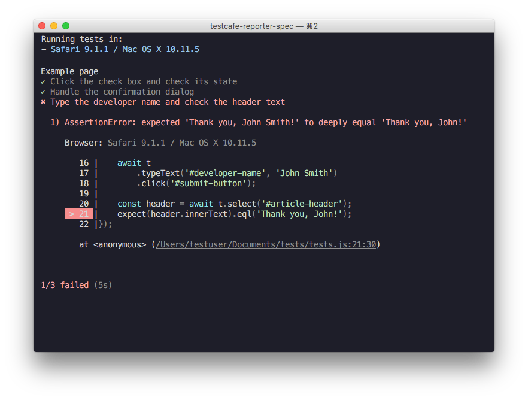

<h1 align="center">
    <a href="https://devexpress.github.io/testcafe">
        
    </a>
</h1>
<p align="center">
<a href="https://devexpress.github.io/testcafe">https://devexpress.github.io/testcafe</a>
</p>
<p align="center">
<i>Automated browser testing for the modern web development stack.</i>
</p>

<p align="center">
<a href="https://ci.appveyor.com/project/DevExpress/testcafe"></a>
<a href="https://travis-ci.org/DevExpress/testcafe"></a>
<a href="https://www.npmjs.com/package/testcafe"></a>
</p>

----

TestCafe is a pure node.js end-to-end solution for testing web apps. It takes care of all the stages: starting browsers, running tests, gathering test results and generating reports. TestCafe doesn’t need browser plugins - it works in all popular modern browsers out-of-the-box.


* [Features](#features)
* [Getting Started](#getting-started)
* [Documentation](#documentation)
* [TestCafe Ecosystem](#testcafe-ecosystem)
* [Roadmap](#roadmap)
* [Contributing](#contributing)
* [Stay in Touch](#stay-in-touch)
* [License](#license)
* [Author](#author)

## Features

### Easy Install

Everything is included in a single module installed with one command.

```bash
npm install -g testcafe
```

No native parts to compile, no browsers plugins to install.

### Complete Test Harness

TestCafe automatically starts browsers, runs tests and gathers results. You only type a single command to begin testing.

```bash
testcafe chrome tests/
```

When testing is finished, TestCafe aggregates test results from different browsers and outputs them into one comprehensive report.

### Write Test Code Using ES2016

You can write TestCafe tests in ES2016 using the latest JavaScript features like `async/await`.

[Test API](https://devexpress.github.io/testcafe/documentation/test-api/index.html) consists of over two dozen methods that can emulate all actions one could possibly do with a webpage.
Chained syntax allows for code that is easy to write and read.

```js
fixture `Example page`
    .page `https://devexpress.github.io/testcafe/example`;

test('Emulate user actions and perform a verification', async t => {
    await t
        .setNativeDialogHandler(() => true)
        .click('#populate')
        .click('#submit-button');

    const location = await t.eval(() => window.location);

    await t.expect(location.pathname).eql('/testcafe/example/thank-you.html');
});
```

Additionally, TestCafe automatically generates source maps for easy debugging.
To debug your test code, start a debugging session in an IDE that supports source maps.

### Flexible Selector System

TestCafe supports a flexible selector system that provides API with rich capabilities for writing test scripts.
You can access webpage elements in different ways using [selectors](https://devexpress.github.io/testcafe/documentation/test-api/selecting-page-elements/selectors.html). For example, you can use one of the following selector types:

* CSS selector
* Text
* DOM hierarchy
* or use any custom logic

The selector API provides methods that can be combined together, thus providing you with a flexible functional-style selector mechanism.

```js
const macOSInput = Selector('.column').find('label').withText('MacOS').child('input');
```

Check our [example](https://github.com/DevExpress/testcafe/blob/master/examples/basic) that demonstrates how to create tests using
declarative [Page Objects](http://martinfowler.com/bliki/PageObject.html) built with TestCafe selectors.

### Smart assertions

TestCafe provides a full-featured set of [built-in assertions](https://devexpress.github.io/testcafe/documentation/test-api/assertions/assertion-api.html), so you do not need to reference additional libraries.
Use assertions with [Selector's DOM node state properties](https://devexpress.github.io/testcafe/documentation/test-api/selecting-page-elements/selectors.html#define-assertion-actual-value) to enable the [Smart Assertion Query Mechanism](https://devexpress.github.io/testcafe/documentation/test-api/assertions/index.html#smart-assertion-query-mechanism) and create stable, fast and reliable tests that do not depend on page response time.

```js
import { Selector } from 'testcafe';

fixture `Example page`
    .page `http://devexpress.github.io/testcafe/example/`;

test('Check property of element', async t => {
    const developerNameInput = Selector('#developer-name');

    await t
        .expect(developerNameInput.value).eql('', 'input is empty')
        .typeText(developerNameInput, 'Peter Parker')
        .expect(developerNameInput.value).contains('Peter', 'input contains text "Peter"');
});
```

### No Extra Coding

Write tests without boilerplate code.

* TestCafe automatically waits for page loads and XHRs to complete, as well as for DOM elements to become visible. You do not need to write custom code for that.
* Test runs are isolated, which means that they do not share cookies, local or session storages. There is nothing to clean up between test runs.

### Descriptive Reports

TestCafe automatically generates full-detailed reports that provide a test run summary and comprehensive information about errors.
Automatic page screenshots, fancy call sites and call stacks free of TestCafe internals allow you to easily detect error causes.

Use one of [built-in reporters](https://devexpress.github.io/testcafe/documentation/using-testcafe/common-concepts/reporters.html) to output test results or [create your own one](https://devexpress.github.io/testcafe/documentation/extending-testcafe/reporter-plugin/) to produce custom reports.



### Straightforward Continuous Integration

TestCafe is easy to set up on popular Continuous Integration platforms as it allows you to test against various browsers: local, remote, cloud (e.g., [Sauce Labs](https://devexpress.github.io/testcafe/documentation/recipes/running-tests-using-travis-ci-and-sauce-labs.html)) or headless (e.g. [Nightmare](https://github.com/ryx/testcafe-browser-provider-nightmare)).
You can also create a custom [browser provider](https://devexpress.github.io/testcafe/documentation/extending-testcafe/browser-provider-plugin/index.html) to add support for a browser or a cloud platform of your choice.

### Other Useful Features

* Automatic screenshots of the tested page taken [whenever the test fails](https://devexpress.github.io/testcafe/documentation/using-testcafe/command-line-interface.html#-s---screenshots-on-fails) or [triggered from test code](https://devexpress.github.io/testcafe/documentation/test-api/actions/take-screenshot.html).
* [File upload](https://devexpress.github.io/testcafe/documentation/test-api/actions/upload.html) support.
* Detecting JavaScript errors on the tested page.
* [Handling native browser dialogs](https://devexpress.github.io/testcafe/documentation/test-api/handling-native-dialogs.html) (i.e., alert, confirm, prompt, beforeunload ) using custom logic whenever they are invoked during a test run.
* [Resizing the browser window](https://devexpress.github.io/testcafe/documentation/test-api/actions/resize-window.html) during test execution.
* [Adjusting the speed](https://devexpress.github.io/testcafe/documentation/using-testcafe/command-line-interface.html#--speed-factor) of test execution.

## Getting Started

### Installing TestCafe

Ensure that [Node.js](https://nodejs.org/) and [npm](https://www.npmjs.com/) are installed on your computer, then run a single command:

```bash
npm install -g testcafe
```

For more information, see [Installing TestCafe](https://devexpress.github.io/testcafe/documentation/using-testcafe/installing-testcafe.html).

### Creating a Test

To create a test, create a new .js file anywhere on your computer.
This file must have a special structure: tests must be organized into fixtures. Thus, begin by declaring a fixture using the [fixture](https://devexpress.github.io/testcafe/documentation/test-api/test-code-structure.html#fixtures) function.

```js
fixture `Getting Started`
```

In this tutorial, you will create a test for the [https://devexpress.github.io/testcafe/example](https://devexpress.github.io/testcafe/example) sample page.
Specify this page as a start page for the fixture by using the [page](https://devexpress.github.io/testcafe/documentation/test-api/test-code-structure.html#specifying-the-start-webpage) function.

```js
fixture `Getting Started`
    .page `https://devexpress.github.io/testcafe/example`;
```

Then, create the [test](https://devexpress.github.io/testcafe/documentation/test-api/test-code-structure.html#tests) function where you will place test code.

```js
fixture `Getting Started`
    .page `https://devexpress.github.io/testcafe/example`;

test('My first test', async t => {
    // Test code
});
```

### Running the Test

You can simply run the test from a command shell by calling a single command where you specify the [target browser](https://devexpress.github.io/testcafe/documentation/using-testcafe/command-line-interface.html#browser-list) and [file path](https://devexpress.github.io/testcafe/documentation/using-testcafe/command-line-interface.html#file-pathglob-pattern).

```bash
testcafe chrome test1.js
```

TestCafe will automatically open the chosen browser and start test execution within it.

> Important! Make sure to keep the browser tab that is running tests active. Do not minimize the browser window.
> Inactive tabs and minimized browser windows switch to a lower resource consumption mode
> where tests are not guaranteed to execute correctly.

For more information on how to configure the test run, see [Command Line Interface](https://devexpress.github.io/testcafe/documentation/using-testcafe/command-line-interface.html).

### Viewing the Test Results

While the test is running, TestCafe is gathering information about the test run and outputting the report right into a command shell.


For more information, see [Reporters](https://devexpress.github.io/testcafe/documentation/using-testcafe/common-concepts/reporters.html).

### Writing Test Code

#### Performing Actions on the Page

Every test should be capable of interacting with page content. To perform user actions, TestCafe provides
a number of [actions](https://devexpress.github.io/testcafe/documentation/test-api/actions/): `click`, `hover`, `typeText`, `setFilesToUpload`, etc.
They can be called in a chain.

The following fixture contains a simple test that types a developer name into a text editor and then clicks the Submit button.

```js
fixture `Getting Started`
    .page `https://devexpress.github.io/testcafe/example`;

test('My first test', async t => {
    await t
        .typeText('#developer-name', 'John Smith')
        .click('#submit-button');
});
```

All test actions are implemented as async functions of the [test controller object](https://devexpress.github.io/testcafe/documentation/test-api/test-code-structure.html#test-controller) `t`.
This object is used to access test run API.
To wait for actions to complete, use the `await` keyword when calling these actions or action chains.

#### Observing Page State

TestCafe allows you to observe the page state.
For this purpose, it offers special kinds of functions that will execute your code on the client:
[Selector](https://devexpress.github.io/testcafe/documentation/test-api/selecting-page-elements/selectors.html) used to get direct access to DOM elements
and [ClientFunction](https://devexpress.github.io/testcafe/documentation/test-api/obtaining-data-from-the-client.html) used to obtain arbitrary data from the client side.
You call these functions as regular async functions, that is you can obtain their results and use parameters to pass data to them.

The selector API provides methods and properties to select elements on the page and get theirs state.

For example, clicking the Submit button on the sample web page opens a "Thank you" page.
To get access to DOM elements on the opened page, the `Selector` function can be used.
The following example demonstrates how to access the article header element and obtain its actual text.

```js
import { Selector } from 'testcafe';

fixture `Getting Started`
    .page `http://devexpress.github.io/testcafe/example`;

test('My first test', async t => {
    await t
        .typeText('#developer-name', 'John Smith')
        .click('#submit-button');

    const articleHeader = await Selector('.result-content').find('h1');

    // Obtain the text of the article header
    let headerText = await articleHeader.innerText;
});
```

For more information, see [Selecting Page Elements](https://devexpress.github.io/testcafe/documentation/test-api/selecting-page-elements/).

#### Assertions

A functional test also should check the result of actions performed.
For example, the article header on the "Thank you" page should address a user by the entered name.
To check if the header is correct, you have to add an assertion to the test.

The following test demonstrates how to use [build-in assertions](https://devexpress.github.io/testcafe/documentation/test-api/assertions/).

```js
import { Selector } from 'testcafe';

fixture `Getting Started`
    .page('https://devexpress.github.io/testcafe/example');

test('My first test', async t => {
    await t
        .typeText('#developer-name', 'John Smith')
        .click('#submit-button')
        // Use the assertion to check if the actual header text is equal to the expected one
        .expect(Selector('#article-header').innerText).eql('Thank you, John Smith!');
});
```

## Documentation

* [Test API](https://devexpress.github.io/testcafe/documentation/test-api/)
* [Using TestCafe](https://devexpress.github.io/testcafe/documentation/using-testcafe/)
* [Extending TestCafe](https://devexpress.github.io/testcafe/documentation/extending-testcafe/)
* [Recipes](https://devexpress.github.io/testcafe/documentation/recipes/)

## TestCafe Ecosystem

The following plugins make your work with TestCafe easy and introduce new features.

### IDE Plugins

Run tests and view test results right from your favorite IDE.

* [Visual Studio Code](https://github.com/romanresh/vscode-testcafe)
* [SublimeText](https://github.com/churkin/testcafe-sublimetext)

### Framework-Specific Selectors

Work with page elements in a way that is native to your framework.

* [Aurelia](https://github.com/miherlosev/testcafe-aurelia-selectors)

### Plugins for Task Runners

Easily integrate TestCafe into your project's workflow.

* [Grunt](https://github.com/crudo/grunt-testcafe)
* [Gulp](https://github.com/DevExpress/gulp-testcafe)

### Browser Providers

Provide support for more browsers to test against.

* [SauceLabs](https://github.com/DevExpress/testcafe-browser-provider-saucelabs)
* [Nightmare](https://github.com/ryx/testcafe-browser-provider-nightmare)
* [iOS Simulator](https://github.com/Ents24/testcafe-browser-provider-fbsimctl)

### Custom Reporters

Enable TestCafe to present test results in different formats.

* [NUnit](https://github.com/AndreyBelym/testcafe-reporter-nunit)

### ESLint

Use ESLint when writing and editing TestCafe tests.

* [ESLint plugin](https://github.com/miherlosev/eslint-plugin-testcafe)

## Roadmap

We plan to introduce other outstanding features so that you can test apps with even more efficiency.
Meanwhile, you can help us improve TestCafe by voting for features on our [roadmap](https://github.com/DevExpress/testcafe/milestone/10).

## Contributing

Please use our [issues page](https://github.com/DevExpress/testcafe/issues) to report a bug or request a feature.

For general purpose questions and discussions, use the [discussion board](https://testcafe-discuss.devexpress.com/).

For more information on how to help us improve TestCafe, please see the [CONTRIBUTING.md](CONTRIBUTING.md) file.

## Stay in Touch

* [Blog](https://devexpress.github.io/testcafe/blog/)
* [Twitter](https://twitter.com/dxtestcafe)

## License

[MIT](LICENSE)

## Author

Developer Express Inc. ([https://devexpress.com](https://devexpress.com))
