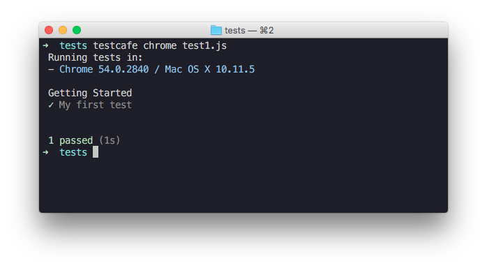

<p align="center">
    <a href="http://devexpress.github.io/testcafe">
        
    </a>
</p>
<p align="center">
<a href="http://devexpress.github.io/testcafe">http://devexpress.github.io/testcafe</a>
</p>
<p align="center">
<i>Automated browser testing for modern web development stack.</i>
</p>

<p align="center">
<a href="https://www.npmjs.com/package/testcafe"></a>
</p>

----

TestCafe is a simple and powerful framework for testing web sites and apps.
It allows you to easily create, maintain and execute automated web tests across browsers, operating systems and devices.

* [Build status](#build-status)
* [Features](#features)
* [Getting Started](#getting-started)
* [Documentation](#documentation)
* [Contributing](#contributing)
* [License](#license)
* [Author](#author)

# Build status

Tests             | Status
----------------- | ----------
All               | [](https://travis-ci.org/DevExpress/testcafe)
Client            | [](https://saucelabs.com/u/testcafe-master)

# Features

## Easy Install

All you need is to have [Node.js](https://nodejs.org) with [npm](https://www.npmjs.com) installed and call a single command.

```bash
npm install --save-dev testcafe
```

No browsers plugins to install, no binary compilation post-install steps.

## Complete Test Harness

TestCafe covers all testing phases: starting browsers, running tests and gathering results.
You configure test run and start execution either via the API or from a command shell simply by running a single command

```bash
testcafe safari tests/
```

TestCafe aggregates test results from different browsers and outputs them into one comprehensive report.

## Write Test Code Using ES2016

You can write TestCafe tests in ES2016 using all latest JavaScript features like `async/await`.

TestCafe introduces simple, but powerful test API. It offers a couple of dozen methods covering user actions. Chained syntax produces code that is easy to write and read. Furthermore, you are free to use any assertion library to perform verifications of different kinds.

```js
import { expect } from 'chai';

fixture `My Fixture`
    .page('http://devexpress.github.io/testcafe/example');

test('My Test', async t => {
    await t
        .click('#send-button')
        .handleAlert()
        .typeText('#input', 'Peter Parker')
        .wait(1000);

    expect(await t.eval(() => getSomethingOnTheClient())).to.be.true;
});
```

TestCafe will compile your test code on-flight and run it immediately.
It also ships with built-in support for source maps to leverage debugging experience.
Source maps are automatically enabled, so all you need to do is start a debugging session in an IDE that supports them.

## Write Regular Client JavaScript to Observe Page State

TestCafe is capable of executing code on the client side thus giving you direct access to DOM elements on the page and empowering you to obtain required data from the client.
Simply write JavaScript code within the `ClientFunction` or `Selector` function.
These functions are called from a test as regular async functions. So, you can pass parameters to them and return values.

```js
import { Selector } from 'testcafe';

const getElementById = Selector(id => document.querySelector(`#${id}`));

fixture `My Fixture`
    .page('http://devexpress.github.io/testcafe/example');

test('My Test', async t => {
    await t
        .typeText('#developer-name', 'John Smith')
        .click('#submit-button');

    const articleHeader = await getElementById('article-header');
    const headerText = articleHeader.innerText;
});
```

## Descriptive Reports

TestCafe automatically generates full-detailed reports providing a test run summary and comprehensive information about errors.
Fancy call sites, clean stacks and screenshots help you easily detect an error cause.

Choose from five [built-in reporters](http://devexpress.github.io/testcafe/documentation/using-testcafe/common-concepts/reporters.html) to output test results or create [custom reporter plugins](http://devexpress.github.io/testcafe/documentation/extending-testcafe/custom-reporter-plugin/) to produce your own reports.


## Continuous Integration

Take advantage of automatic test execution through integration of TestCafe with popular Continuous Integration platforms.
TestCafe's browser provider mechanism makes it simple to set up testing in various browsers: local, remote, [Sauce Labs](https://saucelabs.com/) or [PhantomJS](http://phantomjs.org/).
You can also create your own browser provider plugin that will suit your platform and needs.

# Getting Started

## Installation

Make sure that [Node.js](https://nodejs.org/) and [npm](https://www.npmjs.com/) are installed on your computer, then run a single command:

```bash
npm install --g testcafe
```

For more information, see [Installing TestCafe](http://devexpress.github.io/testcafe/documentation/using-testcafe/installing-testcafe).

## Creating a Test

To create a test, create a new .js file anywhere on your computer.
This file must have the special structure: tests must be organized into fixtures.
So, first you need to declare a fixture by using the [fixture](http://devexpress.github.io/testcafe/documentation/test-api/test-code-structure.md#fixtures) function.

```js
fixture `Getting Started`
```

In this tutorial, you will create a test for the [http://devexpress.github.io/testcafe/example](http://devexpress.github.io/testcafe/example) sample page.
Specify this page as a start page for the fixture by using the [page](http://devexpress.github.io/testcafe/documentation/test-api/test-code-structure.md#specifying-the-start-webpage) function.

```js
fixture `Getting Started`
    .page('http://devexpress.github.io/testcafe/example');
```

Then create the [test](http://devexpress.github.io/testcafe/documentation/test-api/test-code-structure.md#tests) function where place test code.
The test will type a developer name into a text editor, click the Submit button and check a header text on the resulting page.

```js
import { expect } from 'chai';

fixture `Getting Started`
    .page('http://devexpress.github.io/testcafe/example');

test('My first test', async t => {
    await t
        .typeText('#developer-name', 'John Smith')
        .click('#submit-button');

    expect((await t.select('#article-header')).innerText).to.equal('Thank you, John Smith!');
});
```

## Running the Test

You can simply run the test from a command shell, by calling a single command where you specify the [target browser](http://devexpress.github.io/testcafe/documentation/using-testcafe/command-line-interface.md#browser-list) and [file path](http://devexpress.github.io/testcafe/documentation/using-testcafe/command-line-interface.md#file-pathglob-pattern).

```bash
testcafe safari test1.js
```

TestCafe will automatically open the chosen browser and start the test execution within it.

For more information on how to configure the test run, see [Command Line Interface](http://devexpress.github.io/testcafe/documentation/using-testcafe/command-line-interface.md).

## Viewing the Test Results

While the test is running, TestCafe is gathering information about the test run and outputing the report right into a command shell.



For more information, see [Reporters](http://devexpress.github.io/testcafe/documentation/using-testcafe/common-concepts/reporters.md).

# Documentation

- [Getting Started](http://devexpress.github.io/testcafe/documentation/getting-started/)
- [Test API](http://devexpress.github.io/testcafe/documentation/test-api/)
- [Using TestCafe](http://devexpress.github.io/testcafe/documentation/using-testcafe/)
- [Extending TestCafe](http://devexpress.github.io/testcafe/documentation/extending-testcafe/)
- [Recipes](http://devexpress.github.io/testcafe/documentation/recipes/)

# Contributing

Please use our [issues page](https://github.com/DevExpress/testcafe/issues) to report a bug or request a feature.

For general purpose questions and discussions, use the [discussion board](https://testcafe-discuss.devexpress.com/).

For more information on how to help us improve TestCafe, please see the [CONTRIBUTING.md](CONTRIBUTING.md) file.

# License

[MIT](LICENSE)

# Author
Developer Express Inc. (https://devexpress.com)
