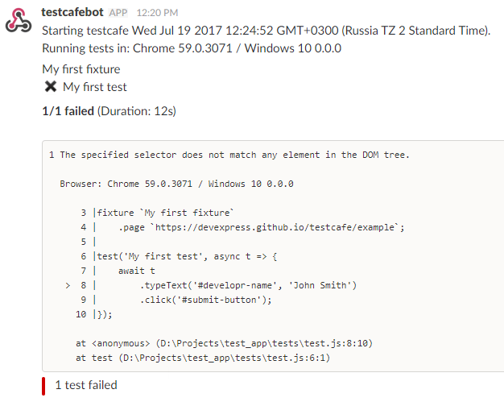
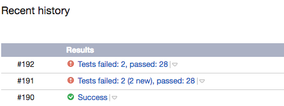

# TestCafe v0.17.0 Released: Testing Electron Apps and Concurrent Test Execution

With this release, we have prepared a bunch of new features. Two big news are the Electron browser provider and concurrent test execution.

Read on to learn more.

<!--more-->

## Enhancements

### ⚙ Testing Electron applications ([testcafe-browser-provider-electron](https://github.com/DevExpress/testcafe-browser-provider-electron))

We have created a browser provider that allows you to test Electron applications with TestCafe.

Getting it to work is simple. First, install the browser provider plugin from npm.

```sh
npm install testcafe-browser-provider-electron
```

We assume that you have a JavaScript application that you wish to run in Electron.

Create a `.testcafe-electron-rc` file that contains configurations for the Electron plugin.
The only required setting here is `mainWindowUrl`. It's a URL (or path) to the main window page relative to the application directory.

```json
{
    "mainWindowUrl": "./index.html"
}
```

Place this file into the application root directory.

At the next step, install the Electron module.

```sh
npm install electron@latest
```

Now you are ready to run tests. Specify the `electron` browser name and the application path
at the test launch.

```sh
testcafe "electron:/home/user/electron-app" "path/to/test/file.js"
```

```js
testCafe
    .createRunner()
    .src('path/to/test/file.js')
    .browsers('electron:/home/user/electron-app')
    .run();
```

To learn more about the Electron browser provider, see the plugin [readme](https://github.com/DevExpress/testcafe-browser-provider-electron).

### ⚙ Concurrent test execution ([#1165](https://github.com/DevExpress/testcafe/issues/1165))

We've added concurrent test launch. This makes a test batch complete faster.

By default TestCafe launches one instance of each specified browser. Tests run one by one in each of them.

Enable *concurrency* and TestCafe will launch multiple instances of each browser. It will distribute the test batch among them. The tests will run in parallel.

To enable concurrency, add `-c`in the command line. Or use the `runner.concurrency()` API method.
Specify the number of instances to invoke for each browser.

```js
testcafe -c 3 chrome tests/test.js
```

```js
var testRunPromise = runner
    .src('tests/test.js')
    .browsers('chrome')
    .concurrency(3)
    .run();
```

For details, see [Concurrent Test Execution](https://devexpress.github.io/testcafe/documentation/using-testcafe/common-concepts/concurrent-test-execution.html).

### ⚙ Output test run reports to Slack and TeamCity ([testcafe-reporter-slack](https://github.com/Shafied/testcafe-reporter-slack), [testcafe-reporter-teamcity](https://github.com/Soluto/testcafe-reporter-teamcity))

Thanks to [@Shafied](https://github.com/Shafied) and [@nirsky](https://github.com/nirsky), TestCafe ecosystem has gained two new reporter plugins.

The Slack reporter allows you to create a chat bot that posts test run results to a Slack channel.



The TeamCity reporter enables you to display reports inside the TeamCity UI.



### ⚙ Further improvements in automatic waiting mechanism ([#1521](https://github.com/DevExpress/testcafe/issues/1521))

We have enhanced the waiting mechanism behavior in certain scenarios where you still used to need `wait` actions.
Now automatic waiting is much smarter and chances that you need to wait manually are diminished.

### ⚙ User roles preserve the local storage ([#1454](https://github.com/DevExpress/testcafe/issues/1454))

TestCafe now saves the local storage state when switching between roles. You get the same local storage content you left when you switch back.

This is useful for testing websites that perform authentication via local storage instead of cookies.

## Bug Fixes

* Selector's `withAttribute` method supports search by strict match ([#1548](https://github.com/DevExpress/testcafe/issues/1548))
* Description for the `path` parameter of the `t.takeScreenshot` action has been corrected ([#1515](https://github.com/DevExpress/testcafe/issues/1515))
* Local storage is now cleaned appropriately after the test run.([#1546](https://github.com/DevExpress/testcafe/issues/1546))
* TestCafe now checks element visibility with a timeout when the target element's `style.top` is negative ([#1185](https://github.com/DevExpress/testcafe/issues/1185))
* Fetching an absolute CORS URL now works correctly. ([#1629](https://github.com/DevExpress/testcafe/issues/1629))
* Add partial support for proxying live node collections (the `GetElementsByTagName` method) ([#1442](https://github.com/DevExpress/testcafe/issues/1442))
* TypeScript performance has been enhanced. ([#1591](https://github.com/DevExpress/testcafe/issues/1591))
* The right port is now applied to a cross-domain iframe location after redirect. ([testcafe-hammerhead/#1191](https://github.com/DevExpress/testcafe-hammerhead/issues/1191))
* All internal properties are marked as non-enumerable. ([testcafe-hammerhead/#1182](https://github.com/DevExpress/testcafe-hammerhead/issues/1182))
* Support proxying pages with defined referrer policy. ([testcafe-hammerhead/#1195](https://github.com/DevExpress/testcafe-hammerhead/issues/1195))
* WebWorker content is now correctly proxied in FireFox 54. ([testcafe-hammerhead/#1216](https://github.com/DevExpress/testcafe-hammerhead/issues/1216))
* Code instrumentation for the `document.activeElement` property works properly if it is `null`. ([testcafe-hammerhead/#1226](https://github.com/DevExpress/testcafe-hammerhead/issues/1226))
* `length`, `item` and `namedItem` are no longer own properties of `LiveNodeListWrapper`. ([testcafe-hammerhead/#1222](https://github.com/DevExpress/testcafe-hammerhead/issues/1222))
* The `scope` option in the `serviceWorker.register` function is now processed correctly. ([testcafe-hammerhead/#1233](https://github.com/DevExpress/testcafe-hammerhead/issues/1233))
* Promises from a fetch request are now processed correctly. ([testcafe-hammerhead/#1234](https://github.com/DevExpress/testcafe-hammerhead/issues/1234))
* Fix transpiling for the `for..of` loop to support browsers without `window.Iterator`. ([testcafe-hammerhead/#1231](https://github.com/DevExpress/testcafe-hammerhead/issues/1231))