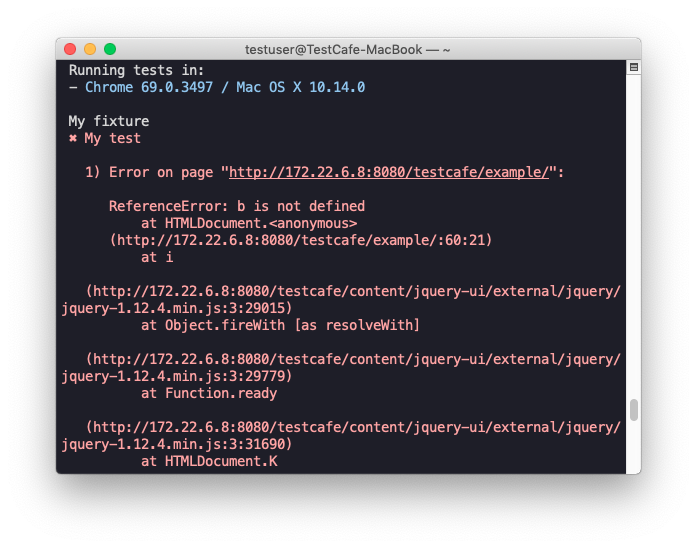

# TestCafe v0.23.0 Released

Stop a test run after the first test fail, view JavaScript errors' stack trace in test run reports and let TestCafe restart browsers when they stop responding.

<!--more-->

## Enhancements

### ⚙ Stop Test Run After the First Test Fail ([#1323](https://github.com/DevExpress/testcafe/issues/1323))

You can now configure TestCafe to stop the entire test run after the first test fail. This saves your time when you fix problems with your tests one by one.

Specify the [--sf](https://devexpress.github.io/testcafe/documentation/using-testcafe/command-line-interface.html#--sf---stop-on-first-fail) flag to enable this feature when you run tests from the command line.

```sh
testcafe chrome my-tests --sf
```

In the API, use the [stopOnFirstFail](https://devexpress.github.io/testcafe/documentation/using-testcafe/programming-interface/runner.html#run) option.

```js
runner.run({ stopOnFirstFail: true })
```

### ⚙ View the JavaScript Errors' Stack Traces in Reports ([#2043](https://github.com/DevExpress/testcafe/issues/2043))

Now when a JavaScript error occurs on the tested webpage, the test run report includes a stack trace for this error (only if the [--skip-js-errors](https://devexpress.github.io/testcafe/documentation/using-testcafe/command-line-interface.html#-e---skip-js-errors) option is disabled).



### ⚙ Browsers are Automatically Restarted When They Stop Responding ([#1815](https://github.com/DevExpress/testcafe/issues/1815))

If a browser stops responding while it executes tests, TestCafe restarts the browser and reruns the current test in a new browser instance.
If the same problem occurs with this test two more times, the test run finishes and an error is thrown.

## Bug Fixes

* An error message about an unawaited call to an async function is no longer displayed when an uncaught error occurs ([#2557](https://github.com/DevExpress/testcafe/issues/2557))
* A request hook is no longer added multiple times when a filter rule is used ([#2650](https://github.com/DevExpress/testcafe/issues/2650))
* Screenshot links in test run reports now contain paths specified by the `--screenshot-pattern` option ([#2726](https://github.com/DevExpress/testcafe/issues/2726))
* Assertion chains no longer produce unhandled promise rejections ([#2852](https://github.com/DevExpress/testcafe/issues/2852))
* The `moment` loader now works correctly in the Jest environment ([#2500](https://github.com/DevExpress/testcafe/issues/2500))
* TestCafe no longer hangs if the screenshot directory contains forbidden symbols ([#681](https://github.com/DevExpress/testcafe/issues/681))
* The `--ssl` option's parameters are now parsed correctly ([#2924](https://github.com/DevExpress/testcafe/issues/2924))
* TestCafe now throws a meaningful error if an assertion method is missing ([#1063](https://github.com/DevExpress/testcafe/issues/1063))
* TestCafe no longer hangs when it clicks a custom element ([#2861](https://github.com/DevExpress/testcafe/issues/2861))
* TestCafe now performs keyboard navigation between radio buttons/groups in a way that matches the native browser behavior ([#2067](https://github.com/DevExpress/testcafe/issues/2067), [#2045](https://github.com/DevExpress/testcafe/issues/2045))
* The `fetch` method can now be used with data URLs ([#2865](https://github.com/DevExpress/testcafe/issues/2865))
* The `switchToIframe` function no longer throws an error ([#2956](https://github.com/DevExpress/testcafe/issues/2956))
* TestCafe can now scroll through fixed elements when the action has custom offsets ([#2978](https://github.com/DevExpress/testcafe/issues/2978))
* You can now specify the current directory or its parent directories as the base path to store screenshots ([#2975](https://github.com/DevExpress/testcafe/issues/2975))
* Tests no longer hang up when you try to debug in headless browsers ([#2846](https://github.com/DevExpress/testcafe/issues/2846))
* The `removeEventListener` function now works correctly when an object is passed as its third argument ([testcafe-hammerhead/#1737](https://github.com/DevExpress/testcafe-hammerhead/issues/1737))
* Hammerhead no longer adds the `event` property to a null `contentWindow` in IE11 ([testcafe-hammerhead/#1684](https://github.com/DevExpress/testcafe-hammerhead/issues/1684))
* The browser no longer resets connection with the server for no reason ([testcafe-hammerhead/#1647](https://github.com/DevExpress/testcafe-hammerhead/issues/1647))
* Hammerhead now stringifies values correctly before outputting them to the console ([testcafe-hammerhead/#1750](https://github.com/DevExpress/testcafe-hammerhead/issues/1750))
* A document fragment from the top window can now be correctly appended to an iframe ([testcafe-hammerhead/#912](https://github.com/DevExpress/testcafe-hammerhead/issues/912))
* Lifecycle callbacks that result from the `document.registerElement` method are no longer called twice ([testcafe-hammerhead/#695](https://github.com/DevExpress/testcafe-hammerhead/issues/695))
