# Integrate TestCafe with Azure DevOps

This topic describes how to integrate TestCafe tests into an [Azure DevOps Server](https://azure.microsoft.com/en-us/services/devops/server/) and an [Azure Pipelines](https://azure.microsoft.com/en-us/services/devops/pipelines/) project's build process.

## Step 1 - Add TestCafe Dependency to the Project

Open the repository's root directory and execute the following command:

```sh
npm install --save-dev testcafe
```

This command installs the latest TestCafe version locally and adds it to the `devDependencies` section in the `package.json` file.

```json
{
    "devDependencies": {
        "testcafe": "*"
    }
}
```

## Step 2 - Provide a Command to Run Tests

The test run command that uses TestCafe should be also added to `package.json` to the `scripts` section because TestCafe is installed locally.

```json
{
    "scripts": {
        "test": "testcafe chrome:headless tests/**/*"
    },

    "devDependencies": {
        "testcafe": "*"
    }
}
```

This allows you to use `npm test` to run tests.

## Step 3 - Configure a Build Task

Now you are ready to create a build task.

### Configure Build Task on Azure Pipelines

Open `azure-pipelines.yml` or create it in the repository root and add the following [job](https://docs.microsoft.com/en-us/azure/devops/pipelines/process/phases?view=vsts&tabs=yaml):

```yaml
jobs:
- job: e2e_tests
  pool:
    vmImage: 'Ubuntu 16.04'
  steps:
  - task: NodeTool@0
    inputs:
      # Replace '10.14' with the latest Node.js LTS version
      versionSpec: '10.14'
    displayName: 'Install Node.js'
  - script: npm install
    displayName: 'Install TestCafe'
  - script: npm test
    displayName: 'Run TestCafe Tests'
```

* `jobs` - the list of [jobs](https://docs.microsoft.com/en-us/azure/devops/pipelines/process/phases?view=vsts&tabs=yaml).
* `job` - the job name.
* `pool` - the [agent pool](https://docs.microsoft.com/en-us/azure/devops/pipelines/agents/pools-queues?view=vsts) that executes this build job.
* `vmImage` - the [agent's](https://docs.microsoft.com/en-us/azure/devops/pipelines/agents/agents?view=vsts) virtual machine image name. This tutorial uses a [Microsoft-hosted agent](https://docs.microsoft.com/en-us/azure/devops/pipelines/agents/hosted?view=vsts&tabs=yaml) that runs on an Ubuntu 16.04 machine. You can find the list of software installed on this machine in the [Azure Pipelines GitHub repository](https://github.com/Microsoft/azure-pipelines-image-generation/blob/master/images/linux/Ubuntu1604-README.md).
* `steps` - the list of steps performed when executing a job.
* `task` - adds a [Node.js installer task](https://docs.microsoft.com/en-us/azure/devops/pipelines/tasks/tool/node-js?view=vsts)  to the job. This task installs Node.js and adds it to the `PATH` variable.
* `inputs` - specifies input variables for the task.
* `versionSpec` - the Node.js version to install. The latest LTS version number is available on the [Node.js website](https://nodejs.org/en/).
* `displayName` - a step name displayed in build results.
* `script` - a console command executed at this step.

The first step in this task installs TestCafe with `npm install` and the second step runs TestCafe tests using `npm test`.

Commit your changes and push them to the repository.

### Configure Build Task on Azure DevOps Server

Hover over the **Pipelines** section and click **Builds** in the pop-up menu.

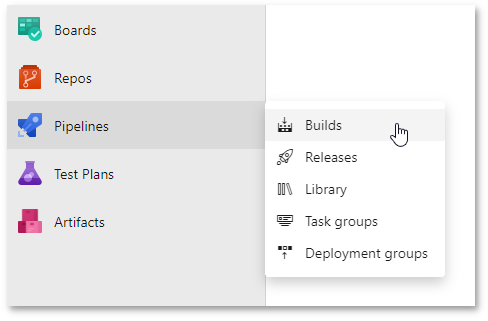

Click the **New** button and select **New build pipeline**.

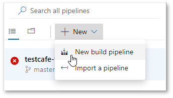

Azure DevOps Server asks you to select the repository that contains your code. Enter the repository details and click **Continue**.

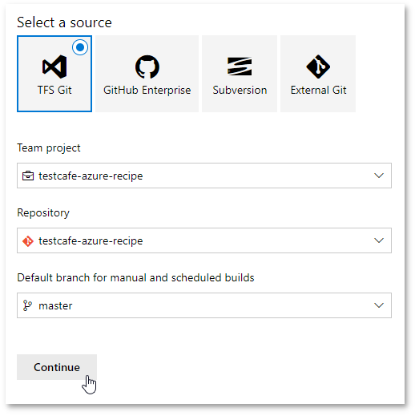

The next screen prompts you to select a build template. Choose to start with an empty job.

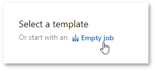

On the next screen, select an [agent pool](https://docs.microsoft.com/en-us/azure/devops/pipelines/agents/pools-queues?view=vsts) to run the job.

> Important! The agent should run on a machine with all the necessary browsers installed.

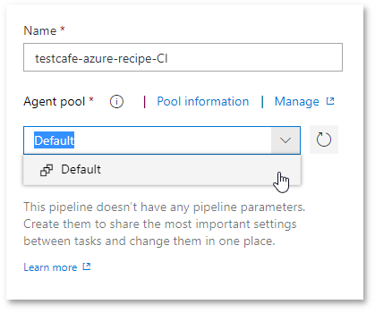

Now you can add tasks to the job. Click the **+** button to create a new task.

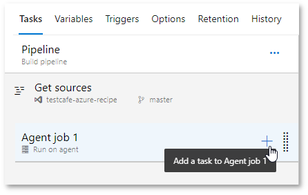

Select **Node Tool Installer** from the task list. This task installs Node.js and adds it to the `PATH` variable.

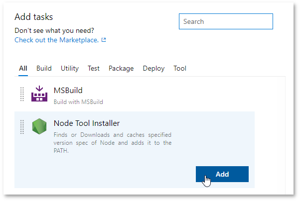

The task is now added to the pipeline. Click its name in the pipeline to enter the task settings.

On the settings screen, specify the Node.js version to install. Use the latest LTS version - it is available on the [Node.js website](https://nodejs.org/en/).

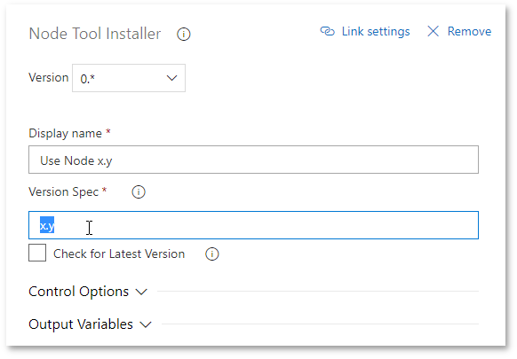

Now add another task that runs a shell command. Click the **+** button again and select **Command Line** from the task list.

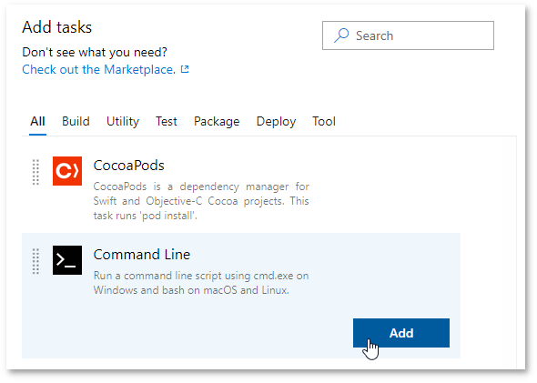

Configure this command to install TestCafe. Open its settings, specify a name and enter the following command:

```cmd
npm install
```

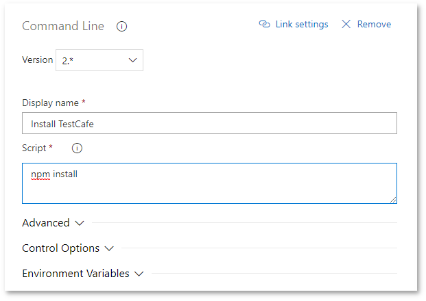

In the same manner, add another **Command Line** task that runs TestCafe tests.

```cmd
npm test
```


Save the changes and run this task using the **Save & queue** button.

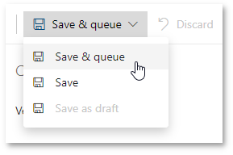

This opens the **Save build pipeline and queue** window. Specify an optional comment that describes the changes you have made. Select an agent pool that runs this task, the repository branch and the commit that contains code to build. You can leave the **Commit** field blank to use the latest commit. Click **Save & queue**.

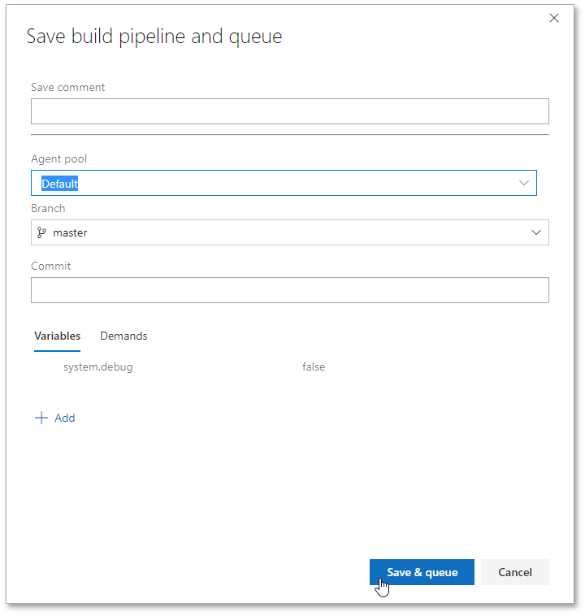

## Step 4 - Run Test Task and View Results

### Option 1 - Enable Continuous Integration

You can enable continuous integration in Azure DevOps to specify that the pipeline is run every time your code changes.

On Azure Pipelines, continuous integration is enabled for every newly created build.

On Azure DevOps Server, select the build and click **Edit**.

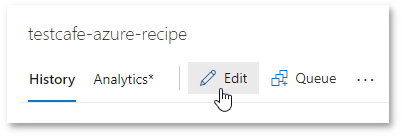

Then open the **Triggers** tab.

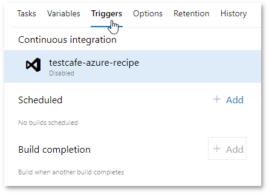

Click the repository name under the **Continuous integration** header and check **Enable continuous integration**.

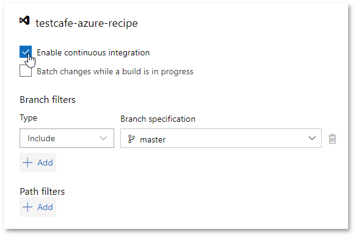

To build a specific branch or path, add **Branch filters** and/or **Path filters**.

Now, changes to code in the repository trigger the build.

### Option 2 - Run the Build Manually

Select the build and click **Queue** to run the build.

On Azure DevOps Server, you can find this button under the build header.

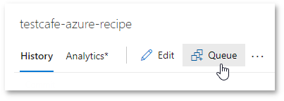

On Azure Pipelines, this button is in the top-right corner.

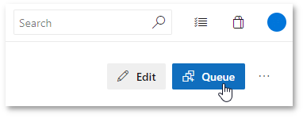

This opens the **Queue build** window. Specify the branch and commit that should be built. You can leave the **Commit** field blank to use the latest commit. On Azure DevOps Server, specify the agent pool that should run the task. Click **Queue**.

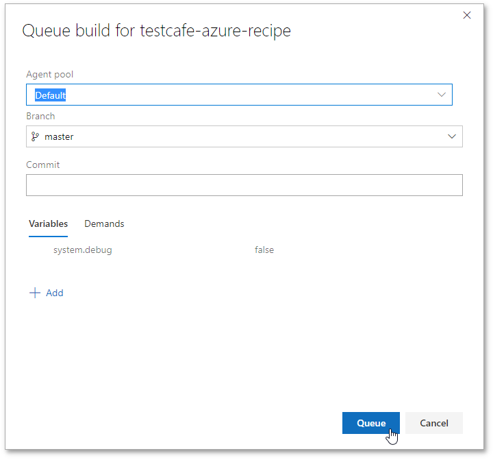

### View Test Results

Select the build and click the commit whose results you want to view.

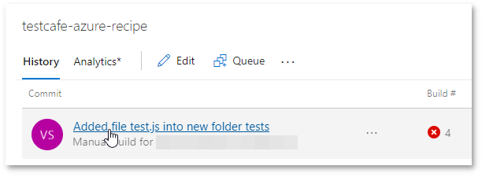

In the detail view, select a task to view its log.

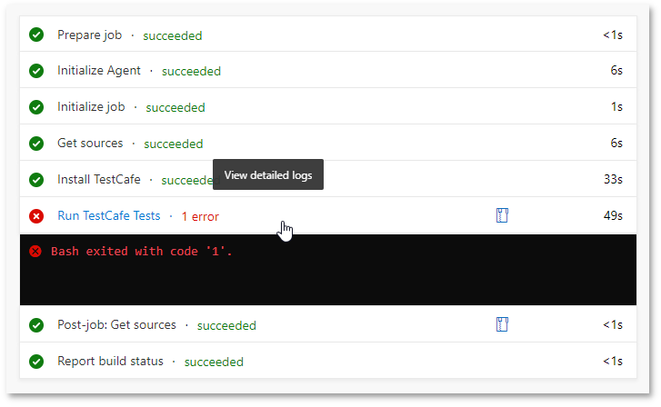

This displays a detailed log that includes a TestCafe report.

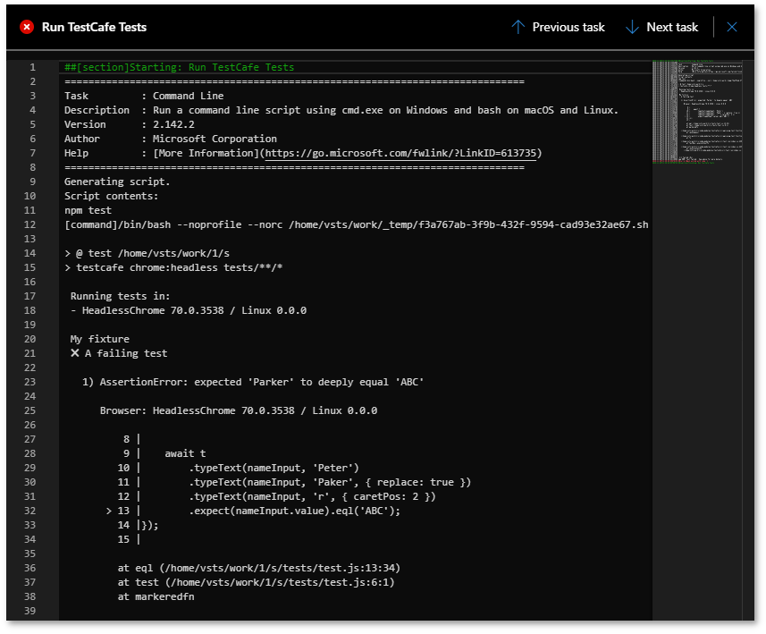