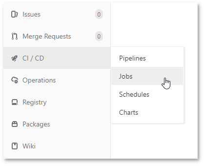
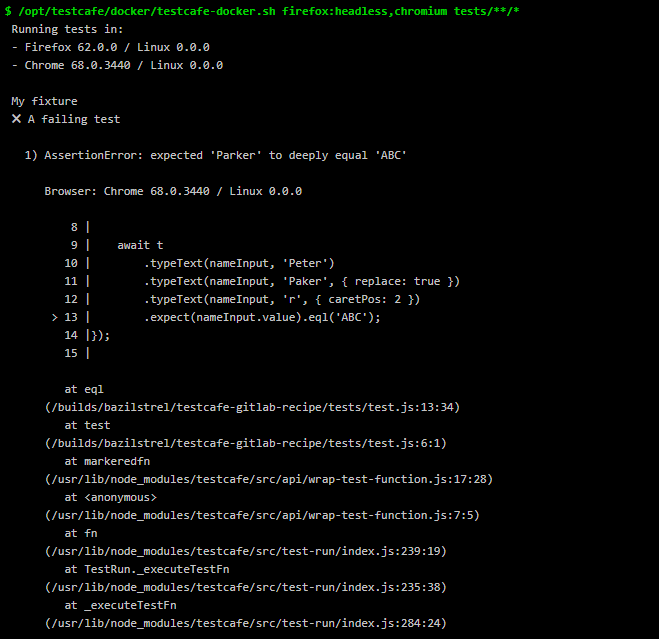

# Integrate TestCafe with GitLab

This topic describes how to integrate TestCafe tests into a [GitLab](https://gitlab.com) project's build process.

GitLab has a built-in continuous integration service. Refer to the [GitLab documentation](https://docs.gitlab.com/ee/ci/quick_start/README.html) for more information.

To run tests with TestCafe, you need a virtual machine with Node.js, TestCafe and browsers. You can [use a TestCafe Docker image](#option-1---use-testcafe-docker-image) with pre-installed software.

However, if you already have a Docker image prepared to deploy your web application and run tests, you can [install TestCafe on this image before testing](#option-2---install-testcafe-on-a-docker-image).

## Option 1 - Use TestCafe Docker Image

Open the `.gitlab-ci.yml` file that stores the GitLab CI configuration. If this file does not exist, create it in the repository's root directory.

Create a new [job](https://docs.gitlab.com/ee/ci/pipelines.html#jobs). To do this, add the following settings to `.gitlab-ci.yml` at the top level:

```yaml
e2e_tests:
  image:
    name: testcafe/testcafe
    entrypoint: ["/bin/sh", "-c"]
  script:
    - /opt/testcafe/docker/testcafe-docker.sh firefox:headless,chromium tests/**/*
```

* `e2e_tests` - the job's name.
* `image` - Docker image settings.
* `name` - the TestCafe image's name. You can find it on [Docker Hub](https://hub.docker.com/r/testcafe/testcafe/).
* `entrypoint` - overrides the image's [ENTRYPOINT](https://docs.docker.com/glossary/?term=ENTRYPOINT) and sets it as `/bin/sh`. You should specify this setting because the TestCafe image's default `ENTRYPOINT` is set to the `testcafe` command and GitLab uses `sh` to run test scripts. The `-c` flag indicates that the subsequent argument is a command rather than a script.
* `script` - the command that runs TestCafe tests. `/opt/testcafe/docker/testcafe-docker.sh` points to a script that prepares the environment to run a browser and starts TestCafe. Its arguments are standard TestCafe [command line parameters](../using-testcafe/command-line-interface.md).

See [Configuration of your jobs with .gitlab-ci.yml](https://docs.gitlab.com/ee/ci/yaml/README.html) for more information about the `.gitlab-ci.yml` syntax.

Commit `.gitlab-ci.yml` and push the changes to the repository. This creates a new [job](https://docs.gitlab.com/ee/ci/pipelines.html#jobs) that any [GitLab Runner](https://docs.gitlab.com/ee/ci/runners/README.html) can execute.

## Option 2 - Install TestCafe on a Docker Image

You can install TestCafe from `npm` before tests are run if you use a Docker image that does not have TestCafe pre-installed.

First, add TestCafe to your project development dependencies. Open the repository root and execute the following command:

```sh
npm install --save-dev testcafe
```

This installs the latest TestCafe version locally and adds it to the `devDependencies` section in the `package.json` file.

```json
{
    "devDependencies": {
        "testcafe": "*"
    }
}
```

The test run command that uses TestCafe should be also added to `package.json` to the `scripts` section because TestCafe is installed locally.

```json
{
    "scripts": {
        "test": "testcafe chrome:headless tests/**/*"
    },

    "devDependencies": {
        "testcafe": "*"
    }
}
```

This allows you to use `npm test` to run tests.

Finally, open `.gitlab-ci.yml` (or create it in the repository root) and add a [job](https://docs.gitlab.com/ee/ci/pipelines.html#jobs) that installs TestCafe and runs tests.

```yaml
e2e_tests:
  # Replace '10.14' with the latest Node.js LTS version
  # available on Docker Hub
  image: circleci/node:10.14-browsers
  before_script:
    - npm install
  script:
    - npm test
```

* `e2e_tests` - the job's name.
* `image` - the Docker image's name. This job uses an image with Node.js and popular browsers provided by [CircleCI](https://circleci.com/). **Replace** `10.14` with the desired Node.js version. You can find the list of available versions on the [image's page](https://hub.docker.com/r/circleci/node/tags/) on Docker Hub.
* `before_script` - defines a command to run before tests start. Install TestCafe at this stage.
* `script` - the command that runs TestCafe tests.

Commit `.gitlab-ci.yml` and `package.json`, then push the changes to the repository.

## View Test Results

Go to your project page. In the right-side panel, hover over the **CI/CD** category and click **Jobs**.



The **Jobs** page displays a list of all recently executed jobs. Click a job's status to view its details.


On the detail page, you can see a job log with the TestCafe report.


