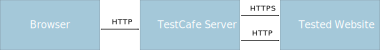

# Test HTTPS Features and HTTP/2 Websites

This topic describes how TestCafe works with HTTPS and HTTP/2 websites.

* [Test HTTPS Websites](#test-https-websites)
* [Test HTTP/2 Websites](#test-http2-websites)

## Test HTTPS Websites

TestCafe is a proxy-based testing tool. The TestCafe [reverse proxy](https://en.wikipedia.org/wiki/Reverse_proxy) serves the tested webpage over HTTP and communicates with the original web server over HTTP or HTTPS (depending on the [specified page URL](../../reference/test-api/fixture/page.md)).



If the tested page does not use HTTPS-specific features (like
[Service Workers](https://developer.mozilla.org/en-US/docs/Web/API/Service_Worker_API),
[Geolocation API](https://developer.mozilla.org/en-US/docs/Web/API/Geolocation_API),
[ApplePaySession](https://developer.apple.com/documentation/apple_pay_on_the_web/applepaysession), or
[SubtleCrypto](https://developer.mozilla.org/en-US/docs/Web/API/SubtleCrypto)), TestCafe successfully proxies it over HTTP. Otherwise, the tests fail because the page throws JavaScript errors, does not load or loads partially. This indicates that you should [configure the proxy server to use HTTPS](#proxy-the-website-over-https).

### Proxy the Website Over HTTPS

When you run tests from the command line, use the [--ssl](../../reference/command-line-interface.md#--ssl-options) flag to enable HTTPS on a proxy server. Specify options required to initialize [a Node.js HTTPS server](https://nodejs.org/api/https.html#https_https_createserver_options_requestlistener) after this flag in a semicolon-separated string. The most commonly used SSL options are described in the [TLS topic](https://nodejs.org/api/tls.html#tls_tls_createsecurecontext_options) in the Node.js documentation.

The example below uses the PFX encoded private key and certificate chain to create an HTTPS server.

```sh
testcafe --ssl pfx=path/to/file.pfx;rejectUnauthorized=true;...
```

When you use the programming interface, pass the HTTPS server options to the [createTestCafe](../../reference/testcafe-api/global/createtestcafe.md) method.

The following example uses the [openssl-self-signed-certificate](https://www.npmjs.com/package/openssl-self-signed-certificate) module to generate a self-signed certificate:

```js
const createTestCafe        = require('testcafe');
const selfSignedSertificate = require('openssl-self-signed-certificate');
let runner                  = null;

const sslOptions = {
    key:  selfSignedSertificate.key,
    cert: selfSignedSertificate.cert
};

createTestCafe('localhost', 1337, 1338, sslOptions)
    .then(testcafe => {
        runner = testcafe.createRunner();
    })
    .then(() => {
        return runner
            .src('test.js')

            // Browsers restrict self-signed certificate usage unless you
            // explicitly set a flag specific to each browser.
            // For Chrome, this is '--allow-insecure-localhost'.
            .browsers('chrome --allow-insecure-localhost')
            .run();
    });
```

## Test HTTP/2 Websites

TestCafe can test an HTTP/2 website only if the server can downgrade the connection to HTTPS or HTTP/1. See [ALPN negotiation](https://nodejs.org/api/http2.html#http2_alpn_negotiation) for details.
