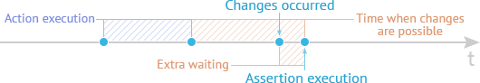

# Assert

You can use *assertions* to check if the tested page's state matches the expected state.

TestCafe provides a comprehensive set of assertions that are based on the Behavior-Driven Development style (BDD-style).

This topic consists of the following sections:

* [Assertion Structure](#assertion-structure)
* [Smart Assertion Query Mechanism](#smart-assertion-query-mechanism)
* [Options](#options)

## Assertion Structure

To construct assertions, use the test controller's [expect](../../reference/test-api/testcontroller/expect/README.md) method.

The [t.expect](../../reference/test-api/testcontroller/expect/README.md) method is followed by an assertion method that accepts an expected value
and optional arguments.

The following example shows the structure of the deep equality assertion:

```text
await t.expect( actual ).eql( expected, message, options );
```

The code snippet below demonstrates how to use assertions in a test:

```js
import { Selector } from 'testcafe';


fixture `Example page`
   .page `http://devexpress.github.io/testcafe/example/`;


test('Check property of element', async t => {
   const developerNameInput = Selector('#developer-name');

   await t
       .expect(developerNameInput.value).eql('', 'input is empty')
       .typeText(developerNameInput, 'Peter Parker')
       .expect(developerNameInput.value).contains('Peter', 'input contains text "Peter"');
});
```

The following assertion methods are available:

* [Deep Equal](../../reference/test-api/testcontroller/expect/eql.md)
* [Not Deep Equal](../../reference/test-api/testcontroller/expect/noteql.md)
* [Ok](../../reference/test-api/testcontroller/expect/ok.md)
* [Not Ok](../../reference/test-api/testcontroller/expect/notok.md)
* [Contains](../../reference/test-api/testcontroller/expect/contains.md)
* [Not Contains](../../reference/test-api/testcontroller/expect/notcontains.md)
* [Type of](../../reference/test-api/testcontroller/expect/typeof.md)
* [Not Type of](../../reference/test-api/testcontroller/expect/nottypeof.md)
* [Greater than](../../reference/test-api/testcontroller/expect/gt.md)
* [Greater than or Equal to](../../reference/test-api/testcontroller/expect/gte.md)
* [Less than](../../reference/test-api/testcontroller/expect/lt.md)
* [Less than or Equal to](../../reference/test-api/testcontroller/expect/lte.md)
* [Within](../../reference/test-api/testcontroller/expect/within.md)
* [Not Within](../../reference/test-api/testcontroller/expect/notwithin.md)
* [Match](../../reference/test-api/testcontroller/expect/match.md)
* [Not Match](../../reference/test-api/testcontroller/expect/notmatch.md)

## Smart Assertion Query Mechanism

In synchronous functional testing, you can execute assertions immediately after test actions.


Functional tests are asynchronous on the web. This means that we cannot get the expected changes immediately after a user's actions.
For example, it can take time for the tested page to send a request to the server for the required data or a user's action to invoke an animation after which the page reaches its final state.
All these intervals cannot be pre-calculated because they depend on various factors: computer performance,
network connection speed, etc. In this case, if we perform assertions immediately after the test action, we can get an inconclusive result.


An additional timeout is usually added when performing asynchronous functional tests.



To stabilize asynchronous functional tests, you need to add a timeout that allows changes to be applied.
Note that adding a timeout can increase the test's duration.

TestCafe uses the smart assertion query mechanism if the assertion receives a [Selector's DOM node state property](select-page-elements.md#define-assertion-actual-value)
or [client function](obtain-client-side-info.md) promise
as an `actual` value:
if an assertion did not pass, the test does not fail immediately. The assertion retries to pass multiple times, and
each time it requests the `actual` property value. The test fails if the assertion could not complete successfully
within a timeout:


**Example:**

The following web page is an example:

```html
<div id="btn"></div>
<script>
var btn = document.getElementById('btn');

btn.addEventListener('click', function() {
    window.setTimeout(function() {
        btn.innerText = 'Loading...';
    }, 100);
});
</script>
```

Test code for this page can be as follows.

```js
test('Button click', async t => {
    const btn = Selector('#btn');

    await t
        .click(btn)
        // A regular assertion fails immediately, but TestCafe retries to run DOM state
        // assertions many times within the timeout until this assertion passes successfully.
        // The default timeout is 3000 ms.
        .expect(btn.textContent).contains('Loading...');
});
```

The approach described above allows you to create stable tests with fast runtime and reduces the risk of errors.

You can specify the assertion query timeout in test code with the [options.timeout](#options) option.
To set the timeout when you launch tests, pass the timeout value to the [runner.run](../../reference/testcafe-api/runner/run.md)
method if you use API or specify the [assertion-timeout](../../reference/command-line-interface.md#--assertion-timeout-ms) option
if you run TestCafe from the command line.

## Options

### options.timeout



### options.allowUnawaitedPromise


