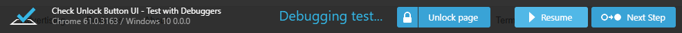

# Debug

TestCafe allows you to debug server-side test code and test behavior on the client.

* [Debug Test Code](#debug-test-code)
* [Client-Side Debugging](#client-side-debugging)
* [Options Useful for Debugging](#options-useful-for-debugging)

## Debug Test Code

You can debug test code in Chrome Developer Tools and popular IDEs. See the following recipes for details.

* [Debug in Chrome Developer Tools](../../recipes/debug-tests/chrome-dev-tools.md)
* [Debug in Visual Studio Code](../../recipes/debug-tests/visual-studio-code.md)
* [Debug in WebStorm](../../recipes/debug-tests/webstorm.md)

## Client-Side Debugging

TestCafe provides the [t.debug](../../reference/test-api/testcontroller/debug.md) method that pauses the test and allows you to debug it with the browser's developer tools.

You can also use the [--debug-mode](../../reference/command-line-interface.md#-d---debug-mode)
command line option to pause the test before the first action or assertion.

The footer displays buttons that allow you to continue the test, or skip to the next test action or assertion.



> The debugger does not stop at creating and resolving the [selectors](select-page-elements.md) and [client functions](obtain-client-side-info.md).

TestCafe logs points in code where the debugger stopped.


**Example**

```js
fixture `Debugger example`
    .page `http://devexpress.github.io/testcafe/example/`;

test('Debugger', async t => {
    await t
        .debug()
        .setNativeDialogHandler(() => true)
        .click('#populate')
        .click('#submit-button');
});
```

## Options Useful for Debugging

TestCafe includes features that help you locate the cause of issues in your tests.

### Screenshots

You can specify that a screenshot should be taken in a particular place in a test using the [t.takeScreenshot](../../reference/test-api/testcontroller/takescreenshot.md) action.

```js
fixture `My fixture`
    .page `https://devexpress.github.io/testcafe/example`;


test('My test', async t => {
    await t
        .setNativeDialogHandler(() => true)
        .takeScreenshot('./screenshots')
        .click('#populate')
        .takeScreenshot('./screenshots')
        .click('#submit-button');
});
```

You can also specify the [takeOnFails](../../reference/command-line-interface.md#takeonfails) option to automatically take a screenshot when a test fails.

```sh
testcafe chrome ./my-tests --screenshots path=./screenshots,takeOnFails=true
```

Analyzing these screenshots reduces debugging time and allows you to determine the reason of issues earlier.

### Test Speed

TestCafe provides the capability to change test speed. Tests are executed at full speed with minimum delays between actions and assertions, which can make it hard to identify problems when a test is running.

To slow down the test, use the [--speed](../../reference/command-line-interface.md#--speed-factor)
CLI flag. You can use values from `1` to `0.01`.

```sh
testcafe chrome ./my-tests --speed 0.1
```

When tests run slower, you can monitor test execution and notice when the test's behavior differs from what is expected.
