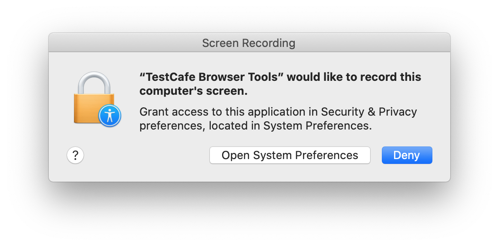
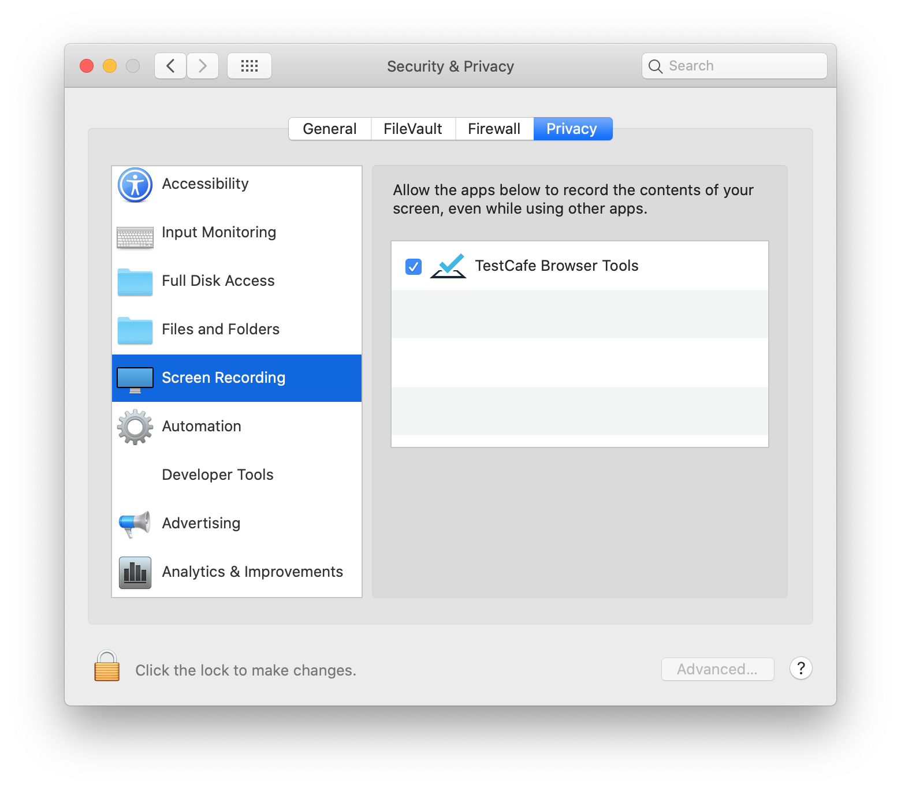

# Install TestCafe

You can install TestCafe from `npm` globally or locally in your project.

[Global installation](#global-installation) is required to run TestCafe in the [command line](../../reference/command-line-interface.md) from any location. For instance, you need to install TestCafe globally to execute the `testcafe` command from your custom application.

> You can use `npx`, `yarn run` or the `npm` scripts to run the `testcafe` command from the project directory without global installation.

[Local installation](#local-installation) should be preferred for continuous integration systems, Node.js applications and other scenarios where global installation is not required.

* Local installation makes your project setup easier: `npm install` executed in the project directory installs all dependencies including TestCafe.
* Different projects can use different local TestCafe versions.

You can also run TestCafe [without prior installation](#ad-hoc-installation). However, this is not recommended for regular use.

## Global Installation

```bash
npm install -g testcafe
```

After that, use the [testcafe](../../reference/command-line-interface.md) command to run TestCafe from the command line.

```bash
testcafe chrome tests/
```

## Local Installation

The following command installs TestCafe into your project directory and saves it on the dependencies list.

```bash
npm install --save-dev testcafe
```

To run a local TestCafe version from the [command line](../../reference/command-line-interface.md), use one of the following methods:

* the [npx](https://www.npmjs.com/package/npx) command:

    ```sh
    npx testcafe chrome tests/
    ```

* the [yarn run](https://yarnpkg.com/lang/en/docs/cli/run/) command:

    ```sh
    yarn run testcafe chrome tests/
    ```

* [npm scripts](https://docs.npmjs.com/misc/scripts) - add the `testcafe` command to the `scripts` section in `package.json`:

    ```json
    "scripts": {
        "test": "testcafe chrome tests/"
    }
    ```

    Then use `npm test` to run the specified TestCafe command:

    ```sh
    npm test
    ```

* If TestCafe is installed both locally and globally, the `testcafe` command runs the local version:

    ```bash
    testcafe chrome tests/
    ```

## Ad Hoc Installation

The [npx](https://www.npmjs.com/package/npx) utility installs all modules required to run the specified command if these modules are not installed globally or in the local project.

Use `npx testcafe` if you need to quickly run TestCafe from a directory outside of the project. However, this approach is not recommended for regular use.

```sh
npx testcafe chrome tests/
```

## Screen Recording Permission

TestCafe requires screen recording permission on macOS (v10.15 Catalina and newer) to perform test actions, take screenshots and record videos. When TestCafe starts the first time, macOS asks you to allow screen recording for *TestCafe Browser Tools*.



Click **Open System Preferences** and check **TestCafe Browser Tools** to grant permission.

When you update TestCafe, macOS may reset its security permissions (it depends on which TestCafe components are updated). In this case, the system repeats the request the next time you run tests. When the **Security and Privacy** dialog opens, uncheck the **TestCafe Browser Tools** check box and check it again.


