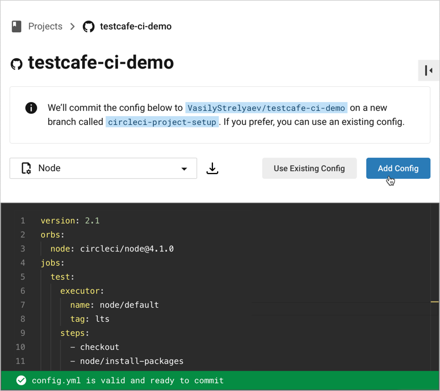
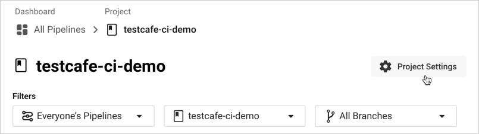
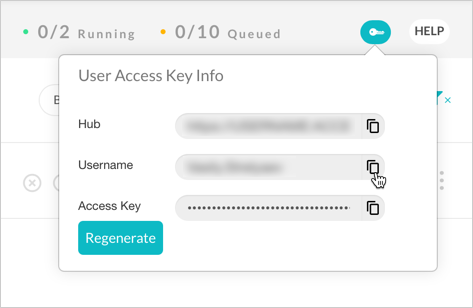
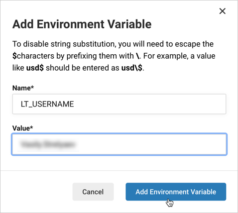
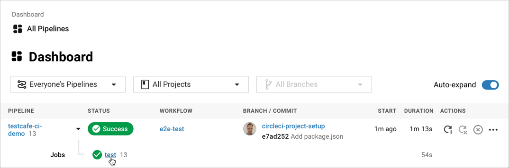
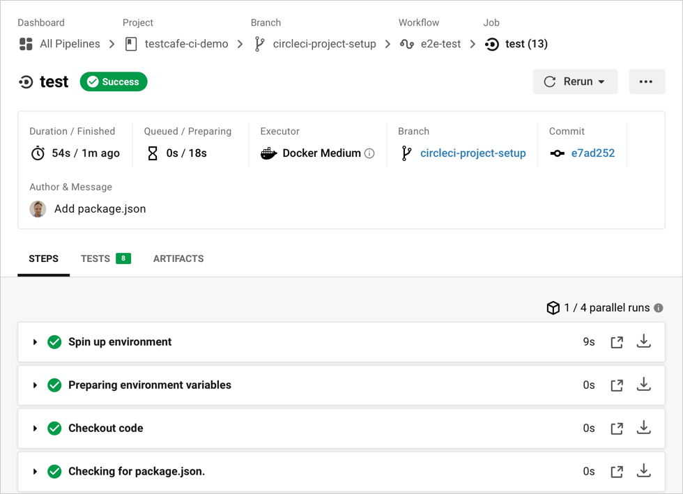

# Run Tests on LambdaTest with CircleCI

This topic describes how to integrate TestCafe into the [CircleCI](https://circleci.com/) build process and run tests in the [LambdaTest](https://www.lambdatest.com) cloud testing service.

## Prerequisites

In this tutorial, we will fetch tests from a GitHub repository: [testcafe-ci-demo](https://github.com/DevExpress-Examples/testcafe-ci-demo). Fork this repository before we start.

> If you use a different version control system, make sure CircleCI supports it. To learn which systems it supports, refer to the [CircleCI Integrations](https://circleci.com/integrations/) page.

## Step 1 - Install TestCafe and Create Tests

Install TestCafe [locally](../basic-guides/install-testcafe.md#local-installation) in your project and [create tests](../../getting-started/README.md#creating-a-test).

## Step 2 - Create a New CircleCI Project

Log in to CircleCI using your GitHub account.

If this is the first time you are using CircleCI, you will start from an empty workspace. Click the **Add Project** button to create your first project.


You will see the list of GitHub projects associated with your account.

Find `testcafe-ci-demo` and click **Set Up project**.


## Step 3 - Configure the Build

On the project configuration page, open a drop-down list and select **Node** as the target platform. Paste the following configuration:

```yaml
version: 2.1
orbs:
  node: circleci/node@4.1.0
jobs:
  test:
    executor:
      name: node/default
      tag: lts
    steps:
      - checkout
      - node/install-packages
      - run:
          command: npm run test
      - store_test_results:
          path: /tmp/test-results
workflows:
  e2e-test:
    jobs:
      - test
```

The following table describes the YAML properties used in this example:

Property                | Description
----------------------- | ----
`version`               | The CircleCI version that should be used for this project.
`orbs`                  | Imports CircleCI [orbs](https://circleci.com/docs/2.0/orb-intro/) – reusable parts of build configurations stored in a CircleCI registry.
`node`                  | Imports the [circleci/node](https://circleci.com/developer/orbs/orb/circleci/node) orb v4.1.0 under the name `node`.
`jobs`                  | The section that specifies [jobs](https://circleci.com/docs/2.0/jobs-steps/#jobs-overview).
`test`                  | The job's name.
`executor`              | An [executor](https://circleci.com/docs/2.0/configuration-reference/#executors-requires-version-21) that defines the environment in which this job runs. This example uses the default executor from the `node` orb. The `tag` property specifies that the LTS version of Node.js should be used.
`steps`                 | The job's [steps](https://circleci.com/docs/2.0/jobs-steps/#steps-overview).
`checkout`              | Checks out code from the `testcafe-ci-demo` repository. This is a pre-defined step (see [checkout](https://circleci.com/docs/2.0/configuration-reference/#checkout)).
`node/install-packages` | A step from the `node` orb that installs the project's dependencies (see [install-packages](https://circleci.com/developer/orbs/orb/circleci/node#commands-install-packages)).
`run`                   | The [run](https://circleci.com/docs/2.0/configuration-reference/#run) step invokes shell commands. In this example, `run` executes the `npm test` script.
`store_test_results`    | Uploads test results to the specified directory (see [store_test_results](https://circleci.com/docs/2.0/configuration-reference/#store_test_results)).
`workflows`             | A [workflow](https://circleci.com/docs/2.0/workflows/) that runs the `test` job.

After you pasted the YAML, click **Add Config**.



## Step 4 - Specify LambdaTest Credentials

CircleCI allows you to assign sensitive information, like user credentials or access keys, to the CI project so that you do not keep secret values in the repository.

Open the **Dashboard** view and select the `testcafe-ci-demo` project from the drop-down list:


Click **Project Settings**:



Open the **Environment Variables** category and click **Add Environment Variable**:


In a separate browser tab or window, open the [LambdaTest app](https://www.lambdatest.com/) and click **Automation** in the navigation bar:


Click  to display the access key info. Copy the *username*:



In CircleCI, enter `LT_USERNAME` as the variable name, paste the copied value below, and click **Add Environment Variable**:



In the same manner, copy the *access key* from LambdaTest and create the `LT_ACCESS_KEY` environment variable in CircleCI to store this key.

## Step 5 - Install the LambdaTest Browser Provider and JUnit XML Reporter

Install the following npm packages locally in your project directory:

* [testcafe-browser-provider-lambdatest](https://www.npmjs.com/package/testcafe-browser-provider-lambdatest) – the LambdaTest browser provider that enables TestCafe to run tests in the LambdaTest cloud,
* [testcafe-reporter-xunit](https://www.npmjs.com/package/testcafe-reporter-xunit) – the JUnit XML reporter that generates test run reports in the XML format. CircleCI can process XML reports and display test results in the UI.

Run the following command to install both packages:

```sh
npm install --save-dev testcafe-browser-provider-lambdatest testcafe-reporter-xunit
```

Commit the `package-lock.json` file generated by npm into the repository and push the changes. This file allows CircleCI to use a fast `npm ci` command to install the dependencies.

## Step 6 - Add the `test` script to package.json

To specify how CircleCI should launch TestCafe, add the `test` script to the project's `package.json` file. Use the `testcafe` command in the script to run tests on LambdaTest.

```json
"scripts": {
  "test": "testcafe \"lambdatest:Chrome@85.0:Windows 10\" tests/**/* -r xunit:/tmp/test-results/res.xml"
}
```

After you install the dependencies and specify the `test` script, `package.json` should look as follows:

```json
{
  "scripts": {
    "test": "testcafe \"lambdatest:Chrome@85.0:Windows 10\" tests/**/* -r xunit:/tmp/test-results/res.xml"
  },
  "devDependencies": {
    "testcafe": "*",
    "testcafe-reporter-xunit": "*",
    "testcafe-browser-provider-lambdatest": "*"
  }
}
```

For more information on how to configure a test run with the `testcafe` command, see [Command Line Interface](../../reference/command-line-interface.md).

## Step 7 - View Test Results

Once you commit the `package.json` changes in the previous step, the build is triggered and the CircleCI Dashboard shows the results in the pipeline.

Click the job name to see the details.



The job view displays information about the completed job including the run duration, latest commit, and build log:


