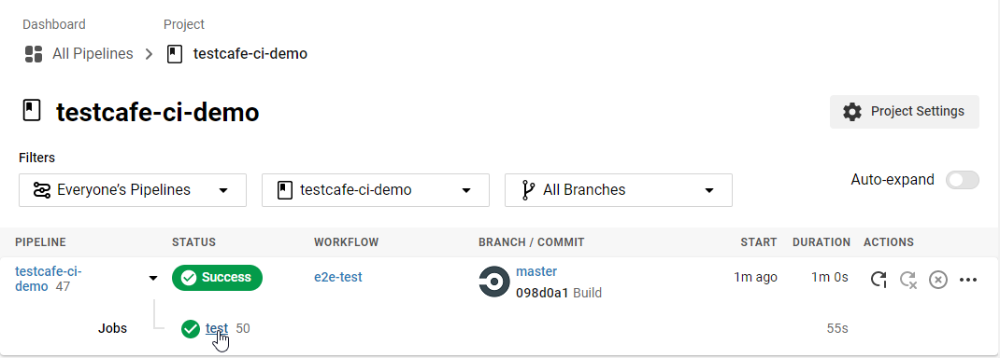
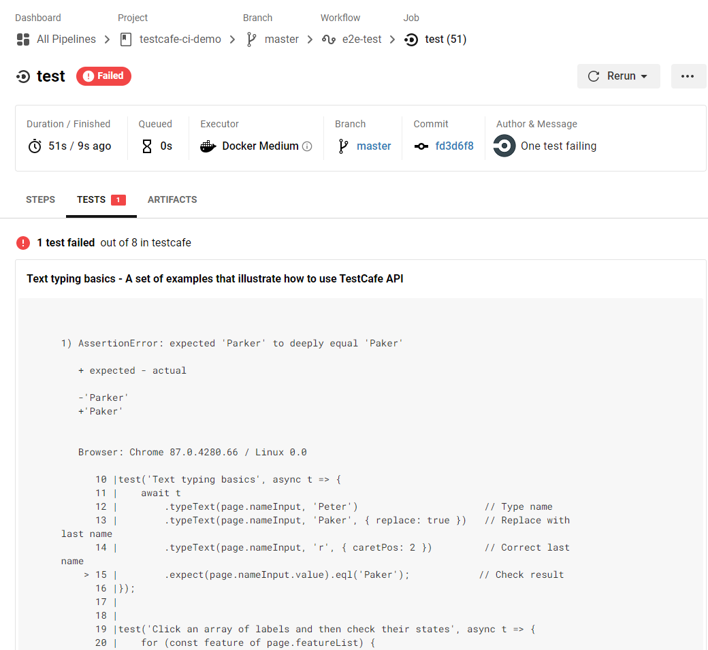

# Integrate TestCafe With CircleCI

This topic describes how to integrate TestCafe tests into a [CircleCI](https://circleci.com/) project.

* [Prerequisites](#prerequisites)
* [Step 1 - Install TestCafe and Create Tests](#step-1---install-testcafe-and-create-tests)
* [Step 2 - Create a New CircleCI Project](#step-2---create-a-new-circleci-project)
* [Step 3 - Configure the Build](#step-3---configure-the-build)
* [Step 4 - Add the Test Script to package.json](#step-4---add-the-test-script-to-packagejson)
* [Step 5 - View Test Results](#step-5---view-test-results)
* [Use Alternative Images](#use-alternative-images)
  * [Use a TestCafe Image](#use-a-testcafe-image)
  * [Use a Legacy CircleCI Image](#use-a-legacy-circleci-image)

## Prerequisites

In this tutorial, you fetch tests from a GitHub repository: [testcafe-ci-demo](https://github.com/DevExpress-Examples/testcafe-ci-demo). Fork this repository before you begin.

> If you use a different version control system, make sure it supports CircleCI. For information on which systems you can use, refer to the [CircleCI Integrations](https://circleci.com/integrations/) page.

## Step 1 - Install TestCafe and Create Tests

To run TestCafe, [install it locally](../basic-guides/install-testcafe.md#local-installation) in your project and [create tests](../../getting-started/README.md#creating-a-test).

To see test results in the CircleCI UI, install the [testcafe-reporter-xunit](https://www.npmjs.com/package/testcafe-reporter-xunit) npm package.
This JUnit reporter generates test run reports in XML format. CircleCI can process XML reports and display test results in the UI.

For more information about reporters, see [Reporters](../concepts/reporters.md).

Run the following command to install the packages locally in your project directory:

```sh
npm install --save-dev testcafe testcafe-reporter-xunit
```

Commit the `package-lock.json` file generated by npm to the repository. This file allows CircleCI to use a fast `npm ci` command to install the dependencies.

## Step 2 - Create a New CircleCI Project

Log into CircleCI with your GitHub account.

If this is the first time you use CircleCI, you will start from an empty workspace. Click the **Add Project** button to create your first project.


Find `testcafe-ci-demo` and click **Set Up project**.


## Step 3 - Configure the Build

On the project configuration page, select **Node** as the target platform and paste the following configuration:

```yaml
version: 2.1
orbs:
  node: circleci/node@4.1.0
  browser-tools: circleci/browser-tools@1.1.0
jobs:
  test:
    docker:
      - image: cimg/node:lts-browsers
    steps:
      - checkout
      - browser-tools/install-browser-tools
      - node/install-packages
      - run:
          command: npm run test
      - store_test_results:
          path: /tmp/test-results
workflows:
  e2e-test:
    jobs:
      - test
```

The table below describes the YAML properties used in this example:

Property                | Description
----------------------- | ----
`version`               | The CircleCI version that should be used for this project.
`orbs`                  | Imports CircleCI [orbs](https://circleci.com/docs/2.0/orb-intro/)–reusable parts of build configurations stored in a CircleCI registry.
`node`                  | Imports the [circleci/node](https://circleci.com/developer/orbs/orb/circleci/node) orb v4.1.0 under `node`.
`browser-tools`         | Imports the [circleci/browser-tools](https://circleci.com/developer/orbs/orb/circleci/browser-tools) orb v1.1.0 under `browser-tools`.
`jobs`                  | The section that specifies [jobs](https://circleci.com/docs/2.0/jobs-steps/#jobs-overview).
`test`                  | The job's name.
`docker`                | An [executor](https://circleci.com/docs/2.0/configuration-reference/#docker--machine--macos--windows-executor) that defines the environment in which this job runs. The `docker` executor specifies that the job should run inside a docker container.
`image`                 | Specifies the docker image to use. `cimg/node:lts-browsers` is a pre-built CircleCI docker image that includes the `lts` version of Node.js and browser dependencies. For a list of available images, see [Pre-Built CircleCI Docker Images](https://circleci.com/developer/images/image/cimg/node).
`steps`                 | The job's [steps](https://circleci.com/docs/2.0/jobs-steps/#steps-overview).
`checkout`              | Checks out code from the `testcafe-ci-demo` repository. This is a pre-defined step (see [checkout](https://circleci.com/docs/2.0/configuration-reference/#checkout)).
`browser-tools/install-browser-tools` | A step from the `browser-tools` orb that installs browsers and browser drivers on the machine. This step installs Chrome, Firefox, ChromeDriver, and GeckoDriver.
`node/install-packages` | A step from the `node` orb that installs the project's dependencies (see [install-packages](https://circleci.com/developer/orbs/orb/circleci/node)).
`run`                   | The [run](https://circleci.com/docs/2.0/configuration-reference/#run) step invokes shell commands. In this example, `run` executes the `npm test` script.
`store_test_results`    | Uploads test results to the specified directory (see [store_test_results](https://circleci.com/docs/2.0/configuration-reference/#store_test_results)).
`workflows`             | A [workflow](https://circleci.com/docs/2.0/workflows/) that runs the `test` job.

After you paste the YAML, click **Add Config**.


This config is commited to the new `circleci-project-setup` branch. Merge this file into your working branch.

```sh
git checkout master
git pull
git merge origin/circleci-project-setup
```

## Step 4 - Add the Test Script to package.json

To specify how CircleCI should launch TestCafe, add the `test` script to the project's `package.json` file. Use the `testcafe` command in the script to run tests in Chrome in the headless mode. Add the `-r` flag to use the JUnit XML reporter.

```json
"scripts": {
  "test": "testcafe chrome:headless tests/**/* -r xunit:/tmp/test-results/testcafe/results.xml"
}
```

After you install the dependencies and specify the `test` script, `package.json` should look as follows:

```json
{
  "scripts": {
    "test": "testcafe chrome:headless tests/**/* -r xunit:/tmp/test-results/testcafe/results.xml"
  },
  "devDependencies": {
    "testcafe": "*",
    "testcafe-reporter-xunit": "*"
  }
}
```

For more information on how to configure a test run with the `testcafe` command, see [Command Line Interface](../../reference/command-line-interface.md).

## Step 5 - View Test Results

Commit the changes to trigger the build. CircleCI Dashboard shows the results in the pipeline.

Click the job name to show the details.



The `Steps` panel displays information about the completed job including the run duration, latest commit, and build log:


The `Tests` panel displays test results. If errors occur, the report is shown.



## Use Alternative Images

This guide uses the `cimg/node:lts-browsers`, an official CircleCI Docker image that includes the `lts` version of Node.js and browser dependencies. This image is in beta. If you encounter issues, use one of the images listed below.

### Use a TestCafe Image

TestCafe is available as a part of a preconfigured Docker image. The image includes TestCafe, Chromium, and Firefox.

To use this image, paste the following contents in your `config.yml` on [Step 3](#step-3---configure-the-build):

```yml
version: 2.1
orbs:
  node: circleci/node@4.1.0
jobs:
  test:
    docker:
      - image: testcafe/testcafe:latest
    steps:
      - checkout
      - node/install-packages
      - run:
          command: npm run test
      - store_test_results:
          path: /tmp/test-results
workflows:
  e2e-test:
    jobs:
      - test
```

This image does not have Google Chrome. To run tests in Chromium instead, paste the following code in your `package.json` on [Step 4](#step-4---add-the-test-script-to-packagejson):

```json
  "scripts": {
    "test": "testcafe chromium:headless, firefox:headless tests/**/* -r xunit:/tmp/test-results/testcafe/results.xml"
  }
```

For more information about TestCafe Docker image, read [Use TestCafe Docker Image](../advanced-guides/use-testcafe-docker-image.md).

### Use a Legacy CircleCI Image

The following example uses `circleci/node:lts-browsers`, a legacy image with `lts` version of Node.js, Google Chrome, and Firefox:

A full list of legacy CircleCI images are available at [Pre-Built CircleCI Docker Images](https://circleci.com/docs/2.0/circleci-images/#legacy-language-images).

To use the legacy image, paste the following `config.yml` on [Step 3](#step-3---configure-the-build):

```yml
version: 2.1
orbs:
  node: circleci/node@4.1.0
jobs:
  test:
    docker:
      - image: circleci/node:lts-browsers
    steps:
      - checkout
      - node/install-packages
      - run:
          command: npm run test
      - store_test_results:
          path: /tmp/test-results
workflows:
  e2e-test:
    jobs:
      - test
```

Since this image has Chrome and Firefox installed, add the following command to the `package.json` file on [Step 4](#step-4---add-the-test-script-to-packagejson) to run tests in these browsers:

```json
"scripts": {
  "test": "testcafe chrome:headless, firefox:headless tests/**/* -r xunit:/tmp/test-results/testcafe/results.xml"
}
```
