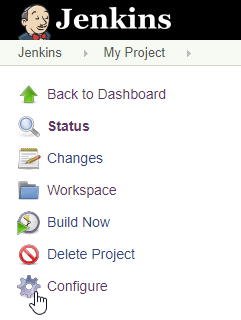
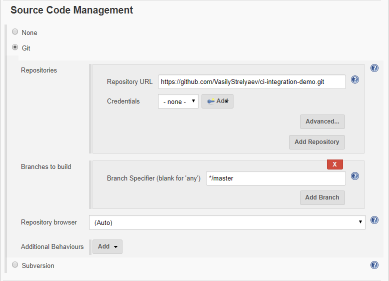
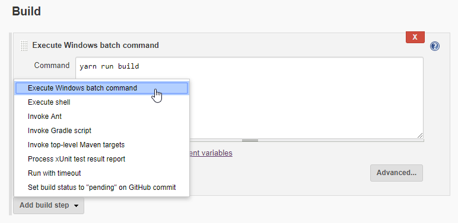
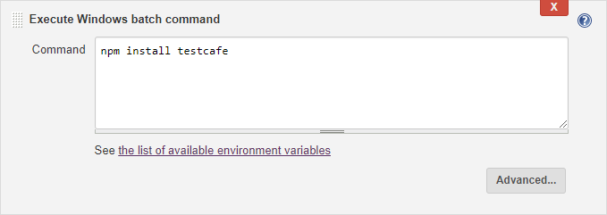
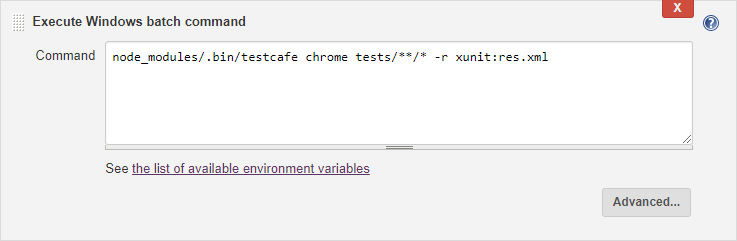
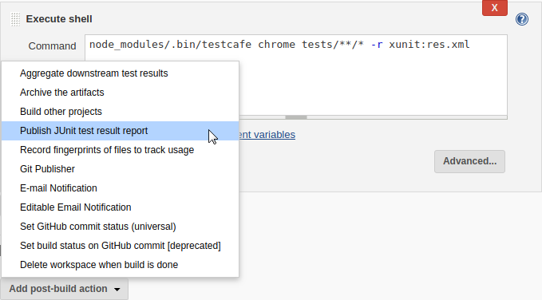
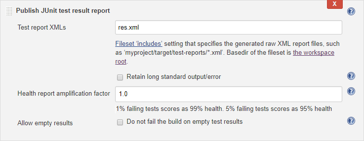
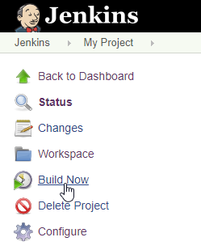
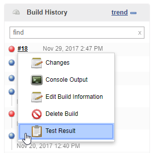
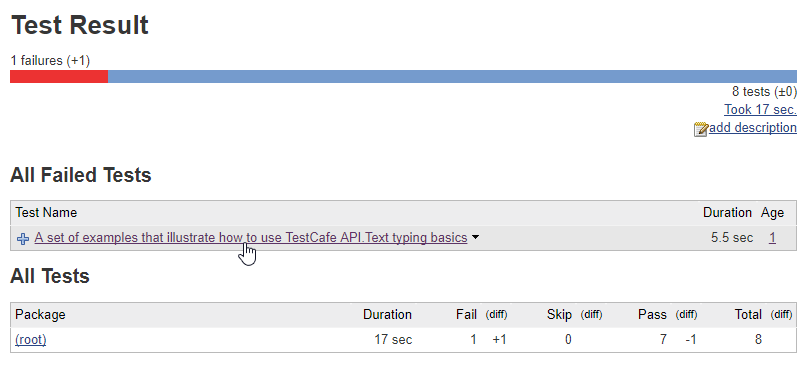

# Integrate TestCafe with Jenkins

TestCafe has an extensive command line interface that allows it to fit well in any popular continuous integration system.

This topic shows how you can integrate TestCafe tests into project build process in [Jenkins](https://jenkins.io/).

## Enable Jenkins to Start the Browser UI (macOS and Linux)

The default Jenkins configuration on macOS and Linux does not allow the CI system to start the local browser's UI. This section describes how to give Jenkins these permissions.

You can skip these steps if you use [headless browsers](../concepts/browsers.md#test-in-headless-mode), [cloud testing services](../concepts/browsers.md#browsers-in-cloud-testing-services) or the [Xvfb server](#configure-the-display-server-linux) (on Linux).

> Important! The Jenkins installer overwrites permission settings during upgrade. Download and replace `jenkins.war` to upgrade Jenkins, or repeat the steps below after you run the installer.

### Obtain Permissions on macOS

1. Stop Jenkins:

    ```sh
    launchctl unload /Library/LaunchDaemons/org.jenkins-ci.plist
    ```

2. Open the `org.jenkins-ci.plist` file in a text editor:

    ```sh
    sudo nano /Library/LaunchDaemons/org.jenkins-ci.plist
    ```

3. Find the `USER_NAME` option and change its value to the username under whose account macOS is started:

    ```xml
    <key>USER_NAME</key>
    <string>peter.p</string>
    ```

4. Find the `JENKINS_HOME` key that specifies the Jenkins home directory. Copy the directory content to a local user's directory and specify the new path under the `JENKINS_HOME` key:

    ```xml
    <key>JENKINS_HOME</key>
    <string>/users/peter.p/jenkins/</string>
    ```

    Close the file and save your changes.

5. Change the Jenkins temporary directory:

    ```sh
    sudo defaults write /Library/Preferences/org.jenkins-ci tmpdir "/tmp"
    ```

6. Change the `/var/log/jenkins` file ownership to your account:

    ```sh
    sudo chown peter.p /var/log/jenkins
    ```

7. Start Jenkins:

    ```sh
    launchctl load /Library/LaunchDaemons/org.jenkins-ci.plist
    ```

### Obtain Permissions on Linux

1. Stop Jenkins:

    ```sh
    sudo systemctl stop jenkins.service
    ```

2. Open the `/etc/default/jenkins` file in a text editor:

    ```sh
    sudo nano /etc/default/jenkins
    ```

3. Specify your username in the `JENKINS_USER` variable:

    ```text
    JENKINS_USER=peter.p
    ```

    Then close the file and save your changes.

4. Change the Jenkins directory ownership to your account:

    ```sh
    sudo chown peter.p /var/log/jenkins
    sudo chown peter.p /var/lib/jenkins
    sudo chown peter.p /var/run/jenkins
    sudo chown peter.p /var/cache/jenkins
    ```

5. Start Jenkins:

    ```sh
    sudo systemctl start jenkins.service
    ```

## Step 1 - Install Node.js Plugin

1. Follow the [instructions from Jenkins documentation](https://www.jenkins.io/doc/book/managing/plugins/#installing-a-plugin) to install a [Node.js plugin](https://plugins.jenkins.io/nodejs/).

2. Configure this plugin as described in the [Usage section](https://plugins.jenkins.io/nodejs/#NodeJSPlugin-Usage) on the plugin page. Ensure that you have added a Node.js installation on the **Global Tool Configuration** page and checked the **Provide Node & npm bin/ folder to PATH** checkbox in your build configuration.

## Step 2 - Fetch Test Code From a Repository

This tutorial uses tests published in the [testcafe-ci-demo](https://github.com/DevExpress-Examples/testcafe-ci-demo) GitHub repository. Fork it before you start.

> You can find plugins for other source control systems on the [Jenkins Plugins](https://plugins.jenkins.io/) website in the **Source code management** category.

Open your project and choose **Configure** from the right pane.



Scroll down to the **Source Code Management** section and select *Git*, then specify the **Repository URL**.



## Step 3 - Add a Command to Install TestCafe

Go to the **Build** section, find a step that builds your application and add a new step after it. To do this, click **Add build step** and select **Execute shell** for macOS and Linux, or **Execute Windows batch command** for Windows.



In the **Command** box, type the following.

```sh
npm install testcafe testcafe-reporter-xunit
```

This command installs the main `testcafe` module and a plugin that saves test run reports in the xUnit format.



## Step 4 - Add a Command to Run TestCafe

Add another step that executes a shell command and enter:

```sh
node_modules/.bin/testcafe chrome tests/**/* -r xunit:res.xml
```

This runs TestCafe tests from the `tests` directory in Google Chrome. Test results are saved to the `res.xml` file in the xUnit format.



### Configure the Display Server (Linux)

> Skip this step if you use [headless browsers](../concepts/browsers.md#test-in-headless-mode) or [cloud testing services](../concepts/browsers.md#browsers-in-cloud-testing-services).

If you run Jenkins on a Linux machine and [test in local browsers in the UI mode](#enable-jenkins-to-start-the-browser-ui-macos-and-linux), set the `DISPLAY` environment variable to `1` before the `testcafe` command:

```sh
export DISPLAY=:1
node_modules/.bin/testcafe chrome tests/**/* -r xunit:res.xml
```

Alternatively, you can use the [Xvfb server](https://www.x.org/archive/X11R7.6/doc/man/man1/Xvfb.1.xhtml):

```sh
export DISPLAY=:99.0
sh -e /etc/init.d/xvfb start
sleep 3
fluxbox >/dev/null 2>&1 &
node_modules/.bin/testcafe chrome tests/**/* -r xunit:res.xml
```

## Step 5 - Publish Test Run Reports

Go to the **Post-build Actions** section and click **Add post-build action**. Select **Publish JUnit test result report** from the drop-down list.



Enter `res.xml` in the **Test report XMLs** field.



## Step 6 - Run the Test

Click **Save** to save changes and navigate to the **Project** page.

Click **Build Now** to build the project.



## Step 7 - View Test Results

Find a build in the **Build History** section and select **Test Results** from the drop-down menu.



Jenkins displays a test run report with overall results. Click the test name for information about a specific test.


