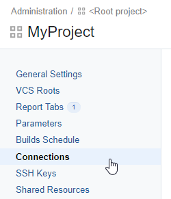
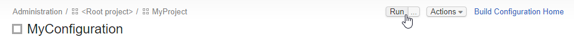

# Integrate TestCafe with TeamCity

TestCafe is easy to set up with most modern CI systems.

This topic describes how to use TestCafe with [TeamCity](http://www.jetbrains.com/teamcity/).

## Prerequisites

* Before starting this tutorial, install TestCafe and the TeamCity reporter plugin.

    ```sh
    npm install -g testcafe testcafe-reporter-teamcity
    ```

    The `testcafe-reporter-teamcity` plugin enables TestCafe to output test run results in the TeamCity format. The reports will be presented in the TeamCity UI allowing you to analyze the results with its built-in features.

* We will fetch test code from a GitHub repository: [testcafe-ci-demo](https://github.com/DevExpress-Examples/testcafe-ci-demo). Fork it before starting.
  
    If you use a different version control system, make sure TeamCity supports it. You can find a list of supported VCS in the [TeamCity documentation](http://confluence.jetbrains.com/display/TCD10/TeamCity+Documentation).

## Adding a Build Step that Runs TestCafe

Create a new build configuration or open an existing one as described in the [TeamCity documentation](https://confluence.jetbrains.com/display/TCD10/Creating+and+Editing+Build+Configurations).

Click the **Edit Configuration Settings** link.


In the configuration settings, add a build step that runs TestCafe. First, select **Build Steps** from the left menu.


This opens the **Build Steps** page. On this page, click the **Add build step** button.


The **New build step** page will be opened. Configure this step to run TestCafe using the command line.

In the **Runer type** field, select *Command Line*. Optionally, specify a name for this step. In the **Run** parameter, select *Executable with parameters*. Type `testcafe` into the **Command executable** box and add the following arguments in the **Command parameters** field: `chrome tests/**/* -r teamcity`.

Parameters used in this example specify Google Chrome as the target browser, `tests` as the folder that contains test fixtures and TeamCity reporter as a plugin used to output test run reports.


Click **Save**.

## Fetching Test Code

First, you will need to create a connection with GitHub.com.

Open project settings and click **Connections**.



On the **Connections** page, click **Add Connection**.


The **Add Connection** dialog will be invoked.

Select *GitHub.com* as the **Connection type** and click **Register TeamCity** to set up OAuth authentication with GitHub.


You will be redirected to GitHub. In the **Register a new OAuth application** dialog, specify the application name, homepage URL and authorization callback URL as they are provided by TeamCity and click **Register application**.


A page with client application ID and secret will open.


Copy and paste them to TeamCity and click **Save**.


Now the connection is created.

Next, attach a VCS root to the build configuration.

Go to the configuration parameters and click **Version Control Settings**.


On the **VCS Roots** page, click **Attach VCS root**.


Select **Git** as the **Type of VCS**. Enter the **Root name**.


In the **Fetch URL** field, click the GitHub logo. A drop-down list of GitHub repos associated with your account will open. Select `testcafe-ci-demo`.


In the **Authentication Settings** section, select *Password* as the **Authentication Method**, enter your credentials and click **Create**.


Now the TeamCity build configuration will fetch tests from the `testcafe-ci-demo` repo each time it runs.

## Running the Build

Now you can run the build using the **Run** button.



## Viewing Test Results

Open the **Overview** tab and see which tests failed and why.

