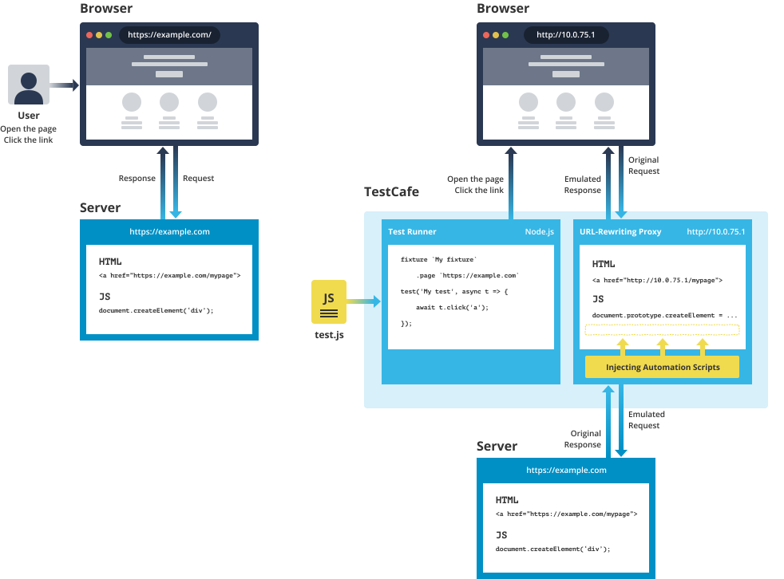

# How It Works

Before TestCafe, end-to-end web testing tools that worked with real browsers relied on driving these browsers from the outside to emulate user actions. This approach, however, had serious drawbacks.

* **Dependency on third-party tools.** This required you to install, configure, and maintain additional drivers, SDKs and/or libraries in every test environment.
* **Limited browser support.** The range of available browsers and platforms was restricted to those supported by the driver.
* **Boilerplate code.** These testing tools functioned with the same browser instance during the entire test run, so the tested web app state (cookies, storages, etc.) persisted from test to test. As a result, end-to-end tests contain a large amount of boilerplate code that clears the state to avoid interference between tests.
* **Low automation.** Legacy tools were unable to interact directly with the tested page. Although the fact that the user’s test code did not intervene in the app code was an advantage, the testing tool itself could benefit from operating inside the page. This would enable the tool to automate many routine tasks.

## TestCafe is Different

The idea that defined TestCafe architecture was that you don't really need an external driver to run end-to-end tests in the browser. Instead, the page can run all the test scripts that emulate user actions. This would allow for true cross-browser and cross-platform tests that run on any device that has a modern browser. This vision eventually developed into the following design concepts.

### Client-server architecture

TestCafe runs test code written by the user in the Node.js environment on the "server side". Scripts that emulate user activity (e.g., *automation scripts*) run inside the tested page in the browser on the same or on a different device. This is the "client side".

With this hybrid approach, TestCafe tests combine advantages of the browser scripts (built-in waiting, mobile testing) and standalone server-side code (access to the app's server and testing environment, better control over test execution).

### Node.js API

Test code uses compact API that consists of just a few dozen methods that eventually transform to user actions on the page. Since this server-side code runs in Node.js, tests should be written in JavaScript or a language TestCafe can compile to JavaScript (like TypeScript or CoffeeScript).

The concise API makes tests easy to write, read, and maintain. Support for popular web languages allows most users to use their existing skills and minimizes the learning curve for new users.

### Page proxying

To provide automation scripts (client-side code) to the browser, TestCafe runs a reverse proxy under the hood. It proxies the tested page on the server and injects the scripts into its code.

Script injection enables TestCafe key features like mobile testing, automatic waiting, or user roles for smart authentication out of the box.

### Isolated tests

Each test starts with a clean browser state. Cookies and storages are reset, an empty user profile is used, and the tested page is reloaded. This helps prevent interference between tests without extra boilerplate code.



## Client-Server Model

The client-server design comes from our own experience. An early version of TestCafe injected users' test code directly into the page. This seemed to be the easiest way to break free from web drivers. Later, we realized that this architecture restricted test code capabilities, so we decided to decouple the test engine. We exposed Node.js API for all test actions and implemented a test runner that executes test scripts in a server process. TestCafe, on its end, generates automation scripts (client code) and runs them in the browser.

### Why Server-Side Test Code

Node.js test code gives you more control over the testing environment.

* You can prepare a database or launch a web service from the tests.
* You can access the server's file system to read data samples or check the uploaded files.
* Tests can use all Node.js features and external Node.js modules.
* Tests became faster and more stable as test logic is now separated from automation scripts.
* Test code cannot interrupt page execution, because TestCafe doesn't inject user-written code 'as is'.
* Latest syntax features like async/await are supported.

Since Node.js code executes on the server, it doesn't have immediate access to the DOM, browser API, etc. We compensated for this trade-off with support for custom client-side functions.

### TestCafe API

Test code uses TestCafe API methods to interact with the tested page. The following are three main types of interaction:

* Perform ***actions*** on the page. TestCafe can emulate all end-user actions: click, double click, type, hover, drag-and-drop, select text, upload, etc. API provides a single simple method for each action.

    ```js
    await t
        .typeText('#input', 'Hello world!')
        .click('#submit-button');
    ```

* Execute ***assertions***. Assertions allow you to verify element properties and other page parameters. You can use conditions like 'equals', 'contains', 'greater', 'less', 'match', 'type of', etc.

    ```js
    await t
        .expect(input.exists).ok()
        .expect(input.value).eql('Hello world!');
    ```

* ***Select*** elements. TestCafe uses an advanced mechanism to locate target elements for an action or assertion. From the user's point of view, this task is as easy as specifying a standard CSS selector. You can additionally chain methods for more complex queries (like select 'class name', then proceed to its second sibling and take its third child). Under the hood, TestCafe utilizes a powerful *selector* mechanism with built-in waiting adapted to asynchronous page events.

    ```js
    const downloadSection = Selector('.download-section');
    const downloadButton  = downloadSection.child().withText('Download');
    ```

Other capabilities available in TestCafe API are request mocking, user roles for quick authentication, dialog handling, debugging, and more.

### Custom Client-Side Code

In advanced scenarios, TestCafe allows you to write code to be executed on the tested page. You can use custom client-side code to perform the following tasks:

* *Identify page elements.* Even complex CSS selectors are not always powerful enough to identify a page element in a real-world web app. TestCafe allows you to create selectors based on client-side code that returns DOM elements or nodes – you can write this code right inside the server-side test. Apparently, this doesn't bring live DOM objects to the Node.js environment. TestCafe will execute these functions in the browser when it needs to locate a page element.

    ```js
    const element = Selector(() => {
        return document.querySelector('.class-name');
    });

    await t.click(element);
    ```

* *Obtain data.* You can write a client function that returns any serializable object from the client side (this includes all objects that can be converted to JSON). Unlike with selectors, test code can access the object this client function returns. You can use data obtained from client functions to verify different parameters of the page state.

    ```js
    const getUrl = ClientFunction(() => {
        return window.location.href;
    });

    await t.expect(getUrl).eql('https://example.com');
    ```

* *Inject scripts.* TestCafe also allows you to inject custom code into the tested page. You can use the injected scripts to add helper functions or mock browser API.

    ```js
    fixture `My Fixture`
        .page `https://example.com`
        .clientScripts('assets/jquery.js', 'scripts/location-mock.js');
    ```

Note that a best practice rule is to avoid page modifications in custom client-side code. Actions that change DOM should be performed through server-side API only because there's no reliable way to perform them manually without interfering with TestCafe internal mechanisms. The rule is to use client-side code only to explore the page, find, and return information to the server.

## Reverse Proxy

You may notice that when you run TestCafe tests, the browser's address bar shows a URL that does not belong to your website. This is because TestCafe proxies the tested pages.

TestCafe reverse proxy ([testcafe-hammerhead](https://github.com/DevExpress/testcafe-hammerhead)) runs locally on your computer. It enables TestCafe to add automation scripts in a way that neither the existing page code nor the resources it communicates with can tell that the page has been modified.

When TestCafe proxies the tested page, it injects automation scripts and rewrites all URLs inside (in the markup, scripts, etc.) to point to the proxy. When the browser refers to these new URLs, the original resources are also proxied and modified in the same way to let automation continue seamlessly. TestCafe also mocks the browser API to conceal automation scripts from the rest of the page code.

The proxying mechanism ensures that the page appears to be hosted at the original URL even to the test code. This is why you can use your website's URLs in tests, and disregard the URL you see in the browser's address bar.

## Automation Scripts

TestCafe automation scripts emulate end-user actions on the tested page. They are designed to imitate the behavior of different browsers in every detail. Automation scripts dispatch events, focus elements or process attributes the way the browser that runs them would do. They abstract out browser specifics and enable you to write cross-browser high-level test code.

## Isolated Test Runs

TestCafe isolates each test run from subsequent tests and tests that run in parallel.

After a test is completed, TestCafe resets the browser state:

* deletes cookies
* clears local and session storages
* reloads the tested page

This saves you from having to write code you to reset the app state and take care of the changes your tests make. As a result, your tests are stable, easy to write and read, and free from boilerplate code.

If you run several tests in parallel, each test run obtains an independent server-side context. This prevents server-side collisions as well.

## Conclusion

TestCafe is a self-sufficient end-to-end testing solution that combines unmatched ease-of-use with advanced automation and robust built-in stability mechanisms. TestCafe officially supports all major browsers and platforms and it is designed to run in most modern browsers beyond officially supported.
