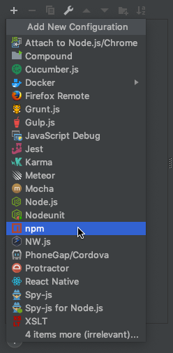
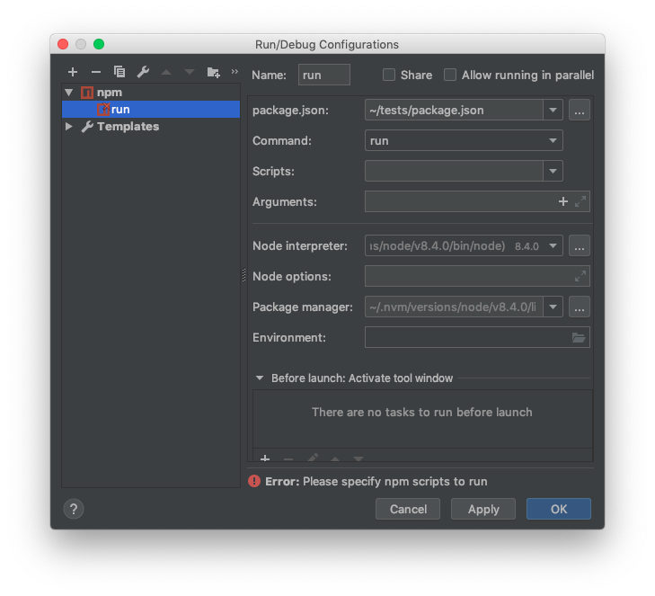

# Debug in WebStorm

This topic describes how to debug your TestCafe tests in [WebStorm](https://www.jetbrains.com/webstorm/) with a Node.js debugger.

## Step 1 - Install TestCafe

Execute the following command:

```sh
npm --save-dev testcafe
```

It installs TestCafe locally and adds it to the `devDependencies` section in `package.json`.

```json
{
    "devDependencies": {
        "testcafe": "*"
    }
}
```

## Step 2 - Add a Command To Debug TestCafe

Add a `debug` script to the `scripts` section in `package.json`. This script contains a command that runs TestCafe and specifies the target browser.

```json
{
    "scripts": {
        "debug": "testcafe $NODE_DEBUG_OPTION chrome"
    },

    "devDependencies": {
        "testcafe": "*"
    }
}
```

The `$NODE_DEBUG_OPTION` placeholder marks a place where Node.js debugger options are inserted before execution.

Path to test files will be specified in the debug configuration at the next steps.

## Step 3 - Create a Debug Configuration

Open WebStorm. If no build or run configuration is set up at the moment, click **Add Configuration** in the top-right corner.


Otherwise, open the configuration drop-down menu and select **Edit Configurations...**.


This invokes the **Run/Debug Configurations** dialog.

Click the **+** button to create a new configuration from a template.


In the list of templates, select **npm**.



This creates a default npm configuration.



## Step 4 - Specify Configuration Options

Select the npm script (`debug`) in the **Scripts** field.


* **WebStorm version prior to 2018.3**

    Specify the path to the test file you wish to debug in the **Arguments** field.

    

    Change this setting later to debug a different file.

* **WebStorm version 2018.3 and newer**

    Click the **+** button in the **Arguments** field to insert a macro.

    

    This invokes the **Macros** dialog.

    Select `FilePath` to insert the path to the current file.

    

    Click **Insert**. A macro `$FilePath$` is inserted to the **Arguments** field.

    

    This allows WebStorm to debug the currently opened test file.

Click **OK** to save changes.

## Step 5 - Debug Tests

Open the file you wish to debug and put a breakpoint into it.

Select the debug configuration you have created and click **Debug**.


TestCafe runs the test and stops at the breakpoint.


Now you can use WebStorm debugging tools to inspect the code, step over to the next command, etc.

> The debugger may consider TestCafe actions called in a chain as a single command. Add `await t.` before each action to correctly step between them. Nevertheless, if you put a breakpoint at each chained action, the debugger stops at these breakpoints.
