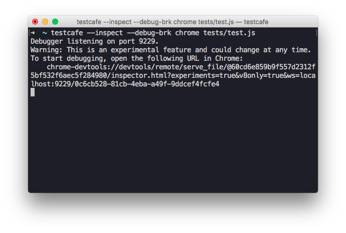
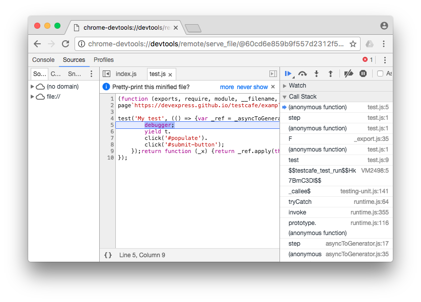

# Debugging Tests

TestCafe allows you to debug server-side test code and test behavior on the client.

* [Debugging Test Code](#debugging-test-code)
* [Debugging Test Behavior on the Client](#debugging-test-behavior-on-the-client)
* [Options Useful for Debugging](#options-useful-for-debugging)

## Debugging Test Code

Starting with version 6.3.0, Node.js allows you to debug applications in Chrome Developer Tools.
If you have Chrome and an appropriate version of Node.js installed on your machine,
you can debug TestCafe test code.
To do this, add the `--inspect` and `--debug-brk` flags to the test run command.

```sh
testcafe --inspect --debug-brk chrome ./tests
```

Put the `debugger` keyword in test code where you want to stop.

```js
fixture `My fixture`
    .page `https://devexpress.github.io/testcafe/example`;

test('My test', async t => {
    debugger;
    await t
        .click('#populate')
        .click('#submit-button');
});
```

After the test run command is executed, a debugging URL will appear in the console.



Open this URL in a new Chrome instance. Chrome will invoke its Developer Tools and the debugger will stop test execution at the first line.
Click the 'Resume script execution' button or press F5 to continue. After that, text execution will pause at the `debugger` keyword allowing you to debug test code.



You can also debug test code from an IDE.
For instance, Visual Studio Code has a dedicated [TestCafe plugin](https://github.com/romanresh/vscode-testcafe).
It allows you to run and debug your tests in the IDE using the context menu.

## Debugging Test Behavior on the Client

To debug test behavior on the client, use the [t.debug](../test-api/actions/debug.md) action.

```js
fixture `My fixture`
    .page `https://devexpress.github.io/testcafe/example`;

test('My test', async t => {
    await t
        .debug()
        .click('#populate')
        .click('#submit-button');
});
```

When test execution reaches this action, it pauses so that you can open browser's developer tools
and check the web page state, DOM elements location, their CSS styles.
In the footer, you'll find buttons that allow you to continue test execution or step to the next test action.


## Options Useful for Debugging

TestCafe includes a few features helpful when you need to find the cause of issues in your tests.

### Screenshots

You can specify that a screenshot should be taken in a particular place in a test.
Use the [t.takeScreenshot](../test-api/actions/take-screenshot.md) action for this.

```js
fixture `My fixture`
    .page `https://devexpress.github.io/testcafe/example`;


test('My test', async t => {
    await t
        .setNativeDialogHandler(() => true)
        .takeScreenshot('./screenshots')
        .click('#populate')
        .takeScreenshot('./screenshots')
        .click('#submit-button');
});
```

You can also turn on the [--screenshots-on-fails](../using-testcafe/command-line-interface.html#-s---screenshots-on-fails)
option.

```sh
testcafe chrome --screenshots-on-fails ./my-tests
```

This option enables TestCafe to take a screenshot automatically when a test fails.

Analyzing these screenshots helps save time on debugging and allows you to determine the reason of issues earlier.

### Test Speed

TestCafe provides the capability to change test speed. By default, tests are executed at full speed with minimum delays between actions and assertions.
This makes it hard to identify problems visually when running the test.
To slow down the test, use the [--speed](../using-testcafe/command-line-interface.html#--speed-factor)
CLI flag. You can use values from `1` to `0.01`.

```sh
testcafe chrome ./my-tests --speed 0.1
```

When tests run slowly, you can monitor test execution more easily and notice when test behavior differs from the one that's expected.