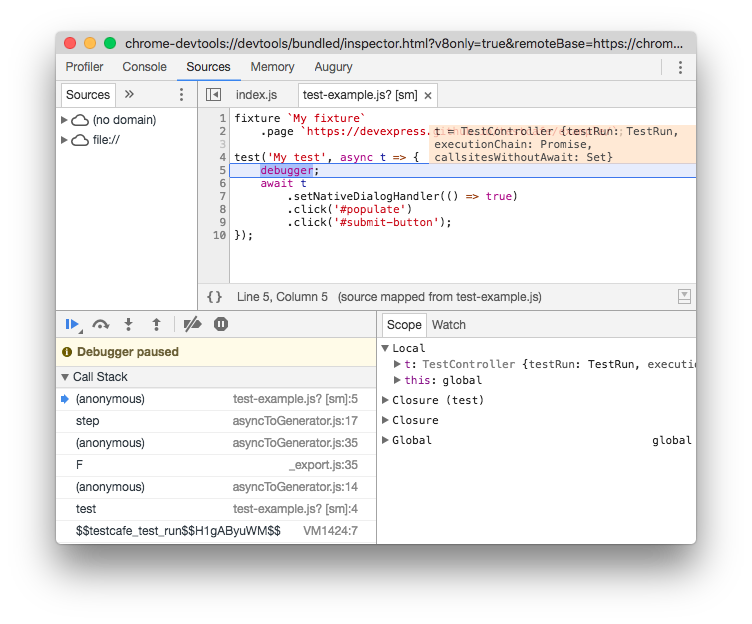

# Debug Tests in Chrome Developer Tools

Starting with version 6.3.0, Node.js allows you to debug applications in Chrome Developer Tools.
If you have Chrome and an appropriate version of Node.js installed on your machine,
you can debug TestCafe test code.

> This topic describes steps that apply to Node.js v8 and newer.

First, run TestCafe in the Node.js debugging mode. To do this, add the `--inspect-brk` flag to the test run command.

```sh
testcafe --inspect-brk chrome ./tests
```

Put the `debugger` keyword in test code where you want to stop.

```js
fixture `My fixture`
    .page `https://devexpress.github.io/testcafe/example`;

test('My test', async t => {
    debugger;
    await t
        .setNativeDialogHandler(() => true);
        .click('#populate')
        .click('#submit-button');
});
```

Navigate to `chrome://inspect` in Google Chrome. In the **Remote Target** section, find the Node.js debugger and click **Inspect**.


Chrome will invoke its Developer Tools and the debugger will stop test execution at the first line.
Click the **Resume script execution** button or press F5 to continue. After that, text execution will pause at the `debugger` keyword allowing you to debug test code.


