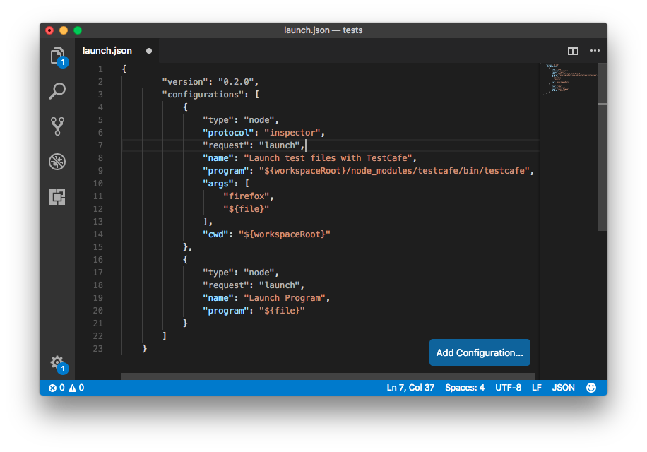
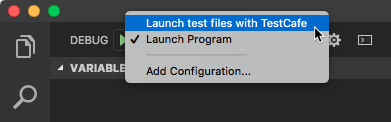
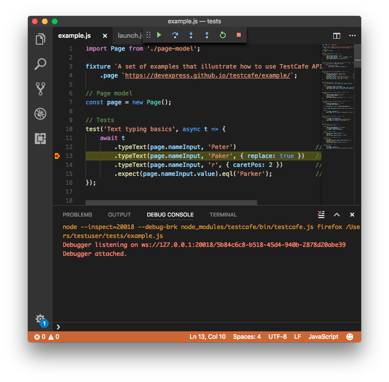

# Debug Tests in Visual Studio Code

Before you debug in Visual Studio Code, ensure that your root test directory contains a `package.json` file that includes `testcafe` in the `devDependencies` section.

```json
{
  "devDependencies": {
    "testcafe": "*"
  }
}
```

You can replace `*` with the actual TestCafe version you use.

Then you need to install TestCafe locally in the test directory.

```sh
npm install
```

The next step adds a launch configuration used to run TestCafe tests.



See the [Visual Studio Code documentation](https://code.visualstudio.com/docs/editor/debugging#_launch-configurations) to learn how to create a configuration.

You need to add the following configuration to the `launch.json` file.

```json
{
    "type": "node",
    "protocol": "inspector",
    "request": "launch",
    "name": "Launch test files with TestCafe",
    "program": "${workspaceRoot}/node_modules/testcafe/bin/testcafe.js",
    "args": [
        "firefox",
        "${relativeFile}"
    ],
    "console": "integratedTerminal",
    "cwd": "${workspaceRoot}"
}
```

This configuration contains the following attributes:

* `type` - specifies the configuration type. Set to `node` for a Node.js configuration.
* `protocol` - specifies the Node.js [debugger wire protocol](https://code.visualstudio.com/docs/nodejs/nodejs-debugging#_supported-nodelike-runtimes). Note that the inspector protocol is supported in Node.js v6.3 (or v6.9 for Windows) or later. For early versions, omit this property. In that case, Node.js uses a legacy debugger protocol. The legacy protocol has issues with source map support, therefore newer versions of Node.js are recommended.
* `request` - specifies the request type. Set to `launch` since this configuration launches a program.
* `name` - specifies the configuration name.
* `program` - path to the executed JS file. In this case, this file is the TestCafe module.
* `args` - [command line arguments](../../using-testcafe/command-line-interface.md) passed to the launched program. In this case, they specify the browser in which the tests should run and the relative path to the test file.
* `console` - the console where the test run report is printed. In this case, the report is output to the integrated terminal. You can learn about other available values in the [Launch.json attributes](https://code.visualstudio.com/docs/editor/debugging#_launchjson-attributes) topic.
* `cwd` - the current working directory. Set to the workspace root.

Save the `launch.json` file. The new configuration then appears in the configuration drop-down.



Now you can open a file with TestCafe tests, select the `"Launch test files with TestCafe"` configuration and click the **Run** button.
Tests run with the debugger attached. You can put breakpoints in test code and the debugger stops at them.



> Important! If you do not select the `"Launch test files with TestCafe"` configuration, Visual Studio Code tries to run the test file as a program and throws an error.
