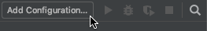

# Debug Tests in WebStorm

This topic describes how to debug TestCafe tests in [WebStorm](https://www.jetbrains.com/webstorm/) with a Node.js debugger.

## Step 1 - Install TestCafe

Execute the following command to install TestCafe locally and add it to the `devDependencies` section in `package.json`:

```sh
npm install --save-dev testcafe
```

```json
{
    "devDependencies": {
        "testcafe": "*"
    }
}
```

## Step 2 - Add a Command To Debug TestCafe

Add a `debug` script to the `scripts` section in `package.json`. This script contains a command that runs TestCafe and specifies the target browser.

```json
{
    "scripts": {
        "debug": "testcafe $NODE_DEBUG_OPTION chrome"
    },

    "devDependencies": {
        "testcafe": "*"
    }
}
```

The `$NODE_DEBUG_OPTION` placeholder marks a place where Node.js debugger options are inserted before execution.

The path to test files is specified in the debug configuration ([step 4](#step-4---specify-configuration-options)).

## Step 3 - Create a Debug Configuration

Open WebStorm. If no build or run configuration is set up, click **Add Configuration** in the top-right corner to invoke the **Run/Debug Configurations** dialog.



Otherwise, open the configuration drop-down menu and select **Edit Configurations...**.


In the **Run/Debug Configurations** dialog, click the **+** button to create a new configuration from a template.


In the list of templates, select **npm**.


This creates a default npm configuration.


## Step 4 - Specify Configuration Options

Select the npm script (`debug`) in the **Scripts** field.


* **WebStorm version prior to 2018.3**

    Specify the path to the test file you wish to debug in the **Arguments** field.

    

    Change this setting later to debug a different file.

* **WebStorm version 2018.3 and newer**

    Click the **+** button in the **Arguments** field to insert a macro.

    

    This invokes the **Macros** dialog.

    Select `FilePath` to insert the path to the current file.

    

    Click **Insert**. A macro `$FilePath$` is inserted to the **Arguments** field.

    

    This allows WebStorm to debug the currently opened test file.

Click **OK** to save changes.

## Step 5 - Debug Tests

Open the file you wish to debug and put a breakpoint into it.

Select the debug configuration you have created and click **Debug**.


TestCafe runs the test and stops at the breakpoint.


Now you can use WebStorm debugging tools to inspect the code, step over to the next command, etc.

> The debugger may consider a TestCafe action chain as a single command and therefore fail to correctly step between these actions. In this instance, put a breakpoint at each chained action.
