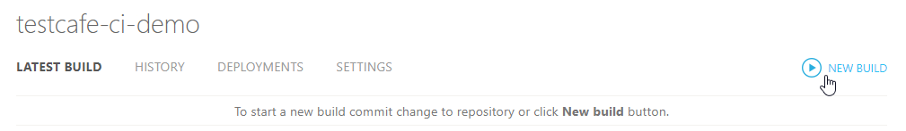

# Integrating TestCafe with AppVeyor

This topic describes how to integrate TestCafe tests into an AppVeyor project's build process.

## Step 1 - Create an AppVeyor Project

If you are using AppVeyor for the first time, you will begin with an empty account without any projects.

To create a project, click **NEW PROJECT**.


AppVeyor will ask you to specify a repository to create a project for. In this tutorial, we will use a GitHub repository, so click **GitHub** and authorize.

You will see a list of repositories associated with your account. Find the project you need to test and click **ADD**.


A new AppVeyor project is created.

## Step 2 - Specify the Commands to Run Tests

On the new project's page, open the **SETTINGS** menu.


If you are starting from a fresh project that has nothing to build yet, go to the **Build** settings category and disable building by pushing **OFF**.


Click **Save**.

Now configure AppVeyor to install TestCafe before running tests.

To this end, go to the **Environment** settings category and find the **Install script** section. Select PowerShell (**PS**) and enter a command that installs TestCafe - `npm install -g testcafe`.


Click **Save**.

Next, specify how tests should be triggered. Go to the **Tests** category and choose to use a custom script to run tests.


Select **PS** as a shell type and enter a command to run tests.

```sh
testcafe chrome:headless tests/**/*
```

This command starts tests from the `tests` directory in the headless Chrome.


## Step 3 - Trigger the build

Return to the project page and click **NEW BUILD** to trigger the AppVeyor build.

