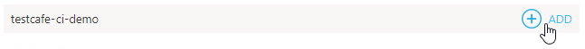

# Integrating TestCafe with AppVeyor

This topic describes how to integrate TestCafe tests into an [AppVeyor](https://www.appveyor.com/) project's build process.

## Prerequisites

In this tutorial, we will fetch tests from a GitHub repository: [ci-integration-demo](https://github.com/VasilyStrelyaev/ci-integration-demo). Fork this repository before we start.

> If you use a different version control system, make sure that AppVeyor supports your platform.
> The list of supported platforms is available after you click the *NEW PROJECT* button.

## Step 1 - Create an AppVeyor Project

If you are using AppVeyor for the first time, you will begin with an empty account without any projects.

To create a project, click **NEW PROJECT**.


AppVeyor will ask you to specify a repository to create a project for. In this tutorial, we will use a GitHub repository, so click **GitHub** and authorize.

You will see a list of repositories associated with your account. Find `ci-integration-demo` and click **ADD**.



A new AppVeyor project is created.

## Step 2 - Specify the Commands to Run Tests

On the new project's page, open the **SETTINGS** menu.


If you are starting from a fresh project that has nothing to build yet, go to the **Build** settings category and disable building by pushing **OFF**.


Click **Save**.

Now configure AppVeyor to install TestCafe before running tests.

To this end, go to the **Environment** settings category and find the **Install script** section. Select PowerShell (**PS**) and enter a command that installs TestCafe.

```sh
npm install -g testcafe testcafe-reporter-xunit
```

This command installs the main `testcafe` module and a plugin used to output reports in the xUnit format.


Click **Save**.

Next, specify how tests should be triggered. Go to the **Tests** category and choose to use a custom script to run tests.


Select **PS** as a shell type and enter the following code.

```sh
testcafe chrome:headless tests/**/* -r xunit:.\TestsResults.xml

$wc = New-Object 'System.Net.WebClient'
$wc.UploadFile("https://ci.appveyor.com/api/testresults/junit/$($env:APPVEYOR_JOB_ID)", (Resolve-Path .\TestsResults.xml))
```

The first command starts tests from the `tests` directory in the headless Chrome and saves the result to the `TestsResults.xml` file in xUnit.

The next two lines upload test run reports to AppVeyor so that you could view them in the UI.


Click **Save**.

## Step 3 - Trigger the Build

Return to the project page and click **NEW BUILD** to trigger the AppVeyor build.


## Step 4 - View Test Results

When testing is done, you can go back to **LATEST BUILD** and click the **TESTS** button to view the results.

