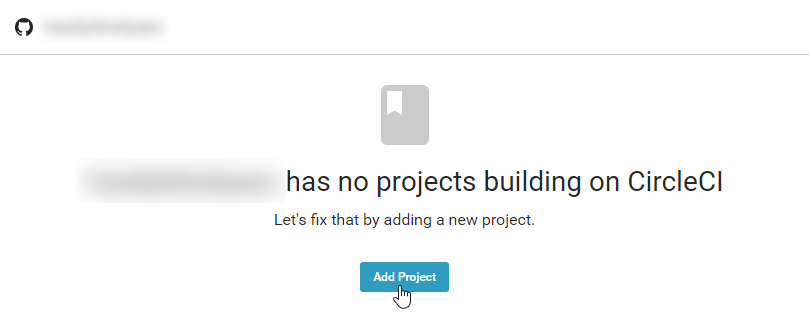
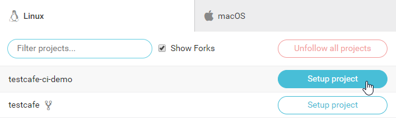
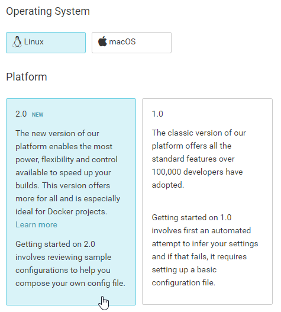
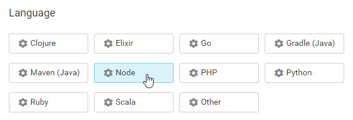
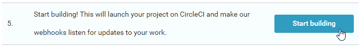
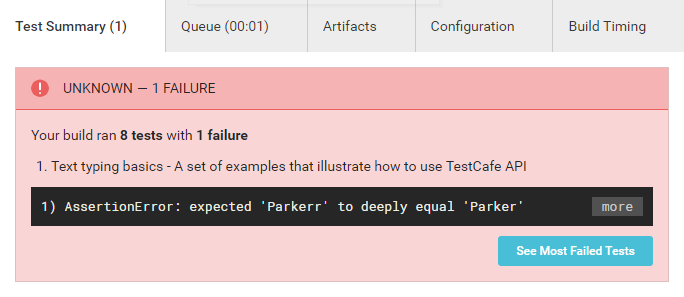

# Integrating TestCafe with CircelCI

This topic describes how to integrate TestCafe tests into a [CircelCI](https://circleci.com/) project's build process.

## Prerequisites

In this tutorial, we will fetch tests from a GitHub repository: [ci-integration-demo](https://github.com/VasilyStrelyaev/ci-integration-demo). Fork this repository before we start.

> If you use a different version control system, make sure CircleCI supports it. To learn which systems it supports, refer to the [First Steps](https://circleci.com/docs/2.0/first-steps/) document.

## Step 1 - Create a New CircleCI Project

Log in to CircleCI using your GitHub account.

If this is the first time you are using CircleCI, you will start from an empty workspace. Create your first project by clicking the **Add Project** button.



You will see the list of GitHub projects associated with your account.

Find `ci-integration-demo` and click **Setup project**.



The *Setup Project* screen will appear.

In the **Operating System** section, select *Linux*. Then select *2.0* in the **Platform** section.



In the **Language** section, select *Node*.



## Step 2 - Configuring the Build

Create a `.circleci` directory in the `ci-integration-demo` repository fork and add a `config.yml` file there.

Use the content CircleCI provides by default with two changes:

* Since you are going to perform browser testing, you need a virtual machine image that has all popular browsers pre-installed. So use the following image

    ```yml
    - image: circleci/node:7.10-browsers
    ```

* Add a step that imports test results to the end of the YAML. The results will be displayed in the **Test Summary** section.

    ```yml
    - store_test_results:
        path: /tmp/test-results
    ```

The resulting YAML will look as follows.

```yml

# Javascript Node CircleCI 2.0 configuration file
#
# Check https://circleci.com/docs/2.0/language-javascript/ for more details
#
version: 2
jobs:
  build:
    docker:
      # specify the version you desire here
      - image: circleci/node:7.10-browsers

      # Specify service dependencies here if necessary
      # CircleCI maintains a library of pre-built images
      # documented at https://circleci.com/docs/2.0/circleci-images/
      # - image: circleci/mongo:3.4.4

    working_directory: ~/repo

    steps:
      - checkout

      # Download and cache dependencies
      - restore_cache:
          keys:
          - v1-dependencies-{{ checksum "package.json" }}
          # fallback to using the latest cache if no exact match is found
          - v1-dependencies-

      - run: yarn install

      - save_cache:
          paths:
            - node_modules
          key: v1-dependencies-{{ checksum "package.json" }}

      # run tests!
      - run: yarn test

      - store_test_results:
          path: /tmp/test-results

```

Next, create a `package.json` file in the repository root directory. Provide a command to run tests and add TestCafe as a dependency.

```json
{
  "scripts": {
    "test": "testcafe chrome:headless tests/**/* -r xunit:/tmp/test-results/res.xml"
  },
  "devDependencies": {
      "testcafe": "^0.18.4",
      "testcafe-reporter-xunit": "^2.1.0"
  }
}
```

The `test` command runs tests from the `tests` directory in the headless Chrome. Reports are saved in the xUnit format at `/tmp/test-results/res.xml`.

Finally, push all changes to GitHub.

## Step 3 - Running the Build

Use the **Start building** button to trigger a build.



## Step 4 - Viewing Test Results

Go to the **Builds** section and choose a build to view its results.

