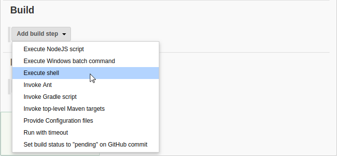
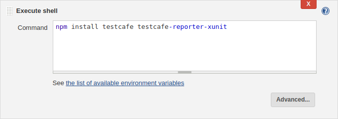
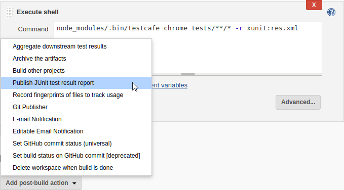

# Integrating TestCafe with Jenkins CI System

TestCafe has an extensive command line interface that allows it to fit well in any popular continuous integration system.

This topic shows how you can integrate TestCafe tests into project build process in [Jenkins](https://jenkins.io/).

## Step 1 - Fetching Test Code From a Repository

In this tutorial, we will use tests pubished in a separate repository on GitHub - [ci-integration-demo](https://github.com/VasilyStrelyaev/ci-integration-demo). If you use a different version control system, search for a plugin that integrates it with Jenkins.

Open your project and choose **Configure** from the right pane.


Scroll down to the **Source Code Management** section and select *Git*, then specify the **Repository URL**.


## Step 2 - Adding a Command to Install TestCafe

Go to the **Build** section, find a step that builds you application and add a new step right after it. To do this, click **Add build step** and select a step type that runs a shell command.



In the **Command** box, type the following.

```sh
npm install testcafe testcafe-reporter-xunit
```

This command installs the main `testcafe` module and a plugin that saves test run reports in the xUnit format.



## Step 3 - Adding a Command to Run TestCafe

Add another step that executes a shell command after the previous one. This step will run TestCafe.

Type the following command.

```sh
node_modules/.bin/testcafe chrome tests/**/* -r xunit:res.xml
```

This runs TestCafe tests from the `tests` directory in Google Chrome. Test results are saved to the `res.xml` file in the xUnit format.


## Step 4 - Publishing Test Run Reports

Go to the **Post-build Actions** section and click **Add post-build action**. In the drop-down list, select **Publish JUnit test result report**.



In the **Test report XMLs** field, specify the test report file: `res.xml`.


## Step 5 - Run the Test

Click **Save** and you will be navigated to the Project page.

Hit **Build Now** to build the project immediately.


## Step 6 - View Test Results

In the **Build History** section of the **Project** page, click a build and select **Test Results** from the drop-down menu.


Jenkins will display a test run report where you can see general information about testing results. You can click individual tests for details.

