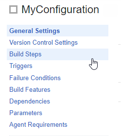
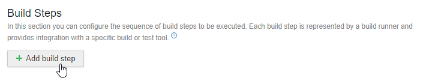

# Integrating TestCafe with TeamCity CI System

TestCafe is easy to set up with most modern CI systems.

This topic describes how to use TestCafe with TeamCity.

## Prerequisites

TestCafe community developed a reporter for TeamCity. Install it before configuring the CI system.

```sh
npm install -g testcafe-reporter-teamcity
```

This plugin enables TestCafe to output test run results in the TeamCity format. The reports will be presented in the TeamCity UI allowing you to analyze the results with its built-in features.

## Adding a Build Step that Runs TestCafe

Create a new build configuration or open an existing one as described in the [TeamCity documentation](https://confluence.jetbrains.com/display/TCD10/Creating+and+Editing+Build+Configurations).

Click the **Edit Configuration Settings** link.


In the configuration settings, add a build step that runs TestCafe. First, select **Build Steps** from the left menu.



This opens the **Build Steps** page. On this page, click the **Add build step** button.



The **New build step** page will be opened. Configure this step to run TestCafe using the command line.

In the **Runer type** field, select *Command Line*. Optionally, specify a name for this step. In the **Run** parameter, select *Executable with parameters*. Type *testcafe* into the **Command executable** box and add the following arguments in the **Command parameters** field: `chrome tests/**/* -r teamcity`.

Parameters used in this example specify Google Chrome as the target browser, *tests* as the folder that contains test fixtures and TeamCity reporter as a plugin used to output test run reports.


## Running the Build

Click **Save**. Now you can run the build using the **Run** button.


