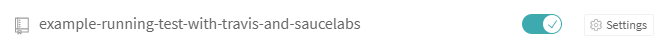
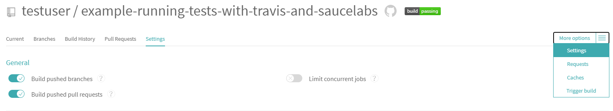
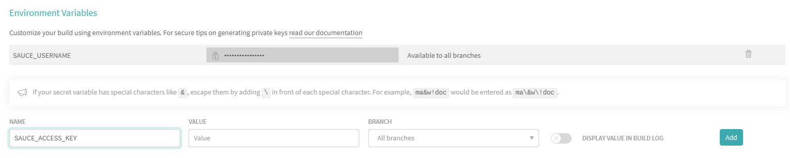

# Running Tests Using Travis CI and Sauce Labs

You can automatically run tests as a part of your build process using TestCafe and [Travis CI](https://travis-ci.org/).
TestCafe also allows you to use [Sauce Labs](https://saucelabs.com/) browsers for testing.
Thus, you can run your tests completely in the cloud.

Suppose you have a GitHub project for which you need to automatically run tests in the cloud when the project is modified. To do this, go through the following steps.

* [Step 1 - Install TestCafe and create tests](#step-1---install-testcafe-and-create-tests)
* [Step 2 - Enable Travis for your project](#step-2---enable-travis-for-your-project)
* [Step 3 - Configure Travis to use Sauce Labs](#step-3---configure-travis-to-use-sauce-labs)
* [Step 4 - Install the Sauce Labs browser provider plugin](#step-4---install-the-sauce-labs-browser-provider-plugin)
* [Step 5 - Add the `test` script to package.json](#step-5---add-the-test-script-to-packagejson)
* [Step 6 - Trigger a Travis CI build](#step-6---trigger-a-travis-ci-build)

> TestCafe provides an [example](https://github.com/DevExpress/testcafe/tree/master/examples/running-tests-using-travis-and-saucelabs/) that can show you how to run tests with Travis CI and Sauce Labs.

## Step 1 - Install TestCafe and create tests

Install TestCafe [locally](../using-testcafe/installing-testcafe.md#locally) in your project and [create tests](../getting-started/README.md#creating-a-test).

## Step 2 - Enable Travis for your project

1. [Sign in to Travis CI](https://travis-ci.org/auth) with your GitHub account. Travis CI will synchronize your repositories from GitHub. You can see them on your [profile page](https://travis-ci.org/profile).
2. Enable Travis CI for a repository you want to build by flicking the switch on.

     

     By default, Travic CI runs builds on pushes and pull requests. You can manage this behavior in your repository's settings.

     

3. Add a `.travis.yml` configuration file to the root of your project. This file contains parameters and commands that instruct Travis CI how to execute your builds. For more information, see [Customizing the Build](https://docs.travis-ci.com/user/customizing-the-build).

     For Node.js projects, the `.travis.yml` file can have the following content.

     ```yaml
     language: node_js
     node_js: "stable"
  
     before_install:
       - stty cols 80
     ```

     Commit and push this file to your repository.

## Step 3 - Configure Travis to use Sauce Labs

1. Save your Sauce Labs username and access key to the SAUCE\_USERNAME and SAUCE\_ACCESS\_KEY environment variables, as described in [SauceLabs documentation](https://wiki.saucelabs.com/display/DOCS/Best+Practice%3A+Use+Environment+Variables+for+Authentication+Credentials).
2. Go to the repository settings in Travis CI. In the **Environment Variables** section, define the SAUCE\_USERNAME and SAUCE\_ACCESS\_KEY variables (see [Defining Variables in Repository Settings](https://docs.travis-ci.com/user/environment-variables/#Defining-Variables-in-Repository-Settings)).

     

## Step 4 - Install the Sauce Labs browser provider plugin

To run TestCafe tests in the cloud using Sauce Labs browsers, you need to install the [testcafe-browser-provider-saucelabs](https://www.npmjs.com/package/testcafe-browser-provider-saucelabs) plugin locally to your project.
To do this, run the following command.

```bash
npm install --save-dev testcafe-browser-provider-saucelabs
```

For more information on testing in cloud browsers, see [Browsers in Cloud Testing Services](../using-testcafe/common-concepts/browsers/browser-support.md#browsers-in-cloud-testing-services).

## Step 5 - Add the `test` script to package.json

To test a project, Travis runs test scripts. For Node.js projects, the default test script is `npm test`.
To tell npm how to run your tests, add the `test` script to the project's package.json file. Use `testcafe` command in the script to run tests on a Sauce Labs browser.

```text
"scripts": {
    "test":  "testcafe \"saucelabs:Chrome@beta:Windows 10\" tests/index-test.js"
}
```

For more information on how to configure a test run using a `testcafe` command, see [Command Line Interface](../using-testcafe/command-line-interface.md).

**Note:** If your app requires starting a custom web server, use the `--app` TestCafe option to specify a command that starts your server.
This command will be automatically executed before running tests. After tests are finished, TestCafe will stop the app server.

```text
"scripts": {
  "test":  "testcafe \"saucelabs:Chrome@beta:Windows 10\" tests/index-test.js --app \"node server.js\""
}
```

## Step 6 - Trigger a Travis CI build

You can trigger a Travis CI build by pushing commits to your repository or creating a pull request.

To check if the build passed or failed, go to the [build status page](https://travis-ci.org/repositories).
