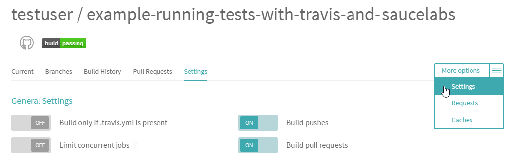
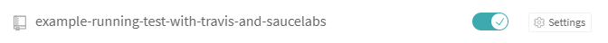

# Running Tests Using Travis CI and Sauce Labs

You can automatically run tests as a part of your build process using [Travis CI](https://travis-ci.org/).
Furthermore, Travis CI integrates with [Sauce Labs](https://saucelabs.com/) that provides access to multiple real browsers in the cloud (see [Using Sauce Labs with Travis CI](https://docs.travis-ci.com/user/sauce-connect/)).
Thus you can run your tests completely in the cloud.

Suppose you have a GitHub project, you [installed TestCafe](../using-testcafe/installing-testcafe.md) to that project and created tests. Now you need to automatically run these tests in the cloud when your project is modified.
To do this, go through the following steps:

* [Step 1 - Enable Travis for your project](#step-1---enable-travis-for-your-project)
* [Step 2 - Configure Travis to use Sauce Labs](#step-2---configure-travis-to-use-sauce-labs)
* [Step 3 - Install the Sauce Labs browser provider plugin](#step-3---install-the-sauce-labs-browser-provider-plugin)
* [Step 4 - Add the `test` script to package.json](#step-4---add-the-test-script-to-packagejson)
* [Step 5 - Trigger a Travis CI build](#step-5---trigger-a-travis-ci-build)

The [Example](#example) section describes how to run tests with Travis CI and Sauce Labs for a sample project.

## Step 1 - Enable Travis for your project

1. [Sign in to Travis CI](https://travis-ci.org/auth) with your GitHub account. Travis CI will synchronize your repositories from GitHub. You can see them on your [profile page](https://travis-ci.org/profile).
2. Еnable Travis CI for a repository you want to build by flicking the switch on.

     

3. Add a `.travis.yml` configuration file to the root of your project. This file should contain parameters and commands that instruct Travis CI on how to execute your builds. For more information, see [Customizing the Build](https://docs.travis-ci.com/user/customizing-the-build).

     For Node.js projects, the file can have the following content.

     ```text
     language: node_js
     node_js: 6
     ```

     Commit and push the `.travis.yml` file to your repository.

4. Enable builds on pushes and pull requests in your repository settings. To do this, navigate to the repository, choose **Settings** from the **More Options** menu, and enable the **Build Pushes** and **Build Pull Requests** options in the **General Settings** section.

     

## Step 2 - Configure Travis to use Sauce Labs

1. Save your Sauce Labs username and access key to the SAUCE\_USERNAME and SAUCE\_ACCESS\_KEY environment variables, as described in [SauceLabs documentation](https://wiki.saucelabs.com/display/DOCS/Best+Practice%3A+Use+Environment+Variables+for+Authentication+Credentials).
2. Go to the repository settings in Travis CI. In the **Environment Variables** section, define the SAUCE\_USERNAME and SAUCE\_ACCESS\_KEY variables (see [Defining Variables in Repository Settings](https://docs.travis-ci.com/user/environment-variables/#Defining-Variables-in-Repository-Settings)).

     

## Step 3 - Install the Sauce Labs browser provider plugin

To run TestCafe tests in the cloud using Sauce Labs browsers, you need to install the [testcafe-browser-provider-saucelabs](https://www.npmjs.com/package/testcafe-browser-provider-saucelabs) plugin locally to your project.
To do this, run the following command.

```bash
npm install --save-dev testcafe-browser-provider-saucelabs
```

For more information, see [Browser Provider Plugins](../using-testcafe/common-concepts/browser-support.md#browser-provider-plugins).

## Step 4 - Add the `test` script to package.json

To test a project, Travis runs test scripts. For Node.js projects, the default test script is `npm test`.
To tell npm on how to run your tests, you need to add the `test` script to the project's package.json file.

For example, the following `test` script starts the application and runs TestCafe tests on a Sauce Labs browser.

```text
"scripts": {
    "test":  "node server.js & testcafe 'saucelabs:Chrome@beta:Windows 10' 'tests/index-test.js'; EXIT_CODE=$?; kill $!; exit $EXIT_CODE"
}
```

## Step 5 - Trigger a Travis CI build

You can trigger a Travis CI build by pushing commits to your repository or creating a pull request.

To check if the build passed or failed, go to the [build status page](https://travis-ci.org/repositories).

## Example

To try running TestCafe tests with Travis CI and Sauce Labs:

1. Create a GitHub repository and copy sample files from the [examples/running-tests-using-travis-and-saucelabs](https://github.com/DevExpress/testcafe/examples/running-tests-using-travis-and-saucelabs) folder to it. This folder contains the following files.
    * *server.js* - runs an HTTP server.
    * *index.html* - the application's main page.
    * *package.json* - the project description file. The package.json file's `dependencies` list already contains all needed packages to run the application, the `devDependencies` list contains TestCafe and Sauce Labs browser provider. The file also includes the `test` script that starts the application and runs TestCafe tests on a Sauce Labs browser.
    * *tests/index-test.js* - a simple TestCafe test.
    * *.travis.yml* - a Travis CI configuration file.
2. Go through [Step 1](#step-1---enable-travis-for-your-project) and [Step 2](#step-2---configure-travis-to-use-sauce-labs).
3. Trigger a Travis CI build ([Step 5](#step-5---trigger-a-travis-ci-build)), for example, by modifying the *index.html* file and pushing it into your repository.