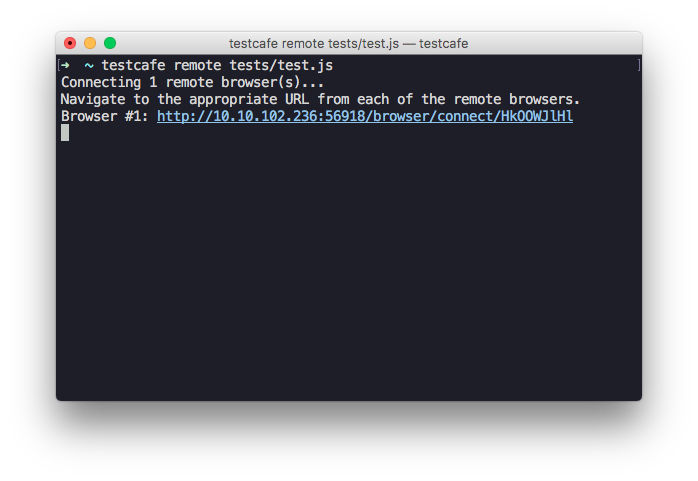
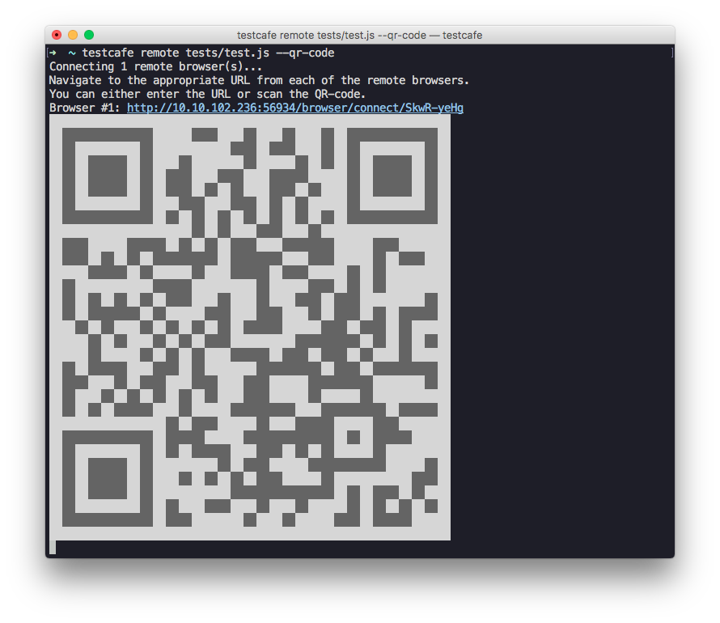

# Testing on Remote Computers and Mobile Devices

TestCafe allows you to run tests on any device that has network access to the machine where TestCafe is installed.

This guide demonstrates how to test on a remote computer and a mobile device.
It assumes that TestCafe is already [installed](../using-testcafe/installing-testcafe.md)
in your project and you have [created some tests](../getting-started/README.md#creating-a-test).

## Run Tests on a Remote Computer

1. Open the console and type a command to run tests.
  Use [remote](../using-testcafe/command-line-interface.md#remote-browsers) as a browser alias
  to specify that tests should run on a remote machine.

    ```sh
    testcafe remote tests/test.js
    ```

2. TestCafe prepares a URL for the remote browser to connect to the server.

    

3. Go to a remote computer that has network access to the machine with TestCafe.
  Open the browser in which you want to test and navigate to the URL generated by TestCafe.
  Testing will start automatically.

## Run Tests on a Mobile Device

1. Open the console and type a command to run tests with [remote](../using-testcafe/command-line-interface.md#remote-browsers) as a browser alias.
  Add the `--qr-code` flag to generate a QR-code for the mobile device.

    ```sh
    testcafe remote tests/test.js --qr-code
    ```

2. TestCafe will output the QR-code to the console.

    

3. Scan the QR-code with a mobile device that has network access to the TestCafe machine and open the link.
  TestCafe will start tests in the mobile browser.

<blockquote class="twitter-video" data-lang="en"><p lang="en" dir="ltr">Something <a href="https://twitter.com/hashtag/webdriver?src=hash">#webdriver</a> can’t do...  <a href="https://twitter.com/hashtag/testcafe?src=hash">#testcafe</a> <a href="https://t.co/bgD8cgUwXX">pic.twitter.com/bgD8cgUwXX</a></p>&mdash; TestCafe (@DXTestCafe) <a href="https://twitter.com/DXTestCafe/status/804368394569052160">December 1, 2016</a></blockquote>
<script async src="//platform.twitter.com/widgets.js" charset="utf-8"></script>