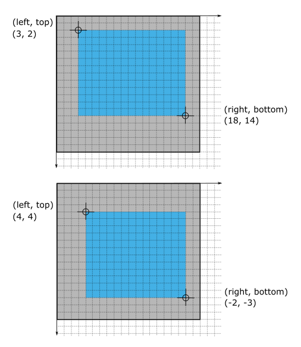

# t.takeElementScreenshot Method

Takes a screenshot of the specified page element.

```text
t.takeElementScreenshot(selector[, path][, options])
```

Parameter                | Type   | Description
------------------------ | ------ | -----------------------------------------------------------------------------------------------------
`selector`               | Function &#124; String &#124; Selector &#124; Snapshot &#124; Promise | Identifies the webpage element whose screenshot should be taken. See [Select Target Elements](#select-target-elements).
`path`&#160;*(optional)* | String | The screenshot file's relative path and name. The path is relative to the root directory specified in the [runner.screenshots](../../testcafe-api/runner/screenshots.md) API method or the [-s (--screenshots)](../../command-line-interface.md#-s---screenshots-optionvalueoption2value2) command line option. This path overrides the relative path the default or custom [path patterns](../../../guides/advanced-guides/screenshots-and-videos.md#screenshot-and-video-directories) specify.
`options`&#160;*(optional)*   | Object | Options that define how the screenshot is taken. See details below.

The example below demonstrates how to use `t.takeElementScreenshot` action.

```js
import { Selector } from 'testcafe';

fixture `My fixture`
    .page `http://devexpress.github.io/testcafe/example/`;

test('Take a screenshot of a fieldset', async t => {
    await t
        .click('#reusing-js-code')
        .click('#continuous-integration-embedding')
        .takeElementScreenshot(Selector('fieldset').nth(1), 'my-fixture/important-features.png');
});
```

The `options` object contains the following properties:

Property        | Type | Description   | Default
--------------- | ---- | ------------- | ----------
`scrollTargetX`,&#160;`scrollTargetY` | Number | If the target element is too big to fit into the browser window, the page is scrolled to put this point to the center of the viewport. The coordinates of this point are calculated relative to the target element. If the numbers are positive, the point is positioned relative to the top-left corner of the element. If the numbers are negative, the point is positioned relative to the bottom-right corner. If the target element fits into the browser window, these properties have no effect. | The center of the element. If the `crop` rectangle is specified, its center. If the `crop` rectangle is larger than the viewport, the center of the viewport.
`includeMargins` | Boolean | Specifies whether to include target element's margins in the screenshot. When it is enabled, the `scrollTargetX`, `scrollTargetY` and `crop` rectangle coordinates are calculated from the corners where top and left (or bottom and right) margins intersect. | `false`
`includeBorders` | Boolean | Specifies whether to include target element's borders in the screenshot. When it is enabled, the `scrollTargetX`, `scrollTargetY` and `crop` rectangle coordinates are calculated from the corners where top and left (or bottom and right) internal edges of the element intersect. | `true`
`includePaddings` | Boolean | Specifies whether to include target element's paddings in the screenshot. When it is enabled, the `scrollTargetX`, `scrollTargetY` and `crop` rectangle coordinates are calculated from the corners where top and left (or bottom and right) edges of the element's content area intersect. | `true`
`crop`           | Object  | Allows you to crop the target element on the screenshot. | Crops to the whole element or, if it does not fit into the viewport, its visible part.

An object assigned to the `crop` property has the following fields.

Field    | Type   | Description
-------- | ------ | --------------
`top`    | Number | The top edge of the cropping rectangle. The coordinate is calculated from the element's top edge. If a negative number is passed, the coordinate is calculated from the element's bottom edge.
`left`   | Number | The left edge of the cropping rectangle. The coordinate is calculated from the element's left edge. If a negative number is passed, the coordinate is calculated from the element's right edge.
`bottom` | Number | The bottom edge of the cropping rectangle. The coordinate is calculated from the element's top edge. If a negative number is passed, the coordinate is calculated from the element's bottom edge.
`right`  | Number | The right edge of the cropping rectangle. The coordinate is calculated from the element's left edge. If a negative number is passed, the coordinate is calculated from the element's right edge.



**Example**

```js
fixture `My fixture`
    .page `http://www.example.com/`;

test('Take a screenshot of my new avatar', async t => {
    await t
        .click('#change-avatar')
        .setFilesToUpload('#upload-input', 'img/portrait.jpg')
        .click('#submit')
        .takeElementScreenshot('#avatar', {
            includeMargins: true,
            crop: {
                top: -100,
                left: 10,
                bottom: 30,
                right: 200
            }
        });
});
```

You can take a screenshot of the entire page with the [t.takeScreenshot](takescreenshot.md) method.

See [Screenshots and Videos](../../../guides/advanced-guides/screenshots-and-videos.md) for more information on taking screenshots.

## Select Target Elements


