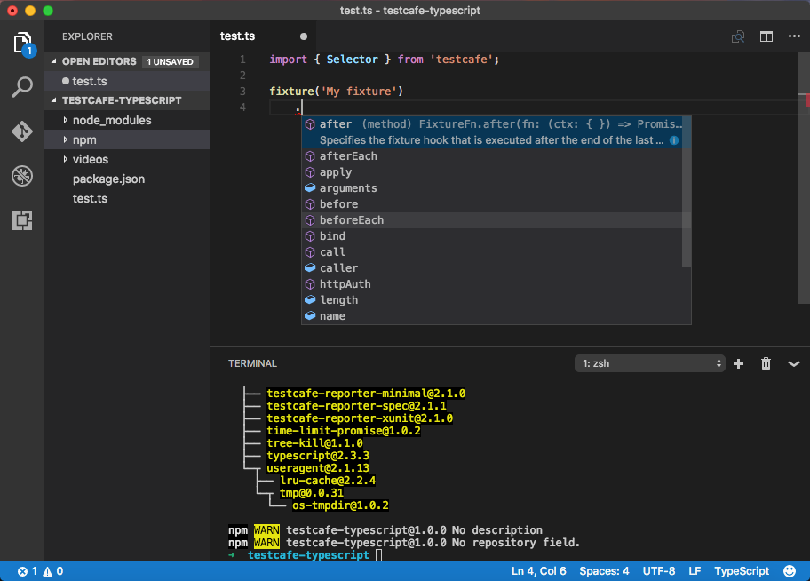

# TypeScript Support

TestCafe allows you to write tests with [TypeScript](https://www.typescriptlang.org/) - a typed superset of JavaScript.
Using TypeScript brings you all the advantages of strongly typed languages: rich coding assistance,
painless scalability, check-as-you-type code verification and much more.

> TestCafe automatically compiles TypeScript before running tests, so you do not need to compile the TypeScript code.

TestCafe bundles the TypeScript declaration file with the npm package, so you do not need to install it separately.

## Writing Tests with TypeScript

To start writing tests with TypeScript, install TestCafe into your project directory. For more information, see [Installing TestCafe](../using-testcafe/installing-testcafe.md#locally).

When writing test in TypeScript, it is required to import TestCafe module first.

```js
import { Selector } from 'testcafe';
```

After importing a `testcafe` module, an IDE (e.g. VS Code, Sublime Text, WebStorm, etc.) will load TestCafe declaration
file and will show you code completion hints for TestCafe API:



> If installed [globally](../using-testcafe/installing-testcafe.md#globally), TestCafe will successfully compile and run your tests written in TypeScript.
In this case, your IDE will not be able to find the TestCafe declaration file and provide code completion.

Now, you can write tests in the same manner as in JavaScript.
When you run a test Testcafe will output if there are any compilation errors.

> The [extending selectors](./selecting-page-elements/selectors/extending-selectors.md)
> in TypeScript differs from extending selectors in JavaScript. Refer to the
> [Custom Properties](./selecting-page-elements/selectors/extending-selectors.md#custom-properties)
> and [Custom Methods](./selecting-page-elements/selectors/extending-selectors.md#custom-methods)
> sections to learn how to extend selectors in TypeScript.
