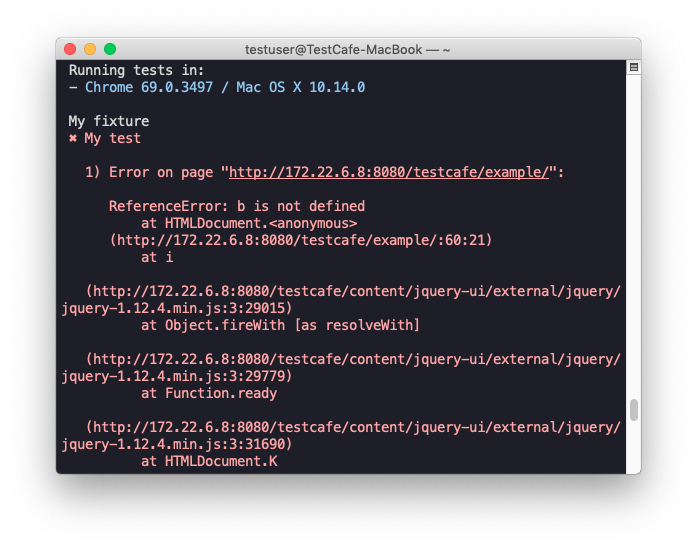

# Reporters

Reporters are plugins used to output test run reports in a certain format.

TestCafe ships with the following reporters:

* [spec](https://github.com/DevExpress/testcafe-reporter-spec) - used by default
* [list](https://github.com/DevExpress/testcafe-reporter-list)
* [minimal](https://github.com/DevExpress/testcafe-reporter-minimal)
* [xUnit](https://github.com/DevExpress/testcafe-reporter-xunit)
* [JSON](https://github.com/DevExpress/testcafe-reporter-json)

You can also create a [custom reporter](/testcafe/documentation/extending-testcafe/reporter-plugin/) that fulfills your needs.

Here are some custom reporters developed by the community.

* [NUnit](https://github.com/AndreyBelym/testcafe-reporter-nunit)
* [Slack](https://github.com/Shafied/testcafe-reporter-slack)
* [TeamCity](https://github.com/Soluto/testcafe-reporter-teamcity)

For more information about the reporters, see the following sections.

* [Searching for Reporter Plugins](#searching-for-reporter-plugins)
* [Installing the Reporters](#installing-the-reporters)
* [Using the Reporters](#using-the-reporters)
* [Report Content](#report-content)

## Searching for Reporter Plugins

Reporter plugins are npm packages. The reporter package name consists of two parts - the `testcafe-reporter-` prefix and the name of a reporter itself; for example, `testcafe-reporter-list`.

You can search for available reporter packages on npm: [https://www.npmjs.com/search?q=testcafe-reporter](https://www.npmjs.com/search?q=testcafe-reporter).

## Installing the Reporters

You can install reporter packages from npm as you would install any other plugin. See [Installing Plugins](../../extending-testcafe/README.md#installing-plugins).

## Using the Reporters

When running tests, you can select a reporter to generate test reports.
You can do this by using the
[-r (--reporter)](../command-line-interface.md#-r-namefile---reporter-namefile) command line option or the
[runner.reporter](../programming-interface/runner.md#reporter) API method.

## Report Content

> The description below applies to the most popular reporters. Specific reporters may produce output that differs from the one described here.

A typical reporter outputs information about the browsers where test were run followed by the list of passed and failed tests.

For each failed test, the report shows the error message, the call site where the error originated and the callstack.

If the error occurs because of a failed [selector](../../test-api/selecting-page-elements/selectors/README.md), the test report shows a sequence of the selector's methods that were called during the test and highlights the failed method.

If the test failed due to a client-side JavaScript error, the report shows the error message and the callstack provided by the browser.

Reports may also include

* warnings thrown during test execution,
* links to the screenshots taken while testing,
* information about test runs in the quarantine mode,
* other information that can be obtained from the [TestCafe reporter plugin API](../../extending-testcafe/reporter-plugin/reporter-methods.md).